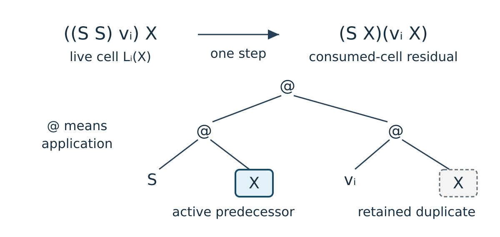
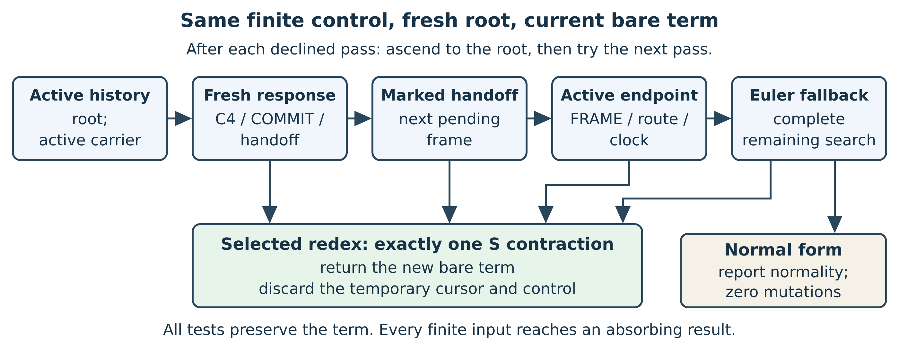
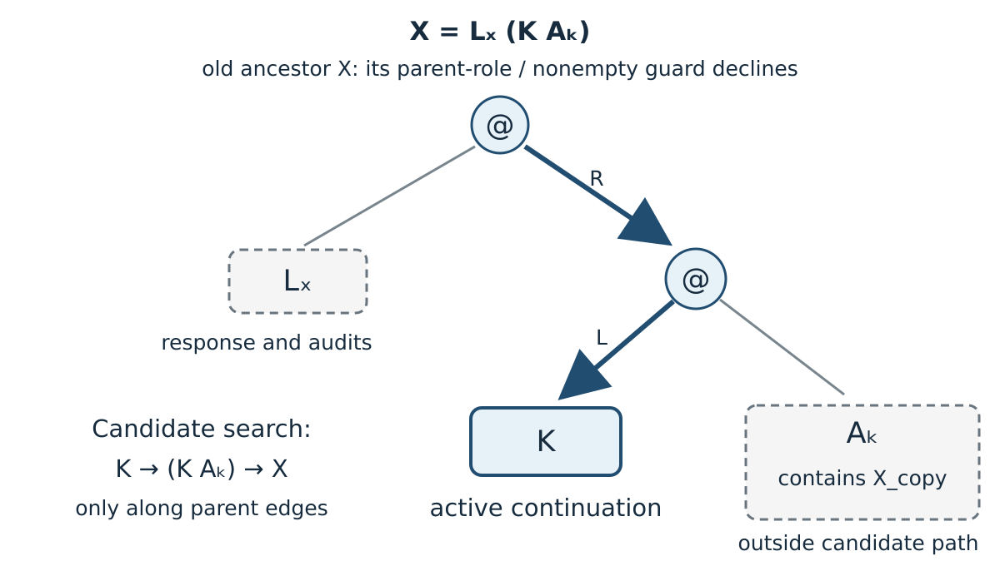
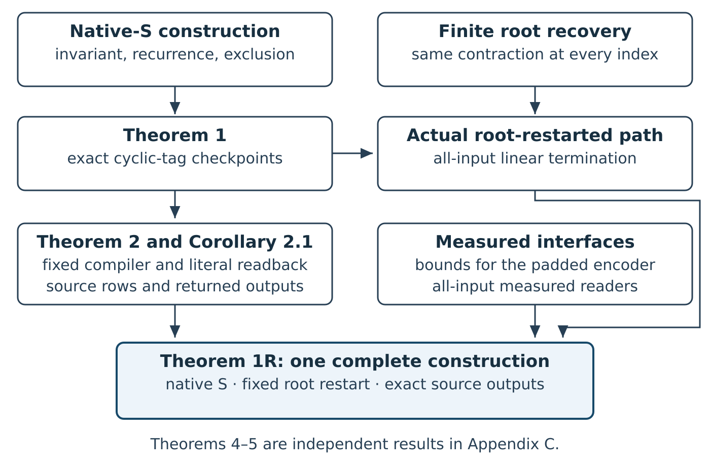
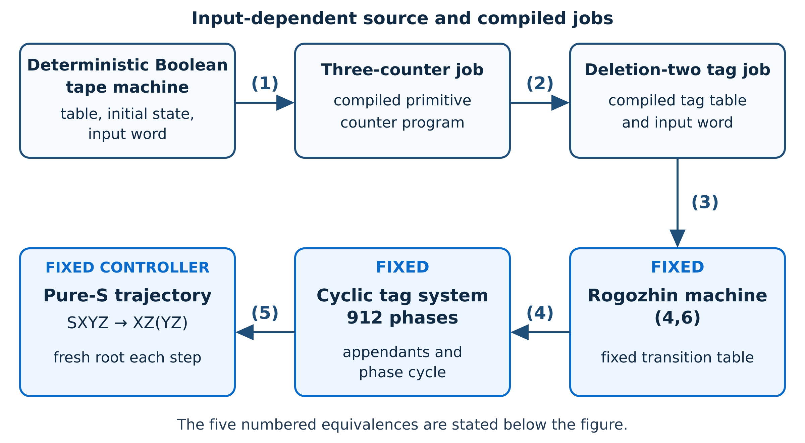

# Pure S Is Computationally Universal Under a Fixed Root-Restarted Finite Controller

**Project coordinator:** Alexander Filin  
**Contact:** [contact@cinematicstrawberry.com](mailto:contact@cinematicstrawberry.com)  
**Date:** 14 September 2026

Developed with substantial AI assistance within the Predictive Universe (PU)
framework; see the [contribution statement](#project-context-and-contributions).

## Abstract

Pure $\mathbf S$ is computationally universal under a fixed root-restarted
finite controller. One encoder and controller represent every deterministic
Boolean-tape computation using only $\mathbf SXYZ\to XZ(YZ)$. Fixed readers
recover exactly its reachable literal source rows and terminal scanned-bit
outputs. One fixed regular tree language detects halting: the source halts
if and only if its trajectory eventually enters that language.

Every invocation starts at the root of the current bare term; its temporary
cursor and finite control are reset. On every finite term $T$, it terminates
within $K(|T|+1)$ microticks, reports normality without mutation or performs
exactly one contextual S-contraction. The construction realizes every finite
binary cyclic tag system at exact, strictly increasing checkpoints and
rejects every other contraction sample. A fixed 912-phase program supplies
the universal endpoint.

The complete encoder is primitive recursive, with a measured structural
construction bound independent of source execution. Checkpoint, detector
and seed parsing use quadratically bounded primitive operations; complete
source-output reading has an all-input quartic bound. The regular-language
result uses an explicit finite tree automaton equivalent to a read-only
observer. Lean 4.33.1 checks encoder correctness, every contraction, the event
and output equivalences, using only `propext` and `Quot.sound`, with no undischarged
simulation or compiler premise.

## 1. Problem and central idea

The S Combinator Challenge asks whether the preassigned rule
$\mathbf SXYZ\to XZ(YZ)$ can perform arbitrary computation [1,3].
Its selected-path formulation permits one specified evaluation order and
observations during reduction. Wolfram explicitly proposes bounded detection
and decoding of results during a continuing S computation [3], pp. 85--86.
Our theorem fixes a finite local controller,
restarted at the root for every contraction, and fixes the encoder and
output readers before receiving the source instance.

The S rule preserves its arguments and duplicates $Z$. To distinguish active
queue data from retained copies, use the bit cell
$L_i(X)=((\mathbf S\mathbf S)v_i)X$, where $v_i$ is a fixed S-term encoding bit
$i$. One contraction gives
$\mathbf S X(v_iX)$. The left occurrence of $X$ continues the active queue;
the right field retains the consumed bit and a duplicate of its predecessor.
This deletes a live queue cell without erasing its history.

A finite dispatcher chooses the appendant; two contractions build each
appended bit. Fresh bounded jobs recompute a cyclic-tag horizon from the
immutable input. A completed continuation identifies its unique checkpoint.
Finite pattern tests and one-edge moves recover the active occurrence
from the root.

This yields exact cyclic-tag checkpoints and a fixed universal specialization
with literal source-row and returned-bit observations. Normal-form existence
is decidable for pure S [5,42], so it cannot serve as the target halting
predicate of this computable reduction. The output is read from a completed
checkpoint on the continuing path.

The worked example in Section 3 exercises the controller on a small cyclic-tag
instance. The retained padded universal encoder produces at least $2^{57207}$
literal seed bits for every input; Section 7.4 derives this bound and states
the scope of the executions.


## 2. Model and main theorem

### 2.1 Terms and native contraction

A term is either the constant $\mathbf S$ or an application of two terms:

$$
T ::= \mathbf S \mid (T\,T).
$$

Application associates to the left. The size $|T|$ counts every constant and
application node in the unshared occurrence tree. The one-step relation is
the contextual closure of

$$
(((\mathbf S X)Y)Z)\longrightarrow_{\mathbf S}(XZ)(YZ).
$$

A step contracts one occurrence at one selected address. Appendix B identifies
the implementation and its agreement with this rule.

### 2.2 Finite selection from the current term

An invocation has configuration $(q,p,T)$: finite control $q$, a temporary
cursor at occurrence $p$, and bare term $T$. Its six observations are node kind (S or application)
and incoming side (root, left, or right). Its fixed transition table updates
control, moves one edge left, right or up, attempts one verified focused
contraction, or rejects. Only the contraction changes $T$.

Every invocation starts at the root in the same initial control and returns
the contracted bare term or failure for normality. Its temporary control and
cursor are discarded. The cursor's parent frames store one address and can grow with
tree depth. Finite control contains no source configuration, unbounded
counter or auxiliary return stack. Section 5 gives the passes and proof.


### 2.3 Source instances and returned bits

A source instance $x$ supplies a finite deterministic Boolean-tape table,
an initial state and a finite input. Each instruction writes one bit,
moves left, stays or moves right, and chooses the next state. An executable
row records state, head index and a finite tape window, extended by blanks
when needed. An undefined instruction is terminal.
$\operatorname{SourceReturns}(x,b)$ means a finite run reaches a terminal
row scanning $b$. Section 6.1 gives the exact initialization and proves
agreement with an independent conventional two-sided infinite tape.

### Theorem 1R. Exact computation by a fixed root-restarted finite controller

For every finite binary cyclic tag program $P$, there are an encoder $E_P$,
a total checkpoint decoder $D_P$, a finite local-observation machine
$\mathcal R_P$, an initial control $q_P^0$, and a positive constant $K_P$,
all fixed before the input word. Write $F_P(T)$ for the result of one
invocation. On every finite term $T$, the machine reaches an absorbing
terminal control within $K_P(|T|+1)$ microticks. It either reports normality
and makes no mutation, or performs exactly one contextual S-contraction.
It reports normality exactly when $T$ has no redex.

For each word $w$, fresh-root iteration from $T_w(0)=E_P(w)$ succeeds at
every contraction index:

$$
F_P(T_w(j))=\operatorname{some}(T_w(j+1)).
\tag{1R}
$$

There is a strictly increasing checkpoint map $\tau_w$, with $\tau_w(0)=0$,
such that $D_P(T_w(j))=\operatorname{some}(n,c)$ exactly when
$j=\tau_w(n)$ and $c$ is the $n$th totalized cyclic-tag configuration.
Every other contraction sample is rejected.

Fix the universal program $U$ of period 912. Extend a source table with
undefined rows so that it contains every mentioned state, obtaining
$\widehat x$. Let $W$ be the fixed structural compiler to cyclic-tag words
and define the publication encoder once and for all by

$$
E(x)=E_U(W(\widehat x)),\qquad T_x(0)=E(x).
$$

There are fixed total bare-term readers $D_{\rm src}$, $D_{\rm fin}$, and
$O$. A row is accepted by $D_{\rm src}$ somewhere on $T_x$ if and only if
it occurs in a finite source run. Every defined finite source prefix has one strictly increasing sampling
along $T_x$, starting at zero, on which $D_{\rm src}$ returns its literal
rows in order. The reader $D_{\rm fin}$ accepts exactly the reachable
terminal rows, and

$$
\operatorname{SourceReturns}(x,b)
\quad\Longleftrightarrow\quad
\exists j\;O(T_x(j))=\operatorname{some}(b).
$$

There is also one fixed finite bottom-up tree automaton, with accepted
language $\mathcal L_{\mathrm{halt}}$, such that
$\operatorname{Halts}(x)\iff\exists j\;T_x(j)\in\mathcal L_{\mathrm{halt}}$.
Its membership test agrees on every finite tree with a read-only
finite observer that recognizes the selected fresh halt-field occurrence.

The encoder is primitive recursive and has a measured construction bound
independent of source execution time. Checkpoint, detector, and seed parsing
have quadratic primitive-operation bounds on every input term; complete
source-output reading has a quartic bound. The readers recover literal
data from the current term without executing source transitions.

**Proof dependencies.** Section 4 establishes the checkpoint invariant with
a persistent scheduler as a proof device. Section 5 proves that the concrete
root-restarted machine selects every contraction of that path, satisfies
the all-input invocation contract and yields the finite tree automaton
of Section 5.4. Section 6 composes the universal compiler
and literal readback equivalences; Section 7 gives the measured bounds.
[Appendix B.1](#formal-theorem-1r) identifies the
[complete headline theorem](../formalization/PureSFormal/RootResetHeadline.lean)
and its component declarations.

**Clause-to-declaration map.** The
[headline contract](../formalization/generated/public_theorem_signatures.md#complete-root-reset-headline-contract)
combines the controller, checkpoints, literal outputs, regular halting language,
finite-prefix chronology and interface bounds. The
[headline theorem](../formalization/generated/public_theorem_signatures.md#complete-root-reset-headline-theorem)
proves it for the displayed encoder, controller and source trajectory. The
component fields are linked below; Appendix B and the
[signature ledger](../formalization/generated/public_theorem_signatures.md)
give their exact names and types.

| Part of the statement | Declaration or aggregate fields |
|----------------------------------------|------------------------------------------------------------|
| Generic all-input selection and exact CTS checkpoints | [Finite selector](../formalization/PureSFormal/Research/RootResetFinitePrioritySelector.lean#L29); [normal-form criterion](../formalization/PureSFormal/Research/RootResetContractProjection.lean#L97); [exact CTS trajectories](../formalization/PureSFormal/Research/RootResetFiniteAllInputsTraceAgreement.lean#L43) |
| Fixed universal controller and actual root-restarted invocation | [Period](../formalization/PureSFormal/RootResetChallenge.lean#L57); [finite control cover](../formalization/PureSFormal/RootResetChallenge.lean#L58); [root initialization](../formalization/PureSFormal/RootResetChallenge.lean#L63); [no carried state](../formalization/PureSFormal/RootResetChallenge.lean#L65); [selector projection](../formalization/PureSFormal/RootResetChallenge.lean#L67); [one-contraction return](../formalization/PureSFormal/RootResetChallenge.lean#L79); [normal-term return](../formalization/PureSFormal/RootResetChallenge.lean#L85) |
| Literal source rows, terminal rows and returned bit | [Seed form](../formalization/PureSFormal/RootResetChallenge.lean#L106); [source rows](../formalization/PureSFormal/RootResetChallenge.lean#L123); [terminal rows](../formalization/PureSFormal/RootResetChallenge.lean#L126); [returned bit](../formalization/PureSFormal/RootResetChallenge.lean#L130) |
| Primitive-recursive encoder, construction bound and interface costs | [Complete encoder](../formalization/PureSFormal/RootResetChallenge.lean#L111); [primitive recursion](../formalization/PureSFormal/RootResetChallenge.lean#L121); [decoder](../formalization/PureSFormal/RootResetChallenge.lean#L137), [detector](../formalization/PureSFormal/RootResetChallenge.lean#L141), [seed reader](../formalization/PureSFormal/RootResetChallenge.lean#L145) and [output-reader costs](../formalization/PureSFormal/RootResetChallenge.lean#L150) |
| Ordered sampling of each defined finite source prefix | [Ordered source sampling](../formalization/generated/public_theorem_signatures.md#ordered-literal-source-sampling-for-every-defined-finite-prefix) |
| Fixed regular halting language and all-tree observer agreement | [Halting-language equivalence](../formalization/generated/public_theorem_signatures.md#fixed-regular-language-detects-source-halting); [automaton agreement](../formalization/generated/public_theorem_signatures.md#tree-automaton-agrees-with-the-finite-observer-on-every-tree) |
| Accompanying cumulative bounds in Section 7.3 | [Native-path bound](../formalization/generated/public_theorem_signatures.md#cumulative-invocation-bound-on-every-native-s-path); [source-sampling bound](../formalization/generated/public_theorem_signatures.md#cumulative-fresh-root-source-microticks) |


### 2.5 Four clocks

| Index | What it counts | What is proved |
|----------|------------------------------|------------------------------------------------------------|
| $t$ | source tape-machine steps | ordered sampling of every defined finite prefix; literal rows and terminal outputs |
| $n$ | totalized cyclic-tag steps | the configuration at checkpoint $n$ |
| $j$ | native S-contractions | the current bare term $T(j)$ |
| $k$ | controller microticks | local observations, moves, and contraction commands |

The checkpoint map $j=\tau_w(n)$ is strictly increasing. Corollary 2.2
also supplies one ordered sampling of every defined finite source prefix.
Neither statement identifies source time from a row value or orders every
accepted source-row observation. Repeated configurations and observations
can have different times.


**Reading guide.** The main construction is developed in Sections 3–7. The
appendices give its complete compiler and resource derivations, the formal
declaration map, and the separate unrestricted-reduction result.

| Question | Where to read |
|--------------------------------------------|--------------------------------------------------------|
| What does one encoded computation do? | Worked example, p. \pageref{guide-example} |
| Why are checkpoints exact, and how is each redex recovered from the root? | Representation, p. \pageref{guide-native}; selection, p. \pageref{guide-selection} |
| Why is the halting event a fixed regular tree language? | Automaton construction, p. \pageref{guide-regular} |
| How do source computations and outputs reach pure S? | Compiler and readers, p. \pageref{guide-compilation}; complete layer proofs, p. \pageref{guide-compiler-details} |
| What do the encoder, readers, and controller cost? | Bounds and execution scope, p. \pageref{guide-bounds}; primitive derivations, p. \pageref{primitive-resource-derivation} |
| How does the result compare with earlier work? | Formal assurance and related work, p. \pageref{guide-related} |
| Where are notation and checked declarations collected? | Glossary, p. \pageref{guide-glossary}; declaration map, p. \pageref{guide-formal} |
| What persists under unrestricted reduction? | Observer-verified certificate histories, p. \pageref{guide-certificates} |

## 3. A worked computation

\label{guide-example}

### 3.1 Queue cells and cyclic-tag steps

A cyclic tag program has a positive period and one finite Boolean appendant at
each phase. A configuration is a phase and a Boolean data word. One ordinary
step deletes the front bit, advances the phase cyclically, and appends the
current appendant exactly when the deleted bit is one. The formal development
also uses a **totalized empty-word step**: on an empty word it advances the
phase and leaves the word empty. This is the function called `absorbingStep`
in Lean. Iteration gives the configuration after any finite horizon. The
executable definitions are in the [cyclic-tag
source](../formalization/PureSFormal/CTS/Core.lean).

Write $\delta_P$ for this totalized transition and $I_P(w)$ for the
phase-zero configuration with word $w$.

All constructors below are ordinary pure-$\mathbf S$ terms; the displayed
names are abbreviations, not additional constants. Application associates to
the left. In the controller formulas, $p$ denotes the cursor position.
Write $\pi$ for the closed appender terminator called `p` in the Lean
source. Set

$$
b=\mathbf S\mathbf S,\qquad
C_0=\mathbf Sbb,\qquad C_{n+1}=bC_n,\qquad
\pi=\mathbf S b,
$$

$$
v_0=\mathbf S C_0,\qquad
v_1=\mathbf S(\mathbf S C_0),\qquad
L_i:=bv_i,\qquad
\Omega=\mathbf S.
\tag{G1}
$$

Here $L_i$ is the unary prefix $bv_i$. The live bit cell and its one-step
residual are

$$
L_i(X)=((\mathbf S\mathbf S)v_i)X,\qquad
L_i(X)\longrightarrow_{\mathbf S}\mathbf S X(v_iX).
\tag{G2}
$$

{width=100%}

The left copy of $X$ is the canonical predecessor. The term $v_iX$ in the
right field records the consumed bit and is never compared with the
predecessor. Define $\operatorname{Word}([])=\Omega$ and, for
$w=i_1\cdots i_m$,
$\operatorname{Word}(w)=L_{i_m}(\cdots L_{i_1}(\Omega)\cdots)$; the logical
front is innermost.

### 3.2 Computing 101 → 011 → 11

Take the two-phase program $A_0=[1]$, $A_1=[]$ and input $101$.

For a program of period $s$, the finite branch table has one leaf for each
pair $(\phi,i)$ of phase and front bit. Its selected leaf contains a fixed
append routine for the corresponding appendant. An internal branch contraction
duplicates the accumulator into both branches; the controller follows only
the branch encoded by $(\phi,i)$. The unselected branch remains dormant. The
fixed append routine wraps new queue cells around the canonical predecessor
and never around a history copy. The scheduler recurrence in Appendix B
certifies the resulting checkpoints.


The encoded queue is $L_1(L_0(L_1\Omega))$ because the logical front is
innermost. Put $\Theta_i(R,A)=\mathbf S R(v_iA)$ for a consumed-cell
residual: its predecessor is $R$, and $A$ is its retained audit copy.
The actual queue field changes by

$$
L_1(L_0(L_1\Omega))\longrightarrow_{\mathbf S}
L_1(L_0(\Theta_1(\Omega,\Omega))).
$$

The carrier reader skips $\Theta_1$ along its predecessor field, so this
literal residual decodes to $01$. The plain word term $L_1(L_0\Omega)$
represents that decoded suffix; it is not the contractum. The tombstone
and its duplicate remain in the term.

Because the deleted bit is $1$ at phase $0$, the append routine wraps one
outer $L_1$ around the actual carrier, including its retained history. This
adds one final bit to the decoded word and gives $011$.
\Needspace{8\baselineskip}
At phase $1$, consuming the leading $0$ appends
nothing and leaves $11$. Hence the decoded configurations are

$$
(0,101)\longmapsto(1,011)\longmapsto(0,11)
$$

The local transition proof and the global checkpoint recurrence establish
these two arrows; the public recurrence is listed in Appendix B.

### 3.3 Observed checkpoints

`pure-s-demo` records the persistent-cursor proof trajectory. A separate
cyclic-tag implementation recomputes the expected configuration directly
from the two appendants. For input $101$, both computations give:

| Contraction index | Horizon | Decoder output | Independent cyclic-tag calculation | Unshared term nodes |
|----------------:|----------:|-----------------|--------------------------------|----------------------:|
| 0 | 0 | $(0,101)$ | $(0,101)$ | 171 |
| 22 | 1 | $(1,011)$ | $(1,011)$ | 17,057 |
| 85 | 2 | $(0,11)$ | $(0,11)$ | 339,285 |

Every intervening contraction sample is rejected by Theorem 1.
This recorded scheduler trace starts once at the root and then retains one cursor. A checkpoint
may therefore persist through cursor-only microticks without creating another
contraction index. The fresh-root execution of these same 85 contractions
is reported in Section 7.4, p. \pageref{guide-execution}.

### 3.4 Two successive invocations from the root

Each invocation starts with the same finite control at the root. No address
or control bit survives from the preceding invocation. Two consecutive
contractions in the $101$ example are:

| Contraction | Selected address | Effect |
|--------------:|----------------------------|---------------------------------------------------------|
| 12 | $RLRLLRRRRR$ | Consume the innermost live $1$: the active word becomes $01$. |
| 13 | $\epsilon$ | Contract the pending parent at the root, beginning the phase-zero response. |

Before contraction 12, the active carrier path has neither a completed
response shell nor a tombstone. Its parity is even, so the controller selects
the oldest live cell. That contraction leaves one tombstone. Starting again
from the root, the controller recomputes odd parity and selects the
pending-parent contraction instead of deleting another cell. It obtains
parity with one temporary bit while traversing the carrier; no unbounded
counter is needed. The later append action produces $011$ at contraction 22.

Initially empty input follows a separate case. Its first completed response
has no preceding deletion. The EMPTY-origin query selects COMMIT, a single
contraction marking the response's halt field while preserving its other
fields. An empty checkpoint is accepted only when this marked response also
has the required terminal continuation. Section 5.2.2 gives the complete
decision table; Appendix E gives the literal contractions in the $101$ run.

## 4. Representation and exact checkpoints

\label{guide-native}

### 4.1 The five fields

The term has five fixed roles: an immutable seed; an active queue, including
its canonical predecessor; a finite dispatcher; a continuation carrying the
remaining steps and terminal horizon; and opaque history. These roles tell
the traversal which occurrence to use when the rewrite rule duplicates a
subtree. A consumed cell's left copy is the canonical active predecessor;
its extra right copy belongs to history. The controller continues along the
registered active path, and the decoder follows the corresponding
accumulator and continuation fields. Neither recovers the active copy by
comparing it with its duplicate. A dormant subtree may still contain redexes;
the selected traversal leaves those occurrences alone.

To produce a positive checkpoint $n$, the outer clock creates $n$ fresh jobs from the
seed. Each job repeats one local operation $n$ times:

$$
\begin{aligned}
&\text{delete the front bit}
  &&\longrightarrow\quad \text{select the phase/bit branch}\\
&\text{append its fixed word}
  &&\longrightarrow\quad \text{continue with the new queue}.
\end{aligned}
$$

The two occurrences of $n$ come from the chosen clock's nested expansion.
The outer expansion supplies $n$ launch slots, each receiving the same seed
and bound; the inner expansion supplies $n$ pending response frames per job.
Thus stage $n$ computes the same horizon $n$ times. It does not continue from
the result of stage $n-1$. The repeated jobs have different continuations:
the first $n-1$ lead to more work, and the last leads to the matched terminal
carrying $n$. This continuation is what lets the exact checkpoint invariant
distinguish the last completion. The repetition is a feature of this clock
construction, not a lower bound on pure-$\mathbf S$ simulation.

The seven controller families implement this expansion and traversal.
**Clock** exposes the next stage; **fuel** expands a bounded job into pending
frames; **down** follows the canonical carrier toward its terminator; and
**up** scans the returning spine, consuming the innermost live cell and
recording its bit. **Frame/dispatch** selects the phase/bit branch and executes
its append routine. **Return** follows the completed response's continuation
to the remaining work. **Empty** handles a queue with no live cell and its
marker. Fixed constructor probes distinguish the local shapes; the
reachability invariant connects these local decisions to the intended
computation.

Earlier completed jobs remain historical syntax. The decoder accepts only the
terminal boundary after the $n$th job: the terminal's matched numerals
$C_{n+1}C_{n+1}$ encode horizon $n$, and the final response carries the
resulting queue. Section 4.2 gives the literal
pure-$\mathbf S$ constructors, Section 3 and Appendix E trace the data movement and
one complete transition, and Section 4.7 states the invariant and exact cost
recurrences.

### 4.2 The checkpoint grammar

The grammar distinguishes live queue cells, pending frames, completed
response shells, and terminals. Each response passes its resulting carrier
to the next frame, and completed responses are linked through a literal
continuation field. The time-zero generator is accepted directly. A positive
checkpoint is accepted only after at least one response shell has been
completed and its continuation reaches the positive terminal for the claimed
horizon.

For the compiled dispatcher term $A_P$ and word $w$, define

$$
\begin{aligned}
\operatorname{haltTag}&=b\mathbf S,&
H^\star&=b\,\operatorname{haltTag},\\
\operatorname{Act}_P&=\mathbf S H^\star A_P,&
\operatorname{Seed}_w&=\mathbf S\operatorname{Word}(w),\\
D^\star_{P,w}&=\mathbf S\operatorname{Act}_P\operatorname{Seed}_w,&
E^\star_{P,w}&=\mathbf S D^\star_{P,w},\\
G_P(w)&=(C_0C_0)E^\star_{P,w}.&&
\end{aligned}
\tag{G3}
$$

The initial encoding is $E_P(w)=G_P(w)$. The outer clock uses

$$
U_{n,0}=C_{n+1}C_{n+1},\qquad
U_{n,r+1}=\mathbf S C_n U_{n,r},\qquad
\operatorname{Exit}_{n,r}=U_{n,r}E^\star_{P,w}.
\tag{G4}
$$

Thus the positive terminal for horizon $n$ is
$\operatorname{Exit}_{n,0}=(C_{n+1}C_{n+1})E^\star_{P,w}$. The parser requires
equal carrier indices at least two and recovers the horizon by subtracting
one.

Let $E$ be an environment term and $B$ a continuation term. The frame and
its base endpoint have the following literal forms:

$$
\begin{aligned}
\operatorname{Frame}(E,B,X)&=(EB)X,\\
\alpha&=(E(bE))B,\\
\beta&=(EB)\alpha,\\
\operatorname{Base}(E,B)&=(B\alpha)\beta.
\end{aligned}
$$

In particular, $(C_nE)B$ contracts to $n$ nested
$\operatorname{Frame}(E,B,{[-]})$ contexts, where $[-]$ denotes the unique
context hole, ending in
$\operatorname{Base}(E,B)$. During a response only one queue occurrence is
active.

\Needspace{8\baselineskip}
For a current queue term $Q$, define

$$
E_Q=\mathbf S\bigl((\mathbf S\operatorname{Act}_P)(\mathbf S Q)\bigr),
\qquad
\alpha_Q=(E_Q(bE^\star_{P,w}))B,
\qquad
\operatorname{Base}_Q(R)=(B\alpha_Q)R.
$$

The subtree $R$ is an opaque retained field. At the freshly expanded base,
$Q=\operatorname{Word}(w)$ and
$R=\beta$ for $E=E^\star_{P,w}$, so this mutable form is exactly
$\operatorname{Base}(E^\star_{P,w},B)$. Later contractions change the active
queue without requiring equality with either the dormant seed or $R$.

The dispatcher grammar is also literal. Let $\operatorname{tree}_P$ be the
fixed phase/bit dispatcher tree for $P$. Write

$$
\begin{aligned}
\operatorname{Leaf}(F)&=bF,&
\operatorname{Node}(L,R)&=b(\mathbf SLR),\\
\operatorname{Chosen}(A,Y)&=\mathbf S A Y,&
\operatorname{Call}_P(\mathcal T,Z)&=\operatorname{Compile}_P(\mathcal T)Z,
\end{aligned}
$$

where $\operatorname{Compile}_P$ replaces each internal tree node by
$\operatorname{Node}$ and each leaf labelled $(\phi,i)$ by
$\operatorname{Leaf}(F^P_{\phi,i})$ for that leaf's fixed append routine.
Thus $A_P=\operatorname{Compile}_P(\operatorname{tree}_P)$. A completed route is
generated by exactly three role-indexed alternatives:

$$
\begin{aligned}
\operatorname{Route}_{\rm leaf}(A,Y)
  &=\operatorname{Chosen}(A,Y),\\
\operatorname{Route}_{\rm left}(A,R_L,\mathcal T_R,Z_R)
  &=\operatorname{Chosen}\bigl(A,R_L\operatorname{Call}_P(\mathcal T_R,Z_R)\bigr),\\
\operatorname{Route}_{\rm right}(A,\mathcal T_L,Z_L,R_R)
  &=\operatorname{Chosen}\bigl(A,\operatorname{Call}_P(\mathcal T_L,Z_L)R_R\bigr).
\end{aligned}
$$

Here $R_L$ or $R_R$ is recursively a completed route in the selected child.
The other child is a dormant compiled call. The audit terms $A,Z_L,Z_R$ are
independent opaque subtrees.

A completed local response has the literal shell

$$
\operatorname{Shell}(H,D,W,A_s,K,A_k)
=(((H D)((\mathbf S W)A_s))(K A_k)).
\tag{G5}
$$

Here $H$ is either the fresh field $H^\star A$ or the marked field
$\mathbf S A_L(\operatorname{haltTag}A_R)$; $D$ is a completed dispatcher
route; $W$ is an opaque seed payload; $A_s$ and $A_k$ are opaque audit
subtrees; and $K$ is the literal continuation. The parser never compares or
descends into the audit fields. It follows the continuation at address $RL$
through a nonempty sequence of completed shells and stops at the terminal in
Equation (G4).

At the level of outer-shell shape, with every omitted audit variable ranging
independently over arbitrary terms, the continuation skeleton is

$$
\begin{aligned}
\operatorname{Tail}_{P,w,h}
  &::=\operatorname{Exit}_{h,0}
     \mid \operatorname{Shell}(H,D,W,A_s,
             \operatorname{Tail}_{P,w,h},A_k),\\
\operatorname{PositiveCheckpoint}_{P,w,h}
  &::=\operatorname{Shell}(H,D,W,A_s,
             \operatorname{Tail}_{P,w,h},A_k).
\end{aligned}
$$

The second production enforces a nonempty completed chain. An accepted
instance must also have a dispatcher field that passes the completed-route
parser, an accumulator that passes the carrier parser, the required phase
label, and fresh status exactly for a nonempty decoded queue or marked status
exactly for an empty decoded queue.

For the recursive carrier grammar, write
$\Theta_i(R,A)=\mathbf S R(v_iA)$. Starting from a registered mutable base or
completed local shell, the decoder follows only the accumulator/predecessor
child through the productions $L_i(R)$ and $\Theta_i(R,A)$. A live production
adds $i$ to the decoded queue; a tombstone production adds no bit. The audit
$A$ is never traversed.

The remaining registered forms are summarized below; Appendix B maps them to
their defining Lean declarations.

\Needspace{13\baselineskip}

| Syntactic family | Literal role |
|----------------------------|------------------------------------------------------------------------|
| clock and bounded job | $C_n$, $U_{n,r}$, $\operatorname{Exit}_{n,r}$, and the stage/job applications built from them |
| frame and base | nested $\operatorname{Frame}$ contexts ending in $\operatorname{Base}$ or $\operatorname{Base}_Q$ |
| active queue | $L_i(R)$ and $\Theta_i(R,A)$, each with one canonical predecessor child |
| dispatcher | leaf, node, chosen-child, dormant-call, and completed-route forms |
| append action | $\operatorname{Push}_J(N)=\mathbf S(\mathbf S N)J$, ending at $\pi$ and using two contractions per emitted bit |
| completed response | the fresh or marked shell in Equation (G5) |
| checkpoint | a nonempty completed-response chain ending at $\operatorname{Exit}_{h,0}$, or the time-zero generator $G_P(w)$ |

The grammar separates active fields by fixed constructors and head arities.
Its semantic invariant supplies one active continuation on the generated run;
arbitrary history and audit subtrees remain opaque.

This table is a map of the operational families, not a substitute for their
inductive definitions. Appendix B identifies the exact family-indexed Lean
predicates used by the scheduler invariant. Equations (G3)--(G5) give the
public decoder's outer-shell skeleton; the route, accumulator, phase, and
status checks stated above complete its acceptance test.

\Needspace{23\baselineskip}

### 4.3 Literal checkpoint parsing

The public decoder is a total parser. In mathematical pseudocode:

```text
decode_P(T):
  if parseGenerator(A_P, T) = some w:
      return some (0, initial_P(w))

  chain := parseNonemptyCompletedChain(P, A_P, T)
  h := chain.terminal.leftCarrierIndex - 1
  require chain.terminal.leftCarrierIndex = chain.terminal.rightCarrierIndex
  require chain.terminal.leftCarrierIndex >= 2
  last := chain.innermostLocal
  require phase(last.label) = (h - 1) mod period(P)
  u := decodeCarrier(P, A_P, last.accumulator)
  require (last.status = marked) iff (u = [])
  return some (h, (h mod period(P), u))

decodeCarrier(T):
  registered Base with literal queue Q  -> decodeCellSpine(Q)
  completed local shell                 -> decodeCarrier(accumulator)
  live cell i over predecessor R        -> decodeCarrier(R) ++ [i]
  tombstone over predecessor R          -> decodeCarrier(R)
  otherwise                             -> none
```

The label check uses $(h-1)\bmod s$ because the innermost completed response
executes the last transition of the $h$-step job; the returned CTS phase is
$h\bmod s$. Every recursive call enters a strict subterm. Neither parser
receives the input word, controller state, cursor, or prior terms. Neither
calls the cyclic-tag transition function. Soundness and completeness are
proved for every parser stage, and Theorem 1 proves that the composite accepts
exactly the registered contraction indices on the generated path.

**A rejected horizon-two completion.** Let $E$ be the fixed environment for the seed. Horizon two launches two jobs, each starting from the seed and each with two units of fuel. Immediately after completing the first job, its innermost completed Local has continuation

$$
 \operatorname{Exit}(2,1,E)
   =(S\,C_2\,(C_3\,C_3))E.
$$

The completed-Local chain reader follows $RL$ through its surrounding Local layers and reaches this arity-three term. It is not another Local and is not a terminal carrier-pair envelope, so the chain reader rejects. This rejection does not depend on the completed job's output queue; a completed job alone is not a checkpoint.

That remaining wrapper launches the second, fresh horizon-two job. At its completion the corresponding continuation is

$$
 \operatorname{Exit}(2,0,E)=(C_3\,C_3)E.
$$

The terminal reader now parses the equal carrier indices $3=3$, checks $3\geq2$, and returns horizon $3-1=2$. The chain must contain at least one completed Local. The last Local's phase must be $(2-1)\bmod\operatorname{period}(P)$, its selected accumulator must decode, and its marked status must be equivalent to the queue being empty. For the two-appendant example $101\to011\to11$, these final fields are phase one, queue $11$, and fresh status, which satisfy the tests. Earlier Local layers are permitted and do not replace the innermost Local's fields. The preceding first job may also have computed $11$; its remaining continuation wrapper is what prevents premature acceptance.

### 4.4 Fresh bounded recomputation

Each contraction preserves every occurrence of its three redex arguments, and
completed payloads are placed in such preserved argument fields. The scheduler
therefore does not update an old result in place. At stage $n$, it allocates
$n$ fresh bound-$n$ jobs from the same immutable seed. Each job recomputes
$\delta_P^n(I_P(w))$. The selected evaluator does not re-enter completed
jobs' retained work payloads; it can test and decline their enclosing
Local ancestors on the active continuation path. Only the last job is placed in the
checkpoint grammar accepted by the decoder. The
matched unary continuation $C_{n+1}C_{n+1}$ records that literal horizon. The
finite-job completion lemmas feed the public checkpoint recurrence in Appendix
B.

These are not $n$ successive source configurations. The unary stage expansion
creates $n$ launch slots with the same seed and bound; they differ only in
their continuations. The continuation shape rejects the first $n-1$ completed
jobs and identifies only the final one as checkpoint $n$.


### 4.5 The persistent scheduler used in the proof

The cursor is a zipper over the current occurrence tree. At each microtick the
controller sees only whether the focused node is $\mathbf S$ or an application
and whether the focus is at the root, a left child, or a right child. It may
update finite control without moving, move one edge left, right, or up, attempt
one verified focused contraction, or reject. A controller consists of a finite
state set and a total transition table on these six observations. Only a
successful contraction changes the bare term. The definitions are in the
[observation source](../formalization/PureSFormal/PureS/Probe.lean), [cursor
source](../formalization/PureSFormal/PureS/Cursor.lean), and [controller
source](../formalization/PureSFormal/PureS/FiniteController.lean).

The finite control combines a program counter with the current phase, scanned
bit, and finitely many scan/return flags. For a period-$s$ program, the flag
bank has exactly $24s$ values. Fixed scripts and bounded constructor probes
expand into one microtick per edge movement or control update; no term,
address, stack, or unbounded integer belongs to the control value. Section 4.7
explains the seven program-counter families.

The fixed program appears in both the controller and the term. The controller
contains its phase set, dispatcher routes, and fixed scripts; the term
contains the compiled dispatcher $A_P$ and its append routines. The input word
appears in the immutable seed. During execution the finite phase register and
the active queue determine the selected branch, while the stage and fuel
numerals are carried in syntax. At a checkpoint the decoder reads the literal
horizon and queue and recovers the phase modulo the fixed program period.

The scheduler is persistent: after a contraction, its finite control and one
arbitrary-depth cursor continue into the next microtick. It starts at the root
in a fixed state but does not restart there between contractions. The cursor
is therefore part of the complete evaluator state, separate from its finite
control. Section 7.2 gives its exact resource boundary; Appendix E.4 gives
the fixed endpoint's control-cover counts.

A reduction path is an infinite sequence whose adjacent terms differ by one
contextual contraction. A bare-term decoder is a total function from the
current unannotated term to a horizon/configuration pair or failure. Exact
realization requires a strictly increasing checkpoint sequence, correct
decoding at every checkpoint, and failure at every other contraction index.
Uniform realization fixes the controller and decoder before the input word is
chosen. The contract is in the [selected-path
interface](../formalization/PureSFormal/WeakPath/Interface.lean).

The [trusted-definition ledger](../TRUSTED_DEFINITIONS.md) gives the exact
declaration name, file, role, and agreement theorem for every definition in
Sections 2 and 4.

### Theorem 1. Exact cyclic-tag trajectories under a fixed persistent-cursor evaluator

For every finite binary cyclic tag program $P$, there are, fixed solely by
$P$, a finite control set $Q_P$, a total transition table $M_P$ with one
persistent tree cursor, a total decoder

$$
D_P:\operatorname{Term}\longrightarrow
\operatorname{Option}\bigl(\mathbb N\times\operatorname{Config}(P)\bigr),
$$

and an encoder $E_P:\{0,1\}^*\to\operatorname{Term}$. For every input word
$w$, there are a term sequence $T_w:\mathbb N\to\operatorname{Term}$ and a
strictly increasing checkpoint function $\tau_w:\mathbb N\to\mathbb N$ such
that

$$
T_w(0)=E_P(w),\qquad \tau_w(0)=0,
$$

$$
T_w(j)\to_{\mathbf S}T_w(j+1)\qquad(j\in\mathbb N),
$$

and, for every contraction index $j$, horizon $n$, and configuration $c$,

$$
D_P(T_w(j))=\operatorname{some}(n,c)
\quad\Longleftrightarrow\quad
j=\tau_w(n)\ \land\ c=\delta_P^n(I_P(w)).
\tag{1}
$$

The table observes only the focused node kind and incoming side. Its commands
are finite-control update, one-edge left, right, or parent movement, verified
focused contraction, and rejection. The sequence $T_w$ is sampled after
successive successful contractions of the actual run from the fixed initial
control state with its cursor at the root of $E_P(w)$. Thus Equation (1)
gives both exact checkpoint decoding and rejection of every intervening
contraction. The decoder receives neither the controller state nor the
cursor. The program $P$ is quantified before $M_P$, $D_P$, and $E_P$ are
fixed; the input word changes only the value of $E_P(w)$ and the resulting
$T_w$ and $\tau_w$.

Taking $P$ to be the fixed 912-phase program $U$ of Theorem 2 fixes $M_U$,
$D_U$, and the detector once for all encoded deterministic tape instances.
Equation (1) is the exact computation trajectory underlying the halting
equivalence in Equation (2).

{{SIG_THEOREM_1}}

### 4.7 Exactness and progress

The proof joins exact execution lemmas for the local cursor primitives,
a simultaneous invariant with exact classification at every contraction
sample, and induction over the numbered stages. The seven controller
families classify the sampled work as follows.

| Family | Active endpoint | Why it is not an accepted checkpoint |
|------------------|----------------------------------------|------------------------------------------|
| clock | unfinished stage-clock pair or raw terminal | no completed response chain |
| fuel | bounded-job source, pending frame, or base carrier | the required positive chain is incomplete |
| down | descent through the active carrier | the whole term is not a completed checkpoint shell |
| up | ascent through live cells and tombstones | the accumulator is active or its continuation is pending |
| frame/dispatch | frame prefix, dispatcher route, or append action | a shell, route, action, or marker check is incomplete |
| return | completed response before the registered terminal boundary | the continuation is pending, wrapped, or before its marker |
| empty | empty response before or during marking | rejection continues until the unique marker contraction |

For an initial or contraction-sampled configuration, let $q$ be its finite control value, let
$\zeta$ be its zipper, let $p$ be the address selected by that zipper, and let
$T=\operatorname{erase}(\zeta)$ be the reconstructed bare term. For every
possible decoder result $r$, the simultaneous sampled-state invariant records:

$$
\begin{aligned}
&q\ne\mathsf{reject},\qquad
  T=\operatorname{erase}(\zeta),\\
&\operatorname{registers}(q)
  \text{ satisfy the phase, scanned-bit and empty-mode interpretation},\\
&p\text{ is prescribed jointly by }q\text{ and the family-indexed syntax/zipper invariant},\\
&T\text{ has the endpoint grammar for the family of }q,\\
&D_P(T)=\operatorname{some}(r)
  \iff T\text{ is one of the registered accepting forms for }r.
\end{aligned}\tag{10}
$$

The endpoint evidence treats audit arguments as opaque subtrees. For the
down, up, frame/dispatch, return, and empty families it also carries the
recursive carrier certificate. Indexed event evidence distinguishes the
generator at horizon zero, a rejected intermediate contraction sample,
and a positive completed chain at its exact contraction index.
Productivity supplies certificates for every finite number of future
contractions. Because the next-mutation search is a function, these finite
certificates determine one unique infinite sampled path without choice.

Administrative microticks are related to this invariant by a separate
erasure theorem. If $m(k)$ is the number of successful contractions in
the first $k$ controller microticks, then the erased term at microtick
$k$ is exactly $T_w(m(k))$. Cursor motion and control updates therefore
introduce no additional bare terms or decoder values. The current
control family need not be the family at the preceding contraction
sample: a completed checkpoint may remain unchanged while return probes
install the next clock mode. The family-indexed invariant above holds
at the samples; exact local script/probe execution and the erasure
theorem account for the intervening microticks.

**Representation preservation and local response.** The queue lemma is especially simple. Let $H[-]$ be an arbitrary
one-hole term context. If the unique live front is
$L_i(X)=((\mathbf S\mathbf S)v_i)X$, then the selected occurrence is the
saturated redex with arguments $(\mathbf S,v_i,X)$, and

$$
H[L_i(X)]
\longrightarrow_{\mathbf S}
H[\mathbf S X(v_iX)].\tag{11}
$$

Under the canonical-front premise, the local queue-decoding relation assigns
$i::u$ to the active field before Equation (11) and $u$ afterward. This local
relation is not the public checkpoint decoder $D_P$;
$D_P$ rejects both intervening contraction samples. The address-level
replacement theorem proves that the same one-hole context $H$ surrounds the
contractum. Thus the old front remains as a tombstone audit while disappearing
from the live queue. For one appended bit $a$, with $J=L_a$ and current
accumulator $X$, the two root contractions are

$$
\operatorname{Push}_{J}(N)X
=\mathbf S(\mathbf S N)JX
\longrightarrow (\mathbf S N X)(JX)
\longrightarrow N(JX)(X(JX)).\tag{12}
$$

The distinguished accumulator becomes $JX$; the second argument $X(JX)$ is
retained history. Iterating Equation (12) for an appendant
$[a_1,\ldots,a_m]$ takes exactly $2m$ contractions, appends those bits in
order, and retains one history field per bit.

The global induction is governed by executable natural-number recurrences.
Write $c_f=\delta_P^f(I_P(w))$, let $\rho_P(c)$ be the exact deletion,
frame, route, append, and optional-marker cost for configuration $c$, and set

$$
\begin{aligned}
J_P(w,0)&=0,&
J_P(w,f+1)&=J_P(w,f)+\rho_P(c_f),\\
B_P(w,f,0)&=0,&
B_P(w,f,k+1)&=(2f+6)+J_P(w,f)+B_P(w,f,k),\\
S_P(w,h)&=h+1+B_P(w,h,h).&&
\end{aligned}\tag{13}
$$

Here $J_P(w,f)$ is one job of fuel $f$, $B_P(w,f,k)$ is $k$ such jobs
including their launch frames, and $S_P(w,h)$ is the complete stage $h$.
The checkpoint gaps and times are

$$
\begin{aligned}
g_P(w,0)&=1+S_P(w,1),&
g_P(w,h+1)&=S_P(w,h+2),\\
\tau_w(0)&=0,&
\tau_w(n+1)&=\tau_w(n)+g_P(w,n).
\end{aligned}\tag{14}
$$

For the induction step $h\mapsto h+1$, expansion of the next stage takes
$h+2$ contractions and produces $h+1$ launchable jobs. Each launch takes
$2(h+1)+6$ contractions, after which the job theorem applies Equation (11),
the finite dispatcher route, Equation (12), and the marker rule exactly as
specified by $J_P(w,h+1)$. Completed responses wrap the still-active
continuation. The final response exposes the terminal with matched numerals
$C_{h+2}C_{h+2}$, from which the decoder recovers horizon $h+1$, and carries
the literal queue $\delta_P^{h+1}(I_P(w))$; Equation (14)
gives its global index. Substituting $h=0$ gives
$\tau_{101}(1)=22$ in the worked example.

**Exact checkpoint recognition and exclusion.** Completeness is only half of exact recognition. The family table above is
formalized as an exhaustive endpoint classification. Every noncheckpoint
case has a direct parser equation $D_P(T)=\mathsf{none}$; the only accepting
forms are the exact generator and a nonempty completed chain whose innermost
local response is fresh for a nonempty decoded queue or marked for an empty
decoded queue. The sampled-state classification then proves both directions
of Equation (1), including rejection of every intervening contraction.

The whole-term transition-family lemma in Section 5.2.5, beginning on
p. \pageref{guide-whole-term-proof}, assembles these local identities.
Its literal mutation tables establish the indexed decoder cases and
selector equality together; its coverage and concatenation argument
extends them to every contraction sample.

Appendix B identifies the checked declarations for the simultaneous sampled-state invariant and raw-microtick erasure theorem,
live-cell deletion, two-contraction append, exact recurrences, positive
checkpoint induction, noncheckpoint exclusion, and final realization
interface.

Bounding every $\rho_P(c)$ by a program-dependent constant plus the length of
its finite appendant and summing Equation (13) yields
$\tau_w(n)\le C_P(n+1)^3$. One contraction at most doubles an unshared
occurrence tree, which yields Equation (4). These are bounds in separate
units, as detailed in Section 7.3.

## 5. Selection from a fresh root

\label{guide-selection}

**Active-occurrence lemma.** At every contraction sample of an encoded run,
the literal predecessor, accumulator and continuation fields determine the
next prescribed contraction occurrence. The first successful finite priority
pass selects that occurrence. Off-path audit copies are never candidates;
earlier candidates in the completed outer context are declined. The selected
native contraction preserves the invariant for the next invocation from the
root.

The four conclusions are proved together by the
[whole-term transition-family lemma](#whole-term-transition-agreement).
[Section 5.2.1](#active-copy-exclusion) establishes occurrence roles,
outer-context preservation and historical rejection;
[Section 5.2.2](#response-decision) proves the response decisions below.
The transition tables cover CLOCK, FUEL, FRAME, routing and append as well.

| Response case | Recognized structure and selected contraction | Rejected alternative and preservation |
|----------------------|------------------------------------------------------------|------------------------------------------------------------|
| Ordinary deletion | A pending completed response has true ordinary parity and a live cell. C4 contracts the oldest live occurrence. | The extra copy is in its audit field. C4 adds one tombstone, so the next reset requires handoff; carrier and context preservation are proved in Sections 5.2.1–5.2.2. |
| Pending handoff | After C4, the parity query returns false. Ascend to the pending parent and contract its root redex. | Even if C4 consumed the last cell, this response cannot COMMIT yet. The pending wrapper and parity invariant distinguish it from a completed empty response (Section 5.2.2). |
| Empty-origin response | Nonemptiness fails and the EMPTY-origin query succeeds. COMMIT contracts the fresh halt field at $LLL$. | An initial or repeated EMPTY has no ordinary preceding deletion. Its separate origin test prevents an incorrect parity-based handoff; COMMIT preserves every other field (Section 5.2.2). |
| Completion | An ordinary completed response with true parity and no live cell commits its halt field. A marked Local, or a fresh Local with nonempty result, admits its $RL$ continuation. | A historical fresh outer Local has a nonempty accumulator and is declined; marked outer layers are traversed. The completed-parent invariant is preserved (Section 5.2.1). |

[]{#completion-55-85}

**The same queue at contractions 55 and 85.** In the $101$ example, both
final Local fields contain queue $11$, phase one and fresh status. Their
continuations differ:

| After contraction | Continuation reached through completed Locals | Checkpoint decision |
|-------------------:|-------------------------------------------------------------|--------------------------------|
| 55 | At $RLRL$, $(S C_2(C_3C_3))E$ still contains a pending job. | Reject. |
| 85 | At $RLRLRL$, $(C_3C_3)E$ is the matched terminal. | Accept horizon 2. |

Queue equality therefore does not identify a checkpoint. Selection uses the
occurrence invariant and response tests; decoding additionally requires the
terminal continuation and valid final fields. At either term the next
invocation starts at the root and recovers its choice from the current
syntax. Section 4.3 derives the two continuations; Section 7.4 records their
execution.

### 5.1 The concrete finite passes

The root-restarted machine uses the local observations and primitive moves defined in
Section 2.2. It starts each invocation at the root in one fixed control state. Its
control is a finite tagged union of the active-history walk, fresh-response
tests, marked-handoff tests, endpoint probes, and an Euler fallback. Each
component publishes a finite list covering its controls and a total
transition generator. We do not numerically enumerate this composite cover
or identify its length with a deduplicated or reachable-state count.

The following describes control flow; each search expands into one-edge
commands in the checked transition generator.

```text
start at the root in the fixed initial control
follow the active continuation through completed history
search upward for its nearest completed fresh response
if its finite response tests select an operation: contract and finish
ascend to the root; try the marked-response handoff
if selected: contract and finish
ascend to the root; try FRAME, dispatcher, action, fuel and clock endpoints
if selected: contract and finish
ascend to the root; traverse the term by an Euler walk
contract the first verified redex, or report normality
```

All selection tests are read-only. Every success enters one contraction
command followed by an absorbing terminal control; failure enters the next
pass. Root ascent is a loop of parent moves that stops on the root
observation. The configuration contains no address register, unbounded
arithmetic counter, or source configuration. The cursor zipper stores the
current position and its parent frames during the invocation; there is no
auxiliary procedure-return stack beyond that zipper. Its discarded position
cannot influence the next invocation.

{width=100%}

\Needspace{12\baselineskip}

**Finite table construction.** A read-only worker consists of a finite control
set, a start state, a total local transition table and an answer map into
$\{\bot,0,1\}$; $\bot$ means that the worker is still running. In the following
code equations, $Lq,Rq,Uq$ each issue one move and continue at $q$, and
$N(q_S,q_{\rm app})$ observes the node kind. The restoring pattern compiler is

$$
\begin{aligned}
 \operatorname{Match}_\square(y,n)&=y,& \operatorname{Match}_S(y,n)&=N(y,n),\\
 \operatorname{Match}_{AB}(y,n)&=N\bigl(n,L \operatorname{Match}_A(U R \operatorname{Match}_B(Uy,Un),Un)\bigr),\\
 G([])&=\operatorname{answer}(0),\\
 G((Q,a)::\mathcal R)&=\operatorname{Match}_Q\bigl(a\operatorname{answer}(1),G(\mathcal R)\bigr).
\end{aligned}
$$

Here $a q$ expands the fixed address into successive $L/R$ commands. Each
compiled fragment's controls are its finite set of subcodes; an answer
control stays in place. Thus $G$ tests rows in their listed order, restores
after a mismatch, and follows only the first successful row's address.

Write $A;B$ for the worker with control set
$Q_A\sqcup Q_B\sqcup\{d_0,d_1\}$ and the following handoffs. Unanswered
component states execute their own commands with the same tag.

| Control and answer | Command and next control |
|---|---|
| First component, $1$ | stay at $d_1$ |
| First component, $0$ | stay at the tagged start of $B$ |
| Second component, $b\in\{0,1\}$ | stay at $d_b$ |
| $d_b$ | stay at $d_b$ |

The start is the tagged start of $A$, and only $d_b$ answers $b$.
$\operatorname{Reset}(B)$ adds one state that issues $U$ off the root and,
at the root, stays at $B$'s start. Set $A\triangleright B=A;\operatorname{Reset}(B)$.
For the fresh-response, marked-handoff and active-endpoint workers $F,M,E$
described below, the selector is exactly

$$
 \operatorname{Finish}\bigl(F\triangleright(M\triangleright E)\bigr).
$$

In particular,
$E=V;((B;P_B);(D;(A;(F_u;C))))$: active-context frontend, scoped Base,
pending-to-Base adapter, dispatcher, selected action, FUEL and CLOCK,
respectively. Parentheses fix the handoff structure.

For conditional composition, $\operatorname{Branch}(T,Y,N)$ has controls
$Q_T\sqcup Q_Y\sqcup Q_N\sqcup\{d_0,d_1\}$ and starts in $T$.
A test answer $1$ or $0$ issues a stay into the tagged start of $Y$ or $N$,
respectively. Either branch's answer $b$ issues a stay to $d_b$.
Unanswered states execute their tagged commands; only $d_b$ answers $b$,
and these controls stay. Let $Z$ be the single false-answer stay state.
Let $V^0$ retain $V$'s machine and start, replacing either terminal answer
by $0$. If $A_f,A_m$ are the nearest completed fresh/marked ancestor searches,
$R_f$ the scoped completed-response worker and $H_p$ the nearest
pending-ancestor search, the exact remaining assembly is

$$
\begin{aligned}
 C_f&=V^0;A_f,& C_m&=V^0;A_m,\\
 F&=\operatorname{Branch}(C_f,R_f,Z),\\
 M&=\operatorname{Branch}(C_m,H_p,Z).
\end{aligned}
$$

Thus both frontend outcomes continue into candidate recovery; a missing
candidate declines the pass.

$\operatorname{Finish}$ tags the selection controls and the fixed tail
controls separately. Selection answer $1$ enters the tail's contraction
state; answer $0$ enters its root-ascent state. Both handoffs are stays.
Unanswered selection states and tail states execute their tagged tables.
Root ascent enters Euler visitation; contraction enters the absorbing
redex result, and completed Euler traversal enters the absorbing normal
result. The tail's full finite cover also contains guarded-progress
controls, but neither entry targets them and no Euler transition reaches
them. Finite covers compose by tagged concatenation, without any
deduplication or reachable-state-count assertion.

The formal `Contract` supplies a proof-level stopping time bounded by
$K_P(|T|+1)$. The executable projection runs to that bound and reads the
already absorbing terminal result. The bound is outside the transition
table: it certifies termination and is not a runtime countdown in finite
control. A complete Euler fallback guarantees normality detection on
arbitrary malformed terms as well as progress on nonnormal terms.

\Needspace{41\baselineskip}

**Worker dictionary.** All workers below preserve the whole term and end
in an absorbing Boolean answer. In the return column, *selection* means
answer $1$ at a certified native redex and answer $0$ at the exact invocation
cursor. A coefficient $c$ refers to the bound $cN$ microticks for a whole
term of size $N$. Section 5.2.4 gives the termination argument;
[Appendix G](#root-controller-costs) derives the coefficients.

$F,M,E,V$ start at the root; $V$'s internal restarts satisfy
the guards described below. Every other listed worker may start
at any cursor.

| Worker and role | Answer cursor | Coefficient |
|--------------------------------|--------------------------------------------------|------------------|
| $F$: fresh-response pass | $1$: selected redex; $0$: fresh candidate or root | $\kappa_{\rm fresh}$ |
| $M$: marked-handoff pass | $1$: pending parent redex; $0$: root | $\kappa_{\rm mark}$ |
| $E$: active-endpoint pass | $1$: selected redex; $0$: frontend stop | $\kappa_{\rm end}$ |
| $V$: active-history/FRAME frontend | $1$: FRAME redex; $0$: active stop | $\alpha_P$ |
| $B$: scoped Base response | Selection | $\widehat\chi_B$ |
| $P_B$: pending-to-Base adapter | Selection; checks the pending/Base row before entering $R$ | $\chi_{PB}$ |
| $D$: Local dispatcher route | Selection, after phase and front-bit recovery | $\chi_D$ |
| $A$: selected action/Push | Selection by the initial-action and appender rows | $\chi_A$ |
| $F_u$: FUEL endpoints | Selection by the seven FUEL rows | $\chi_F$ |
| $C$: CLOCK endpoints | Selection by the guarded numeral and growth probes | $\chi_C$ |
| $A_f$: fresh-Local locator | $1$: nearest completed fresh Local; $0$: root | $f_P+2$ |
| $A_m$: marked-Local locator | $1$: nearest completed marked Local; $0$: root | $u_P$ |
| $H_p$: pending-parent locator | $1$: nearest matching parent redex; $0$: root | $v_P$ |
| $R_f$: scoped completed response | Selection by the response/EMPTY decision table | $\beta_{\rm response}$ |

The locators $A_f,A_m$ test their starting occurrence before ascending;
their successful Local need not itself be a redex. $H_p$ tests the current
child's immediate parent and moves to that parent on success. The
nonemptiness, parity and EMPTY-origin subqueries restore on both answers;
oldest-live instead selects a live redex on success and restores on failure.
The scope guards establish the carrier-query boundary before these scans.

$V^0$ has exactly $V$'s terminal cursors, with either answer changed to
$0$; $C_f,C_m$ then run $A_f,A_m$, respectively, and $Z$ answers $0$
without moving. The assembly above fixes their compositions; no additional
coefficient is assigned here. A declined $F$ or $E$ need not restore the
root: the displayed $\operatorname{Reset}$ and $\operatorname{Finish}$
wrappers perform that ascent. In this dictionary $B$ is the scoped worker
with coefficient $\widehat\chi_B$; the inner Base query has coefficient
$\chi_B$. The worker $F_u$ handles FUEL endpoints; $F$ is the whole fresh-response
pass. The notation for pattern compilation and its costs is:

| Notation | Meaning |
|-----------------------------------|-----------------------------------------------------------------|
| $\operatorname{Match}_Q$ | Restoring pattern test compiled from $Q$ |
| $T_{\rm fwd}(\mathcal R)$, $T_{\rm inv}(\mathcal R)$ | Finite sums of forward and inverse row costs |
| $k_{\rm down}(\mathcal R)$, $k_{\rm up}(\mathcal R)$ | Carrier descent and return coefficients, including feedback |

[Appendix G.1](#root-cost-patterns) defines the four cost functions.

### 5.2 Recovery, the empty case, and termination

**Proof of Theorem 1R (selection).** Shell and Local name the completed
response constructor of Equation (G5). The constructor
$\operatorname{Frame}(E,B,X)=(EB)X$ has its active hole at $R$;
the controller family FRAME exposes a response through the $L$ or $LL$
redex specified below. Every mutation is a native S contraction.

\Needspace{10\baselineskip}

#### 5.2.1 Active roles and historical-copy exclusion {#active-copy-exclusion}

Write application explicitly as a binary tree, and read an address from the root. A completed Local has the shape

$$
 X=\bigl(((H\,D)((S\,W)A_s))\,(K\,A_k)\bigr).
$$

Here the continuation is the occurrence of $K$ at address $RL$. The dispatcher and its retained response are in the left subtree; $A_s$ and $A_k$ are retained audits. These roles concern occurrences, so equal subtrees in different positions do not become interchangeable. Set $L_X=((H\,D)((S\,W)A_s))$. Descending to the continuation produces exactly the two nearest parent frames

$$
 K\ \longmapsto\ (K\,A_k)\ \longmapsto\ L_X(K\,A_k)=X
$$

on the reverse path. In zipper notation these are a left-child frame retaining $A_k$, followed by a right-child frame retaining $L_X$.

The active descent has two continuation-admission rules. A completed marked Local admits $RL$. A completed fresh Local admits $RL$ only after its selected accumulator has been found nonempty; if it is empty, descent stops at that Local so that its halt field can be committed. A pending shell has the shape $(E_p\,J)Y$, where $E_p$ has the fixed program's environment skeleton. It admits only its right edge, to $Y$, and only when $Y$ matches one of the following fixed finite prefix families:

| Child family | Required prefix or role |
|----------------------------|------------------------------------------------------------------------|
| Another pending shell | $(E_q\,J')Y'$, with the same fixed action wrapper |
| Fresh response shell | The displayed Local shell with a fresh halt field; its dispatcher need not yet be complete |
| Completed Local | A fresh or marked Local with a completed dispatcher response |
| Fuel prefix | One of the seven rows listed below |
| FRAME head | $S(S H^\star\square)\square\square\square$, or $S H^\star\square\square\square\square$, with $H^\star=b(bS)$ |

For precision, let $\varepsilon$ denote the fixed environment pattern with its payload unrestricted, and let every $\square$ be an independent hole. Repeated occurrences of $\varepsilon$ need not have equal payloads. The seven fuel prefixes, with application associated to the left, are

$$
\begin{gathered}
 C_0\,\varepsilon\,\square,\qquad
 (b\,\square)\,\varepsilon\,\square,\qquad
 S\,\varepsilon\,(\square\,\varepsilon)\,\square,\\
 b\,\varepsilon\,(b\,\varepsilon)\,\square,\qquad
 S\,(b\,\varepsilon)\,(\varepsilon(b\,\varepsilon))\,\square,\\
 b\,\varepsilon\,\square\,((\varepsilon(b\,\varepsilon))\,\square),\qquad
 S\,\square\,(\varepsilon\,\square)\,\square.
\end{gathered}
$$

These prefixes admit a child for further inspection; they do not by themselves certify that an arbitrary term is a generated fuel stage. FRAME lookahead is separate from continuation admission: it follows a chain of right edges through arity-three $S$-frames, tests the two displayed FRAME heads, and selects respectively their $L$ or $LL$ redex. On failure it restores its origin. The generated-term invariant rules out confusing a Base, fresh Local, or generated marked carrier with a FRAME head. In the marked case this uses the retained audit's shape, rather than an assertion about every independently chosen audit.

After active descent, a fresh-candidate search tests its starting occurrence, then its parent, and so on, stopping at the first completed fresh Local. The marked-candidate search uses the corresponding marked test. Their classifiers restore the tested occurrence before the next upward move. Thus the succession of candidate occurrences is an ancestor chain: it cannot jump into a sibling audit or dispatcher subtree. This does not say that the classifiers never read fixed parts of those fields, or that the ancestor chain contains no old Local.

For example, suppose $A_k$ contains an old completed shell $X_{\rm copy}$, while the active continuation $K$ is a new computation. The active descent in $L_X(K A_k)$ goes to $K$, not to $X_{\rm copy}$. An upward candidate search then visits $K$, $K A_k$, and $X$; it never visits the occurrence of $X_{\rm copy}$ inside $A_k$ as a candidate. The enclosing $X$ itself can be an old completed response. A second argument is needed to show that it cannot preempt the current computation.

{width=96%}

**Completed-parent preservation.** Separate the completed outer context
from the pending job and its working carrier. Old Locals inside that
working carrier can still have changing accumulators; the outer-context
invariant is not imposed on them.

The invariant has three constructors: an empty context; a fresh completed
Local around its $RL$ continuation whose selected accumulator decodes to
a nonempty word and fails the progress-accumulator classifier; or a marked
completed Local around its $RL$ continuation. The other fields lie outside
the hole. These constructors prove stability under any replacement of
the active hole. The empty case is immediate. In a fresh layer, replacement
preserves the halt field, dispatcher, accumulator, seed and audits;
therefore its decode and classifier result are unchanged. Apply induction
inside its continuation. The marked case is identical and needs no
nonemptiness premise.

\Needspace{10\baselineskip}

Only exposing a newly completed response can add a layer. The execution
cases establish exactly the two permitted extensions:

| Execution case | Preservation or extension |
|-----------------------------|-----------------------------------------------------------------------|
| Initialization | The completed outer context is empty. |
| Cursor tests, returns, root restart | The bare syntax is unchanged. |
| CLOCK, launch, FUEL, next job or stage | Changes lie in the active hole. Replacement stability preserves the outer layers; the literal seed supplies the next Base. |
| C4 | One live cell in the working carrier becomes a tombstone. Its predecessor still decodes to the suffix, its audit is opaque, and the tombstone count increases by one. Outer layers are unchanged. |
| FRAME, route, append | The response is assembled inside the hole. Route wrappers retain the distinguished accumulator; each appended bit adds a live wrapper. Its completed accumulator decodes to the CTS successor. |
| Ordinary response with nonempty successor, followed by continuation entry | Add a fresh layer. Its decode is nonempty and the classifier exclusion below applies. |
| Ordinary response with empty successor | Keep this fresh Local as the current response until the response decision commits it. It is not admitted as a fresh nonempty outer layer. |
| Initial or repeated EMPTY | The EMPTY-origin decision selects COMMIT. No ordinary deletion-count premise is needed. |
| COMMIT, followed by continuation entry | The native halt-field contraction preserves all other fields. Add a marked layer. |

**Literal progress-classifier forms.** The progress classifier appearing in
the historical-parent invariant recognizes the following separate language,
not the ordinary carrier grammar:

$$
\begin{aligned}
\operatorname{End}&=S,\\
\operatorname{Armed}_i(X)&=(bL_i)X,\\
\operatorname{Open}_i(X;A)&=S X(L_iA),\\
\operatorname{Closed}_i(X;A,B)&=S X(S A(v_iB)).
\end{aligned}
$$

Here $b=SS$, $L_i=bv_i$, $v_0=SC_0$, and $v_1=S(SC_0)$.
The displayed audit holes are independent. The test for an Armed
constructor compares the fixed constructor with $L_0,L_1$; Open and
Closed compare their fixed value tag with $v_0,v_1$. Only the
predecessor recurses, at $R$ for Armed and $LR$ for Open/Closed.
End returns empty data and no open addresses; Armed appends its bit to
the predecessor's data and prefixes its open addresses by $R$;
Open contributes no data, adds its own close address $R$, and prefixes
the predecessor's open addresses by $LR$; Closed contributes neither
data nor a close address and uses the same $LR$ prefix.
All other shapes reject. The resulting transaction classifier distinguishes
zero, one and multiple open addresses; that subsequent distinction cannot
turn a failed structural parse into success.

The accepted root arities are therefore exactly among $0,2,3$.
An ordinary completed carrier of arity five or six is rejected immediately.
An ordinary live cell $L_iX=(bv_i)X$ is also rejected, independently of $X$:
an Armed match would require $v_i=L_j$, impossible because their arities
are one and two; Open/Closed have arity two rather than three.
Consequently wrapping any finite appendant of ordinary live cells around
a rejected completed carrier remains rejected. These are the precise facts
used to establish the historical fresh accumulator's classifier failure.
They do not assert that every ordinary tombstone with arbitrary audit holes
is disjoint from every progress role.

Every step leaves syntax unchanged, replaces part of the active hole,
or exposes one of the two completed-layer forms. The table and the
three-constructor induction therefore preserve the invariant throughout
ordinary jobs, the first empty response, repeated EMPTY, and all later
jobs and stages.

The same induction excludes misleading ancestors. Off-path audits are
outside the $RL$ descent and its upward return. A historical fresh Local
is tested at a root or left-child boundary of the remaining completed
stack, where the nonpending decision declines its nonempty accumulator.
The fresh search skips a historical marked Local. The pending-parent
search cannot escape a completed layer: first it crosses a left edge,
which fails its entry test; next it reconstructs a Local of arity six or
five, whereas a pending parent has arity three.

Intermediate applications also fail the candidate tests. Pending wrappers
have arities three or four, below a fresh Local's six. A marked Local has
arity five. Adding an argument to it produces arity six, but a fresh match
would then require $\operatorname{haltTag}=b$, which fails as a fixed-term
comparison. The exceptional terminal-exit application of arity five is
not marked either: it would require $C_h=\operatorname{haltTag}A$,
impossible for both zero and successor numerals. These field tests settle
the cases where arity alone does not suffice. After a declined pass, the
controller returns to the root for the next pass.

#### 5.2.2 The response decision and EMPTY {#response-decision}

The completed-response decision uses three restoring carrier queries:
nonemptiness, parity, and the oldest live cell. Their pattern rows are
fixed by $P$ and its dispatcher. Each $\square$ below is an independent
wildcard; repeated wildcards impose no equality between mutable subtrees.

**The finite rows.** For a branch label $\lambda=(q,i)$ let
$h(\lambda)=0$ when $i=0$ and
$h(\lambda)=|\operatorname{appendant}(q)|$ when $i=1$.
The completed action pattern is $\pi\square$ followed by exactly
$h(\lambda)$ wildcard arguments. A selected-route wrapper is
$S\square R$. At a leaf, $R$ is that action pattern. At a left branch,
$R=R_L(\operatorname{code}_R\square)$; at a right branch,
$R=(\operatorname{code}_L\square)R_R$. The dormant codes are fixed
closed terms. Recursion over the dispatcher gives a finite ordered list
of completed-route patterns $D$.

Write $H=b(bS)$ and $\operatorname{haltTag}=bS$. For each $D$, the
fresh and marked Local patterns are, respectively,

$$
\begin{aligned}
 &(((H\square)D)((S\square)\square))(\square\square),\\
 &(((S\square(\operatorname{haltTag}\square))D)
       ((S\square)\square))(\square\square).
\end{aligned}
$$

For route $\rho$, its accumulator address is
$LLR\,r(\rho)L^{h(\lambda)}R$, where
$r([])=R$, $r(L\rho)=RL\,r(\rho)$, and
$r(R\rho)=RR\,r(\rho)$. The continuation address is $RL$.

\Needspace{13\baselineskip}

Put $\varepsilon=S((S\operatorname{Act}_P)(S\square))$, with
$\operatorname{Act}_P=S H A_P$. Use the first matching row in this order:

| Pattern | Designated child |
|-----------------------------------------------------------------|-----------------------------------|
| Base: $(\square((\varepsilon(b\varepsilon))\square))\square$ | $LRLLRRR$ |
| Fresh Local patterns, in dispatcher order | Selected accumulator |
| Marked Local patterns, in dispatcher order | Selected accumulator |
| Tombstone $S\square(v_i\square)$, first $i=0$, then $i=1$ | $LR$ |
| Live cell $((S S)v_i)\square$, first $i=0$, then $i=1$ | $R$ |

The two environment payloads in the Base pattern are independent. Each
selected address is nonempty and supported by its pattern. Following
these rows therefore reaches a terminal on every finite input.

1. **Nonemptiness:** omit the live rows, descend until no row matches,
   test the two live patterns at the endpoint, and restore the start.
2. **Ordinary parity:** use all rows and initialize one control bit to
   true at the terminal. Retrace the selected edges, toggling at each
   completed Local or tombstone root, including the candidate Local.
   Base and live roots do not toggle the bit.
3. **Oldest live cell:** use all rows, then ascend to the first live root.
   This is the deepest live cell on the forward path, hence the queue
   front. If no such root exists, restore the start and report failure.

**Restoring-query lemma.** On arbitrary finite syntax, any two successful
inverse carrier rows return to the same predecessor. A query started at
the root, a left child, or an admitted pending child restores exactly
that starting cursor on failure. Nonemptiness, parity and EMPTY-origin also restore it
on success; the oldest-live query instead selects the certified live
redex.

Here $b=SS$, $\pi=S b$ (the Lean constant `p`),
$L_i=bv_i$ (the Lean function `live i`), $v_0=SC_0$, and
$v_1=S(SC_0)$. Thus $L_i$ denotes the fixed live-cell function,
not its argument or an entire cell. To prove inverse coherence, read the incoming sides upward from the
selected child. The last application on a Base or tombstone edge has
function $S$; on a Local edge it has function $\pi$; on a live edge it
has function $L_i$. These four fixed functions $S,\pi,L_0,L_1$ are
pairwise distinct. They divide all possible overlaps as follows.

| Edge family | Upward side word identifying the predecessor |
|-------------------------|---------------------------------------------------------------------------|
| Tombstone | $RL$ |
| Base | $RRRLLRL$ |
| Local | $R L^h R$, followed by zero or more pairs $LR$ or $RR$, then the delimiter $RLL$ |
| Live | $R$ |

These are words of incoming sides at successive upward moves, hence
the reversals of the designated downward addresses. For example,
the Base address is $LRLLRRR$, while a Local address is
$LLR\,r(\text{route})L^hR$, with $r([])=R$,
$r(L::q)=RLr(q)$ and $r(R::q)=RRr(q)$.

The two $S$-anchored words differ at their second side. For a Local,
the initial $R$ is followed by all consecutive history $L$s; the next
$R$ starts the route part. The route parser repeatedly consumes $LR$
or $RR$; it stops only on $RLL$. These three words are prefix-free:
an initial $L$ forces $LR$, and after an initial $R$ the next side
distinguishes $RR$ from $RLL$. No route pair can consume the beginning
of the delimiter. Thus the delimiter and the end of the
whole inverse edge are determined by the side word itself. Duplicate
or overlapping Local patterns can succeed only at that same endpoint.
Equality of the unconsumed side suffixes implies equality of predecessor
depths. Both candidates are reached by climbing from the same cursor;
equal depths therefore mean the same number of deterministic $U$ moves
and the same full predecessor cursor, including its focused term and parents.
Live rows both climb one edge, and their fixed functions exclude every
ordinary row. This exhausts same-family and cross-family overlaps,
without assuming that wildcard payloads are generated carriers.

Every successful inverse row requires the cursor to be a right child
of one of $S,\pi,L_0,L_1$. At the root or a left child this is
impossible. For the fixed compiled action tree $A_P$, write
$\varepsilon_P(X)=S((S\,\operatorname{actCode}(A_P))(SX))$.
At an admitted pending child the parent function is
$\varepsilon_P(X)J$. Its outer head is $S$ with two arguments, and
its first argument $(S\,\operatorname{actCode}(A_P))(SX)$ is an application,
not $S$. It therefore differs from $L_i=(SS)v_i$, from the one-argument
$\pi$, and from the atom $S$, independently of $X,J$ and the child payload.
The pending-parent pattern
test establishes this boundary; a failed test declines before starting
a carrier query. No saved entry address is needed. The same argument
applies to the row subsets used by nonemptiness and EMPTY-origin.

Each downward row chooses a proper supported child, so descent ends.
The selected forward row has a successful inverse by literal pattern
matching. Coherence makes the first successful inverse return across
that very edge. Induction reverses the descent until the starting
boundary, where every inverse fails and restores its attempted moves.
Endpoint tests and the one-bit parity updates preserve these facts.
This proves the lemma, including malformed trees and late pattern
failures.

**Decision table.** Require a completed fresh Local. At the root or a
left child, use the nonpending rows below. At a right child, test its
immediate parent for $(\varepsilon J)X$, where $X$ is the candidate
and $J$ is unrestricted, and restore the candidate by $R$. A failed
parent test declines outright; a successful test uses the pending rows.

| Role and test results | Selected operation |
|-------------------------------------------------------|---------------------------------------------|
| Nonpending; nonempty | Decline |
| Nonpending; empty | COMMIT at $LLL$ |
| Pending; empty; EMPTY-origin true | COMMIT at $LLL$ |
| Pending; otherwise; parity true; a live root exists | C4 at the oldest live root |
| Pending; otherwise; parity true; no live root exists | COMMIT at $LLL$ |
| Pending; otherwise; parity false | Handoff: $U$, then the parent's root redex |

The EMPTY-origin query follows only the Base, fresh-Local and live rows.
At its terminal it tests both tombstone labels and returns true when
neither is found. It is used only after a false nonemptiness result.
An untouched empty Base and a fresh response over a marked EMPTY carrier
therefore commit regardless of parity. An ordinary deletion-origin
response reaches a tombstone and uses the ordinary parity rows. Absence
of a tombstone label alone does not certify emptiness on arbitrary syntax.

**Why parity gives the ordinary decision.** Counts appear only in the
proof. If the accumulator path contains $l$ completed Locals immediately
after an ordinary response, it contains $l+1$ tombstones. Including the
candidate Local, there are $(l+1)+(l+1)$ toggles, so the result is true.
If a live cell exists, C4 turns its deepest occurrence into one tombstone
while preserving every Local and the pending parent. The next reset
counts $(l+1)+(l+2)$ toggles and selects the handoff. If no live cell
existed at the completed response, true parity and the failed oldest-live
query select COMMIT instead. In particular, after C4 consumes the last
live cell, emptiness must not cause premature COMMIT of the old response:
the false parity first requires its handoff.

The count relations follow by induction along the designated carrier
path. A Local adds one Local count; a tombstone adds one tombstone count;
Base and live edges add neither. C4 increases only the tombstone count.
Route contractions preserve the accumulator, and append rows add only
live wrappers. Completing the next response adds its one new Local.
Initially EMPTY has no preceding C4: its first Local alone would flip
true to false. This is why the EMPTY-origin override is necessary.

COMMIT is the single native contraction

$$
 H A=((S S)\operatorname{haltTag})A
 \longrightarrow S A(\operatorname{haltTag}A).
$$

It preserves the dispatcher, accumulator, seed and continuation. The next
reset admits the marked Local at $RL$ before testing FRAME. Marked
admission has priority because unrestricted marked audit fields can
resemble a FRAME head. Repeated EMPTY responses use the same origin test
and COMMIT rule; no flag survives between invocations.

#### 5.2.3 Exact recovery of the contraction path

The [whole-term transition-family lemma](#whole-term-transition-agreement)
joins the literal mutations and preservation cases at their exact sample
indices. Its induction covers ordinary jobs, the first empty response,
repeated EMPTY, initially empty jobs and every subsequent stage. Determinism
of the next-mutation relation and equality of finite sample lengths identify
the two trajectories at every contraction index, proving Equation (1R).
The root-restarted iteration therefore uses the same encoder, checkpoints
and literal output readers as the persistent proof trajectory.

#### 5.2.4 All-input termination

**Invocation contract.** Fix the program and dispatcher, and let $N=|M|$
count the application nodes and $S$-leaves of an arbitrary finite input
term $M$. One invocation terminates within $K_P(N+1)$ microticks. It
contracts exactly one native $S$-redex if one exists, and otherwise reports
normality without a contraction. The constant $K_P$ depends only on the
fixed controller. This statement requires neither an encoded input nor a
well-formed accumulator, numeral or continuation.

The proof has three parts: the frontend charges repeated searches to syntax
left outside its next continuation; the remaining workers form a fixed
number of linear scans; and a complete Euler fallback finds any redex the
specialized passes do not select. [Appendix G](#root-controller-costs)
gives every pattern cost, worker coefficient and control-handoff allowance.

**Why repeated searches remain linear.** A completed Local separates its
accumulator $A$ from its continuation $K$ in different branches. Thus

$$
 |A|+1+|K|\leq|\operatorname{Local}|.
$$

A restoring nonempty query costs a fixed multiple of $|A|+1$, even when
$A$ is malformed. If the frontend then enters $K$, the query is paid by
nodes outside $K$; the full budget for $K$ remains available. A failed
FRAME lookahead has the same property: around a terminal body $B$ with
$r$ pending wrappers, it costs at most $207(r+1)$ independently of $|B|$.
If the next phase enters a completed Local's continuation $K$ inside $B$,
then $r+1+|K|\leq|u|$. The failed lookahead is therefore paid by the
wrappers and a Local node outside $K$, without charging the retained body
repeatedly.

These disjointness inequalities give a single frontend coefficient
$\alpha_P$. At every continuing phase, from focused subtree $u$ to $v$,
the phase cost $t$ satisfies

$$
 t+1+\alpha_P|v|\leq\alpha_P|u|,\qquad |v|<|u|. \tag{RootPotential}
$$

The extra tick is the internal phase restart. This is a descent within one
invocation; the next invocation still starts at the root of the whole term.
A terminating phase costs at most $\alpha_P|u|$. Strong induction on
$|u|$ therefore bounds the entire frontend by $\alpha_P|u|$. The actual
entry guards ensure that inverse scans stop at their entry boundary, even
on malformed payloads. The sizes and potential belong to the proof; the
finite control stores neither. [Appendix G.2](#root-cost-frontend) derives
the phase inequalities and their common coefficient.

**A fixed number of remaining scans.** Before selection succeeds, every
worker preserves the whole term, so all costs use the same $N$. Restoring
queries return both answers at their entry cursor. Selection workers
return success at a certified native redex and failure at their entry.
The ancestor locators instead have their stated nearest-match or root
return contracts; the frontend and complete passes have the endpoints
listed in the worker dictionary. Scope guards establish the boundary
conditions before invoking carrier queries. These distinctions are used
in the composition proof, rather than assuming that every failed pass
restores the root.

Trying two restoring selection workers in order adds their bounds and at
most two handoff ticks. Branching after a restoring query likewise adds a
fixed number of component bounds. Ancestor searches cost a fixed multiple
of depth plus one, which is at most $N$. The resulting three pass bounds
are $\kappa_{\rm fresh}N$, $\kappa_{\rm mark}N$ and
$\kappa_{\rm end}N$. [Appendix G.3](#root-cost-workers) and
[Appendix G.4](#root-cost-endpoints) prove the worker contracts on every
finite input; [Appendix G.5](#root-cost-passes) records
the exact pass coefficients.

**Complete fallback and the final bound.** If the specialized passes
decline, the controller ascends to the root and performs an Euler walk.
At each application, a bounded local test checks for a saturated native
$S$-redex. Each traversal edge has bounded cost. Hence the walk terminates
on every finite tree, selecting a redex if one is present and reporting
normality otherwise. The explicit walk bound is $28(N+1)$; ascent and
terminal control give a common wrapper allowance of $31(N+1)$. The two
priority compositions contribute six further coefficient units.
[Appendix G.6](#root-cost-euler) gives the potential and command counts.
Thus the selector's declared bound is

$$
 K_P=\kappa_{\rm fresh}+\kappa_{\rm mark}+\kappa_{\rm end}+37,\qquad
 \operatorname{microticks}(M)\leq K_P(|M|+1). \tag{RootLinear}
$$

All searches are read-only. A successful search enters exactly one
contraction command followed by an absorbing result; a normality report
makes no contraction. This proves the invocation contract for arbitrary
finite terms. The following transition-family argument proves agreement
with the CTS schedule on encoded inputs at every contraction index.

#### 5.2.5 Whole-term transition and trajectory agreement {#whole-term-transition-agreement}

\label{guide-whole-term-proof}

**Whole-term transition-family lemma.** Fix the program, compiled dispatcher and input $w$.
For every finite construction prefix, retain its generated completed context
$\mathcal C$ and depth $\ell$; pending depth $d$ and continuation $B_{h,r}$;
selected route, remaining emitted word $u$ and ordered histories $\mathbf H$;
and ordinary/EMPTY mode, wherever applicable, with the row constraints below.
These are proof indices of the actual construction.

Maintain jointly the actual postcontraction zipper (focus and complete parent
stack), whole-term mutation address, and rebuilt source and target; coherent
control position, phase and scan registers determining the route and emitted
word; and the literal family, audited-carrier and occurrence-role invariants.
Follow only the specified predecessor, accumulator and continuation occurrences.
Completed-parent preservation requires fresh outer layers to have nonempty
decoded accumulators rejected by the progress classifier; marked layers need
neither condition. This restriction applies to $\mathcal C$, not every Local
inside the working carrier; audit copies do not become alternative occurrences.

For ordinary responses the working carrier's (Local, tombstone) counts are
$(l,l)$ before C4, $(l,l+1)$ after C4, and $(l+1,l+1)$ after response completion.
The last pair includes the newly completed candidate Local; appending preserves
the accumulator's counts. Under a pending parent, its even total gives C4
when live and COMMIT otherwise; the next C4 makes the total odd and requires
handoff. Initial-empty and marked-empty origins use the separate EMPTY-origin
override after nonemptiness fails.

For consecutive samples $c,c'$, retain
$\operatorname{select}(\operatorname{erase}(c))=
\operatorname{some}(\operatorname{erase}(c'))$ and the indexed decoder case:
time zero, rejection, or a positive completed-prefix certificate. At
$\tau_w(h)$ the value is $\operatorname{some}(h,\delta_P^h(I_P(w)))$;
every other contraction sample rejects. For $h>0$, acceptance is the last
response mutation of a terminal job with nonempty result, or its final COMMIT
when empty, satisfying the terminal, phase and halt/queue tests. The tables
prove the literal identities, parser cases and selection priorities using this
conjunction; neither family shape nor coarse sampled-state evidence suffices.

Initially the root zipper contains $(C_0C_0)E$, with empty parent stack and
completed context, CLOCK control, phase zero, no scanned bit and three false
Boolean registers. This is time zero. The $h=0$ zero-CLOCK contraction produces
the rejected staging term $(C_1C_1)E$.

Fix the compiled action tree $A$, the input $w$,
$H=b\operatorname{haltTag}$, $\operatorname{Act}=S H A$,
$\operatorname{Seed}=S\operatorname{Word}(w)$,
$D=S\operatorname{Act}\operatorname{Seed}$, and $E=S D$.
Application associates left. The quantities below are proof indices and
literal syntax descriptions, not counters or saved addresses of the finite
root walker.

Write $\mathcal C[-]$ for a nest of already completed Local continuation
contexts. Its hole address is $a=(RL)^\ell$. Each shell has fixed halt,
dispatcher, seed and continuation-audit fields; only its continuation hole
varies. For decoder rejection it suffices that each shell parses as a Local.
For root selection we retain the stronger invariant: every fresh outer shell
has a nonempty decoded accumulator rejected by the progress classifier;
marked outer shells need neither extra condition. This is the generated
completed-parent invariant proved in Section 5.2.

Define $P_B^0(X)=X$ and $P_B^{d+1}(X)=(E B)P_B^d(X)$.
Its body address is $R^d$. In each job,
$B=B_{h,r}=(W_h^r(C_{h+1}C_{h+1}))E$, where
$W_h^0(X)=X$ and $W_h^{r+1}(X)=S C_h(W_h^r(X))$.
Here $0\le r<h$: $r>0$ is a nonterminal job continuation, of head
arity three; $r=0$ is the terminal continuation, of head arity four.
Every address in the tables is relative to the displayed entry endpoint;
prefix it by $a$, and by $R^d$ where stated, to obtain the whole-term address.
Every target is rebuilt inside exactly the same displayed outer context.

The rejection rule is worth stating explicitly. Let $G,L,T$ be the generator,
Local and terminal parsers. If $G(X)=L(X)=T(X)=\mathrm{none}$, then
$D_P(\mathcal C[X])=\mathrm{none}$. Indeed a completed outer Local is not
a generator (its head arity is five or six); the positive parser follows its
literal $RL$ continuation. Induction on the number of such shells reaches
$X$, where both remaining boundary alternatives fail. Furthermore
$P_B^d(X)$ has head arity three whenever $d>0$, independently of $X$.
Consequently all three boundary parsers fail at that pending endpoint.
This argument concerns the whole term; no conclusion is inferred from the
head arity of a deeply focused contractum alone.

**CLOCK and FUEL.** In the first two rows the whole source is
$\mathcal C[(W_h^r(C_mC_h))E]$, with $r+m=h$. In the launch row the
source is $\mathcal C[(S C_h V)E]$, with
$V=W_h^r(C_{h+1}C_{h+1})$. The other rows have whole source
$\mathcal C[P_B^d(X)]$ for the displayed $X$.

| Entry endpoint $X$ | Chosen address | Endpoint after this one native contraction | Decoder status after rebuilding |
|---------------------------|-------------|---------------------------|---------------------------------|
| $(W_h^r(C_{m+1}C_h))E$, $r+m+1=h$ | $LR^r$ | $(W_h^{r+1}(C_mC_h))E$ | Reject: at least one wrapper gives endpoint arity three. |
| $(W_h^r(C_0C_h))E$, $r=h$ | $LR^r$ | $(W_h^r(C_{h+1}C_{h+1}))E$ | If $h>0$, a wrapper remains, so reject. If $h=0$, this is $(C_1C_1)E$, which fails the terminal lower bound and the generator's two zero indices. |
| $(S C_h V)E$, $r+1\le h$ | $\epsilon$ | $(C_hE)(VE)$ | The new fuel call; reject. The continuation is exactly $VE=B_{h,r}$. |
| $(C_{m+1}E)B$ | $L$ | $(S E(C_mE))B$ | Reject: endpoint arity three. |
| $(S E(C_mE))B$ | $\epsilon$ | $(E B)((C_mE)B)$ | A pending frame; reject. Re-index the same target as $P_B^{d+1}((C_mE)B)$. |
| $(C_0E)B$ | $L$ | $((bE)(bE))B$ | If $d>0$, pending rejection; otherwise the arity-four exception discussed below. |
| $((bE)(bE))B$ | $L$ | $(S(bE)(E(bE)))B$ | Reject: endpoint arity three. |
| $(S(bE)(E(bE)))B$ | $\epsilon$ | $((bE)B)\alpha$ | If $d>0$, pending rejection; otherwise the second arity-four exception below. |
| $((bE)B)\alpha$ | $L$ | $(S B(EB))\alpha$ | Reject: endpoint arity three. |
| $(S B(EB))\alpha$ | $\epsilon$ | $(B\alpha)\beta$ | The exact Base with queue $\operatorname{Word}(w)$; reject as below. |

Here $\alpha=(E(bE))B$ and $\beta=(EB)\alpha$. The two arity-four
zero-FUEL exceptions are not dismissed by arity. In the first,
the proposed carrier pair is $bE,bE$; neither is a numeral because
numeral-successor parsing would require the one-argument environment
$E=S D$ to be a numeral. In the second, the proposed pair is $bE,B$,
and its first member fails the same test. Local parsing fails at arity four.
The uncontracted positive fuel call also has arity four; its proposed pair
is $C_{m+1},E$ with the second member not a numeral. These failures establish
$G=L=T=\mathrm{none}$, even if the final environment-position argument
is arbitrary. The final Base has arity five or six, hence is neither a
generator nor a terminal. Its literal Base parse succeeds. A Local parse
would use its penultimate argument $\alpha$ as the seed-audit field, which
must have shape $(S X)Y$ and arity two; here $\alpha=(E(bE))B$ has
arity three, so that parse fails. The active queue is then scanned
below the still-positive stack of $h$ pending frames.

The initial whole source $(C_0C_0)E$ is the sole time-zero case.
Its contraction is the $h=0$ zero-CLOCK row. A raw terminal envelope
$(C_kC_k)E$ with $k\ge2$ and no completed Local is also rejected: positive
decoding requires a nonempty completed chain. Such an envelope must not be
confused with the same endpoint underneath the last completed job.

**FRAME, route and retained-word families.** Set
$\Phi_{B,V}(Y)=((H V)Y)(\operatorname{Seed}V)(B V)$, so its
dispatcher-field address is $LLR$. The whole response is rebuilt as
$\mathcal C[P_B^d(X)]$. The snapshot carrier $V$ satisfies the reachable
carrier audit with admissible $B$; in particular its head arity is five or
six. It need not be a plain word, and its retained fields are not erased.

| Entry endpoint $X$ | Chosen address | Endpoint after contraction | Endpoint classification |
|-------------------------------|------------|-------------------------------|--------------------------|
| $(E B)V$ | $\epsilon$ | $(D V)(B V)$ | Unfinished FRAME 1; reject. |
| $(D V)(B V)$ | $L$ | $((\operatorname{Act}V)(\operatorname{Seed}V))(B V)$ | Unfinished FRAME 2; reject. |
| $((\operatorname{Act}V)(\operatorname{Seed}V))(B V)$ | $LL$ | $\Phi_{B,V}(A V)$ | Fresh shell with unopened route; reject. |

For FRAME 1, generator/terminal recognition would require $D$ to be a
numeral; $D=S\operatorname{Act}\operatorname{Seed}$ has neither the
zero pattern nor successor pattern. Its whole endpoint arity is four,
excluding a Local. FRAME 2 has arity five, so arity alone is insufficient:
its putative halt field is $\operatorname{Act}=S H A$.
It is not fresh, since its arity is two whereas a fresh halt field has arity three;
it is not marked, since $A$ is a compiled wrapped code of arity two,
whereas $\operatorname{haltTag}X$ has arity three. The generator and
terminal tests fail their numeral-pair patterns. In FRAME 3 the halt field
is valid, but a compiled call $A V$ has arity three and is not an activated
route (whose outer `Chosen` shape has arity two).

The following recursive table gives **every** remaining route mutation.
Write $\langle U,Z\rangle=S U Z$, let $F_t$ be the compiled code of
subtree $t$, and start the route context $\mathcal R[-]$ as the identity.
Once a left branch has been selected, replace it by
$\mathcal R[\langle V,\square(F_{t_R}V)\rangle]$; for a right branch use
$\mathcal R[\langle V,(F_{t_L}V)\square\rangle]$.
The selected subtree's hole address consequently gains $RL$ or $RR$.
The whole source for this table is
$\mathcal C[P_B^d(\Phi_{B,V}(\mathcal R[Y]))]$.
Let $q$ be the current route-context hole address; add $aR^dLLRq$
to each local address below.

| Selected subtree expression $Y$ | Local address | Replacement for $Y$ | Route/action status |
|---------------------------|-------------|------------------------------|------------------------------|
| $(b(S F_L F_R))V$ | $\epsilon$ | $\langle V,(S F_L F_R)V\rangle$ | Exposed fork; route rejects. |
| $\langle V,(S F_L F_R)V\rangle$ | $R$ | $\langle V,(F_LV)(F_RV)\rangle$ | Both children dormant; route rejects. Recurse in the branch of the fixed route. |
| $(b a_\lambda)V$ at its selected leaf | $\epsilon$ | $\langle V,a_\lambda V\rangle$ | Route complete. Action complete iff its emitted word is empty. |

The rejection test at an exposed node sees children $S F_L F_R$ and $V$,
with arities $(2,5)$ or $(2,6)$, rather than $(2,3)$ or $(3,2)$.
Immediately after fork contraction both calls have arity three, again
rejecting. Once an inner selected child has begun activation, that child
has arity two and the dormant sibling has arity three; the parser uniquely
recurses into that selected child and inherits its rejection until the leaf
is reached. This proves the recursive cases for both left and right routes.
At the leaf it instead recovers the exact label and action call. The label
is the one recovered from the snapshot's finite phase and front-bit fields;
this equality is an induction premise supplied by the preceding carrier
scan, not a claim about arbitrary malformed shells.

After the leaf, let $k$ be the emitted word length. At each appender stage
retain an exact list $\mathbf H$ of histories, a remaining word $i::u$,
and accumulator $X$, with $|i::u|+|\mathbf H|=k$.
The action expression is left-associated application to $\mathbf H$.
The completed route embeds it at the fixed response address
$r(\epsilon)=R$, $r(Lq)=RLr(q)$, $r(Rq)=RRr(q)$.
Thus its whole address prefix is $aR^dLLRr(\mathrm{route})$.

| Action expression | Relative selected address | Replacement | Action status |
|---------------------------------|-----------------|---------------------------|-----------------------|
| $(\operatorname{Push}_{L_i}(N)X)\,\mathbf H$, $N=\operatorname{appender}(u)$ | $L^{|\mathbf H|}$ | $(S N X(L_iX))\,\mathbf H$ | Reject: its first spine argument is $N\ne b$. |
| $(S N X(L_iX))\,\mathbf H$ | $L^{|\mathbf H|}$ | $(N(L_iX)(X(L_iX)))\,\mathbf H$ | If $u\ne\epsilon$, reject; otherwise complete. |

For $u\ne\epsilon$, the head is another Push: its first spine argument
has form $S N'$, which cannot equal $b=S S$, since $N'\ne S$.
For $u=\epsilon$, $N=\pi=S b$, and the result is exactly
$(\pi X')\mathbf H'$ with $X'=L_iX$ and
$\mathbf H'=X(L_iX)::\mathbf H$. The exact history count is $k$.
On a nonfinal second row recurse with $(u,X',\mathbf H')$;
the next address gains one $L$. Empty emitted words already have
$\pi V$ at the leaf and require no appender contraction.
Thus the unique final response mutation produces the literal completed
Local, including the order of every history argument.

An unfinished route or action fails the dispatcher component of Local
parsing; its valid fresh shell has arity six, excluding generator and
terminal parsing. This gives endpoint failure, which lifts through
$\mathcal C$. If $d>0$, the pending argument gives rejection even for
the final completed response. If $d=0$, follow the new Local's $RL$
continuation: $r>0$ rejects at the arity-three exit; $r=0$ admits a positive
checkpoint exactly when the phase and halt/queue tests also pass.

**Consumption, EMPTY, and selection priority.** The remaining mutation
rows are the registered live deletion and halt-field COMMIT. For any
reachable carrier context $\mathcal K[-]$ whose hole is the deepest live
cell, deletion replaces
$\mathcal K[L_iX]$ by $\mathcal K[S X(v_iX)]$ at that hole address.
Its surviving registered predecessor is the left occurrence of $X$ at
$LR$; the audit occurrence is not followed. The carrier-path induction
follows Base $LRLLRRR$, Local $LLRr(\mathrm{route})L^kR$, live $R$,
and tombstone $LR$ edges. It finds the innermost live cell and preserves
all fixed Base/Local fields. Under a positive pending stack both whole
terms reject. Silent ascent next exposes the innermost enclosing frame.

A completed fresh Local whose output is empty is not yet an empty
checkpoint. COMMIT selects its $LLL$ halt-field redex and replaces
$H X$ by $S X(\operatorname{haltTag}X)$, leaving its dispatcher,
accumulator, seed, continuation and audits fixed. The result is a marked
Local. Under a pending stack or a nonterminal continuation it still rejects;
at the last terminal continuation it passes the empty-marker test.
The initially empty Base follows the same empty-response/COMMIT case
without a preceding deletion. Further empty responses use label front-bit
false, emit nothing, and repeat FRAME, the selected empty-action route,
and COMMIT; the ordinary deletion row is absent.

For clarity, root recovery uses the following priority facts in addition
to the transition identities. They concern the actual reachable row and
the completed-parent invariant, not every term matching one loose pattern.

| Current reachable row | Why the root passes choose the displayed occurrence |
|--------------------------|--------------------------------------------------------------------------|
| CLOCK/FUEL | Historical fresh/marked priorities decline as in the ancestor lemma. The endpoint and its possible one-argument wrappers fail fresh/marked Local patterns by the fixed numeral/environment tags. Base alternatives also decline. The finite FUEL or CLOCK endpoint rows then select exactly the addresses above. |
| FRAME/unfinished route/unfinished Push | The active frontier is not a completed response. The two FRAME heads select $L,LL$ at the respective residuals; then the dispatcher/selected-action row follows $LLR$, the fixed route and the retained-history left spine. No audit is searched. |
| Initial Base with nonempty queue | The even chronology selects the oldest live occurrence. After that C4, odd chronology selects its checked pending parent instead of deleting another cell. |
| Completed fresh response below a pending parent | Fresh response selection precedes the endpoint pass. Ordinary even chronology selects oldest live, or COMMIT if there is no live cell; the post-C4 odd chronology selects the pending parent. The EMPTY-origin override applies only after nonemptiness is false, handling the initial-empty and marked-empty origins without confusing them with post-C4 emptiness. |
| Marked response below a pending parent | Fresh search declines; the marked-handoff pass selects the nearest admitted pending frame. This happens before a permissive FRAME endpoint test can inspect a marked audit. |
| Completed response with no pending parent | Fresh nonempty and marked completed shells extend $\mathcal C$; root recovery follows only their $RL$ continuations. A fresh empty shell first takes COMMIT. |

The CLOCK endpoint's two numeral passes cannot select a launch during
growth: with no wrapper its first head test misses; with at least one
wrapper both numeral readings are $C_h$ and have equal parity.
In either case the growth branch reaches $LR^r$. At a launch the first
numeral is $C_h$ and the second is $C_{h+1}$; their parities differ, and
the saturated entry itself is selected. The exact literal row tests and
boundary assumptions for these passes are those in the component-closure
lemma. Fuel continuations here are the generated $B_{h,r}$; an arbitrary
arity-three/four continuation is not substituted for that hypothesis in
the complete finite-selector agreement theorem.

**Coverage and concatenation.** For one primitive script list every
postcontraction cursor, with its complete parent stack. The list contains
no entry for a cursor-only move or test. A finite trace certificate consists
of either a zero-mutation suffix to its terminal configuration, or a
successful next-mutation search followed by such a certificate. In parallel,
the selector certificate has either an empty list or the exact equation
$\operatorname{select}(\operatorname{erase}(c))=
\operatorname{some}(\operatorname{erase}(c'))$ followed by its tail.
Retain the actual cursor at each contraction; equality of separately
enumerated unpositioned response terms is not substituted for this fact.

Concatenate two certificates only at the same terminal/start
configuration. A zero-mutation suffix may be absorbed because its whole
term is unchanged. The concatenated sample list is ordinary list append;
its global index offsets add the first list's length. Induction first on
the route, then on the remaining appendant word, proves all response rows
above. Induction on residual fuel adds exactly the two positive-FUEL rows
per layer and the five zero-FUEL rows. Induction on the remaining responses
splits into nonempty continuation, first empty result, and already empty
continuation; the last two use the COMMIT rows just stated. Induction on
jobs adds the launch row between fresh bounded jobs; induction on the
stage adds its $h+1$ clock contractions and $h$ jobs of bound $h$.
The separate initial-empty case uses the same stage induction without C4.

At a nonempty terminal job the unique final response mutation is accepted;
at an empty terminal job its final COMMIT is accepted. All earlier rows
reject for the reasons in the tables. The terminal numeral fixes $h$,
the response induction fixes the last phase to $(h-1)\bmod s$ and the
decoded queue to the totalized $h$-step result, and the exact trace lengths
fix the sample index to $\tau(h)$. Old completed outer shells do not alter
that endpoint or introduce a second final row. This proves the classification
and selector equality together on every finite construction prefix.
The positive stage lengths make these prefixes unbounded, so they cover
every contraction sample of the productive scheduler. Determinism and
induction on the sample index then give equality of the bare root-reset
path and the scheduler's erased path. Classification on arbitrary
cursor-only microticks, or selector agreement from the coarse family
predicate alone, is not needed or asserted. $\square$

### 5.3 Proof dependencies


{width=94%}

Theorem 1 follows from the scheduler invariant, the exact checkpoint
recurrence, and the exclusion theorem. Theorem 2 composes Theorem 1 with five
compiler equivalences. Theorem 3 refines Theorem 1 with resource bounds.
Theorem 1R reconstructs every contraction of Theorem 1 with the finite
root-restarted selector; source-output transfer then preserves Corollary 2.1.
Theorems 4 and 5 are independent of this construction.


### 5.4 A fixed regular halting language

\label{guide-regular}

A fixed finite tree automaton can detect halting along the computation path. For each
program $P$, define a read-only observer $\mathsf{obs}_P$ as follows: run the three
priority selection passes of Section 5.2, stopping before contraction.
If they all decline, return false. Otherwise test whether the selected
focus has the literal shape $H^\star X$, with one unrestricted hole
$X$, and return that test's Boolean value. The observer never invokes
the checkpoint decoder. It excludes the Euler fallback: only a
successful priority selection is tested. The finite selector proof and
one fixed restoring pattern test give all-input termination, zero
mutations and absorbing answers.

**The event equivalence.** For every word $w$,

$$
 \exists j\;\mathsf{obs}_P(T_w(j))=\mathsf{true}
 \quad\Longleftrightarrow\quad
 \exists n\;\operatorname{data}(\delta_P^n(I_P(w)))=[].
 \tag{RegularCTS}
$$

For completeness, take a finite horizon with empty data. The bounded
stage and response induction supplies the fresh-field COMMIT
contraction in that job, including the initially empty case. The
completed-ancestor invariant makes each historical fresh candidate
decline and then exposes the active fresh response. The same root
priority passes therefore select its $H^\star X$ occurrence, and the observer accepts the sample
immediately before contraction.

Soundness requires occurrence information. A useful property of the
native rule is that the source and target trees determine the
contracted address. A root contraction
$((S X)Y)Z\to(XZ)(YZ)$ changes both immediate children: equality of
the left children would force $X=S X$, and equality of the right
children would force $Z=Y Z$. Each contradicts finite tree size. A
proper descendant contraction changes at most one immediate child.
Thus root and proper descendant contractions cannot give the same
target. Contractions in opposite branches also cannot do so, because
each changes its own branch; this last nonidentity fact follows by
the same argument down the contracted address. For addresses in the
same branch, induction on the source tree proves equality of their
suffixes. This proves occurrence uniqueness for arbitrary finite terms.

On a generated trajectory, each root-selected step agrees with the scheduler's next contraction
in both source and target. Occurrence uniqueness therefore identifies
the same literal precontraction focus. In particular, an accepted
observer sample gives an actual scheduler contraction of $H^\star X$,
whose postcontraction focus is $S X(\operatorname{haltTag}X)$.

Now consider any finite generator prefix in which all CTS states are
nonempty. None of its actual postcontraction foci has shape
$S X(\operatorname{haltTag}Y)$, even with independent holes $X,Y$.
The local cases are exhaustive. Two tests explain the exclusions without
examining arbitrary payloads. The forbidden focus has head arity two.
Moreover, a focus $S Q(F R)$ can match it only if
$F=\operatorname{haltTag}$. Here head arity is the number of arguments
on the complete left spine, before any contraction. Numerals and compiled
branch codes both have head arity two.

| Contraction family | Exclusion at the actual postcontraction focus |
|-------------------------|---------------------------------------------------------------------------|
| C4 | Its audit tag is $v_0$ or $v_1$, of head arity one; $\operatorname{haltTag}$ has head arity two. |
| FRAME | Its three focused contracta below each have head arity four. |
| Dispatcher | A fork $S F_L F_R$ equals $\operatorname{haltTag}=S S S$ only if $F_L=S$; every compiled branch is an application. After fork contraction, $(F_LX)(F_RX)$ has head arity four. A selected leaf uses $S X(aX)$, where $a$ is $\pi$ or a Push term: $\pi$ has head arity one, while equality of Push with $S S S$ would require $S N=S$. |
| Appender | Its two focused contracta below have head arity three and either three or four. |
| Positive CLOCK and FUEL | Their potentially matching forms are $S C_h(C_mC_h)$ and $S E(C_mE)$. Matching requires $C_m=\operatorname{haltTag}$. But $C_0=S b b$ differs literally, and $C_{m+1}=bC_m=bS$ would force $C_m=S$. No numeral is $S$. The other positive FUEL contractum is a Frame, of head arity three. |
| Zero CLOCK, launch and initialization | The closing pair $C_{h+1}C_{h+1}$ has head arity three. A launch $(C_hE)(KE)$ has head arity four. The initial clock contraction is the same closing-pair case. |
| Zero FUEL | The five focused contracta below have head arities three, two, four, two, and five or six. The two arity-two cases would require $E=\operatorname{haltTag}$, whereas $E=S D^\star_{P,w}$ has head arity one. |

For clarity, the decisive focused contracta used in the table are

$$
\begin{aligned}
\text{FRAME:}\quad& D^\star_{P,w}X(BX),\quad
 \operatorname{Act}_P X(\operatorname{Seed}_w X),\quad
 H^\star X(A_PX);\\
\text{Push:}\quad& S N X(JX),\quad N(JX)(X(JX));\\
\text{zero FUEL:}\quad& (bE)(bE),\quad S(bE)(E(bE)),\\
& ((bE)B)\alpha,\quad S B(EB),\quad (B\alpha)\beta.
\end{aligned}
$$

Here $N$ is the remaining appender, either $\pi=S b$ or a Push term;
its head arity is one or two. In zero FUEL,
$\alpha=(E(bE))B$ and $\beta=(EB)\alpha$ are the Base fields from
Section 4.2. The admitted continuation $B$ has head arity three or four,
so the last Base has arity five or six. These are foci immediately after
individual contractions; no erased response root is substituted for a focus.

Returns and cursor probes make no contraction. The response proof
retains the cursor after each primitive contraction, so composing local
traces transports the focused-tree exclusion, not merely equality of
erased whole terms. Induction extends it through appendants, dispatcher
returns, jobs and stages.

If a fresh-field contraction occurred after $c$ prior contractions,
classify the finitely many CTS iterates through horizon $c+1$. A first
empty iterate supplies the required witness. Otherwise the nonempty
stages contain at least $c+1$ contractions. Determinism of the
next-mutation search identifies their first $c+1$ samples with the
actual run, contradicting the forbidden post-focus at sample $c+1$.
This proves soundness and Equation (RegularCTS). No program-counter
registration assumption is part of its antecedent.

**Finite tree-automaton construction.** We give the construction for
any finite read-only observer with decidable control equality, absorbing answers and proved
termination on all finite trees. Enumerate its controls and let $r$
be the enumeration length. For the concrete observer, recursive equality
on its control constructors supplies the required decision procedure.
Searching the finite enumeration then supplies an index for
each next control. Duplicate entries are allowed: when a transition
keeps the underlying control, the indexed machine keeps its current
index. Projection to the original controls commutes with every
microtick and preserves stationary configurations.

First build a nondeterministic tree automaton for nonacceptance
certificates. At each tree node, guess a subset $V\subseteq\{0,\ldots,r-1\}$
of indexed controls. An automaton state consists of the node kind,
incoming side and the $r$-bit characteristic vector of $V$. The finite
cover has $6\cdot2^r$ entries. Its leaf rule requires kind $S$;
its application rule requires application kind and left/right
orientations for the two child states. Impose these local conditions
for each marked control:

- It is nonaccepting.
- A stay instruction marks its next control at the same node.
- A left or right instruction at an application marks its next control
  at the corresponding child.
- An upward instruction at a child marks its next control at the
  parent; the parent's application rule checks both children's obligations.

Moves to nonexistent children, an upward move at the root and explicit
rejection enter a rejecting sink. An attempted contraction also rejects.
The observer has zero successful mutations for every control/cursor
configuration, so this encoding loses no successful contraction. Induction
on ticks extends the property to every finite run. Termination is separately
proved for the observer initialized at the root of any finite term. These
rejecting cases require no successor mark. The final test requires root
orientation and the initial control's mark.

A certificate therefore describes a set of nonaccepting configurations
containing the initial configuration and closed under every successful
step. Induction on the actual walker run, retaining its literal zipper
parents, proves that a certificate excludes acceptance: child moves
use the marked child, upward moves use the parent's obligation, and
rejection stays in the sink.

Conversely, suppose the observer terminates with false. Mark at each
occurrence exactly the controls visited there in the finite run through
its absorbing endpoint. Every earlier step has its successor in that
prefix, and the endpoint is stationary. No earlier control accepts,
because acceptance is absorbing. These finite sets satisfy every
certificate condition. Thus a nonacceptance certificate exists exactly
when the observer returns false.

Apply the explicit powerset construction. A deterministic state is a
bit vector over the certificate-state cover. The leaf vector contains
every state passing the leaf rule. Given two child vectors, the binary
transition marks exactly the parent states obtainable from a pair of
marked child states by the application rule. Induction on the tree
proves that each vector is exactly the set of possible nondeterministic
states there. Its root test is whether some marked state passes the
certificate final test. Complement this Boolean. The resulting finite
bottom-up automaton accepts exactly the observer's true inputs on
every finite pure-S tree. Its state cover, transition functions and
complement are explicit finite constructions; regularity follows from
this construction, independently of the observer's time bound.

**The fixed source endpoint.** Apply this construction to $\mathsf{obs}_U$, with
the same period-912 program and dispatcher as Theorem 1R, and let
$\mathcal L_{\mathrm{halt}}$ be the accepted tree language. Equation (RegularCTS) and the
padded compiler's halting equivalence give

$$
 \operatorname{Halts}(x)
 \quad\Longleftrightarrow\quad
 \exists j\;T_x(j)\in\mathcal L_{\mathrm{halt}}.
 \tag{RegularSource}
$$

The automaton and $\mathcal L_{\mathrm{halt}}$ are fixed before $x$. The initial term is the
same $E(x)$ used for literal source-row and returned-bit reading; no
change of encoder or trajectory is needed. This predicate recognizes
eventual membership in one regular family of continuing terms. It is
distinct from normal-form existence or reachability of one supplied
target term.

**Undecidability consequence.** Eventual entry into
$\mathcal L_{\mathrm{halt}}$ along this fixed selected trajectory is
undecidable, already for initial terms $E(x)$. A decision procedure would,
through the computable map $x\mapsto E(x)$ and Equation (RegularSource),
decide source-machine halting. Membership of an individual finite term in
$\mathcal L_{\mathrm{halt}}$ is decidable by the displayed finite automaton.

## 6. Universal compilation and source output

\label{guide-compilation}

### 6.1 The conventional source machine

The source has a finite partial transition table, Boolean tape symbols with
blank $0$, and moves left, right, or stays. A row $(q,h,w)$ stores a finite
tape window with $h<|w|$. Writing replaces its scanned entry. Crossing the
left boundary prepends a blank; crossing the right boundary appends one.
The source instance specifies its initial control state. The initial row has
that state, head index one, and word $0w_0 0$, where $w_0$ is the input.
An undefined transition is a halt. Its Boolean output
is the scanned bit in that terminal row.

**Infinite-tape representation lemma.** This finite-window machine and a
conventional machine with tape $\mathbb Z\to\{0,1\}$ have the same initialized
runs, step for step, and the same halting and terminal scanned-bit output.

**Proof.** Give the finite window an integer origin $o$. Its entry $i$
represents coordinate $o+i$; all other coordinates are blank. Relate the
two configurations by equality of control states, integer head $o+h$, and
pointwise tape agreement. Initially $o=-1$, so the head and input start at
coordinate zero. The scanned bits and selected rules agree. A write changes
exactly coordinate $o+h$. On a left crossing, set the new origin to $o-1$:
prepending the blank then preserves every old cell's coordinate. Other
left moves, all right moves, and stationary moves preserve the origin;
right extension adds precisely the next blank cell. Each case preserves
validity of the finite head and the representation after one step.

This argument works in both directions because the conventional transition
function independently performs the same table lookup, write, and integer
head displacement. Undefined steps therefore agree as well. Induction on
the exact number of steps gives both run directions with no administrative
delay. Applying the relation at the terminal row gives halting and scanned-bit
equivalence. Appendix B lists the checked initialization, forward and backward
step and run theorems, and the two terminal equivalences. $\square$

**Finite-alphabet reduction.** The conventional binary model simulates every
deterministic finite-alphabet tape machine by a finite effective table
construction. Use Shannon's fixed-length block encoding [39], pp. 163--165:
choose an injection of the alphabet into $k$-bit words, $k\ge1$, sending
blank to $0^k$. Cell $z$ occupies binary positions $kz$ through $kz+k-1$.
At each simulation boundary the head is at the block's left endpoint and
finite control records the original state.

Here is a transition implementation with explicit halting conventions.
Read the $k$ bits while preserving them and moving right, storing their
bounded prefix in finite control. For a defined original rule, move left
$k$ positions, write the new code in $k$ write-and-right steps, then move
$0$, $k$, or $2k$ positions left for an original right, stationary, or left
move. Enter the next boundary state on the last transition. The macro
takes respectively $3k$, $4k$, or $5k$ binary steps, changes exactly the
scanned block, and restores the boundary invariant. All phase counters
are bounded by $2k$ and all code prefixes have length at most $k$, so the
control is finite. Housekeeping transitions are defined on both bits.

For an undefined original rule, return left $k$ positions after reading
and enter a state with no outgoing rules. This takes $2k$ steps. Valid
codes are preserved, so invalid-code branches are unreachable. Every
reachable live phase completes its macro in bounded time; hence there are
neither spurious halts nor infinite administrative runs. Concatenating the
input codes initializes the simulation, including its infinite blank
remainder. For Boolean output symbols, reserve codes starting with their
output bits and make the symbol for output one nonblank; a finite terminal
write can enforce this convention. The terminal return then exposes the
output as the literal scanned bit. This block construction supplies the
standard universality of the source model; the exact binary-tape
representation and the compiler equivalences below are kernel-checked.

### 6.2 The fixed compiler target

The generic theorem becomes a universal computation result by fixing one
compiler target and varying only the encoded input. The complete checked
chain is:

{width=92%}

\Needspace{12\baselineskip}

Each numbered arrow is a proved equivalence:

1. the tape machine halts exactly when its compiled three-counter job halts;
2. that counter job halts exactly when its compiled restricted deletion-two
   tag job halts;
3. that tag job halts exactly when its encoded run in the fixed Rogozhin
   $(4,6)$ machine halts;
4. that Rogozhin run halts exactly when Cook's one-hot cyclic-tag queue
   becomes empty;
5. that queue becomes empty exactly when the bare-term detector accepts a
   marked checkpoint on the generated pure-$\mathbf S$ path.

Theorem 2 composes all five equivalences. Appendix B gives the exact
declaration name for each arrow. The [public theorem
ledger](../formalization/generated/public_theorem_signatures.md) gives the
kernel-elaborated types, and the [public API
record](../formalization/generated/public_api.json) gives the exact axiom
sets. No compiler-correctness premise is imported at any step.

The number 912 follows from Cook's constructions [30], Sections 1.2--1.3.
Rogozhin's table has four states and six symbols. Cook's Turing-machine-to-tag construction, specialized to
this table, gives a deletion-eight tag system with 114 symbols: 16 unindexed
symbols, three state-major blocks of $4\cdot8=32$ indexed symbols, and two
dummies. It has one production for each symbol. Cook's tag-to-cyclic-tag
construction represents every symbol by a 114-bit unit vector and every
deletion-eight step by eight passes through those vectors. The cyclic list is
therefore

$$
\underbrace{114}_{\text{encoded productions}}
+\underbrace{7\cdot114}_{\text{empty padding}}
=114\cdot8=912\tag{15}
$$

appendants. The first 114 appendants are the encoded productions; the next
798 are empty. The list length is the period of the fixed cyclic tag program.

\Needspace{7\baselineskip}

The ordered construction is executable. The generator
`src/generate_rogozhin46_cts.py` maps the 24 normalized Rogozhin table entries
to the ordered 114-symbol alphabet, the 114 tag productions, their one-hot
encodings, and the 798 empty appendants. It writes
`artifacts/rogozhin46_cook_cts.json`, whose SHA-256 is
`{{ROGOZHIN_CTS_SHA256}}`. The commands

```text
python3 -B src/generate_rogozhin46_cts.py --check
python3 -B src/verify_rogozhin_source.py
python3 -B src/verify_universal_endpoint.py
```

respectively check deterministic regeneration, compare the 24 cells with an
independent transcription of Rogozhin's printed table, and reconstruct all
114 productions and 912 appendants. Appendix D gives the normalized table and
the ordering conventions. The program, dispatcher, transition table, initial
control, decoder, and detector are closed constants; only the structurally
encoded source instance varies.

### 6.3 Structural input construction

For a fixed cyclic-tag program $P$, the input encoder is exactly the generator
in Equation (G3):

$$
E_P(w)=G_P(w),\qquad
|E_P(w)|\le 40+|A_P|+18|w|.
\tag{G6}
$$

At the fixed endpoint, the closed program $\Gamma_U$ evaluates on the
canonical code of $w$ to the canonical code of $E_U(w)$. Its evaluation
equation holds for every Boolean word, and its all-natural totalization is
primitive recursive and partial-recursively computable. A closed program
also computes
$n\mapsto\ulcorner W(\operatorname{Dec}_{\rm TM}(n))\urcorner$, with
$\operatorname{Dec}_{\rm TM}$ defined in Theorem 2. Their composition is the
complete program $\Theta$ for the exact tape-instance encoder.

For Theorem 2, name the intermediate outputs of the checked compiler chain
$J_x,t_x,r_x$, and $w_x=W(x)$. The complete structural encoder is

$$
\begin{aligned}
x&\longmapsto J_x
  \longmapsto t_x
  \longmapsto r_x
  \longmapsto w_x
  \longmapsto E_U(w_x)=E_{\mathrm{TM}}(x).
\end{aligned}
\tag{G7}
$$

Here $J_x$ is a three-counter job, $t_x$ a restricted deletion-two tag job
consisting of its compiled table and word,
$r_x$ its input for the fixed Rogozhin machine, and $w_x$ the corresponding
word for the fixed 912-phase cyclic tag program. The checked equivalences
preserve and reflect halting at every arrow; no compiler-correctness premise
appears in Theorem 2. The retained arithmetic route materializes unary counter
values and can grow doubly exponentially as an unshared representation.
Section 7.3 separates that size fact from the qualitative halting theorem.

### Theorem 2. One fixed pure-S endpoint for deterministic Turing-machine halting

Let $U$ be the cyclic tag program obtained from Rogozhin's $(4,6)$ universal
Turing machine by Cook's Turing-machine-to-tag and tag-to-cyclic-tag
constructions. Its 912 appendants consist of 114 production appendants and
798 empty appendants: the deletion number is eight, so the period is
$114\cdot8$. In particular,

$$
\operatorname{period}(U)=912.
$$

The fixed-program definition and period declaration are listed in Appendix B.

Fix the scheduler $M_U$, decoder $D_U$, and marked-checkpoint detector
belonging to $U$. For a deterministic Boolean-tape instance $x$, let $W(x)$
be the Boolean word produced by the compiler composite displayed in Section 6,
and set

$$
E_{\mathrm{TM}}(x)=E_U(W(x)).
$$

Write $\operatorname{Marked}_U(T)$ when the actual microtick run of $M_U$,
initialized in its fixed control state with its cursor at the root of $T$,
eventually reaches a bare current term accepted by the fixed detector. That
detector accepts exactly a structurally decoded positive checkpoint whose
literal queue is empty. Then, for every deterministic Boolean-tape instance
$x$,

$$
\operatorname{Halts}(x)
\quad\Longleftrightarrow\quad
\operatorname{Marked}_U(E_{\mathrm{TM}}(x)).
\tag{2}
$$

The program, scheduler, decoder, and detector in Equation (2) are independent
of $x$. The transparent structural map $E_{\mathrm{TM}}$ and its exact
halting equivalence are identified in [Appendix B.3](#formal-theorem-2). Equation (2) is
premise-free: all compiler-correctness assumptions needed by the displayed
chain are discharged by the checked construction.

{{SIG_THEOREM_2}}

The complete encoder is effective. Let $\operatorname{Dec}_{\rm TM}$ be the
total inverse of the canonical tape-instance numbering and let
$\ulcorner T\urcorner$ be the canonical natural code of a pure-$\mathbf S$
term. A closed primitive-recursive program $\Theta$ satisfies

$$
\Theta(n)=\ulcorner E_{\rm TM}(\operatorname{Dec}_{\rm TM}(n))\urcorner
\qquad(n\in\mathbb N).
$$

The certificate computes the literal instruction tables and initial words
at every compiler stage, followed by the pure-$\mathbf S$ generator. It also
certifies the intermediate tape-instance-to-word map $W$. No validity or
compiler-computability premise is supplied by the caller. Combined with
Equation (2), this gives a computable many-one reduction from deterministic
tape halting to the fixed marked-path predicate. The public effective-reduction
theorem joins computability and pointwise equivalence in one statement.

**Corollary 2.1 (Literal source computation and output).** Let
$\widehat x$ extend the source table with undefined rows until it contains
the initial state and every state mentioned by a rule. This changes neither
the source transitions nor its finite runs. Put
$E(x)=E_{\rm TM}(\widehat x)$, and let $T_x(j)$ be the actual
contraction path from that term. The code map for $E$ is primitive
recursive. There are fixed total bare-term observers

$$
D_{\rm src},D_{\rm fin}:\mathrm{Term}\to\mathrm{Option}(\mathrm{Row}),
\qquad
O:\mathrm{Term}\to\mathrm{Option}(\{0,1\})
$$

such that $D_{\rm src}$ accepts a row somewhere on $T_x$ exactly when that
literal row occurs in a finite run of $x$. The observer $D_{\rm fin}$ accepts
exactly the reachable rows whose next source transition is undefined. Hence

$$
\exists j\;O(T_x(j))=\operatorname{some}(b)
\quad\Longleftrightarrow\quad
x\text{ halts with scanned bit }b.
\tag{2a}
$$

The observers receive only the current term. They read its completed
continuation, immutable seed, current CTS horizon, and current encoded queue.
The seed supplies static program frames and the lookup used to recognize an
undefined source instruction. The queue supplies the literal source state,
head position, and tape. The observers do not execute source transitions.

The proof reflects every accepted snapshot through the compiler in reverse.
Cook arrival recognition yields an actual Rogozhin configuration. Literal
program and data tests exclude strict Rogozhin macro interiors, including
visits to state A with the wrong scanned symbol. Tag normalization and the
counter compiler then reflect an accepted row to a finite source run.
Conversely, every source row has a compiler boundary, a Cook boundary, and a
pure-$\mathbf S$ checkpoint. The reflection implication applies at every
contraction sample, including unfinished computations and post-halt samples;
completeness supplies an accepted sample for every reachable source row.

For a concrete nonconstant output, take a two-state source whose initial
state writes the complement of the scanned bit, stays in place, and enters
the undefined second state. On input bit $b$, the observer emits $1-b$ at
some sample and emits no other value at any sample. This uses the same
encoder, scheduler, and observers for both inputs. [Appendix B.3](#formal-theorem-2) identifies
the exact row, terminal, output, and Boolean-example equivalences.

**Corollary 2.2 (Ordered finite source prefixes).** If the source run is
defined through step $H$, there exists a clock $\theta_{x,H}:\mathbb N\to
\mathbb N$ with $\theta_{x,H}(0)=0$ and

$$
 \begin{aligned}
 i<k\le H&\ \Longrightarrow\ \theta_{x,H}(i)<\theta_{x,H}(k),\\
 D_{\rm src}(T_x(\theta_{x,H}(i)))&=\operatorname{some}(r_i)
 \qquad(0\le i\le H).
 \end{aligned}
 \tag{SourceOrder}
$$

where $r_i$ is the literal row after $i$ source steps. The term path and
observer are those of Theorem 1R.

**Proof.** The padded tape-to-counter compiler has explicit positive
boundary durations; summing them gives the ordinary-tag clock. For a finite
normalized-tag prefix, extend one previous prefix at each transition while
retaining its earlier words and times. Each extension contributes a positive
duration. The explicit Rogozhin boundary clock preserves this strict order.
Cook's registered transition path extends by its actual positive arrival
duration, multiplied by the positive CTS period. Each designated boundary
passes the same seed-derived literal reader used by $D_{\rm src}$. Finally,
compose with the strictly increasing CTS checkpoint map and the pointwise
identity of the persistent and root-restarted paths. All source indices
through $H$ use this one composed clock. $\square$

The normalized-tag construction establishes finite-prefix existence in
the proof language without a choice axiom. It does not extract an executable
global clock or assert that independently chosen clocks agree across
horizons. Equation (SourceOrder) concerns designated samples; the row
reflection theorem separately controls every accepted observation.

### 6.4 Boundary representations and literal readback

For the output corollaries, each simulation must do more than preserve halting. It must expose an encoding of a source configuration at designated target boundaries, reach the next such boundary after a positive finite number of target steps, and exclude misleading observations between boundaries. The reverse condition used here is: **every accepted observation on the actual target run is the literal encoding of a configuration on the source run**. It does not assert that every target configuration is decodable or that an arbitrary hand-built accepted configuration is reachable. The following conventions specify these stronger contracts for the compiler used in Section 6.

The table follows a source row through the compiler. The notation is
expanded below; references give subsection starting pages. Each inverse
checks the present literal representation. The declaration links identify
its exact certificate and hypotheses; the constructed trajectory supplies
those hypotheses. Terminal rows are read before later halt cleanup.

| Layer and complete derivation | Literal boundary | Progress and intermediate observations |
|----------------------------|------------------------------|------------------------------------------|
| Tape to counters: D.2, D.3, pp. \pageref{app-d-2}, \pageref{app-d-3} | $(127q,c(L),c(R),0,\mathrm{running})$ preserves state, head and stored tape cells. | A positive stack macro implements one source step. Nonzero phase, scratch or status excludes its strict interiors; [`exists_decoded_boundary_iff`](../formalization/PureSFormal/Computation/DeterministicTapePrimitiveBoundaryReflection.lean#L625) gives exact row correspondence on the actual run. |
| Counters to ordinary tag words: D.4, p. \pageref{app-d-4} | A live header followed by the three canonical scaled power-of-two register blocks. | Two positive sweeps implement one counter instruction. [`decodeCounterWord?_compiled_reflects`](../formalization/PureSFormal/Computation/ThreeCounterNumericBoundaryReflection.lean#L138) requires both full-word acceptance and the subsequent tape-boundary test to recover the actual primitive state. |
| Deletion-two normalization: D.5, p. \pageref{app-d-5} | Aligned data/pad tokens, or the pending alignment with its already consumed symbol removed. | [`represents_iterate`](../formalization/PureSFormal/Computation/DeletionTwoT2Normalizer.lean#L745) assumes valid, length-at-least-two ordinary boundaries throughout the run. [`QueueState.advances_finitely`](../formalization/PureSFormal/Computation/DeletionTwoT2Normalizer.lean#L982) gives positive progress through finite padding. |
| Rogozhin program/data: D.6, D.7, pp. \pageref{app-d-6}, \pageref{app-d-7} | State A, data head $s_0$, literal program $Q$ after its unary audit, and exactly re-encoded data. | A positive macro implements one restricted step. [`decodeBoundary?_actual_nonempty_reflects`](../formalization/PureSFormal/Computation/RogozhinBoundaryOperationalReflection.lean#L89) assumes [`WellFormed`](../formalization/PureSFormal/Computation/RogozhinT2Semantics.lean#L75) and a nonempty answer; the four guards exclude strict interiors and positive halt cleanup. |
| Cook and cyclic tags: D.8, p. \pageref{app-d-8} | The canonical word at time zero; registered arrival runs at positive times, in phase-zero 114-bit blocks. | Positive arrivals implement Rogozhin steps; the period is 912. [`passDecode?_actual_reflects`](../formalization/PureSFormal/Computation/CookArrivalReflection.lean#L188) starts from the canonical encoded word; unfinished passes and positive halt cleanup fail its inverse. |
| Source-terminal test: D.9, p. \pageref{app-d-9} | The recovered row and the seed-derived frame for its state and scanned bit. | [`decodeTerminalTape?_padded_halted`](../formalization/PureSFormal/Computation/CookSeedTerminalSoundness.lean#L104) identifies an undefined source rule. [`undefined_boundary_halts_after_readback`](../formalization/PureSFormal/Computation/DeterministicTapeStatePadding.lean#L253) locates the readable terminal row before positive halt cleanup. |

Finally, the native-S checkpoint theorem of Section 4.7 supplies one
strictly increasing contraction clock for the CTS iterates and rejects
every intervening contraction sample.

#### Literal tape rows and primitive counter boundaries

Write a source row as $(q,h,w)$, retaining the complete finite tape list, including its stored blank cells. Split that list at the head as

$$
  h=|L|,\qquad w=\operatorname{rev}(L)R,\qquad R\ne\epsilon,
$$

so both stacks are nearest-cell first and the first cell of $R$ is scanned. Encode a Boolean stack by

$$
 c(\epsilon)=1,\qquad c(bv)=2c(v)+b.
$$

The leading binary 1 is a sentinel, not a tape cell. Every positive integer has a unique such spelling; zero is rejected. The primitive boundary representing this row is

$$
 B(q,L,R)=(127q,c(L),c(R),0,\mathrm{running}).
$$

There are 127 internal control phases per source state, with the right-stack pop's start phase numbered zero. The inverse checks running status, scratch zero and control divisible by 127; it decodes both positive stack numbers, rejects an empty right stack, and returns exactly $(q,|L|,\operatorname{rev}(L)R)$. It neither removes stored blanks nor identifies rows modulo tape translation.

Initially $L=[0]$ and $R=\mathrm{input}[0]$. For example, source state zero with one-bit input $1$ gives $L=[0]$, $R=[1,0]$, hence the primitive state $(0,2,5,0,\mathrm{running})$.

The compiled instruction table implements binary-stack pop by decrement/pairing loops and scratch restoration, and push by draining a register into scratch and restoring twice its value, followed by the selected bit. A defined source rule takes its represented boundary to the represented successor after the explicit positive duration supplied by those loops. The endpoint has scratch zero again. The loop-phase analysis also proves that every strictly positive interior time fails the boundary inverse: internal phase labels are not the boundary phase, and the loop invariants enforce the corresponding register conditions. If the source rule is undefined, its starting boundary still represents the terminal source row; every positive time in that halt macro, and the subsequent absorbing halted state, fails this inverse. Strong induction on primitive elapsed time therefore reflects every accepted primitive boundary to a finite source run: either the time is zero, or it lies beyond one complete positive macro and the induction applies to its strictly shorter remainder.

Before compilation, append undefined table rows until the initial state and every referenced target state lie within the table. No state identifier, input cell, rule lookup or source row changes. Consequently the inverse quotient $q=(127q)/127$ already is the original state ID; no renaming or separate state inverse is required. This padding matters for output: even an undefined source instruction has an allocated, live right-pop start phase, so its terminal row remains readable **before** the compiled halt sequence discards data.

#### Counter words and the restricted deletion-two adapter

At a live primitive control $p$, let $a_L,a_R,a_Z$ be its three register values and $r$ the register tested by the instruction. The ordinary typed tag boundary is

$$
 H_pF_p\,X_{p,L}^{s_L2^{a_L}}
            X_{p,R}^{s_R2^{a_R}}
            X_{p,Z}^{s_Z2^{a_Z}},
 \qquad s_r=1,\quad s_{r'}=2\ (r'\ne r).
$$

Control/register payloads are $3p+\mathrm{registerId}$, so distinct register blocks remain distinct. A first sweep prints interleaved positive/zero alternatives. Since all untested blocks have even length, the old generation has odd length precisely when the tested register is zero; deletion-two alignment selects the proper second-sweep lane. Its productions multiply or halve the tested power of two as the primitive instruction requires and restore the successor's prescribed scales. The exact duration is twice the first-sweep duration and is positive. For a tested value $a_r>0$, a half-duration is $1+2^{a_r-1}+\sum_{r'\ne r}2^{a_{r'}}$; for $a_r=0$, it is $2+\sum_{r'\ne r}2^{a_{r'}}$. The example $(0,2,5,0,\mathrm{running})$ starts with right tested and therefore has $2+8+32+2=44$ typed cells.

The live-word inverse reads the control, counts each register's cells, recovers candidate exponents, and requires equality with the **entire** re-encoded canonical word. A numerical alphabet map has a checked inverse on its bounded symbols. Operationally, once an old header is consumed, the remaining old cells keep newly emitted headers behind data or lane symbols until that sweep finishes. A live canonical header is therefore accepted only at a primitive-instruction boundary. The numerical absorbing-halt convention may retain a halted word, but does not create a new accepted live header. At source boundaries the instruction always tests the right register, allowing readback to use a fixed right-tested codec with the recovered table length; it does not reconstruct and execute the source program. For this dummy codec, identification of the candidate with the actual primitive state uses the subsequent successful tape-boundary test as a hypothesis. It is not a claim about every intermediate counter parse in isolation: phase zero establishes the actual right-tested layout, after which whole-word equality and live-word injectivity recover the actual registers.

The ordinary finite tag table is then normalized to Rogozhin's restricted class. With $d$ its fresh delay label and $e$ the embedding that shifts the old halt label past $d$, replace a nonempty production $\alpha$ by $dd\,e(\alpha)$, an empty production by $dddd$, and give $d$ the production $dd$. The initial word is $e(v)dd$; in the 44-cell example this has 46 cells. Thus every restricted production has its required nonempty double-delay prefix, the distinguished row is exactly $d\mapsto dd$, and all labels are valid.

Alignment is essential. An aligned token word uses `data(a)` for one ordinary symbol and `pad` for $dd$. A pending word has one extra leading $d$: its source view is the tail of the data-token sequence because the next ordinary symbol has already been consumed logically as the ignored deletion-two cell. The inverse first tries to parse whole $dd$ pairs; if that fails and the word begins with $d$, it removes that leading $d$, parses the remainder in pairs, and drops the first recovered ordinary symbol. Merely deleting every delay symbol would return a false source word in this pending case.

Each normalized step either preserves the ordinary source view or advances it by exactly one ordinary step. Finite padding rotation and the pending-to-aligned transition provide positive finite progress whenever the ordinary source view is live. These facts give both arbitrary-time reflection and the designated forward boundaries. The ordinary compiled trajectory has valid labels and at least two cells; normalization preserves the restricted well-formedness invariant, whose live productions have length at least two. Accordingly these inputs cannot halt through a short word: their stopping boundary is exactly a halt label at the head. The general short-word stop rule is still part of the tag semantics and is not silently replaced by a halt-head rule on arbitrary words.

#### Rogozhin's represented program and data regions

Use the normalized symbols $s_0,\ldots,s_5$ of Appendix D; the printed unary symbol is $s_0$, the data separator is $s_5$, and the blank is $s_4$. For a restricted table $\pi$, define

$$
 N_0=1,\qquad N_{a+1}=N_a+2|\pi(a)|,
 \qquad
 S(a_1\cdots a_k)=s_0^{N_{a_1}}s_5\cdots s_5s_0^{N_{a_k}}.
$$

The program region $Q$ consists of the halting prefix $s_3s_1$, the production frames in descending label order, and a final separator $s_1$. A production frame records the reversed payload after its first two distinguished labels, followed by the distinguished weight and its difference from the current label's weight. Appendix D.6 gives its literal exponent formula, delimiters, and inverse;
Appendix D.7 proves the complete macro and strict-interior exclusions. These literal frames, rather than a source-machine interpreter, supply the inverse's weights and finite alphabet dimensions.

A nonempty represented boundary is state A scanning the first $s_0$ of $S(v)$, with current/right cells exactly $S(v)$ and nearest-first left list $s_0^p\operatorname{rev}(Q)$ for an audit length $p\ge0$. The inverse requires state A, strips **only** that leading audit run from the left list, and compares the rest with the seed-derived $\operatorname{rev}(Q)$. It parses right-hand unary widths into labels and requires exact re-encoding to $S(v)$. These tests force $s_0$ at every accepted nonempty data head. The parser also has an explicit empty-data clause, A scanning $s_4$ with empty right list; a successful downstream source-row inverse cannot use it because that inverse rejects the empty normalized word.

The three-sweep calculation sends $abv$ to $v\pi(a)$ after a positive macro duration and changes the audit length to $p+N_a+N_b+2$, retaining the program region. Its interior analysis is a separate obligation from the endpoint calculation. For example, the first sweep finishes in state A scanning $s_5$, not $s_0$, and is rejected. More generally, an accepted nonempty boundary implies four local conditions simultaneously: state A, scanned symbol $s_0$, first symbol $s_1$ after stripping the left audit prefix, and no temporary $s_3$ to the right. The excursion and sweep-prefix proofs exclude this conjunction until completion: they use the state or scanned-symbol mismatch, a marked nearest program cell, or a temporary $s_3$ on the right. They do not assert that A and $s_0$ alone characterize completed macros. Full program equality and data re-encoding imply the two additional guards. For a halting head, every positive time, including the absorbing halted configuration, fails this nonempty-boundary test. Induction after subtracting completed positive macro durations therefore reflects every accepted nonempty result on the actual Rogozhin run to an actual normalized tag word. State A alone is never the arrival test.

#### Cook arrivals, phase alignment and cleanup

Appendix D.8 gives the complete production schema, the represented and
periodic-tail passes, their first-arrival durations, and halting cleanup.

The Cook layer uses radix eight with digit $E(s_a)=7-a\in\{2,\ldots,7\}$. For nearest-first finite side lists define

$$
 \Lambda(\epsilon)=8,\quad P(\epsilon)=0,\qquad
 \Lambda(av)=8(E(a)+\Lambda(v)),\quad P(av)=8(E(a)+P(v)).
$$

The canonical word for a Rogozhin configuration $(q,c,L,R)$, writing $c$ for the current symbol's numerical index, is the pure run

$$
 H_q^{8-c}L_q^{\Lambda(L)}R_q^{P(R)}.
$$

These are Cook tag letters, distinct from the primitive-tag letters above. At positive arrival times the head exponent is instead one. A represented-cell left arrival has exponents $(1,E(c)+\Lambda(L),P(R))$; a represented-cell right arrival has $(1,\Lambda(L),E(c)+P(R))$. Arrivals from the periodic blank tails use $(1,1,P(R))$ and $(1,\Lambda(L),0)$, respectively. Thus an explicitly stored blank is distinguished from an unrepresented tail, and radix inversion retains the full represented side lists. The left exponent modulo eight determines direction once the head exponent is one. The inverse validates all digits, sentinels, and run order. Its exact
re-encoding specification is proved by the radix inverse identities;
the metered implementation checks the observed runs without allocating
an additional radix encoding (Appendix D.8).

At a CTS snapshot the reader first requires phase zero, then divides the current bitword into valid 114-bit one-hot blocks. It tests whether the CTS horizon is **zero**, not how many source steps it denotes. At zero it accepts the canonical form; at a positive horizon it accepts only a registered arrival form. On the actual trajectory, phase zero gives a horizon divisible by 912, so the complete blocks correspond to an actual Cook tag iterate. The registered-transition proof gives a positive first-arrival duration and excludes arrival-readable strict interiors. Subtracting this duration reflects every subsequent accepted arrival to the next actual Rogozhin configuration. The halt-cleanup proof excludes positive arrival-readable cleanup states and then establishes an empty queue, which the arrival reader rejects. Consequently this reflection covers every CTS horizon, including cleanup and later empty-queue horizons, rather than only a preselected list of good samples.

#### The observers are partial inverses of present syntax

The bare-term parser first checks a genuine generator or completed continuation and returns the literal seed, CTS horizon and current CTS snapshot. On the generated contraction path, its reflection theorem identifies these with the original seed and the actual CTS iterate; noncheckpoint samples fail the parser. Seed validation decodes its one-hot Cook canonical configuration and the complete program-frame syntax on its left. The retained context contains just those frames. Its equality with the compiled program context is independent of the seed's initial data word.

\Needspace{16\baselineskip}

With failure at any unsuccessful parse, the source observer is:

```text
Dsrc(T):
    (seed, n, snapshot) := checkpoint_and_seed(T)
    context := program_frames_from_canonical_seed(seed)
    machine_row := Cook_pass_inverse(n == 0, snapshot)
    restricted_word := program_and_data_boundary_inverse(context, machine_row)
    ordinary_word := aligned_or_pending_delay_inverse(context, restricted_word)
    counters := numeric_live_word_inverse_with_full_reencoding(context, ordinary_word)
    return running_scratch_zero_phase_zero_stack_inverse(counters)

Dfin(T):
    obtain the same context and row as Dsrc(T)
    accept row exactly when the context's static undefined-rule test succeeds

O(T): return the scanned bit of Dfin(T), if present
```

The frame count supplies codec dimensions; in the current layout it is $30m+3$ for primitive table length $m$, and the context recovers $m$ as $((\mathrm{count}-3)/10)/3$. Dummy tables with these dimensions, and a fixed right-tested instruction shape, are readback codecs and are never executed. The terminal test consults the appropriate compiled frame for the literal source state and scanned bit. Appendix D.9 derives the frame index and literal second-symbol test
that identify absence of the source instruction. An accepted source row always has a scanned cell, so the observer's total fallback on malformed rows does not affect this equivalence.

No step above iterates a source transition, runs for the decoded horizon, or fetches a row from an encoded execution history. The immutable seed supplies static program information; the current queue supplies the row. Re-encoding a candidate validates its present spelling and does not compute its successor.

#### Composition and the exact order conclusion

For soundness, start from an arbitrary accepted contraction sample. Checkpoint reflection supplies the actual seed and CTS snapshot; Cook reflection supplies an actual Rogozhin configuration; nonempty boundary reflection supplies an actual normalized tag word; alignment and the combined live-header/tape-phase checks supply an actual primitive state; and the primitive boundary inverse supplies a finite run of the original, unrenamed source row. The terminal lookup adds exactly the undefined-transition condition. These implications apply at every sample and exclude false terminal outputs as well as false nonterminal rows.

For completeness, take any finite source run ending at a literal row. Padding preserves that run and keeps its state allocated. Compose the positive primitive macros, ordinary tag macros, finite normalized-prefix construction, Rogozhin boundaries and Cook arrivals, then the CTS checkpoint map. Even if the source row is terminal, its right-pop start instruction remains live and right-tested, so these readback boundaries occur before data loss in the later halt simulation. The zero source row is recovered at the zero checkpoint by the initialization equations.

For a whole finite source prefix, the normalized construction extends a previously chosen prefix while retaining all earlier words and times; it does not choose each row's occurrence independently. Positive durations at every stage, followed by the strictly increasing checkpoint map, give one strictly increasing clock for that finite prefix. The identity of persistent and root-restarted contraction paths transfers these statements to the path in Corollaries 2.1–2.2. This proves the asserted finite-prefix order and all-sample reflection. It does not claim an extracted global source clock or compatibility of independently chosen clocks across different horizons.

Cook's and Rogozhin's constructions supply the standard simulation architecture and fixed machine table. The padded literal-row convention, primitive stack macros and inverses, parity-sensitive normalization, guarded program/data inverse, canonical-versus-arrival recognition, halt-cleanup exclusions, and seed/current-queue factorization above are the additional adapters needed for this paper's literal output claims. A citation to halting equivalence alone cannot supply those claims.

## 7. Interface bounds and execution evidence

\label{guide-bounds}

### Theorem 3. Exact observation and explicit structural bounds

Use the notation of Theorem 1. Let $\Lambda_P$ be the finite set of
phase/front-bit branch labels compiled for $P$. For $\ell\in\Lambda_P$, let
$r_P(\ell)$ be its fixed branch route and let $a_P(\ell)$ be the exact number
of contractions required to complete the corresponding local response,
including its route and append action.

\Needspace{7\baselineskip}
Define

$$
C_P=12+\sum_{\ell\in\Lambda_P}a_P(\ell).
$$

Appendix B identifies $\Lambda_P$, $r_P$, and $a_P$ with their formal
definitions.

For every input word $w$ and horizon $n$,

$$
\tau_w(n)\le C_P(n+1)^3,
\tag{3}
$$

and the unshared syntax tree at that checkpoint satisfies

$$
\left|T_w(\tau_w(n))\right|
\le 2^{C_P(n+1)^3}\,|E_P(w)|.
\tag{4}
$$

Let $q_P$ be the number of runtime states of $M_P$, and let $T_C$ be the bare
term underlying a controller configuration $C$. If a finite search from $C$
finds a next contraction and returns $C'$, then the same $C'$ is found within

$$
q_P\,|T_C|
\tag{5}
$$

controller microticks, and its recorded delay is at most the quantity in
Equation (5).

Equations (3)--(5) measure different resources. Equation (3) counts strict
contextual contractions from the initial term to a checkpoint. Equation (4)
counts nodes in the completely unshared checkpoint term. Equation (5) counts
microticks needed to locate one known next contraction from the current
controller configuration.

The constants $C_P$ and $q_P$ depend only on $P$ and its compiled dispatcher.
Let $\mu_w(j)$ be the number of controller microticks elapsed when the $j$th
successful contraction has just been sampled. The unconditional cumulative
bound is

$$
\mu_w(j)\le j q_P 2^j|E_P(w)|.
\tag{6}
$$

No equation identifies contractions with microticks, unshared term nodes,
shared-arena operations, or source-machine time.

Let $\operatorname{tree}_P$ be the fixed dispatcher tree compiled from $P$,
let $A_P=\operatorname{compileActions}(P,\operatorname{tree}_P)$. Prepare the
fixed dispatcher grammar and its unary history counts before supplying an
input term. One primitive operation observes a data constructor, reads a
child or record field, chooses a Boolean branch, or allocates a data
constructor. Subtrees are immutable shared references, and natural numbers
are unary chains. Recursive equality, list copying, and phase arithmetic
are implemented through these operations.

Let $d_P$ and $h_P$ be the explicit grammar coefficients for the complete
checkpoint decoder and marked detector, respectively. [Appendix B.10](#primitive-resource-derivation)
derives their coefficient recurrences; [Appendix B.4](#formal-theorem-3)
identifies the corresponding declarations. The measured implementations agree with the
public functions on every finite term $T$, including rejected inputs, and

$$
\operatorname{ops}(\operatorname{decode}_P,T)
\le d_P(|T|+1)^2,
\tag{7}
$$

$$
\operatorname{ops}(\operatorname{detect}_P,T)
\le h_P(|T|+1)^2.
\tag{8}
$$

Every recursive parser clause counts its own constructor work and that of
its subcalls. The proof covers late failures, long history spines, and deep
continuations. Recovering the immutable seed together with the checkpoint
has a separate explicit quadratic coefficient. Equations (7)--(8) concern
the stated reference representation; they do not count binary integer
instructions or the Lean evaluator's wall-clock execution.

The source-row, terminal-row, and scanned-bit observers of Corollary 2.1
also have complete measured implementations. If $s_U$ is the fixed
coefficient for paired seed/checkpoint readback, each uses at most
$(s_U+114018)(|T|+1)^4$ primitive operations on every bare term $T$.
The bound includes seed-frame parsing, immutable program validation,
alignment recovery, numeric-symbol inversion, counter reconstruction,
literal tape construction, and terminal-rule lookup. An unchecked counter
candidate is reconstructed before the final equality test; its size is
bounded from the actual counted symbol runs even when that test fails.
The seed and current word lengths are bounded by $|T|$ using their literal
parser shapes, without a reachability premise.

For the fixed 912-phase endpoint, let $\ulcorner w\urcorner$ be the bijective
natural code of a Boolean word and $\ulcorner T\urcorner$ the canonical code
of a pure-$\mathbf S$ term. There is a closed primitive-recursive program
$\Gamma_U$ such that, for every word $w$,

$$
\Gamma_U(\ulcorner w\urcorner)=\ulcorner E_U(w)\urcorner.
\tag{9}
$$

The same formal program yields a partial-recursive computability certificate.
Equation (9) isolates the cyclic-tag word-to-term generator. Theorem 2's
complete encoder certificate composes it with the exact compiler $W$.

{{SIG_THEOREM_3}}

### 7.2 What the interfaces do

This section isolates the external interfaces from the coupled dynamics of
Theorem 1. “Evaluator alone” means that focused contraction is disabled: the
controller may update finite control and move its cursor, while the bare term
remains fixed. The decoder and detector are separate total parsers of that
fixed bare term.

A controller microtick has three relevant components:

$$
\mathcal C_k=(q_k,p_k,T_k).
$$

Here $q_k$ belongs to a fixed finite set of control states, $T_k$ is the
current pure-$\mathbf S$ occurrence tree, and $p_k$ is one occurrence address
in $T_k$. The address is represented by the cursor's parent-frame list and can
grow with the depth of the current term. The transition table reads only
$q_k$, the node kind at $p_k$, and the incoming side of $p_k$. A command changes
$q_k$ and moves $p_k$ by at most one edge; a successful contraction also
replaces the focused occurrence by its one-step $\mathbf S$ contractum. The
resulting cursor position is retained for the next microtick.

The cursor path may grow without bound, so the complete evaluator
configuration is not finite-state. Its mutable configuration is exactly
$(q_k,p_k,T_k)$: a finite control value, an arbitrary-depth position, and the
current pure-$\mathbf S$ term. The transition table changes $q_k$, moves $p_k$
locally, and changes $T_k$ only by a verified focused
$\mathbf S$-contraction. Theorems 1--3 describe this persistent baseline. Theorem 1R proves that
the root-restarted controller generates its exact contraction path. The
microtick bounds for the two controllers remain separate.

The reduction-path contract proves that every sampled trajectory edge is
exactly such a contraction. The machine-agreement theorem identifies the
controller with a textbook finite tree walker extended by focused
contraction; both declarations are identified in Appendix B and the trusted
base ledger, together with the cursor, configuration, command, and step
definitions.

Three operational theorems bound the controller's search on a fixed term.

**Evaluator bound E1 (selection on the realized run).** At contraction sample
$j$, bounded search returns the actual next sample within
$q_P|T_j|$ microticks, where $q_P$ is the length of the fixed scheduler's
runtime-state list.

**Evaluator bound E2 (total bounded decision).** From any controller configuration,
the same search either returns a next contraction within the bound
$q_P|T|$, or no amount of additional search fuel can return one. Thus the
search procedure cannot hide an unbounded computation beyond its published
cutoff.

**Evaluator bound E3 (periodicity when contraction is disabled).** Replace every
focused-contraction command by rejection and keep all cursor moves and control updates
unchanged. On a fixed finite term there are at most $q_P|T|$ pairs of runtime
state and occurrence position. The resulting run therefore has a preperiod
plus positive period at most $q_P|T|$. It changes neither the term nor any
external store. In particular, without an $\mathbf S$-contraction this
controller can only walk around the same finite tree and eventually repeat.

E3 is a finite-configuration argument with the tree frozen. The same argument
applies to any deterministic machine whose complete configuration ranges
over a fixed finite set; this fact alone does not establish that an evaluator
is weak when storage may grow. Here the operational restriction comes from the
transition semantics: only the prescribed $\mathbf S$ contraction can change
that storage. Theorem 1 proves what the coupled controller and rewriting
system compute. Appendix B gives the exact declarations for E1--E3. The
cursor may reach the full depth of the current term, and the bound grows with
that term.

**Evaluator bound E4 (bare-term decoder).** The counted decoder returns
exactly the public decoder's value on every finite term and uses at most
$d_P(|T|+1)^2$ primitive operations in the reference model of Theorem 3.

**Evaluator bound E5 (bare-term detector).** The counted detector returns
exactly the public marked-checkpoint detector's Boolean value on every finite
term and uses at most $h_P(|T|+1)^2$ primitive operations in the same model.

**Evaluator certificate E6 (input encoder).** At the fixed
period-912 endpoint, the closed program $\Gamma_U$ computes
$\ulcorner E_U(w)\urcorner$ from $\ulcorner w\urcorner$ for every Boolean word
$w$. Its evaluation equation is proved for every word, and the induced total
function on all natural inputs is both primitive recursive and
partial-recursively computable. Independently, $|E_U(w)|$ is at most a fixed
constant plus $18|w|$. Theorem 2 also supplies the closed program $\Theta$
for the complete tape-instance encoder. The linear size bound applies to
the cyclic-tag input word. A separate measured constructor implements the
complete encoder, including the state-padding variant of Corollary 2.1.
Its certificate combines exact agreement with the closed numeric program,
the actual initial term, and a sum of proved construction bounds for every
compiler stage. It scans literal target-state numbers, allocates every
padding row, and copies every occurrence in the emitted unshared syntax.
The bound depends on finite unary input and intermediate/output structure;
it has no source execution or halting-time parameter. No polynomial bound
in the length of a short binary source description is asserted.

The decoder performs fixed constructor-shape tests and recursive descent
through the configuration term, unary horizon, and queue cells. It receives
only the bare current term: it neither contracts that term, searches its
reduction graph, consults the cursor or controller state, nor applies the
cyclic-tag transition function. It reads the literal horizon and queue; the
phase is the horizon modulo the program period. On the generated trajectory
it accepts exactly the registered checkpoints. The detector is one Boolean
test on this parsed result. The operation proof follows the actual parser
branches, including failed tests. Constructor comparisons stop at their
first mismatch; word copying counts each allocated cell; phase calculation
consumes the unary horizon one constructor at a time. Prepared dispatcher
nodes retain their fixed code and expected history counts. Bounds E4--E5
therefore cover the complete executable interfaces on all terms.


\Needspace{31\baselineskip}

### 7.3 Separate resource units

The selected-path bounds distinguish four resources: native contractions,
controller microticks, occurrence-tree nodes, and primitive parser operations.
Their bounds are:

| Resource and scope | Unconditional bound |
|-------------------------------------------------------|--------------------------------------------:|
| contractions through horizon $n$ | $\tau_w(n)\le C_P(n+1)^3$ |
| baseline persistent microticks to the next contraction from a realized sample $T$ | $q_P|T|$ |
| final root-restarted microticks on every finite term $T$ | $K_P(|T|+1)$ |
| final root-restarted cumulative microticks through contraction $j$ | $jK_P(2^j|E_P(w)|+1)$ |
| baseline persistent cumulative microticks through contraction $j$ | $j q_P2^j|E_P(w)|$ |
| checkpoint term nodes at horizon $n$ | $2^{C_P(n+1)^3}|E_P(w)|$ |
| decoder primitive operations on any bare term of size $N$ | $d_P(N+1)^2$ |
| detector primitive operations on any bare term of size $N$ | $h_P(N+1)^2$ |

No row equates one unit with another. Appendix B lists the corresponding
declarations.

For the root-restarted row, sum the stopping times of the first $j$
invocations. At sample $i<j$, one-step size doubling gives
$|T_w(i)|\le 2^i|E_P(w)|\le 2^j|E_P(w)|$. Its own invocation contract
therefore bounds each summand by $K_P(2^j|E_P(w)|+1)$. Summing $j$ terms
gives the displayed bound. The same argument applies to the fixed padded
source path with $E(x)$ in place of $E_P(w)$. The coefficient $K_P$
belongs to the root-restarted controller and uses no persistent-state count.

The executable reports exact unshared term sizes and compares every decoded
checkpoint with an independent cyclic-tag calculation:

| Executable fixture | Horizon and contraction | Decoded configuration | Exact unshared nodes |
|----------------------------------|---------------------:|----------------------|---------------------:|
| fixed 912-phase program, input $0$ | $n=0$, $j=0$ | phase $0$, word $0$ | 6,103,917 |
| fixed 912-phase program, input $0$ | $n=1$, $j=39$ | phase $1$, empty word | 1,550,394,329 |
| two-phase program, input $101$ | $n=5$, $j=780$ | phase $1$, word $1$ | 1,140,681,565 |

The one-bit rows directly exercise the fixed cyclic-tag endpoint; they are not
encodings of a tape-machine instance. The numbers are exact unshared
occurrence-tree sizes emitted by [Demo.lean](../formalization/Demo.lean). The
independent [Python checker](../src/verify_demo_trace.py) validates the decoded
phase, queue, horizon ordering, and checkpoint count. These occurrence counts
show the cost of explicit non-erasing duplication in this construction and
motivate the separate shared-arena model. Theorem 3 itself concerns ordinary
unshared terms.

An auxiliary shared-arena certificate starts from a supplied list of $j$
addressed contractions and charges at most
$j|E_P(w)|+j(j-1)/2$ edge copies and contractions. With $R$ retained records,
an identifier uses $\operatorname{Nat.log2}(R)+1$ bits and a record uses one
tag bit plus two identifiers. The theorem makes no constant-time lookup claim,
and neither auxiliary bound is used to prove Theorem 1.

The retained source compiler uses arithmetic counter representations that
can grow exponentially and then double-exponentially when materialized as
tag data. The two retained-compiler growth declarations in Appendix B exhibit
exponential and double-exponential families for those representations; the
double-exponential statement makes no reachability claim. These declarations
therefore do not supply a premise-free polynomial source-time bound.

The conditional source-horizon declaration in Appendix B uses four natural
numbers: source time $t$, compiled cyclic-tag horizon $H$, scale $K$, and an
additional supplied factor $L$. It proves that a supplied inequality
$H\le K(t+1)^2L$ yields the explicit cubic substitution
$C_P(K(t+1)^2L+1)^3$. Neary's polynomial cyclic-tag simulation
supplies the external motivation for such a premise [23,24]; the improved
bound appears in [24], theorem 4.3.2. In the checked statement, $L$ and the
horizon inequality are explicit premises.

### 7.4 Scope of execution evidence

\label{guide-execution}

**Fresh-root worked computation.** The two-phase program with appendants
$1$ and the empty word, on input $101$, was run for 85 contractions using
the actual root-restarted controller. Every invocation starts from the bare
term at the root, stops at its first terminal tag, and performs one native
contraction.

\Needspace{10\baselineskip}
The accepted checkpoints are exactly:

| Contraction index | CTS horizon | Phase | Queue | Unshared nodes |
|---:|---:|---:|---|---:|
| 0 | 0 | 0 | 101 | 171 |
| 22 | 1 | 1 | 011 | 17,057 |
| 85 | 2 | 0 | 11 | 339,285 |

The 85 invocations take 1,324,894 microticks; the largest takes 42,088.
The same 85 contractions take 6,935 microticks in the persistent baseline.
These are observed first-terminal times, bounded above by the corresponding
invocation budgets. The first root invocation takes 1,562 microticks:
439 left moves, 15 right moves, 453 upward moves, 654 stationary control
steps, and one contraction at address $L$.

An independent Python occurrence-tree reducer reconstructs the initial term,
replays all 85 returned addresses, and compares every literal contractum.
Its separate checkpoint parser and CTS evaluator agree with all 86 acceptance
decisions and the three decoded configurations. The first invocation's entire
local observation/command sequence is also replayed. Control descriptions and
process-local object identifiers are diagnostic output; they are not a
canonical state numbering or an independent implementation of the selector.
The reproduction command is

```text
python3 -B src/run_current_verification.py --stage runtime \
  --lake /path/to/lake --lean4lean-source /path/to/lean4lean \
  --work-dir /path/to/new-verification
```

The run also verifies the [55/85 completion example](#completion-55-85):
the decoder rejects the first queue-$11$ completion and accepts the second
because only its continuation is terminal.

**Complete source encoder.**
Every input to the retained padded encoder produces at least $2^{57207}$
literal seed bits. Let $m$ be the padded source-state count. The facts
[`initialState_lt_allocationSize`](../formalization/PureSFormal/Computation/DeterministicTapeStatePadding.lean#L50) and [`pad_states_length`](../formalization/PureSFormal/Computation/DeterministicTapeStatePadding.lean#L59) give $m\ge1$; [`source_symbolCount`](../formalization/PureSFormal/Computation/ThreeCounterTagConstructionSize.lean#L192) gives
$r=3810m+3\ge3813$ restricted-tag productions. The definitions
[`productionCode`](../formalization/PureSFormal/Computation/RogozhinTagInput.lean#L157) and [`programCode`](../formalization/PureSFormal/Computation/RogozhinTagInput.lean#L170), with the positive weights in [`weight_is_succ`](../formalization/PureSFormal/Computation/RogozhinTagInput.lean#L122),
assign at least five program-tape cells to each production and three to
the halting prefix and final separator. Thus the initial left tape in
[`compile`](../formalization/PureSFormal/Computation/RogozhinTagInput.lean#L193) has length $\ell\ge3+5r\ge19068$.
The recurrence [`leftCounter`](../formalization/PureSFormal/Cook/PassClassification.lean#L35) starts at 8 and replaces $c$ by $8(d+c)$ for
a nonnegative digit $d$, so its literal block in [`canonicalWord`](../formalization/PureSFormal/Cook/PassClassification.lean#L119) has at least
$8^{\ell+1}\ge8^{19069}=2^{57207}$ entries. Finally, [`encodeWord_length`](../formalization/PureSFormal/Cook/CTS.lean#L126)
multiplies the word length by 114. This is a conservative arithmetic bound
for this particular padded encoder, not an attained minimum or a bound on
other S encodings.

The full padded universal seed has not
been materialized in an end-to-end runtime demonstration, and no such run
is presented as evidence of a positive universal output. The delivered
runtime checks exercise bounded controller trajectories, arbitrary-term
selection, output-reader rejection, and the source compiler's front end.
The complete encoder's value, termination and structural bound, and the
output equivalences for every source instance, are established by the
checked all-input proofs. The challenge announcement explicitly permits
abstract mathematical proofs [1]. The unexecuted large demonstration is
therefore a limitation of the runtime evidence; it is not a premise of the
universality theorem. No practical runtime or compact encoding claim is
made for the retained compiler.

## 8. Formal assurance and related work

\label{guide-related}

### 8.1 Formal statements and trusted definitions

The [public entry point](../formalization/PureSFormal/Public.lean) fixes the
claimed formal surface. Theorems 1R and 1--5 have the kernel correspondences
recorded in Appendix B, which maps them to exact declaration names. The
architectural results of Appendix F also have Lean proofs and public exports,
with their correspondence recorded in Appendices B and F. The complete {{PUBLIC_EXPORT_COUNT}}-entry kernel-elaborated
types are in the machine-readable [public theorem
ledger](../formalization/generated/public_theorem_signatures.md). The generated
[public API record](../formalization/generated/public_api.json) stores the
normalized type and exact axiom set of every export.

The [trusted-definition ledger](../TRUSTED_DEFINITIONS.md) lists the
definitions a reader must inspect as the intended meanings of term, reduction,
source machine, strategy, cursor, decoder, detector, encoder, and certificate
observer. Its decoder entry follows the public wrapper through the complete
parser stack. Agreement theorems connect independently stated textbook
relations to executable definitions where such a comparison is available.

The generated [public axiom audit](../formalization/PureSFormal/PublicAudit.lean)
applies `#print axioms` exactly once to every exported declaration. The
[complete declaration audit](../formalization/scripts/audit_all_axioms.py)
enumerates kernel declarations by their originating module across the exact
source inventory, including private declarations and generated constants.
The Lean 4.33.1 build checks all 1,239 inventoried modules. The central
development admits only `propext` and `Quot.sound`. Appendix F additionally
uses standard classical logic where recorded by its exact axiom reports.
Of the 319 public exports, 228 depend on `Quot.sound` and seven Appendix F
exports depend on `Classical.choice`.

The quotient dependency enters through standard-library function extensionality,
well-founded recursion and arithmetic proofs. No library proof or public
export uses `sorryAx` or a custom axiom. The command-line
demo has a separate, exact allowance for 29 safe declarations that depend on
`Classical.choice` through standard UTF-8 string routines.

Fresh replay with the distribution's `leanchecker` covers all 1,239 modules
and their transitive imports. The alternate implementation `lean4lean`,
derived from Lean's C++ kernel, checks the safe declarations introduced by
each of those modules while assuming imported declarations. An exact-module
driver calls its unchanged replay function sequentially in 31 batches;
valid controls pass and deliberately ill-typed compiled proofs are rejected.
Compiler-generated unsafe and partial runtime records are listed separately
with their axiom sets; they are not admitted as proof premises. The source
audit of the formal source inventory rejects authored proof placeholders,
untrusted declaration forms, unsafe or partial definitions, and foreign
runtime hooks. The separate execution-trace harness uses object identifiers
only as diagnostics; those identifiers are absent from the formal controller.

The [verification guide](../VERIFICATION.md) maps each status-bearing claim to its
Lean declaration, external source, or named premise and records the commands
used to check the repository.

### 8.2 Related work

Wolfram states both the selected-path question and a stronger all-branches
question [1,11]. Theorems 1--3 establish the former in the baseline evaluator
model of Section 4.5; Theorem 1R transfers that computation to the fresh-root finite
controller of Section 5.1. Theorems 4--5 concern the unrestricted graph and are
independent of the halting reduction.

#### 8.2.1 One-point bases and results specific to S

Fokker constructs a one-combinator basis by bracket abstraction, and Goldberg
gives a general schema for one-point bases [33,34]. They construct alternative
basis terms in lambda calculus; these constructions do not establish
completeness for the preassigned native $\mathbf S$ rule. Shultis explains
$\mathbf S$ and $\mathbf K$ through propositional logic, types, and categorical
constructions [38], pp. 2--11. Zachos proves
confluence, nonrecurrence, and that every normalizing ground $\mathbf S$
term is strongly normalizing [44], pp. 50--54. His seventh result also
decides directed reachability $M\to^*N$ for a supplied finite target $N$:
explore reductions only up to $N$'s size. Monotone growth and nonrecurrence
make this search finite. The halting observation here instead ranges over
an unbounded family of terms at unknown times on one selected path.
Section 5.4 fixes this family as one regular tree language
$\mathcal L_{\mathrm{halt}}$. Membership of a given term is decidable by
its finite automaton; eventual membership along the encoded path is
equivalent to source halting. No target-size cutoff is supplied by that
event predicate.

Waldmann decides normalization of ground pure-$\mathbf S$ terms [5],
theorem 55, p. 13; the thesis procedure is [42], theorem 8.6.1, p. 79.
He also gives a regular grammar for the normalizing terms [5],
theorem 56, pp. 13, 18--19.
Endrullis, de Vrijer, and Waldmann subsequently give an explicit finite
partial model and formally verified components of the regular-language
characterization [40], proposition 7.1 and example 7.10. Its minimal
complete automaton has 39 states; the displayed partial model has 38,
with the nonnormalizing class represented by undefined evaluation.
The corresponding Nerode classes are preserved by rewriting and closed
expansion [40], Lemma 7.3. Our automaton instead recognizes the selected
halting event of Section 5.4.

Cheilaris, Ramirez, and Zachos give an explicit regular grammar with a
manual derivation of its correctness [46], pp. 1--5, 6--25. Recognition by
a fixed tree automaton decides normal-form existence in linear time in
the input term's size. This bound concerns the decision, not the length
of a normalizing reduction. Their Claim 10 and Corollaries 3--4 establish
persistence of normal-form right subterms [46], pp. 14--15. The
active-occurrence and checkpoint invariants here additionally distinguish
the continuation from retained copies throughout the selected computation.

Waldmann also proves top termination: no reduction contracts the root
infinitely often [42], Chapter 7, pp. 61--68. The root restart in
Theorem 1R begins a read-only search; the subsequent contraction occurs
at the position selected by that search.

Manzonetto's synopsis of Padovani's work attributes decidable head
normalization and a pair of noninterconvertible $\mathbf S$ terms with
the same Berarducci tree to the chapter *Starlings*
[41], pp. 3:5, 3:9. Vatan's theorem 4.2 rules out a pure-$\mathbf S$
term $\Sigma$ satisfying $\Sigma x\to^*x$ for every term $x$ [4].
These predicates concern normalization, conversion, or extensional
representation. The present theorem encodes a source instance and reads
specified events on a continuing selected path; it does not require
$\mathbf S$ to implement identity or erasure on arbitrary arguments.

Infinite pure-$\mathbf S$ reductions were known before this work.
Mitschke and Mitschke give early pure-S nonnormalization results [47],
pp. 1--2. Zachos
gives explicit nonnormalization families and proofs for the two smallest
ground exceptions, which contain seven $S$ leaves [44], pp. 55--56,
75--90. Dörges organizes infinite native-S reductions through four
inductive-pattern proof schemas and studies their dependence on reduction
order [45], pp. 31--41. His pattern-reachability relation allows the
reduct to contain the target as a subterm [45], p. 15. The surrounding
context need not disappear. Here the decoder instead recognizes an exact
checkpoint in the whole current term and rejects every other contraction
sample on the encoded path.

The automata-based nontermination methods of Endrullis--Zantema and
Nakano--Iwami certify infinite behavior but do not decode an arbitrary source
evolution at exact checkpoints [6,21]. Iwami--Nakano extend that line to
$\mathbf S$-like systems [22]. *Dance of the Starlings* proves an infinite
head reduction for $SSS(SSS)(SSS)$ in its first theorem [10]. Thus an explicitly
selected infinite native-$\mathbf S$ path is itself an established result.
The additional statement here is arbitrary source simulation with exact
checkpoints and literal source-row and terminal scanned-bit observations.

#### 8.2.2 Rewrite strategies and evaluator state

Dauchet constructs, for each Turing machine, a left-linear,
variable-preserving, non-overlapping rewrite rule simulating that machine
[7], claim 4.1 and theorem 5.2, pp. 414, 417. His corollary 5.3, p. 417,
fixes one universal rewrite rule by specializing the construction to a
universal machine. The distinction here is the preassigned
rule $\mathbf SXYZ\to XZ(YZ)$ and its one-constant term language: this rule is
given before any source machine or simulation is designed. Thus having one
fixed rule is not itself the novelty claim.

Statman gives an effective cofinal reduction strategy and an effective
one-step strategy for enumerating a conversion class in general combinatory
logic [43], sections 2 and 4, pp. 2--5 and 6--8. Effectiveness means total
recursiveness on encoded $\mathbf S,\mathbf K$ terms; Algorithm A computes
depth-bounded reduction graphs and uses priority-ordered active pairs and
minimal residual witnesses to
choose a cofinal one-step reduction [43], sections 1--2, pp. 1--5. The
resource property here is a finite local controller with a linear
all-input selection bound, together with the particular native-$\mathbf S$
simulation path. Total recursiveness alone does not give that bound.

Klop--van Oostrom--van Raamsdonk recall that pure-$\mathbf S$ reduction
has no nonempty cycles [53], section 4, theorem 3. Douglas formalizes an
encoding obstruction: no injective map from $\mathbf S,\mathbf K$ terms
to pure-$\mathbf S$ terms preserves every reduction path between the
fixed representatives [52], `PathEncoding` and
`no_pathEncoding_SK_pureS`. A source cycle through distinct states would
otherwise give a target cycle. Here the encoder maps an initial source
instance to a term; it does not assign one fixed representative to every
later source configuration. The same source row can be decoded at distinct
times from distinct growing terms. Thus this construction does not require
the excluded path encoding. Douglas also proves decidability of reachability
between two supplied pure-$\mathbf S$ terms [52],
`steps_decidable_of_kFree`; that target-bounded problem differs from
eventual membership in the present halting language. The repository
explicitly leaves the challenge unresolved.

Canal distinguishes the reduction count of a bare expression from that of
its arity-saturated application [48], pp. 346--347.
[Canal's Theorem 1](https://www.numdam.org/article/ITA_1978__12_4_339_0.pdf) bounds the
latter for proper linear combinations that normalize, over noncomposite
bases with positive reduction power [48], pp. 350--351. Native
$\mathbf S$ has a composite effect and reduction power zero, so it falls
outside those hypotheses. The all-input linear bound here counts local
work to select one contraction, including on terms without a normal form.
Section 7.3 separately bounds accumulated selection work using the size
growth of the actual $\mathbf S$ path.

Zachos also describes leftmost, subterms-first and third-argument-first
strategies, using list, tree and shared representations [44], pp. 61--74.
Those programs use allocation, recursion and mutable traversal links.

Dörges distinguishes an embedded pattern's continuation from reduction
under a global strategy [45], pp. 36--41. His residual-marking method
generalizes a proof by replacing unused subterms with variables
[45], pp. 46--47. His CLS implementation searches for patterns and
verifies restricted instances of three of the four schemas
[45], pp. 59--66; it uses explicit positions, integer pattern indices
and analysis records.
The fresh-root contract instead accounts explicitly for local selection
and permits only the native contraction to change the bare tree.
Huet's zipper is the standard representation used for the focused occurrence
and its path context [9].

The distinction between finite control and complete evaluator state is
essential. Bojańczyk--Colcombet show that tree-walking automata with finite
control do not even recognize all regular tree languages [32]. A walker with
growing storage is a different model. Kutrib--Meyer's fourth theorem shows that
deterministic tree-walking-storage automata accept every recursively
enumerable language; their eighth theorem gives the same language family for the
non-erasing variant [8]. Their machines inspect finite node labels and add
children; the non-erasing simulation retains obsolete nodes and marks them
with additional structure. Non-erasing tree storage with finite control is
therefore already sufficient for universal computation.
The model has a DLT 2023 precursor [51]; the theorem numbers and
non-erasing simulation cited here refer to the expanded 2026 article [8].

In the present construction the rewrite term itself is the growing tree
store. The controller uses one arbitrary-depth cursor during an invocation,
restarts at the root for the next contraction, and can change the tree only
by the native $\mathbf S$ contraction. The contribution to compare
with [8] is the realization of queue, dispatcher, and checkpoint operations
using that particular mutation, together with exact bare-term decoding. E3
describes motion after freezing the term; it supplies no separation from
general growing-tree computation.

Rosen's confluence theorem [2], theorem 5.6, p. 171, supplies the join
principle behind Theorem 4; the combinatory-logic application appears on
p. 177. Winskel's event structures supply a
standard comparison for occurrence histories and their causal prefixes [31];
they do not turn the observer-checked construction of Theorem 5 into a
target-local simulation.

#### 8.2.3 Universal-machine lineage and mechanized computability

The fixed endpoint combines Rogozhin's $(4,6)$ universal machine [25], Cook's
Turing-machine-to-tag and tag-to-cyclic-tag constructions [26,30], and the
Cocke--Minsky and Minsky tag/counter lineage [27,28]. Ibarra--Trân show that
deterministic two-counter programs with unary input initially in one counter
and no input tape cannot recognize all recursive sets [29]. Section 6 identifies the exact conventions
used in the checked specialization. Neary--Woods motivate the conditional
polynomial route isolated in Section 7.3 [23,24].

Machine-checked computability theory predates this development. Carneiro
formalizes partial recursive functions in Lean [35]; Xu--Zhang--Urban
mechanize Turing machines and a universal-machine result in Isabelle/HOL [36];
Forster--Kunze--Wuttke verify Turing-machine programming in Coq [37]. The
pure-$\mathbf S$ normalization work also has machine-checked components
[40]. The use of a proof assistant is therefore not itself a novelty claim.
Turner and Danvy--Zerny supply combinator implementation and operational
semantics [12,17]. Graph-to-term correspondence is studied in [13--15],
while [16,18] establish cost invariance under specified strategies and
representations. Avanzini--Moser analyze complexity for acyclic term graphs
[20]. Asperti--Mairson analyze the nonelementary cost of implementing
Lévy-family parallel reduction [19]. These results provide context for the
separately premised shared-arena refinement.

#### 8.2.4 Direct comparison and priority scope

| Work | Prior result or model | Difference here |
|-----------------------|-----------------------------------|------------------------------------------|
| Fokker; Goldberg [33,34] | constructed one-point bases | their basis term is not native $\mathbf S$ |
| Zachos [44] | native-S growth, nonnormalization families, supplied-target reachability and concrete strategies | arbitrary source events on the fixed selected path have no supplied target-size bound |
| Dörges [45] | inductive-pattern proofs of infinite native-S paths, subterm reachability and CLS analysis | exact whole-term checkpoints and one fixed finite local controller restarted at the root |
| Waldmann; Endrullis et al.; Vatan [4,5,40,42] | pure-$\mathbf S$ normalization and extensional expressibility | selected trajectory observation is a different predicate |
| Cheilaris et al. [46] | regular normalization grammar with a manual derivation and linear-time recognition | normal-form existence at one term differs from eventual membership in the selected halting language |
| Dauchet [7] | a constructed simulation rule; specialization to a universal machine fixes one rule | the present rule is the preassigned native $\mathbf S$ rule |
| Endrullis--Zantema; Nakano--Iwami [6,21,22] | sole-combinator nontermination certificates | exact iterates are not decoded |
| Canal [48] | normalization costs for restricted bases and combinations | local work per selected contraction is bounded on every finite input, including nonnormalizing terms |
| Statman [43] | effective cofinal strategies using recursive graph searches | finite local control and linear all-term selection are additional requirements |
| Kutrib--Meyer [8,51] | universal finite-control tree storage, including the non-erasing variant in [8] | the current term is the store, and only the native $\mathbf S$ contraction changes it |
| Klop et al.; Douglas [52,53] | pure-S acyclicity and exclusion of injective path-preserving SK encodings | repeated source rows can be read from distinct target terms at different times |
| Carneiro; Xu et al.; Forster et al. [35--37] | mechanized computability and Turing machines | precedent for mechanization, not pure-$\mathbf S$ universality |

The construction realizes queue consumption, append, dispatch, retained
history, bounded jobs, and completion through the preassigned native
$\mathbf S$ contraction. These identities, the recovery of the next choice
from a fresh root, and exact bare-term observations constitute the
simulation result. Standard compilation and finite-control tree storage
supply its computational setting.

Wolfram's bounded detection and decoding
proposal [3], pp. 85--86, supplies the observation setting; the encoder,
controller, checkpoint correspondence and regular halting-event theorem
are the explicit construction and proof given here.

### 8.3 Consequence

Pure $\mathbf S$ is computationally universal under the fixed root-restarted
finite controller constructed here. At every contraction, that controller
reconstructs the next choice from the bare term. Each invocation starts at
the root; only the term survives into the next invocation. The controller
terminates linearly in current tree size on every finite input, and its
only mutation is one contextual instance of the native rule.

The same construction gives exact cyclic-tag checkpoints, rejects every
other contraction sample, and preserves literal source rows and returned
output under a fully effective padded encoder. The measured input/output
interfaces and the controller's resource units are explicit. The closed Lean
theorem certifies these properties together for every source instance, with
no simulation or compiler assumption left to discharge. This establishes
the selected-evaluation-path universality result. Unrestricted strategy
independence, a polynomial total source-time bound, and logarithmic
implementation space are separate questions.

\Needspace{10\baselineskip}

## Project context and contributions {#project-context-and-contributions .unnumbered}

**Project context.** This work was developed within the Predictive Universe
(PU) framework, whose broader research concerns prediction, computation,
and systems operating under finite resource constraints. The broader
framework was itself developed with assistance from multiple AI systems.

**Human contribution.** Alexander Filin provided the broader
conceptual context of the Predictive Universe framework, set the research
objectives, and directed successive iterations of the investigation. This
context guided the AI-assisted exploration and development of the
construction presented here.

**AI assistance.** AI systems contributed substantially to conceptual and
mathematical exploration, proof development, Lean formalization,
implementation, and manuscript preparation. The S-combinator investigation
was conducted primarily using Codex (OpenAI).

## Appendix A. Glossary

\label{guide-glossary}

| Term | Definition |
|----------------------------|------------------------------------------------------------------------|
| bare term | A finite unannotated occurrence tree containing only $\mathbf S$ and application. |
| contextual contraction (`Step`) | Replacement of one saturated $\mathbf SXYZ$ occurrence by $XZ(YZ)$ inside an arbitrary term context. |
| reduction path | An infinite term sequence in which every adjacent pair is related by one contextual contraction. |
| root-restarted selector | A fixed finite local walk invoked from the root of the current term for each contraction; no prior position or control is retained. |
| persistent-cursor evaluator (scheduler) | The deterministic controller transition table together with its retained arbitrary-depth cursor semantics. |
| finite control | The fixed finite state component of the scheduler; the complete configuration also contains the cursor. |
| cursor (zipper) | One focused occurrence and its arbitrary-depth path context in the current term. |
| observation alphabet | The six pairs formed by node kind and incoming side. |
| encoder | A structural function mapping source data to a closed pure-$\mathbf S$ term. |
| decoder | A total function mapping a bare current term to a checkpoint value or failure. |
| detector | A total Boolean function recognizing the marked checkpoint event on a bare term. |
| checkpoint | A sample on the contraction-indexed path, including the time-zero sample, at which $D_P$ returns a CTS configuration. |
| horizon | The number of CTS transitions represented by a checkpoint. |
| cyclic tag system | A deletion-one word system with a cyclic finite list of Boolean appendants. |
| appendant | The finite word appended when a cyclic-tag step deletes a leading one. |
| phase | The current index in the cyclic appendant list. |
| live cell | A registered queue constructor whose label contributes one current data bit. |
| tombstone | The registered residual left after a live cell is consumed. |
| Shell / Local | The same completed response constructor; its continuation is at $RL$ (Section 5.2). |
| Frame / FRAME | The term $(EB)X$ / the controller family exposing a response from its FRAME heads. |
| C4 | The ordinary live-cell contraction $L_i(X)\to\Theta_i(X,X)$. |
| EMPTY | The response case after queue exhaustion. |
| COMMIT | The native contraction marking a completed response's fresh halt field. |
| carrier | A registered term containing the active queue and its continuation fields. |
| stage | One outer computation that recomputes a fixed finite horizon from the immutable encoded input. |
| registered contraction index | A path index designated by the checkpoint sequence. |
| marked checkpoint | A positive decoded checkpoint whose literal queue is empty. |
| confluence | The property that two reducts of one term have a common descendant. |
| fork (exclusive branches) | Two reachable source states with no common source descendant. |
| history ideal | A finite ancestor-closed set of valid occurrence histories. |
| protected trie | A pure-$\mathbf S$ prefix generator whose opened sibling fields persist under reduction. |
| certificate address | A prefix-free protected path encoding one history and literal tableau payload. |
| tableau | A finite list of literal source rows supplied as a transition certificate. |
| current-term reader | One of $D_{\rm src}$, $D_{\rm fin}$ and $O$: a total procedure that reads literal source rows or output from the current term, without executing source transitions. |
| certificate observer (Appendix C) | A total current-term procedure that parses exposed certificate records and checks their adjacent source transitions. |
| primitive operation | A constructor observation, child or record-field read, Boolean branch, or data-constructor allocation in the immutable-reference model with unary naturals. |
| structural tick | One unit of a retained abstract meter. Its assigned scan allowance alone does not establish primitive work; the primitive resource certificates supply that evidence separately. |
| persistent enumeration | Preservation of exposed valid histories along every reduction, with complete exposure along one address-complete path. |

## Appendix B. Formal declaration map

\label{guide-formal}

**Contents of this appendix.** The declaration map comes first. The
[primitive resource derivation](#primitive-resource-derivation), beginning
on p. \pageref{primitive-resource-derivation}, is a human proof: it derives
the parser bounds, all encoder stages, and complete source-readback cost
from their counted clauses. It is part of the argument for Section 7.

The entries below are generated from the same pinned Lean `#check` output as
the complete {{PUBLIC_EXPORT_COUNT}}-entry machine-readable ledger. They identify the declarations
used by Theorems 1R and 1--5 and Appendix F without reproducing their full elaborated types inside
the narrative paper.

\begingroup\raggedright
\useOriginalUrlSetting
\def\UrlFont{\ttfamily\addfontfeatures{Scale=1}\fontsize{9}{11}\selectfont}

{{PUBLIC_THEOREM_SIGNATURES}}

### Scheduler grammars and exact sampled execution

All declaration names in this paragraph have prefix `PureSFormal.PureS.`. The literal carrier and route grammars are `CellSpine.Decodes`, `RootPath.Root`, `RootPath.Path`, `ReachableAudit.Holds`, `RouteGrammar.ActivatedRoute`, and `Carrier.CompletedChain`. The seven-family endpoint classification is `CheckpointExclusion.Noncheckpoint` and `CheckpointExclusion.FamilyShape`. `SchedulerInvariant.SilentState` adds the intermediate clock-growth and endpoint-failure cases. `SchedulerInvariant.FamilyEvidence` combines that decoder evidence with the recursive audited-carrier witness in the families that use it.

The simultaneous predicate is `SchedulerInvariant.Holds`; its components are `RegistersCoherent`, `ControlPosition`, and `FamilyEvidence` in the same namespace. `Holds.components` projects these data. `SampledState` adds the exact contraction-indexed `EventEvidence`, and `SampledGood` includes arbitrarily long finite future contraction certificates. `SchedulerRecurrence.initialGood` supplies this certificate without an additional input premise. `SchedulerInvariant.SampledGood.contractionRun_holds` and `.contractionRun_event` establish the mode invariant and exact classification at every contraction sample. For arbitrary raw microticks, the distinct theorem `FiniteController.ProductiveSystem.run_erase_eq_countedContractionSample` identifies the erased term with the sample indexed by the cumulative number of contractions. It does not identify the current control family with that sample's family.

The native local identities are `C4_live_delete`, `C5_push`, and `C6_appender`. The whole-carrier deletion theorem `CanonicalTraversal.Decodes.deleteCanonical` supplies the unique selected address, the decoded suffix and preserved audit invariant; `CanonicalTraversal.FrontCertificate.endpoint_replace` and `.steps` identify the exact contextual replacement and its single native contraction. `RouteAction.execute` and `LocalResponse.execute` join route/action execution to the completed Local; `RouteAction.completedCost_one` gives the two-contractions-per-appended-bit contribution.

`ExactCheckpointRun.completeStage` and `.completePositivePrefix` prove the native checkpoint induction with its exact costs. `CheckpointRun.PositivePrefix.final_phase_val`, `.final_queue`, `.marker_compatible`, and `.decode` establish the final parser fields and value. `SchedulerRecurrence.positiveStages` and `.exactCheckpoint` connect these certificates to the actual productive scheduler. The exclusion direction uses `CheckpointExclusion.Noncheckpoint.decode?_none` and `SchedulerInvariant.SilentState.decode?_none` for local parser failures, followed by `SchedulerInvariant.EventEvidence.publicAcceptsOnly` and `SchedulerInvariant.SampledGood.contractionRun_publicAcceptsOnly` for every sampled contraction. `SchedulerInvariant.SampledGood.controllerCertificate` packages both directions and the strictly increasing checkpoint sequence. Thus the listed rejection grammar is not being used as an unsupported assumption that all executions fall within it.

### Worked-example cost declarations

The 22-contraction decomposition in Appendix E.3 is the specialization of
`ExactCheckpointRun.checkpointTime_one`, using the definitions
`ExactCheckpointRun.stageCost`, `ExactCheckpointRun.jobsCost`, and
`ExactCheckpointRun.jobCost`, together with
`CheckedTransition.totalCost_cons`, `LocalResponse.completedCost`, and
`RouteAction.completedCost_one`.

In Theorem 3, $\Lambda_P$ is `allActionLabels P`, $r_P$ is the route field of
`canonicalDispatcher P`, and $a_P$ is `LocalResponse.completedCost`
specialized to that route and label. Their fully elaborated occurrence in the
cubic bound is copied in the public theorem ledger.

The following human derivation corresponds to the measured parser modules
`ParserCheckpointPrimitive`, `PublicDecoderPrimitive`,
`CheckpointSeedReadbackPrimitive`, the complete reader certificate
`DeterministicTapeOutputQuartic.complete_output_resource_certificate`,
and the complete encoder certificate
`DeterministicTapePaddedEncoderConstructionMachine.complete_padded_encoder_certificate`.

\par\endgroup

### Primitive resource derivation {#primitive-resource-derivation}

All costs below count the primitive operations of Theorem 3. Returning an
immutable subtree reference is constant work; recursive equality and copied
lists are charged by their traversals. Unary arithmetic is charged by the
constructors it reads and allocates. The bounds apply before any assumption
that the input was generated by the evaluator.

**Quadratic parsing.** Put $p=\operatorname{period}(P)$ and
$a=|\operatorname{actCode}(A_P)|$, the size of the wrapped action term
against which the parser compares its input. In the prepared dispatcher
grammar let $\rho$ be the route coefficient and $\eta$ the response
coefficient. Their finite-tree recurrences are

$$
\begin{aligned}
\rho(\mathrm{leaf})&=17,&\eta(\mathrm{leaf})&=18,\\
\rho(\mathrm{node}(G_0,G_1))
 &=150+\rho(G_0)+\rho(G_1)+4|\operatorname{code}(G_0)|
       +4|\operatorname{code}(G_1)|,\\
\eta(\mathrm{node}(G_0,G_1))&=22+\eta(G_0)+\eta(G_1).
\end{aligned}
$$

These coefficients include tests of both child codes even when the chosen
route later fails. The local-shell coefficient is
$\ell=\rho+\eta+154$. Its parser costs at most $\ell(n+1)$ on a term
of size $n$.

The carrier parser tries a base, a completed Local, and a registered cell.
A base dispatches to the separate cell-spine parser on its strict-subterm
queue. That parser has bound $129(m+1)^2$ at queue size $m$: its own
strict-descent induction also charges copies of recovered predecessor
words. The recursive carrier
branches descend into the strict-subterm Local accumulator or cell
predecessor. A live-cell branch also
copies the recovered predecessor word when it appends the cell's bit.
That word has length at most the predecessor's size, by induction on the
same parser. Thus all work outside the recursive call, including failed
earlier alternatives and this copy, is at most $c(n+1)$, where
$c=8a+\ell+512$. For a descended subterm of size $m<n$,

$$
C(n)\le c(n+1)+C(m),\qquad
(m+1)^2+(n+1)\le(n+1)^2.
$$

For the base branch, $129\le c$ bounds its separate queue parser by
$c(m+1)^2$; the outer base test costs at most $c(n+1)$. The same
inequality therefore covers that branch as well.

The leaf and rejection cases fit $c(n+1)^2$ directly. Strong induction on
term size therefore proves the quadratic bound. The continuation-chain
parser uses the same descent: its terminal or Local tests cost linearly,
and every successful Local removes a strict enclosing shell. The positive
checkpoint parser then checks the unary horizon's phase, decodes the final
accumulator, and tests marker compatibility. A successful chain parse
bounds its horizon by $n$ and its accumulator size strictly below $n$;
these facts justify the phase and carrier substitutions without assuming
that the final checkpoint test succeeds.

\Needspace{20\baselineskip}

The resulting coefficients are explicit:

| Parser | Coefficient of $(n+1)^2$ |
|---|---|
| Carrier | $8a+\ell+512$ |
| Continuation chain | $4a+\ell+128$, with five additional operations |
| Positive checkpoint | $12a+2\ell+4p+681$ |
| Generator-or-positive checkpoint | $k_P=16a+2\ell+4p+948$ |
| Public checkpoint value | $d_P=16a+2\ell+8p+967$ |
| Seed alone | $8a+\ell+530$ |
| Seed paired with checkpoint | $24a+3\ell+8p+1503$ |

The generator coefficient is $4a+262$. Adding it to the positive parser
and five branch operations gives $k_P$. Repacking the public value adds
$4p+19$, while the marked detector adds six to $k_P$. Seed recovery tries
the generator and then the continuation chain, with coefficient
$(4a+262)+(4a+\ell+128)+140$. Pairing adds that coefficient to $d_P$
and six operations. These additions give the table and Equations (7)--(8).
The chain's five extra operations are included in the positive and seed
compositions; they are not omitted from either total.

\Needspace{8\baselineskip}

**Finite parser allowances.** The following counts use immutable references: a constructor inspection, child-reference read, Boolean branch, or allocated list cell costs one operation. Equality of trees of sizes $x,y$ costs at most $4(x+y)$, including a failed comparison. Appending one bit to a list of length $h$ costs $4h+3$: two cells for the singleton and $4h+1$ for the append. Grammar preparation is performed once, outside the per-input bounds.

\Needspace{24\baselineskip}

For the cell-spine parser, a live shell is $((\mathbf S\mathbf S)v)T$ and a tombstone shell is $(\mathbf S T)(vU)$. Write $t=|v|$, $m=|T|$, and $r$ for the recursive cost on $T$. The shell observation costs $s=11$ for a live cell and $s=10$ for a tombstone; it does not inspect $U$. Let $e_0,e_1$ be the actual costs of comparing $v$ with the two value tags, in that order. Their sizes are $11,13\le32$, so $e_i\le4(t+32)$. The exact branch counts are:

| Cell-spine branch | Operations |
|---|---|
| Sentinel $\mathbf S$ | $1+2=3$ |
| Malformed shell | $5$, $9$, or $12$ |
| First tag accepted | $s+e_0+1+F$ |
| First tag rejected, second accepted | $s+e_0+e_1+2+F$ |
| Both tags rejected | $s+e_0+e_1+3$ |
| Finishing a tombstone, recursive success or failure | $F=r+1$ |
| Finishing a live cell after recursive failure | $F=r+3$ |
| Finishing a live cell with $h$ recovered bits | $F=r+4h+6$ |

Here $h\le m$. Every cell branch is therefore covered by the recursive allowance plus

$$
\begin{aligned}
11+8(t+32)+3+(4m+6)
 &=8t+4m+276\\
 &\le129(t+m+6)\le129(n+1),
\end{aligned}
$$

where $n$ is the current term size. Both shell shapes give $m<n$ and $t+m+6\le n+1$; in the tombstone case use $|U|\ge1$. The sentinel and malformed-shell counts also fit the bound. Thus $(m+1)^2+(n+1)\le(n+1)^2$ proves the stated $129(n+1)^2$ bound, including failures.

\Needspace{17\baselineskip}

For the local parser, the selected-action check first collects the $k$ spine arguments at cost $4k+1$. In the following table, $f$ is the first argument's size, $h$ the number of history arguments, $e$ the cost of comparing the first argument with $b$, and $q$ the cost of comparing the history-list length with its prepared unary count.

| Selected-action branch | Operations after collection |
|---|---|
| Zero or one argument | $2$ or $5$ |
| Fixed-argument comparison fails | $6+e+2$ |
| Fixed argument accepted, history count fails | $6+e+1+q+2$ |
| Both checks accepted | $6+e+1+q+3$ |

Since $|b|=3$, $e\le4(f+3)$ and $q\le4h+2$, all four rows cost at most $32(W+1)$, where $W$ is the sum of argument sizes: the last row is bounded by $4f+4h+24$, and $h$ is at most the total history-subtree size. With $k,W\le n$ and one outer operation, the complete action check costs at most

$$
1+(4n+1)+32(n+1)\le36(n+1).
$$

The dispatcher composes route, response, and action checks. A returned response is a subtree of the dispatcher input: every
selected-node step chooses one child and the leaf returns its response
field. This size bound holds before the action check. Each option handoff costs one on failure and two on success. Its three handoffs, two three-operation charges for reading returned pairs, and four-operation result construction contribute at most $2+3+2+3+2+4=16$. Consequently its bound is $(\rho+\eta+36+16)(n+1)$; a failed stage retains its work and skips later stages.

\Needspace{19\baselineskip}

Finally let $s$ be the local-shell observation cost, $H$ the halt-field cost, and $D$ the dispatcher cost. The accepted shell opens six applications, checks one $\mathbf S$, and constructs its two-layer result: $6\cdot3+1+2=21$. Rejections stop earlier, at costs $2,5,8,11,14,17,18$; hence $s\le21$.

| Local-parser branch | Operations |
|---|---|
| Shell rejected | $s+2$ |
| Shell accepted, halt field rejected | $s+1+H+2$ |
| Halt field accepted, dispatcher rejected | $s+1+H+1+D+2$ |
| All checks accepted | $s+1+H+1+D+3$ |

For a halt field of size $u$, a leaf rejects in two operations. An application first tests its function against the fresh halt code of size $9$: fresh success costs $5+e_f$; fresh failure costs $4+e_f$ before the marked check. The marked-shell observation costs at most $12$; its failure adds two operations, while a recognized shell tests its tag against the halt tag of size $5$ and adds three, whether that comparison succeeds or fails. Since $20\ge\max(5,4+12+2,4+12+3)$,

$$
\begin{aligned}
H&\le20+4(u+9)+4(u+5)=8u+76,\\
\operatorname{Local}(n)&\le D+8n+(21+1+76+1+3)\\
 &\le D+102(n+1).
\end{aligned}
$$

\Needspace{8\baselineskip}

Here $8n+102\le102(n+1)$ absorbs the halt field's linear work. The halt audit subtrees are returned or ignored by reference. Combining the allowances gives the announced coefficient

$$
\ell=\rho+\eta+\underbrace{36+16+102}_{154}.
$$

#### Counted clauses behind the 6144 and 5124 bounds

All bounds below hold on malformed as well as successful inputs. A continuation is charged only after its preceding parser succeeds; the size invariant established by that success is therefore available before that continuation runs.

The primitive interface uses immutable unary naturals and lists, constructor observations, child-reference reads, Boolean branches, and newly allocated data constructors. Shared suffixes and fixed prepared grammar data are shared references. Arithmetic on an operation counter and the $\mathrm{Result}$ proof wrapper are instrumentation, excluded from the executed-data charge. In particular no growing division or multiplication has unit cost. An option bind costs one observation on failure and two operations plus the continuation on success. A wrapper $\mathrm{charge} c$ adds exactly $c$.

#### Small recursive machines

Here $n$ is a list length or unary input, as appropriate. The following clauses give the complete recurring charges, including rejecting clauses. A fixed finite return allowance is an upper bound on that clause, not a claim that every branch takes the maximum.


- **Unary equality**. Either argument zero: 2; both successors: recurse +4. Bound: $4 \mathrm{first}+2$, also $4 \mathrm{second}+2$.
- **Unary subtraction**. Either relevant chain ends: 2; both successors: recurse +4. Bound: $4 \mathrm{subtrahend}+2$.
- **Unary addition**. First argument zero: 1; successor: recurse +4. Bound: exactly $4 \mathrm{first}+1$.
- **Unary multiplication by $a$**. Second argument zero: 2; successor: recurse + addition(a,previous) +6. Bound: exactly $(4a+7)n+2$.
- **$\mathrm{divMod} d$**. Zero input: 3; successor: recurse, compare successor remainder with $d$, then +12 on wrap or +11 otherwise. Bound: $(4d+14)n+3$ for positive $d$.
- **Bit equality**. Either list ends: 2; unequal heads: 7; equal heads: recurse +9. Bound: $9 \lvert\mathrm{first}\rvert+2$.
- **First true bit**. Empty: 2; true head: 4; false head: recurse +5. Bound: $5n+2$.
- **Cook prepared-table lookup**. Empty: 2; zero index with head: 4; successor index: recurse +4. Bound: $4 \lvert\mathrm{table}\rvert+2$.
- **Fixed prefix cut**. Width zero: 3; exhausted input at positive width: 4; copied cell: recurse +9. Bound: $12(\mathrm{width}+1)$.


For division, the inductive value invariant is $d\cdot q+r=n$, $r<d$. Thus the successor remainder is at most $d$, and its equality test costs at most $4d+2$. A whole recursive clause costs at most $4d+14$, proving the displayed bound by induction on the unary input. The implementation repeatedly advances this pair; it does not execute native division. At radix eight this is $46n+3$.

#### Parsing the fixed 114-bit Cook alphabet

The immutable prepared table has exactly 114 entries, each with its one-hot bit word. It depends only on the fixed Cook alphabet and is prepared once, not regenerated for each input block. Given a block of length $b$, one-hot parsing first finds the first true bit, looks up that table position, and compares the whole block with the stored code. On a successful lookup the bind and equality-result branch cost at most $2+4$. Hence

$$
\begin{gathered}
(5b+2) + (4\cdot 114+2) + 2 + (9b+2) + 4 = 14b+468.
\end{gathered}
$$

The final equality rejects extra true bits, truncated blocks, and any other noncanonical block. The word parser returns the empty word at charge 3. Each nonempty call cuts at width 114, attempts that one-hot parser, recursively parses the remaining suffix, and allocates the result cons through two option binds. Its overhead above the recursive suffix call is at most

$$
\begin{gathered}
12\cdot (114+1) + 2 + (14\cdot 114+468) + 2 + (1+2+2) = 3453 \le  4000.
\end{gathered}
$$

Here the final $1+2+2$ is the continuation wrapper, its bind, and returned symbol cons/option; the preceding 2 is the outer bind. On failure some suffix calls disappear and the retained prefix work is smaller. Whenever recursion occurs, the remaining suffix is strictly shorter. If $T(0)=3$ and $T(n)\le T(m)+3453$ with $m<n$, induction gives $T(n)\le 4000(n+1)$. Successful parsing returns a word of at most $n$ symbols because each returned symbol reconstructs a 114-bit block.

#### Reading unary run counts and radix-eight stacks

State, family, and index comparisons each inspect two finite constructors and return a Boolean at charge 3. A Cook tag comparison costs at most 20: the indexed case uses three such comparisons plus 11 fixed operations; the one-state constructors cost $3+5=8$, and equal dummy or mismatching constructors cost 3. Consequently:

* Counting a tag: base 2; per cell comparison plus at most 5; at most $25n+2$.
* Tag-word equality: base 2; equal-head recursion adds comparison plus 7; unequal-head exit adds at most comparison plus 5; at most $27n+2$.
* Replicating one tag onto a suffix: base 1, per unary count +3; exactly $3k+1$.

The run parser counts head, left, and right tags in three full passes, reconstructs those three runs, and compares the complete reconstruction with the input. Each individual count is at most $n$, even if the eventual equality fails. Reconstruction therefore costs at most $9n+10$, and the body costs

$$
\begin{gathered}
3(25n+2) + (9n+10) + (27n+2) + 7 = 111n+25.
\end{gathered}
$$

The initial head constructor check adds at most 4; $111n+29\le 128(n+1)$. Thus the run parser's coefficient 128 includes all three scans, reconstruction and final equality.

The fixed digit table has eight entries. Its lookup plus option unwrapping costs at most $4\cdot 8+2+2=36$. A radix-eight inverse step divides the count by eight, rejects a nonzero remainder, divides the quotient by eight, looks up the resulting digit, and subtracts that second remainder. The quotient is at most the original count $n$, and the remainder is less than eight. Its longest branch therefore costs at most

$$
\begin{gathered}
(46n+3)+(46n+3)+36+(4\cdot 8+2)+8 = 92n+84 \le 100n+128.
\end{gathered}
$$

The other branches terminate after the first division or digit lookup with additional charges 3 or 6; both fit this allowance. The returned next count is at most $n/8$, and is strictly smaller whenever $n>0$ and the step succeeds.

For a stop value $s$, the recursive stack inverse first tests $n=s$. Immediate success or zero rejection costs equality+3. A failed step costs equality+step+4. A successful recursive step costs equality+step+6, then an option bind (+2) and output cons/option (+2). Set $C_s=4s+256$. The nonrecursive overhead is at most

$$
\begin{gathered}
(4s+2)+(100n+128)+10 \le  C_s(n+1).
\end{gathered}
$$

If the recursive count is $m<n$, its induction budget is $C_s(m+1)^2\le C_s n^2$. Adding the overhead is bounded by $C_s(n+1)^2$, since $n^2+n+1\le (n+1)^2$. The terminal clauses also fit. The right inverse has $s=0$, hence coefficient 256; the left inverse has $s=8$, hence coefficient 288.

#### Canonical boundaries and positive-horizon arrivals

Let $q=n+1$; all run counts passed to the following routines are at most $n$. The nine-entry canonical head table costs at most $4\cdot 9+2+2=40$. The equations below expose every further wrapper or bind. Constants are promoted using $1\le q^2$, and linear terms using $q\le q^2$.


- **Canonical left/right sides**. $288q^2+256q^2+(2+2+2+2)$. Bound: $(552)q^2$.
- **Canonical body (head lookup, bind, wrapper)**. $552q^2+40+2+1$. Bound: $(600)q^2$.
- **Canonical word (run parser, bind, wrapper)**. $128q+600q^2+2+2$. Bound: $(768)q^2$.
- **Arrival selector**. head-count equality $\le 6$; one divide $\le 46n+3$; fixed +7. Bound: $64q$.
- **Exponent inverse with stop $s$**. $(4s+256)q^2+46n+80$. Bound: $(4s+512)q^2$.
- **Left/right arrival finish**. at most $6+(544q^2+2+7)+1$. Bound: $(576)q^2$.
- **Arrival body after direction chosen**. at most $288q^2+576q^2+2+2$. Bound: $(896)q^2$.
- **Arrival direction wrapper**. $64q+896q^2+2+1$. Bound: $(1024)q^2$.
- **Arrival word (run parser, bind, wrapper)**. $128q+1024q^2+2+2$. Bound: $(1280)q^2$.


For the exponent row, the initial division costs $46n+3$; digit lookup costs 36; digit bind costs 2; subtraction is bounded by 34; subsequent bind and output cost 2+2; the final wrapper costs 1. Thus the added constant is $3+36+2+34+2+2+1=80$. Its subtraction result is at most $n$, so the recursive counter bound is applicable. Finally $46n+80\le 256q^2$, giving the stated row. At stops 8 and 0 the coefficients are 544 and 512 respectively; both are bounded by 544. The immediate periodic-tail branches of the finish routines cost only equality+8.

The horizon is inspected only for zero versus successor. At zero the horizon adapter adds 1 to the canonical routine; at a successor it adds 1, runs arrival parsing, binds (+2), and returns the configuration (+2). Thus it is bounded by $1280q^2+5$, independently of the horizon's numeric value. The public pass decoder rejects a nonzero snapshot phase at charge 4. At zero phase it charges 4, parses the bit word, binds (+2), and invokes this horizon adapter. The accepted word length is at most the bit input length $n$, so

$$
\begin{gathered}
4 +4000q +2 +(1280q^2+5) \\
\le 5280q^2+11 \\
\le (4000+1280+864)q^2 \\
=6144q^2.
\end{gathered}
$$

This proves the advertised all-input 6144 allowance. It is a deliberately loose upper bound, not the exact cost of a call.

#### Program-frame decoding and the full 5124 seed adapter

The raw Rogozhin frame parser is considerably smaller than the whole adapter. Its exponent scan has the following complete clauses: on $s_0::\mathrm{rest}$, increase the current unary width by one and recurse, adding 5; on $s_1::s_1::\mathrm{rest}$, recurse at width zero, cons the finished width, and add 13; at a stopping shape return the last width and suffix with at most $7+3=10$. No existing width is copied when a successor is allocated. Induction on remaining cells gives $16(n+1)$: the first branch consumes one cell, the second two, and $5\le 16$, $13\le 32$, $10\le 16$.

A frame starts with $s_1,s_0,s_1$; that clause adds 14 and invokes the exponent scan. All other clauses stop after at most 11 observations and one return. Thus frame parsing costs at most $32(n+1)$, and every returned suffix has length at most $n$. The one-cell separator test costs at most 5.

Let $F(k,n)$ bound parsing at most $k$ frames from $n$ cells. Zero fuel ends with separator+4, at most 9. Positive fuel immediately accepting the separator costs at most 10. Otherwise the cost is a frame call, recursive suffix call, and

$$
\begin{gathered}
5 +3 +2 +(2+2+2) =16
\end{gathered}
$$

additional operations: separator, surrounding branch, frame bind, continuation charge, recursive bind, and result cons/option. Therefore

$$
\begin{gathered}
F(k+1,n) \le  F(k,n)+32(n+1)+16 \le F(k,n)+64(n+1), \\
F(k,n)\le 64(k+1)(n+1).
\end{gathered}
$$

The program parser recognizes $s_3,s_1$ and explicitly constructs the fuel by a length pass: base 2, per cell +3, hence $3n+2$. It then calls the frame loop at fuel $n$; prefix recognition adds 8. Consequently its raw cost is at most

$$
\begin{gathered}
8 +(3n+2)+64(n+1)^2 \le 80(n+1)^2.
\end{gathered}
$$

Rejecting a bad prefix costs at most $7+1=8$. Using the full input length in place of the suffix length only increases the bound.

The remaining adapter stages are as follows. Reverse-onto has base 1 and per cell +4; its public wrapper adds 1, so reversing a left tape of length $l$ costs $4l+2$. Reversal, a charge of 1, and program parsing cost $4l+3+80(l+1)^2\le 96(l+1)^2$. Canonical Cook configuration parsing establishes $l\le n$; binding it to frame parsing costs at most $768q^2+2+96q^2\le 896q^2$. The original bit parser and its bind then give $4000q+2+896q^2\le 5120q^2$. One final bind (+2) and construction of the recovered context (+2) give

$$
\begin{gathered}
5120q^2+4 \le 5124q^2.
\end{gathered}
$$

Thus **5124 is the full bit-seed-to-recovered-context bound**, whereas **80 is the program-frame parser bound**. We distinguish these two stages throughout.

\Needspace{23\baselineskip}

**Complete source readback.** Let $n=|T|$. The following size bounds become
available when the stage producing the corresponding object returns a
value. Each such bound pays for the next stage even if that stage rejects;
it does not presume successful completion of the entire observer. A stage
that returns failure incurs its own all-input budget and skips its suffix.

| Intermediate object | Bound used by its next stage |
|------------------------------------------------|----------------------------------------------------|
| Seed length; current CTS word length | Each at most $n$ |
| Static program-frame mass | At most the seed length, hence $n$ |
| Decoded Rogozhin left and right side lengths | Each at most the current CTS word length |
| Restricted and ordinary tag-word lengths | At most $q=n+2$ |
| Each ordinary numeric label; total unary label mass | At most $n$; at most $m=nq$ |
| Candidate primitive control and registers | Each at most $f=m+n+3$ |

Here frame mass counts the actual parsed unary fields, not just the number
of frames. The ordinary-word inverse checks each returned label against its
seed-derived halt label, which is at most the frame mass. Summing over at
most $q$ returned labels gives $m$ before the numeric inverse runs. That
inverse bounds accepted control by this mass and accepted registers by
$q+1$, giving $f$. Its candidate re-encoding has the unconditional bound
below, so rejected candidates are also charged.

**Local reader allowances.** The following derivations use the same primitive
units: constructor observations, child/field reads, Boolean branches and data
allocations, with immutable unary naturals and shared tails. Operation counters
and proof wrappers are instrumentation. These are input-processing costs; no
source execution is run. An option bind charges 1 after failure, or 2 plus its
continuation after success.

Here are the elementary recurrences used below. Unary addition copies its first
argument: base 1, successor +4, hence $A(a,b)=4a+1$.
Multiplication recurses on its second argument: base 2, successor
$+A(a,\cdot)+6$, hence $M(a,b)=(4a+7)b+2$. Subtraction and equality
inspect two unary chains in lockstep: base 2, continued pair +4. Consequently
subtraction costs at most $4b+2$ and equality at most $4a+2$.
The strict and nonstrict order tests likewise stop when their second argument
is exhausted and cost at most $4b+2$ (the nonstrict test's zero-first base
costs only 1). Thus the displayed operand, rather than an unchecked large
operand, bounds every such scan.

**Weight-to-label search.** Put
$E(r)=\sum_{e\in r}(e+1)$ and $S=\sum_r(1+E(r))$ for the recovered
frame list. Its length and every selected frame's mass are at most $S$.
Reversal preserves these masses. List length has base 2 and per-cell +4;
reversal has base 1 and per-cell +4, with wrapper +1. Lookup has empty-list
base 2, index-zero base 3 and continued-cell +5, hence costs at most
$5\ell+3$ on a list of length $\ell$, including an out-of-range index.
The resulting local allowances are:

| Routine | Charged clauses and bound |
|----------------------------|------------------------------------------------------------------------|
| Difference of the last two frame exponents | On the reversed frame subtract gap from maximum. The difference routine costs at most $4E+8$: subtraction $4\,\mathrm{gap}+2$, wrapper +6; missing fields cost 1 or 3. |
| Frame weight | Reversal $(4E+2)$, difference $(4E+8)$, wrapper +1: $8E+11\le8E+16$. |
| Nonhalting weight | Reverse frames, lookup, frame weight, wrapper +3: $(4S+2)+(5S+3)+(8S+16)+3=17S+24$. |
| Beyond-range weight | Subtract 1 from the frame count (at most 6), obtain a nonhalting weight, add 4 (17), wrapper +2: $17S+49$. |
| Weight at any label | Count frames, compare label-successor to that count, choose either preceding branch, wrapper +4: $(4S+2)+(4S+2)+(17S+49)+4=25S+57$. |

A frame difference is at most its frame mass, even for malformed frames or
truncated subtraction. Therefore every weight is at most $S+4$.
At search fuel $L+1$, constructing the candidate weight, comparing it with the
requested width and the outer +4 cost at most
$(25S+57)+(4(S+4)+2)+4=29S+79$.
The equality branch returns at cost 2; the other branch recurses at fuel $L$;
fuel zero also costs 2. Induction gives $L(29S+79)+2$.
The public search counts the frames, uses their length plus one as fuel, and
adds 2. Its all-width bound is therefore

$$
4S+(S+1)(29S+79)+6=29S^2+112S+85\le85(S+1)^2;
$$

the difference is $56S^2+58S$. An absent match returns the fallback label;
the later spelling check is not assumed here.

**Numeric-symbol inverse.** Let $k$ be the prepared primitive program's row
count, $w=3k$ its family width and $h=30k+2$ its halt label. There are exactly
ten indexed families, with block indices $j=0,\ldots,9$. A family attempt
constructs boundary $(j+1)w$ and tests whether the input label is smaller.
These cost at most $47w+2$ and $40w+2$. On success it constructs offset $jw$
and subtracts that offset from the label, costing $43w+2$ and $36w+2$;
the branch adds 5. Thus success costs at most $166w+13$.
A failed family test adds 3 and calls the next family: its local cost is
$87w+7$. Both fit $180w+20$, retaining the continuation cost on failure.
The nonempty family-list clause adds 3 per attempted family. At its empty tail,
forming $10w$ and comparing it with the label costs
$1+(47w+2)+(40w+2)=87w+5$, selecting sacrificial or sink; the empty-tail
wrapper adds 1.

\Needspace{5\baselineskip}

Induction on the family list gives

$$
10(180w+23)+(87w+5)+1=1887w+236.
$$

The separate halt test costs $4h+2$, with wrapper +3, and may skip the
family scan. Hence every label, including an arbitrarily large invalid label,
costs at most $1887w+4h+241=5781k+249$. Preparing $k$ uses only truncating
subtractions and quotients of the frame count, so $k\le S\le n$, yielding
$B_{\rm sym}=5781n+249$.

**Tape reconstruction.** Measured division by fixed positive radix $d$ has
base 3. At each unary input successor the previous remainder is below $d$,
so comparison of its successor with $d$ costs at most $4d+2$;
the wrap/nonwrap clauses add 12/11. Consequently
$D_d(z)\le(4d+14)z+3$.
For a stack code $z$, zero rejects at cost 2, while one returns the empty
sentinel stack at cost 5. For $z\ge2$, divide by two and recurse on
$v=\lfloor z/2\rfloor<z$. Its remainder is at most 1; reading that bit
costs at most 6, and allocating the output adds 3. Bind +2 and outer +5 give

$$
T(z)\le T(v)+22z+19\le32(v+1)^2+32(z+1)\le32(z+1)^2.
$$

The last step uses $(v+1)^2+(z+1)\le(z+1)^2$; both base cases fit.
A returned stack has length at most its code, by the same descent induction.
This local return property is available before subsequent reconstruction or
validation. Collecting the left stack onto the shared right stack and counting
the head has base 2 and per-cell +6. Row construction adds 4, and the nonempty
right-stack check adds 2; an empty right stack instead rejects at cost 2.
Thus the two stack parses and two binds cost at most
$32(l+1)^2+32(r+1)^2+6l+12$.
Control decoding divides control $c$ by the prepared phase count 127, giving
$522c+3$, and adds 3; a nonzero remainder skips the stacks. The running-status
and zero-scratch path adds 7. Its total is bounded by

$$
522c+32(l+1)^2+32(r+1)^2+6l+25\le640(f+1)^2
$$

when $c,l,r\le f$: each corresponding term is bounded by its coefficient
times $(f+1)^2$, and $522+32+32+6+25=617\le640$.
Halted status costs 3 and nonzero scratch costs 5. Earlier option failure
retains its incurred work and skips the continuation. Thus this bound needs
only the candidate-field bounds already supplied by the preceding stage;
it does not assume that tape reconstruction or the final observer succeeds.

Recovering a data-region label searches the finite seed-derived
weight table. On $N$ data cells and frame mass $S$, counting widths costs
at most $6N+3$, at most $N+1$ labels are considered, and each label search
costs at most $85(S+1)^2$. Reconstructing a candidate data spelling costs
at most $(N+1)(29S+78)+2$ and produces at most $(N+1)(S+5)$ cells.
Those allocations and the equality scan are charged whether or not the
candidate matches. Together with the branch and list operations this gives

$$
6N+(N+1)\bigl(85(S+1)^2+40S+137\bigr)+18.
$$

The live counter inverse likewise has to pay for a rejected candidate.
For each register it counts a specified symbol, divides by the instruction's
scale, and extracts an exponent by repeated halving. The scale is at most
two; the counted run and its quotient are at most $q$. The exponent $e$
returned even on a malformed count satisfies $2^e\le q+1$. Hence the
canonical word reconstructed from that candidate has a bound from the
observed run length before equality is tested. No accepted-word premise is
used to finance its allocation.

For clarity, the complete budget can be calculated using the following
successive polynomials. Set $q=n+2$, $m=nq$, and $f=m+n+3$ as above.
One numeric-symbol inverse costs at most $B_{\rm sym}=5781n+249$.
The three counter scans, re-encoding and live-word validation use

$$
\begin{aligned}
B_{\rm ctr}={}&(19m+12)+5+q\bigl(4(3m+2)+18\bigr)+2\\
 &+(22q+3)+(q+1)(22q+18)+10,\\
B_{\rm enc}={}&10n+3\bigl(30(q+1)+19m+22\bigr)+29,\\
B_{\rm live}={}&5n+3+(3B_{\rm ctr}+6)+B_{\rm enc}
                  +(4m+18q+3)+6+8,\\
B_{\rm codec}={}&(84n+34)+(4n+1)+(164n+16)\\
 &+q(B_{\rm sym}+5)+2+B_{\rm live}+6+4.
\end{aligned}
$$

The first codec terms recover its dimensions and construct its fixed
instruction shape. The $q$-multiple pays for every numeric symbol;
$3B_{\rm ctr}$ pays for all registers. $B_{\rm enc}$ pays for their
canonical spelling, and $4m+18q+3$ pays for its equality test. The resulting
codec polynomial is $36n^3+6109n^2+13099n+1940$.

\Needspace{12\baselineskip}

The remaining compositions are

$$
\begin{aligned}
B_{\rm data}={}&6(n+1)+(n+2)\bigl(85(n+1)^2+40n+137\bigr)+18,\\
B_{\rm tag}={}&6144(n+1)^2+2+48n+B_{\rm data}+76,\\
B_{\rm ordinary}={}&B_{\rm tag}+2+4n+12+(36n+104)(n+3),\\
B_{\rm output}={}&640(f+1)^2+85(n+1)^2+232n+535f+186,\\
P(n)={}&5124(n+1)^2+B_{\rm ordinary}+B_{\rm codec}
                            +B_{\rm output}+6.
\end{aligned}
$$

The $6144$ term pays for Cook pass parsing. The rest of $B_{\rm tag}$
checks the seed-derived program region and literal data spelling.
$B_{\rm ordinary}$ removes the normalized delay syntax with its alignment
test. $B_{\rm output}$ includes tape-row reconstruction, static terminal
lookup and scanned-cell reading. The initial $5124$ term covers the
complete bit-seed-to-context adapter: one-hot parsing, canonical Cook
inversion, left-tape reversal, and program-frame parsing. The final six operations join the seed, tag-to-counter and
counter-to-output stages. Row-only and terminal-row reading omit suffix
work, so the same polynomial bounds them.

Expanding this composition gives

$$
P(n)=640n^4+3961n^3+29293n^2+53914n+26202,
\qquad P(1)=114010.
$$

Each coefficient is nonnegative, and $n^i\le(n+1)^4$ for
$0\le i\le4$. Thus $P(n)\le114010(n+1)^4$. Adding the paired
seed/checkpoint parser's $s_U(n+1)^2$, where $s_U$ is the paired coefficient
in the table at $P=U$, and the eight final adapter operations
proves $(s_U+114018)(n+1)^4$ on every input. All substitutions above use
finite syntax sizes; the horizon is inspected only for its zero/nonzero
case, not used as an iteration count.

**Structural encoder construction.** The measured encoder applies, in
order, total source-code decoding, state padding, literal table and initial
stack construction, ordinary tag-table and word emission, normalization,
Rogozhin program/data serialization, Cook serialization, and the unshared
pure-$\mathbf S$ constructor. A source number is unary input here. The code
decoder costs at most $138z^2+246z+102$. If a source has $M$ table rows,
total literal target-identifier mass $L$ and initial state $i$, padding costs
at most $12L+56M+8i+42$. Here an absent branch contributes zero to $L$;
a present branch contributes its literal target identifier, without an
extra successor. Let the padded source have $M'$ rows and target mass $L'$.
Its $u=127M'$ primitive instructions cost at most

$$
B_{\rm table}=127M'(262524M'+1545L'+2310)+519M'+10.
$$

For a primitive address label $j$, the entry bound is
$2067j+1545L'+15M'+2304$. Every emitted label is below $127M'$;
replacing it by that bound and adding six per iteration gives the displayed
table polynomial. Literal stack initialization costs

$$
B_{\rm init}=4c(v\mathbin{+\!+}\lbrack0\rbrack)+7|v|+515i+14,
$$

where $v$ is the source input and $c$ is its stack encoding from Section 6.
This pays for constructing the unary stack integer, including stored
blanks and its sentinel.

\Needspace{9\baselineskip}

The later constructors are folds over the resulting finite data. A fold
over $x::v$ has the recurrence

$$
\operatorname{cost}(x::v)
 =\operatorname{cost}(v)+\operatorname{cost}(\operatorname{emit}(x))
                           +\operatorname{joinCost}(x),
$$

where the join cost includes copying the emitted block whenever the
implementation copies it. The termination measure is the unprocessed
input list, unary field or finite syntax tree. It is never a simulated
configuration's next transition. The most expensive values emitted by the
counter-word constructor are the literal blocks $s_r2^{a_r}$. Computing
and allocating such a block is charged explicitly by

$$
B_{\rm block}(p,a)
 =1+5+(4\cdot2^a+3a)+(15\cdot2^a+2)
                  +(19p+12)+(8\cdot2^a+1)+1.
$$

For a primitive table of length $u$, the canonical typed word costs at most
$10u+25+\sum_r B_{\rm block}(p,a_r)$; allowing four further operations
covers the total typed-state adapter. Its length is $2+I$, where $I$ is the
actual register-block mass on a live state and zero on a halted or
nonlive state. Numeric serialization adds
$(164u+16)+(87(3u)+9)(2+I)+2$.
With $c=30u+2$ ordinary table rows, normalization costs at most

$$
(4c+7)(8c+2+I)+18c+20.
$$

The $8c$ comes from the ordinary table's at-most-eight-cell productions;
the other term is the actual initial word length. If $J$ is the sum of
the primitive instructions' literal branch targets, ordinary table emission
has the bound

$$
B_{\rm ordtable}=(30u+2)(7999u+19J+473)+164u+19.
$$

Indeed, constructing row $j$ costs at most $7759u+19J+4j+452$.
The fold adds $5+4c$ per row, uses $j<c$, and pays $164u+19$ for
preparation and its endpoints. Let $B_{\rm tagbuild}$ be this table
bound plus the typed-state and numeric-word bounds above and the
normalization bound.

Rogozhin serialization computes its weights by finite sums of production
lengths and emits their literal unary runs. For a job $(\pi,v)$, its data
constructor costs at most
$20\sum_{b\in v}(b+1)^2+18|\operatorname{dataCode}(\pi,v)|+2$.
The program fold is equally explicit. Write $r=|\pi|$, $d=r-1$ (truncated
at zero), $w_b=\operatorname{weight}(\pi,b)$,
$v_b=\pi_b.\operatorname{drop}(2)$, and
$e_b=\operatorname{map}(w,\operatorname{rev}v_b)
\mathbin{+\!+}[w_d,w_d-w_b]$, using truncated subtraction.
Thus the exponent list and all its lengths are determined by the finite
input table. Put

$$
\begin{aligned}
W(b)&=5b^2+14b+14w_b+1,\\
W^*([])&=2,\\
W^*(b::v)&=4+W(b)+W^*(v),\\
E(b)&=7+(4r+2)+6+(5b+3)+5+(4|v_b|+1)\\
 &\quad+W^*(\operatorname{rev}v_b)+W(d)+W(b)
       +(4w_b+2)+(4|v_b|+1),\\
F(b)&=2+E(b)+4\sum e_b+6|e_b|+2,\\
G([])&=1,\\
G(b::v)&=3+F(b)+G(v)\\
 &\quad+4|\operatorname{productionCode}(\pi,b)|+1.
\end{aligned}
$$

$E$ pays for obtaining and reversing the payload and constructing the
exponents; $F$ allocates their unary runs; $G$ pays again when the emitted
production is copied into the full program. Thus program construction costs
$B_{\rm program}=8r+9+G([r-1,\ldots,0])$, with an empty list at $r=0$.
For the data budget $B_{\rm data-build}$ displayed above, the full Rogozhin
job costs

$$
B_{\rm Rog}=B_{\rm program}+4|\operatorname{programCode}(\pi)|
                  +B_{\rm data-build}+9.
$$

This includes reversal of the program region and assembly of the initial
configuration. If the resulting Rogozhin tape
has side lists $L_R,R_R$ and Cook word $w_C$, the final Cook pass adds at
most $5|w_C|+8(|L_R|+|R_R|)+17$ to the preceding tag and Rogozhin
construction budgets. The pure-$\mathbf S$ constructor then adds
$77|w_C|+4|A_U|+167$ operations and two composition operations;
its unshared output has at most
$\operatorname{encoderConstant}(A_U)+18|w_C|$ nodes.
Here $A_U=\operatorname{compileActions}(U,\mathcal T_U)$ is the unwrapped
fixed action term; $\operatorname{encoderConstant}(A_U)=40+|A_U|$.
The parser's earlier $a$ measures $\operatorname{actCode}(A_U)$ instead.

\Needspace{9\baselineskip}

Writing $B_{\rm decode}$ and $B_{\rm pad}$ for the first two displayed
bounds, the complete term-construction budget is

$$
\begin{aligned}
B_{\rm total}={}&B_{\rm decode}+B_{\rm pad}
  +B_{\rm table}+B_{\rm init}+B_{\rm tagbuild}+B_{\rm Rog}\\
 &+5|w_C|+8(|L_R|+|R_R|)+17+6\\
 &+77|w_C|+4|A_U|+167+2.
\end{aligned}
$$

The six operations compose the decoded source, padding and source-word
constructor; the final two compose that word with the literal tree
constructor. The bound ends at the fully materialized unshared tree.
The separate closed program for its natural-number code has a value
agreement theorem; this construction bound does not measure that
interpreter's evaluation time.

Adding these stage budgets proves the complete padded encoder's
construction bound by induction on the displayed folds and composition.
The value proof uses the same induction to identify every intermediate
object with its literal compiler definition, and hence the output with
$T_x(0)$. No source trajectory is an argument of these constructors.
The large powers and serialized lengths remain in the bound; they are not
replaced by the source description's binary length or by an execution-time
estimate.

#### Literal 127-phase source table

Let $M$ be the number of source rows and $L$ the sum of all present rules' literal next-state identifiers (an absent rule contributes zero). A lookup traverses at most the input list: empty fallback costs 2, present zero-index selection costs 3, and a successor lookup adds 5. Thus it costs at most $5M+3$. Reading the selected source Boolean cell adds 3, giving $R=5M+6$. Any returned target identifier is at most $L$, including tables with out-of-range targets: the implementation reads the literal field, rather than assuming target validity.

The fixed phase table has 127 cells: 17 right phases, 4 dispatch phases, 20 left phases, 14 push contexts times 6 push phases, and 2 right-blank phases. Its lookup costs at most $5\cdot 127+3=638$. The phase-to-offset function returns a shared program constant at charge 12. Its finite selection traces have lengths at most 9 (right at most 5, dispatch 5, left at most 7, push at most 9, blank 3), with the remaining allowance covering the fixed return. All offsets are at most 126.

The arithmetic clauses above give multiplication by 127 at exact cost $515s+2$. An address adds the fixed offset onto that base, at cost at most $4\cdot 126+1=505$. Including offset selection and wrapper,

$$
\begin{gathered}
A(s)=12+(515s+2)+505+2=515s+521.
\end{gathered}
$$

Constructing a returned rule's boundary address costs at most $H=515L+2$. The shared helper envelope is

$$
\begin{gathered}
B(s)=A(s)+H+R+16.
\end{gathered}
$$

This pays for each of $\mathrm{address}$, $\mathrm{bit}$, and $\mathrm{finish}$. Here are the actual finite control clauses, making the envelope check explicit:


- **Share fixed datum**: 1.
- **Increment**: target cost +3.
- **Decrement/zero branch**: two target costs +4.
- **$\mathrm{onRule}$**: source lookup $R$ + cost of selected continuation +4.
- **Boolean branch**: test + selected continuation +2.
- **Push bit**: either shared neighbor, or $\mathrm{onRule}$ returning a shared Boolean; then +6, at most $R+11$.
- **Push finish**: address, or $\mathrm{onRule}$ returning shared halt/address/target boundary; then +6, at most $R+A(s)+H+11$.
- **Zero-goto**: shared halt + address +4, at most $B(s)+5$.


Only the selected branch is called by $\mathrm{onRule}$ and the Boolean branch. The last bounds fit $B(s)$ since the other summands are nonnegative and $11\le16$. The complete instruction-body cases now fit the following finite cases:


- **Right and left phases**: increment: $B+3$; decrement: $2B+4$.
- **Dispatch**: $\mathrm{onRule}$ followed by zero-goto: $2B+9$.
- **Push drain**: $2B+4$.
- **Push drain-increment / restore-increment-first / restore-increment-second / add-bit**: $B+3$.
- **Push restore**: address + (bit test + address-or-finish +2) +4: $3B+6$.
- **Right-blank**: lookup + boundary increment +4: $2B+7$.


All bodies are at most $3B+16$; the enclosing typed phase-selection clause adds its fixed allowance 8. Hence every instruction costs at most $3B+24$. This is a finite case bound over the displayed phase constructors, not an inference from the eventual source computation.

To construct numeric label $j$, the machine performs unary $\mathrm{divMod} 127 j$ at cost at most $522j+3$, looks up the phase at cost at most 638, constructs the instruction, and adds 4. The quotient is at most $j$, so

$$
\begin{gathered}
\mathrm{entry}(j) \le 522j+3+638+3B(j)+24+4 \\
=2067j+1545L+15M+2304.
\end{gathered}
$$

The coefficients are $2067=522+3\cdot 515$, $1545=3\cdot 515$, $15=3\cdot 5$, and

$$
\begin{gathered}
2304=3+638+3\cdot (521+2+6+16)+24+4.
\end{gathered}
$$

The table fold has base cost 2. Every row adds its entry cost and 6 for the count/label/list operations. Its labels range from 0 through $127M-1$, so replacing each by $127M$ gives

$$
\begin{gathered}
\mathrm{table} \le 127M\cdot (\mathrm{entryBudget}(127M)+6)+2.
\end{gathered}
$$

Halt-address construction explicitly measures source-list length ($4M+2$), multiplies by 127 ($515M+2$), and adds 2, giving $519M+6$. The final constructor adds 2. Thus the full bound is

$$
\begin{gathered}
127M\cdot (262524M+1545L+2310)+519M+10,
\end{gathered}
$$

where $262524=2067\cdot 127+15$, $2310=2304+6$, and $10=6+2+2$.

#### Typed productions: the coefficient 142

Let $u$ be primitive instruction-table length, $J$ the sum of its literal branch targets, and $j$ a symbol's literal payload. The same list lookup costs $5u+3$; choosing a branch from an instruction costs at most 3 and returns a target at most $J$.

\Needspace{8\baselineskip}

A register code is 0, 1 or 2 and costs 1 to select. Constructing payload $3\cdot \mathrm{control}+\mathrm{registerCode}$ therefore costs at most

$$
\begin{gathered}
1+(19\cdot \mathrm{control}+2)+(4\cdot 2+1)=19\cdot \mathrm{control}+12.
\end{gathered}
$$

The inverse payload decoder has costs 2, 4, 6 at codes 0, 1, 2; removing three successors and returning one quotient successor costs recursive+10. Induction on groups of three gives $4j+2$, since $10\le 4\cdot 3$.

Register equality costs 2; testing whether an instruction uses that register costs at most $2+2=4$; selecting the next lane scale adds 1, giving 5 and a scale at most 2. A lane factor is either zero, that scale, or the scale multiplied by 2 or 4. The largest multiplication costs $(4\cdot 2+7)\cdot 4+2=62$; the longest finite clause totals $1+5+4+3+62=75\le 80$. Its value is at most 8. Replication onto a shared suffix has base 1 and per copied item +4, hence $4k+1$; at most eight emitted items cost 33.

A lane output performs current lookup, branch selection, next lookup, factor, payload, and replication, with outer charge 2. Therefore

$$
\begin{gathered}
\mathrm{lane} \le 2+(5u+3)+3+(5u+3)+80+(19J+12)+33 \\
=10u+19J+136.
\end{gathered}
$$

A header emits two symbols after a lookup, adding at most 6; it costs $5u+9$. A branch header costs $5u+3+3+5u+9=10u+15$. The complete typed-production cases are: head and first-symbol splits at charge 7; selected positive/zero header at branch-header+2/+3; positive/zero lane at payload decode+lane+4; halt at 2; all remaining sink productions at 4. The longest case is consequently

$$
\begin{gathered}
4+(4j+2)+(10u+19J+136)=10u+19J+4j+142.
\end{gathered}
$$

Every production has at most eight symbols: a lane has at most 8, the selected zero header has 3, the other headers/sinks have 2, and halt has 0.

#### Numeric symbols and the coefficients 7759 and 7999

Let $w=3u$. Encoding a symbol computes a fixed-family offset $b\cdot w$ with $b\le 10$, then copies that offset onto its payload. Multiplication costs at most $47w+2$; addition costs at most $40w+1$; the wrapper costs 2. Thus numeric symbol encoding costs $87w+5$. A word fold has base 2 and adds symbol cost+4 per cell, giving $(87w+9)\cdot \mathrm{wordLength}+2$.

Numeric symbol decoding tests ten finite families. In a family $b\le 9$, it constructs boundary $(b+1)w$, compares the input label against it, and either recurses to the next family or constructs payload $\mathrm{label}-\mathrm{bw}$. Unary less-than has terminal cost 2 and successor-pair recursion +4, so its cost is bounded by $4\cdot \mathrm{right}+2$, even for arbitrarily large left labels. The accepting branch costs at most

$$
\begin{gathered}
5+(47w+2)+(40w+2)+(43w+2)+(36w+2)=166w+13\le 180w+20.
\end{gathered}
$$

The rejecting family costs at most $3+(47w+2)+(40w+2)$ plus the remaining decoder, fitting that same per-family allowance. Each family-list cell adds 3. The terminal decoder constructs $10w$, compares it with the input and returns a sacrificial or sink symbol at cost $87w+5$; its empty-list wrapper adds 1. Hence

$$
\begin{gathered}
\mathrm{decodeSymbol} \le 10\cdot (180w+20+3)+(87w+5)+1=1887w+236.
\end{gathered}
$$

The returned payload is a truncated difference from the input label, hence at most that label. Constructing one numeric production at label $j$ therefore costs

$$
\begin{gathered}
(1887w+236)+(10u+19J+4j+142)+8\cdot (87w+9)+2 \\
=7759u+19J+4j+452,                 w=3u.
\end{gathered}
$$

The ordinary table has $c=30u+2$ rows. Preparation explicitly measures the primitive table, computes $3u$, then $10\cdot (3u)$, then adds 2. Its exact cost is

$$
\begin{gathered}
1+(4u+2)+(19u+2)+(47\cdot (3u)+2)+9=164u+16.
\end{gathered}
$$

The row fold has empty cost 2; at each row it recursively constructs preceding rows, constructs the current row, copies that preceding list onto a singleton row, and adds 4. The copy costs $4\cdot \mathrm{previousRowCount}+1$. Thus each row adds at most its construction bound plus $5+4c$. Since $j<c$, substitution gives the uniform row allowance

$$
\begin{gathered}
7759u+19J+4c+452+5+4c=7999u+19J+473.
\end{gathered}
$$

The outer table constructor adds 1, so the final bound is

$$
\begin{gathered}
(30u+2)\cdot (7999u+19J+473)+164u+19.
\end{gathered}
$$

The constants 7759 and 7999 therefore include numeric family decoding and all copied outer-list spines, not just the at-most-eight-symbol productions.

#### Literal register blocks in the emitted initial word

The unary power-of-two constructor has base charge 3 and recurrence

$$
\begin{gathered}
\mathrm{Pow}(a+1)=\mathrm{Pow}(a)+(4\cdot 2^a+1)+2.
\end{gathered}
$$

Consequently $\mathrm{Pow}(a)+1=4\cdot 2^a+3a$, and the quoted allowance $4\cdot 2^a+3a$ includes every doubling allocation. A live register block chooses scale at cost at most 5 and value at most 2, constructs the power, multiplies it by that scale, constructs the payload, and replicates the literal block. The multiplication costs at most $15\cdot 2^a+2$; its count is at most $2\cdot 2^a$; replication costs at most $8\cdot 2^a+1$.

\Needspace{8\baselineskip}

Two fixed wrapper operations give exactly the advertised envelope

$$
\begin{gathered}
B_{\rm block}(p,a)=1+5+(4\cdot 2^a+3a)+(15\cdot 2^a+2) \\
+(19p+12)+(8\cdot 2^a+1)+1.
\end{gathered}
$$

A nonlive block immediately returns the shared suffix at cost 1, also covered. Canonical word construction performs one current-instruction lookup ($5u+3$), three such blocks, a header ($5u+9$), a copy of its two-symbol list ($4\cdot 2+1=9$), and outer charge 4. This gives $10u+25+\sum_{r\in\{L,R,Z\}}B_{\rm block}(p,a_r)$. The total typed-state adapter adds at most 4 (halted constant word costs 4, running path adds 1). Numeric word emission then adds the separately charged preparation $164u+16$ and word-fold bound $(87\cdot (3u)+9)(2+I)+2$, where $I$ is the actual register-block mass for the live state and zero otherwise.

#### Source-code decoding and the coefficients 138, 246 and 102

All numerals in this construction are immutable unary inputs. The total source decoder unfolds a numeric code by a diagonal unpairing walk. The pair successor has two clauses: at first coordinate zero it returns the successor of the second coordinate and zero; otherwise it removes one successor from the first coordinate and adds one to the second. Each clause costs 7. Unpairing has zero-input cost 3 and adds this successor call plus 3 per input successor, so its exact charge is $10z+3$. The sum of its coordinates is at most $z$: a pair-successor step either preserves that sum or increases it by one. In particular each coordinate is at most $z$.

A rule decoder performs unary division by two, followed by division of the quotient by three, then selects its finite write/move fields and returns the record at an additional charge 12. Using quotient bounded by input and the previously derived division costs gives

$$
(22z+3)+(26z+3)+12=48z+18.
$$

The 12 pays for the four coordinate reads, finite constructor/Boolean observations, and returned record; the explicit longest field-selection trace has nine operations. Optional-rule decoding returns absent at cost 2, or calls the rule decoder on a predecessor and adds 4. Thus its bound is $48z+22$. A row first unpairs its input, decodes both optional-rule coordinates, and adds 4. Bounding both coordinates by $z$ gives

$$
(10z+3)+2(48z+22)+4=106z+51.
$$

The source-table list decoder takes a fuel and a code. Zero fuel or zero code returns the empty list at cost 2. Otherwise it unpairs the code predecessor, decodes the first coordinate as a row, recurses on the second coordinate with one less fuel, and adds 10. The fixed work reads the two recursive arguments and predecessors, the two coordinate fields, and allocates the list cell; its displayed seven-operation trace fits the ten-operation allowance. If the initial code is at most $z$, every recursive code remains at most $z$. Hence each iteration costs, apart from its recursive tail,

$$
(10z+3)+(106z+51)+10=116z+64\le 116z+72.
$$

Induction on fuel $f$ therefore bounds this list decoder by $(f+1)(116z+72)$, including early termination. The input-bit list decoder similarly has terminal cost 2. Each continued clause divides the predecessor by two, recurses on its quotient, and adds 12 for argument/coordinate reads, the finite bit test, and returned cons. Its ten-operation fixed trace fits that allowance. The per-step cost is $22z+3+12\le 22z+16$, so its bound is $(f+1)(22z+16)$.

The complete source decoder unpairs $z$, unpairs the second coordinate, decodes the table with the first outer coordinate as both code and fuel, and decodes the word with the second inner coordinate as both code and fuel. All four initial arguments are at most $z$. Final instance assembly costs 8. The resulting bound is

$$
\begin{aligned}
B_{\mathrm{decode}}(z)
&=(10z+3)+(10z+3)\\
&\quad +(z+1)(116z+72)+(z+1)(22z+16)+8\\
&=138z^2+246z+102.
\end{aligned}
$$

Every recursion here decreases a literal input code or explicit fuel. No simulated transition is used to obtain the finite instance.

#### Padding and literal initial-stack construction

Let $M$ be source-table length, $L$ its sum of present rules' literal next-state identifiers, and $i$ the initial state. Computing the maximum of two unary values $x,y$ tests $y<x$ and shares the selected operand, costing at most $4x+3$. An absent target returns zero at cost 1; a present target returns the successor of its literal identifier at cost 6. For a row whose two identifier values sum to $l$, its maximum target is at most $l+1$, and computing it costs at most

$$
6+6+4(l+1)+3+4\le 4l+24.
$$

The table-target fold has empty cost 2. Each row computes that row target, compares it as the first argument of a maximum with the recursively computed tail target, and adds 4. Its local cost is at most

$$
(4l+24)+4(l+1)+3+4\le 8l+36.
$$

Summing over rows gives $8L+36M+2$. Padding preparation separately measures the table length ($4M+2$), computes those target bounds, compares $i+1$ with the table target, compares $M$ with that result, and adds 8. Therefore

$$
\begin{aligned}
B_{\mathrm{prepare}}
&=(4M+2)+(8L+36M+2)\\
&\quad +(4(i+1)+3)+(4M+3)+8\\
&=8L+44M+4i+22.
\end{aligned}
$$

The allocation size is the maximum of $M$, $i+1$, and the maximum successor target. It is at most $M+i+L+1$. Let $e$ be this allocation size minus $M$, with truncated subtraction. Padding pays for that subtraction ($4M+2$), the $e$ undefined rows ($4e+1$), copying the old $M$-row spine onto them ($4M+1$), and final instance assembly (12). Using $e\le  M+i+L+1$ gives

$$
\begin{aligned}
B_{\mathrm{pad}}
&\le (8L+44M+4i+22)+(4M+2)\\
&\quad +4(M+i+L+1)+1+(4M+1)+12\\
&=12L+56M+8i+42.
\end{aligned}
$$

All extra rows are materialized; source row payloads, the initial state, and the input word are shared immutable fields.

The initial right stack is constructed directly from the input bits onto the fixed blank/sentinel integer 2. Empty input returns 2 at cost 4. For a nonempty input, the recursive value $v$ is doubled by unary addition at cost $4v+1$; the bit branch and return add 6. The new value is $2v$ or $2v+1$. Induction gives

$$
T_{\mathrm{stack}}(w)\le 4c(w\mathbin{+\!\!+}\lbrack 0\rbrack)+7|w|+4.
$$

Indeed the induction step costs at most $8v+7|\mathrm{tail}|+11$, while the new budget is at least that value. Multiplying the initial state by 127 costs $515i+2$, and the initial counter-state record costs 8. Thus

$$
B_{\mathrm{init}}=4c(w\mathbin{+\!\!+}\lbrack 0\rbrack)+7|w|+515i+14.
$$

#### Deletion-two normalization

Let $c$ be the ordinary table's row count, $R$ the sum of its production lengths, and $m$ the ordinary input-word length. A label renamer compares the label with the fixed delay label $c$ by counted unary equality, then shares the old or shifted label. It costs at most $4c+3$. A word-to-suffix fold has empty cost 1 and adds that renaming cost plus 4 per label, giving

$$
T_{\mathrm{word}}(m)\le (4c+7)m+1.
$$

A normalized right-hand side is either four delay symbols, cost 6, or two delay symbols followed by the renamed nonempty production, with charge 4 plus the word fold. Both cases are bounded by $(4c+7)m+6$. The table-to-suffix fold has empty cost 1 and per row adds this right-hand-side construction plus 4; therefore its bound is

$$
(4c+7)R+10c+1.
$$

Program normalization separately constructs $c$ by the length pass $4c+2$ and adds 8 for the new delay row and wrapper. Its cost is at most $(4c+7)R+14c+11$. Word normalization performs another length pass, appends the two delay symbols as a suffix, and adds 5, costing at most $(4c+7)m+4c+8$.

\Needspace{6\baselineskip}

The job pair adds 1. Thus

$$
B_{\mathrm{norm}}=(4c+7)(R+m)+18c+20.
$$

For the constructed ordinary table, every production has at most eight cells, so $R\le 8c$; the ordinary initial word has length $m=2+I$. Substitution gives the quoted $(4c+7)(8c+2+I)+18c+20$, with $c=30u+2$. The added delay row is part of the normalized table; it does not alter the separate identity that the primitive source table has exactly $127M$ instructions.

#### Rogozhin weights, data and program serialization

Write $w_b$ for the Rogozhin weight of label $b$. Its defining recurrence is $w_0=1$ and $w_{b+1}=w_b+2n_b$, where $n_b$ is the length of the literal production at label $b$ (zero for an absent row). The weight constructor has base charge 1. A continued clause recursively constructs $w_b$, looks up production $b$, measures its length, doubles that length, and adds it onto the weight. Lookup by index costs at most $5b+3$, even for an out-of-range index; length costs $4n_b+2$; multiplication by two costs $15n_b+2$; copying the doubled length in the final addition costs $8n_b+1$. The outer clause adds 3. Thus the local overhead is

$$
3+(5b+3)+(4n_b+2)+(15n_b+2)+(8n_b+1)
=5b+27n_b+11.
$$

The budget

$$
W(b)=5b^2+14b+14w_b+1
$$

has base value 15, exceeding the actual base charge 1, and its increment is

$$
W(b+1)-W(b)=10b+28n_b+19.
$$

This dominates the displayed local overhead, with slack $5b+n_b+8$. It proves the weight allowance directly from the recursive clauses.

For a data-word label $b$, constructing its weight and replicating the corresponding unary run onto the tail, including the data-tail wrapper, costs at most

$$
\begin{aligned}
4+W(b)+(4w_b+1)
&=5b^2+14b+18w_b+6\\
&\le 20(b+1)^2+18w_b.
\end{aligned}
$$

The data-tail constructor inserts one separator before each such run. Its empty cost is 2; its output-length increment is $w_b+1$. The first data-code block uses the same construction with wrapper 3 instead of 4 and no preceding separator. Induction therefore yields for either the complete code or the corresponding tail

$$
B_{\mathrm{data}}\le 20\sum_{b\in v}(b+1)^2
                    +18|\mathrm{dataCode}(\pi,v)|+2.
$$

The extra separator only increases the available output-length allowance; the first block does not need it.

For completeness, the program fold has the following elementary clauses behind its displayed $E,F,G$ recurrences. Copying or reversing a list onto a suffix has base 1 and per cell +4; dropping the first two cells costs respectively 2, 4 or 5 according to whether zero, one or at least two cells are present. Mapping weights has base 2 and per cell adds the weight cost plus 4. Thus, with $r=|\pi|$, $d=r-1$ truncated at zero, and $v_b=\pi_b.\mathrm{drop}(2)$,

$$
\begin{aligned}
W^*([]) &=2,\\
W^*(b::v)&=4+W(b)+W^*(v),\\
E(b)&=7+(4r+2)+6+(5b+3)+5\\
&\quad +(4|v_b|+1)+W^*(\mathrm{rev}\,v_b)\\
&\quad +W(d)+W(b)+(4w_b+2)+(4|v_b|+1).
\end{aligned}
$$

In order, these summands charge the outer assembly, row-count pass, subtraction of one, row lookup, drop, reversal, mapped weights, two individual weights, subtraction of the current weight from the distinguished weight, and copying the mapped-weight list onto the last two exponents. The subtraction charge depends on its subtrahend $w_b$, so it also covers a truncated result of zero.

Let $e_b$ be the resulting literal exponent list. An exponent-tail encoder has base 1, and each exponent $e$ adds its unary run ($4e+1$) and five operations for the two separators and return. Thus its exact cost is $4\sum e+6|e|+1$. The first exponent uses one leading separator; the empty complete encoder costs 2. Both complete-code cases fit $4\sum e+6|e|+2$. Prefixing the production's two symbols adds 2. Consequently

$$
\begin{aligned}
F(b)&=2+E(b)+4\sum e_b+6|e_b|+2,\\
G([])&=1,\\
G(b::v)&=3+F(b)+G(v)
           +4|\mathrm{productionCode}(\pi,b)|+1.
\end{aligned}
$$

The last term is essential: each completed production is copied into the full program. The descending label list has base 2, per label +4; its length is $r$. Measuring $r$, constructing that list, and adding the outer program prefix cost

$$
5+(4r+2)+(4r+2)=8r+9.
$$

This gives $B_{\mathrm{program}}=8r+9+G([r-1,\ldots,0])$, with the descending list empty for $r=0$. To obtain the Rogozhin configuration, the constructor reverses the complete program ($4|\mathrm{programCode}|+1$), builds the data word, then selects the initial current symbol (cost 2 on empty data and 4 otherwise), with an outer charge 4. Therefore

$$
B_{\mathrm{Rog}}=B_{\mathrm{program}}
 +4|\mathrm{programCode}|+B_{\mathrm{data}}+9.
$$

#### Cook serialization and the pure-S output

Cook digit selection costs 1 and returns a digit $d$ between two and seven. A counter fold with previous value $v$ computes $8(d+v)$ by unary addition and multiplication. Its terminal cost is 1; the continued cost is recursive cost plus

$$
3+1+(4d+1)+(39(d+v)+2).
$$

Induction gives $T\le8\,\mathrm{value}+8\,\mathrm{listLength}+1$. In the induction step the variable charge is $8v+4d+39(d+v)$, at most $64(d+v)$, and the remaining constant fits the next eight-operation allowance. This bound counts the full construction of the growing unary counter values.

Let $h,l,r$ be the head, left and right run counts, and $k=h+l+r$ their sum. Materializing the three tag runs costs exactly $4k+7$: three replication bases plus outer charge 4. Head-count selection costs 1. Together with the two counter folds and the outer charge 5, the canonical tag word costs at most

$$
12k+8(|L_R|+|R_R|)+15.
$$

Every tag has a stored 114-bit one-hot word. The finite selection trace is of length 3 for a one-state tag, 7 for an indexed tag, and 1 for a dummy tag. Copying its fixed bit block costs $4\cdot114+1$; the word-fold clause adds 3. Hence the per-tag charge is at most $3+7+(4\cdot114+1)=467$. Including both word-encoder endpoints yields $467k+2$. The full bit serialization consequently costs

$$
479k+8(|L_R|+|R_R|)+17.
$$

Its literal bit-output length is $n_C=114k$. Since $479\le5\cdot114$, this proves the quoted

$$
5n_C+8(|L_R|+|R_R|)+17.
$$

Finally the pure-$\mathbf S$ constructor stores the two finite live-cell terms and fixed dispatcher headers before receiving the input word. The application-spine fold has empty cost 1 and adds 5 per bit; the outer wrapper adds 6. Its shared result thus costs $5n_C+7$. A final constructor copy materializes the complete unshared syntax tree: an $\mathbf S$ leaf costs 2, and an application costs its two recursive copies plus 4. Induction gives a copy bound of four times the number of tree nodes.

The node counts are obtained from $|\mathbf S|=1$ and $|XY|=|X|+|Y|+1$. Specifically,

$$
\begin{gathered}
|b|=3,\quad |C_0|=9,\quad |v_0|=11,\quad |v_1|=13,\\
|L_0|=15,\quad |L_1|=17,\quad
|\mathrm{haltTag}|=5,\quad |\mathrm{Halt}^*|=9.
\end{gathered}
$$

A bit wrapper therefore adds 16 or 18 nodes. If $A$ is the unwrapped action term and $W$ the word term, the successive frame sizes are $12+|A|$ for the action wrapper, $2+|W|$ for the seed, $17+|A|+|W|$ for the dispatcher, and $19+|A|+|W|$ for the environment. The outer clock pair has 19 nodes, giving generator size $39+|A|+|W|$. Since $|W|\le1+18n_C$, the literal output has at most $40+|A|+18n_C$ nodes. The complete construction charge is therefore

$$
\begin{aligned}
(5n_C+7)+4(40+|A|+18n_C)
=77n_C+4|A|+167.
\end{aligned}
$$

The enclosing seed-to-term adapter adds its two composition operations. All these allowances depend only on literal finite input syntax and the literal output being allocated. They contain no charge financed by running the source machine to obtain its answer.

## Appendix C. Unrestricted reduction and certificate histories

\label{guide-certificates}

Sections 1--7 establish the selected-path result without the construction in
this section. Here every pure-$\mathbf S$ redex is allowed. Contractions expose
and permanently retain candidate records; a separate total observer parses a
record and checks its adjacent rows against the encoded source transition
table. This observer boundary is one of Theorem 5's eight clauses.

### Theorem 4. Confluence obstruction to exclusive functional decoding

Let $\leadsto$ be a confluent reachability relation on a target set $Y$. Let
$\Rightarrow$ be a one-step source relation on $X$, with reflexive-transitive
closure $\Rightarrow^*$. Suppose $i\Rightarrow^*\ell$ and
$i\Rightarrow^*r$, but the two source descendants have no common continuation:

$$
\neg\exists z\;\bigl(\ell\Rightarrow^*z\land r\Rightarrow^*z\bigr).
\tag{16}
$$

There are no target $E\in Y$ and total single-valued decoder $d:Y\to X$
that simultaneously satisfy

\begin{align}
d(E)&=i,\tag{17}\\
E\leadsto T\leadsto U
  &\Longrightarrow d(T)\Rightarrow^*d(U),\tag{18}\\
i\Rightarrow^*x
  &\Longrightarrow
    \exists T\;\bigl(E\leadsto T\land d(T)=x\bigr).\tag{19}
\end{align}

Indeed, completeness supplies representatives of $\ell$ and $r$. Target
confluence joins those representatives. Forward soundness then makes the
decoded join a common source continuation, contradicting Equation (16).
Distinct reachable source sinks are the immediate special case. Appendix B
identifies the generic declarations and their pure-$\mathbf S$ instances.

The conclusion is limited to a total, single-valued decoder that is
forward-monotone on the encoded cone and complete for every source descendant.
It does not preclude deterministic computation, set-valued observation,
certificate enumeration, or every possible representation of branching.

{{SIG_THEOREM_4}}

```{=latex}
\Needspace{8\baselineskip}
\vspace{1.5ex}
\noindent\begin{minipage}{0.80\linewidth}\raggedright
```

### Theorem 5. Persistent exposure and enumeration of observer-verified histories

```{=latex}
\end{minipage}\par
```

Fix an encoded source instance $X$ whose configurations have at most two
ordered transition occurrences. The following definitions determine the
statement.

\Needspace{20\baselineskip}

| Symbol | Meaning |
|--------------------|--------------------------------------------------------------------------------|
| $h\in\{0,1\}^*$ | an occurrence history; each bit selects ordered slot 0 or 1, and validity requires that slot to be enabled |
| $h\preceq k$ | $h$ is a prefix of $k$ |
| $\operatorname{Valid}_X(h)$ | replaying the ordered choices in $h$ from the initial source row succeeds at every step |
| $I$ | a finite prefix-closed set of valid histories, called a history ideal |
| $E_X$ | the pure-$\mathbf S$ term containing the source header and unopened binary address generator |
| $\mathcal H_X(T)$ | the prefix closure of histories whose candidates are opened literally in $T$ and pass the frozen-source tableau checker |
| $\mathcal O_X(T)$ | the total observer: parse the frozen header and each opened payload, then accept only tableaux whose adjacent rows pass the source step checker |
| terminal observation | some observer record has a final row with no enabled transition |

For every such $X$, the following eight clauses hold.

| Clause | Exact content |
|--------------------------|--------------------------------------------------------------------------|
| all-reduct permanence | if $E_X\to_{\mathbf S}^*T\to_{\mathbf S}^*U$, then $\mathcal H_X(T)\subseteq\mathcal H_X(U)$ |
| decoded-range soundness | if $E_X\to_{\mathbf S}^*T$, then every $h\in\mathcal H_X(T)$ is valid for $X$ |
| exact finite range | every valid finite ideal $I$ is extensionally equal to $\mathcal H_X(T)$ for some reachable $T$ |
| cofinal recovery | from every reachable $T$ and valid $I$, some common extension $U$ retains $\mathcal H_X(T)$ and contains $I$ |
| history tree | each valid $h$ has a distinct checkpoint for its ancestor ideal; every one-bit extension is a nonempty simple path, and distinct edge paths have disjoint interiors |
| observer boundary | if $E_X\to_{\mathbf S}^*T$, then every entry in $\mathcal O_X(T)$ comes from a literal opened address whose payload parses as a tableau accepted by the source checker |
| source-step agreement | the executable source checker agrees exactly with the independently stated textbook step relation |
| address-complete adjacent path | one infinite sequence $T_0\to_{\mathbf S}T_1\to_{\mathbf S}\cdots$ starts at $E_X$ and eventually exposes an observer record for every valid history |

{{SIG_THEOREM_5}}

**Interpretation.** Contractions generate persistent candidate payloads; the
observer determines which payloads are valid source histories. Thus this is
not a bisimulation or step-for-step source simulation. Permanence holds along
every reduction from the encoded cone, while eventual exposure of every valid
history is proved along one specified path, not every reduction sequence.

Write $\operatorname{SourceBranchHalts}(X)$ when some valid finite history of
$X$ ends in a source row with no enabled transition. Write
$\operatorname{TargetTerminalObservation}(X)$ when some reduct of $E_X$
contains a literal observer-accepted record whose final row has no enabled
transition. The terminal consequence is

$$
\operatorname{SourceBranchHalts}(X)
\quad\Longleftrightarrow\quad
\operatorname{TargetTerminalObservation}(X).
\tag{20}
$$

It says that some reachable pure-$\mathbf S$ term contains a literal record
whose parsed tableau passes the source checker and ends in a terminal row. For
a current term of unfolded size $N$, the counted observer returns the same
records within $512(N+1)^5$ structural ticks, with peak structural meter at
most $512(N+1)^2$ and at most $10(N+1)^2$ materialized output cells.

The pure-$\mathbf S$ address generator and opening schedules are independent
of $X$. The source description appears in the frozen header, and the observer
uses that header when checking adjacent rows. Appendix C gives the protected
address algebra, directed subdivision, and adjacent-step enumeration proof.

### C.3 Source histories and persistent states

The certificate construction uses an explicit finite ordered-binary
nondeterministic single-tape source. A history is a Boolean list selecting
slot zero or one at each enabled occurrence. `ProtectedTrieTableau.ValidHistory`
checks the resulting run. A persistent state is a finite ancestor-closed
`HistoryIdeal`; insertion of one valid frontier history is the source event
(`ProtectedTrieStrong.PersistentReaches`). Equal successor rows may merge in
the state quotient while their two occurrence histories and slot-labelled
edges remain distinct (`strongStateMergedConfigurationQuotient`).

### C.4 Source-independent protected generation

Put $D_{m,n}=(C_mC_n)S$ and
$F(L,R,J)=S L(S R J)$. Both the outer and inner $S$ records of $F$
have two arguments, so neither is a redex. The left child occurs at $LR$,
the right child at $RLR$, and the unused junk at $RR$. A native step in
$F(L,R,J)$ must therefore change exactly one of $L,R,J$, leaving the
two record constructors fixed. To see that no case is omitted, split the
contraction by root/left/right location twice: the root and left-spine
root cases have too few arguments, and the head atom $S$ has no step.

For $m,n\ge0$, let $G=D_{m,n+2}$ and $Q=C_mC_{n+2}$.
The positive opening is the following literal six-contraction trace;
the displayed address is relative to the expression on its left:

$$
\begin{aligned}
D_{m+1,n+2}
&\xrightarrow{L}(S C_{n+2}Q)S\\
&\xrightarrow{\epsilon}(C_{n+2}S)G\\
&\xrightarrow{L}(b(C_{n+1}S))G\\
&\xrightarrow{\epsilon}S G((C_{n+1}S)G)\\
&\xrightarrow{RL}S G((b(C_nS))G)\\
&\xrightarrow{R}S G(S G((C_nS)G))
 =F(G,G,(C_nS)G).
\end{aligned}
$$

Each equality is one substitution in $SXYZ\to(XZ)(YZ)$.
The zero branch first contracts $D_{0,N}$ at $L$ to
$D_{N+1,N+1}$, then uses the positive trace. For $N\ge2$ this
gives two child generators $D_{N,N+1}$ in seven contractions.
Thus the child phase is $(m,n)\mapsto(m-1,n)$ if $m>0$, and
$(0,n)\mapsto(n,n+1)$ otherwise. Starting at $(2,2)$ preserves
$n\ge2$ and $m\le n$, so every finite designated frontier has an
available six- or seven-contraction opening.

The protected parser recognizes exactly $S L(S R J)$ and follows only
the designated $L$ or $R$ fields. It never searches $J$ for certificates.
An abstract trie word $u$ is translated to an application-tree address
by $\sigma(0u)=LR\sigma(u)$,
$\sigma(1u)=RLR\sigma(u)$ and $\sigma(\epsilon)=\epsilon$.
An opened path means that its selected field is a protected node and all
its ancestors are protected nodes. The empty path tests the root node;
it is not accepted merely because the root term exists.

The local lemmas needed for range construction are:

1. **Preservation under every native step.** An opened path remains opened
   after any contextual native step. Induct on its selected protected
   ancestors. A step in the selected child uses the induction hypothesis;
   a step in a sibling or junk changes no selected node. The record-case
   split above excludes destruction of an ancestor constructor.
2. **Stutter before opening.** At the source and every proper intermediate
   stage of the displayed trace, the focused term does not parse as a
   protected node. The successive root arities are $4,3,4,3,2,2$;
   in the last two cases the proposed inner passive record has arity four
   or three, rather than two. The zero reset is another arity-four source.
   Replacing one unprotected field by another leaves every opened-path
   answer unchanged, by induction through its protected ancestors.
3. **Exactly one new path at completion.** The final replacement is
   $F(G,G,J)$ with both $G$ fields unprotected (generator arity four).
   For a protected-field context with designated path $u$, the new opened
   set is exactly the old opened set union $\{u\}$. Ancestor queries were
   already true, queries leaving the designated branch are unchanged,
   the query $u$ becomes true, and strict extensions of $u$ still fail at
   its unprotected children. Junk queries are not part of this parser.

For anchoring, use $S(N(x))D_{2,2}$, where
$N(\epsilon)=S$, $N(0x)=S S N(x)$, and $N(1x)=S b N(x)$.
These two-argument records and their recursively normal fields admit no
native step. A step in the anchored term therefore changes only its body;
the seed stays literal. The anchored opened-path set consequently has the
same preservation property under all native reductions, not just the
chosen finite opening schedule.

### C.5 Prefix-free addresses and literal tableaux

The certificate addresses are binary trie paths, distinct from their
application-tree translations $\sigma$. Define

$$
r(\epsilon)=\epsilon,\qquad r(bh)=1b\,r(h),\qquad
\operatorname{pc}(x)=1^{|x|}0x,\qquad
a(h,x)=r(h)0\operatorname{pc}(x),\qquad
\operatorname{router}(h)=r(h)1.
$$

They have two elementary separation properties. If one $a(h,x)$ prefixes
another $a(h',x')$, parse the two-bit route blocks until the first $0$
in block-start position. A shorter history would put $0$ opposite the
other's $1$, so $h=h'$. The following unary-length prefixes must have the
same length for the same reason; the remaining payloads have equal length,
so prefixhood forces $x=x'$. Thus all complete candidate addresses are
prefix-free and pairwise distinct. The same comparison proves that no
complete $a(h,x)$ prefixes a router address: either their history blocks
first differ, or the candidate's $0$ meets a continuing/router $1$, or
the router word has already ended.

These facts explain the finite exact-range construction. Open the finite
prefix closure needed to reach the chosen candidate addresses and required
routers, scheduling each frontier by the local opening trace. Every proper
prefix of a candidate is not itself a complete candidate, by prefix-freeness;
opening routers cannot create a complete candidate prefix either. The
singleton lemma therefore adds exactly the intended candidate when its
last node is opened. Arbitrary later reductions preserve every candidate
already opened. The certificate validity, history enumeration and loop-erasure
arguments below complete the eight-clause theorem.

### C.6 Projection and every-edge persistence

**From protected addresses to the eight clauses.** Fix the finite ordered-binary
source instance $X$ in Theorem 5. Retain the protected-node, opening, and
prefix-free-address lemmas of C.4--C.5. The following argument supplies the
semantic and path-composition steps; none requires that an arbitrary native
contraction implement a source-machine transition.

**The exact observer relation.** The initial source row is
$(q_0,1,0\,\mathrm{input}\,0)$. A payload $x$ encodes a list of complete rows,
each containing its state, head index, and finite Boolean tape. Natural numbers
use $1^n0$; lists carry their lengths. The decoder must consume the entire
payload. On history $h=b_1\cdots b_k$, the verifier rejects an empty row list,
a first row different from the initial row, or a list with other than $k+1$
rows. It then checks, for each supplied adjacent pair,

$$
\operatorname{step?}_X(R_{i-1},b_i)=\operatorname{some}(R_i),
\qquad 1\le i\le k,
$$

and checks that re-encoding the parsed rows gives exactly $x$. Thus malformed
payloads, incomplete rows, disabled choices, and extra trailing data are
rejected. The two equal-length recursive tails end together, so this is a
finite check of the rows actually supplied.

For completeness of this test, induct on $h$. The empty history has just the
initial row. For $bh$, both the run and the checker must use the same first
selected transition; if it is undefined, both fail. If it gives $R'$, apply
the induction to the remaining history from $R'$. Consequently a payload
passes exactly when it is the canonical encoding $w_X(h)$ of the unique row
list selected by that history, and such a payload exists exactly when $h$ is
valid. Validity is prefix-closed, since any successful run can be truncated.
Ordered slots remain distinct even when they contain identical rules.

Here the independent source relation uses inductive list lookup, replacement
of one existing tape cell, and the following head-motion cases: left at zero
prepends a blank and keeps index zero; left at a successor decrements the
index; stay changes neither tape nor index; right increments the index and
appends a blank precisely when the new index is outside the current list.
Rule lookup first selects the current state's physical-symbol cell and then
its literal slot-0 or slot-1 field. Induction on a lookup/replacement index
equates those relations with their recursive list functions; the five motion
cases give the same pairs directly. Substituting these equivalences into the
definition of one transition proves the source-step-agreement clause,
including failure when a required lookup or slot is absent.

Write $P(T)$ for the finite set of anchored opened trie paths. Its enumeration
is structural: an unprotected body contributes nothing, while
$F(L,R,J)$ contributes $\{\epsilon\}\cup0P(L)\cup1P(R)$, ignoring $J$.
Induction on the parsed protected tree proves that this list enumerates
exactly the opened paths. Parsing the route and length delimiter gives a
candidate $(k,x)$ exactly when its enumerated word equals $a(k,x)$.
An unrecognized header or undecodable source description returns no records;
an individual malformed or rejected candidate is skipped. On the encoded
reduction cone the header stays $X$, and therefore the exact
semantic membership formula is

$$
h\in\mathcal H_X(T)
\quad\Longleftrightarrow\quad
\exists k,x\;[\,a(k,x)\in P(T)\ \land\
\operatorname{verify}_X(k,x)=\mathrm{true}\ \land\ h\preceq k\,].
$$

The observer emits the accepted endpoint records; the ideal takes their
prefix closure. In particular, a history in the ideal need not have its own
literal certificate in an arbitrary reduct: it may be a prefix of a longer
accepted endpoint. The last row and the two enabled-slot flags of each
emitted record are computed from that record's supplied tableau and the
frozen table. The observer checks transitions; it neither synthesizes missing
rows nor searches for a history witnessing an absent record. Computing
$w_X(h)$ below is part of constructing a completeness witness, not part of
the encoder or a hidden operation in this observer.

**Permanence, soundness, and exact finite range.** Every member of $P(T)$
persists under an arbitrary native step by the protected-ancestor lemma, and
the header is unchanged. The same $(k,x)$ therefore witnesses the membership formula after the
step. Iterating proves all-reduct permanence. Verifier soundness makes $k$
valid, and prefix closure makes $h$ valid. This also proves the literal
observer boundary, since every emitted record came from the enumerated
current-term address and passed the specified check. If a single target
step adds several ideal members, list the finite difference in increasing
history length. Each proper ancestor of a listed member is either already
present or listed earlier. Inserting these members successively is therefore
a finite batch of valid frontier insertions, possibly empty.

### C.7 Exact range and cofinal extension

For exact range, a finite prefix tree $Q$ has a canonical target $B_p(Q)$ at
each good generator phase $p$. Define $B_p(\varnothing)=D_p$ and

$$
B_p(\operatorname{node}(Q_0,Q_1))
=F(B_{p'}(Q_0),B_{p'}(Q_1),J_p),
$$

where $p'$ and the literal $J_p$ are the child phase and ignored term in the
displayed local opening trace. Open the root, then build its two children;
induction gives a finite native reduction from $D_p$ to this exact term.
The same induction gives $P(B_p(Q))=Q$. More generally, if $Q\subseteq Q'$
are finite prefix trees, successively open missing frontiers. This reaches
the same $B_p(Q')$, since the phase at a depth and $J_p$ are fixed and no junk
is reduced. This supplies coherent literal endpoints, not only equal decoded
sets.

Given a finite valid ideal $I$, let $Q_I$ be the prefix closure of
$\{a(h,w_X(h)):h\in I\}$. Anchor $B_{(2,2)}(Q_I)$ under the frozen header.
A complete candidate in $Q_I$ prefixes one of these selected complete
candidates; prefix-freeness forces it to equal that candidate. Thus the
accepted endpoints are exactly the selected histories. The membership formula and
prefix closure of $I$ give exactly $I$. If $I=\varnothing$, use the unopened
encoder, whose ideal is empty. Required routers or strict prefixes of further
certificates may also be prepared: the address-separation lemmas show that
these add no complete candidate.

For cofinal recovery, let $T$ be any reduct of $E_X$, and let $K_I$ be the
checkpoint just constructed. Native confluence gives a common descendant
$T\to^*U\leftarrow^*K_I$. Permanence on each side gives
$\mathcal H_X(T)\cup I\subseteq\mathcal H_X(U)$; equality at $U$ is not
claimed. The confluence used here has a direct complete-development proof.
Permit parallel reduction in both children and, at a root redex, in all three
arguments followed by root contraction. Define $d(S)=S$; develop a root
$Sxyz$ to $(d(x)d(z))(d(y)d(z))$, and otherwise develop the two application
children. Every parallel reduct $V$ of $T$ reduces in parallel to $d(T)$:
the root-contracted case develops the two copies of $z$, while the case that
retained an original root redex contracts it after developing its arguments.
The other cases are structural. This gives the parallel diamond. Each native
step is parallel and each parallel step is a finite native reduction;
induction across finite reductions gives the asserted join.

**Cofinal-continuation corollary.** Let $E_X\to^*T_0$ and let
$T_0\to T_1\to\cdots$ be cofinal: for every $T_0\to^*V$ there is a
$j$ with $V\to^*T_j$. Then every finite protected address is eventually
opened permanently. Consequently every accepted literal certificate
$(h,x)$, with $\operatorname{verify}_X(h,x)=\mathrm{true}$, eventually has
its own permanent observer record on that continuation.

**Proof.** Construct a checkpoint opening a given address $a$, including
its prefixes. Confluence joins this checkpoint with $T_0$ at some $U$.
Cofinality supplies $U\to^*T_j$. Opened-address permanence carries $a$
through both reductions and every later term. The frozen header and the
literal observer then preserve the same accepted record. The supporting
declarations are [`steps_confluent`](../formalization/PureSFormal/Research/ProtectedTrieConfluence.lean#L200), [`encoder_reduct_cofinal_prefixSet`](../formalization/PureSFormal/Research/ProtectedTrieConfluence.lean#L291) and [`anchoredOpenedAt?_steps_mono`](../formalization/PureSFormal/Research/ProtectedTrieParser.lean#L424).

Pure-S rewriting is orthogonal. Therefore the same conclusion holds for
every residual-fair continuation: each redex occurrence must eventually
have no residual copies left. For orthogonal systems this condition implies
cofinality [49], pp. 5, 27--28. It secures every copy created by duplication;
merely reducing one descendant is insufficient. The address condition
[`StructurallyFair`](../formalization/PureSFormal/Research/ProtectedTrieFairness.lean#L34) already depends only on the protected trie, independently of
the source and observer. The cofinality argument above implies that
condition; the residual-fair implication uses the cited residual theorem.

Such continuations exist: concatenate complete-development rounds [49],
pp. 24, 26. They cannot terminate. If a reachable normal form $N$ existed,
choose an address outside finite $P(N)$ and join $N$ with a checkpoint
opening it. Normality forces the join to equal $N$, contradicting
opened-address permanence. This includes sources whose initial row is
terminal.

**Starvation under unrestricted scheduling.** Start with $D_{2,2}$,
perform its finite opening trace, and repeatedly open only the right child.
The six- or seven-contraction traces of Appendix C.4 concatenate to an
infinite native path opening exactly the addresses $\epsilon,1,11,\ldots$.
Every left child remains unopened, including address $0$; ignored junk is
untouched. Since each candidate address $a(h,x)=r(h)0\operatorname{pc}(x)$
contains a zero, no complete certificate is exposed. This path is neither
structurally fair nor residual-fair. Thus unrestricted scheduling does not
ensure the liveness just proved.

### C.8 Adjacent-step path and history-tree subdivision

**Coherent history checkpoints and separated edges.** For a valid $h$, define
$K(h)$ by the canonical prefix-tree build opening, for every $g\preceq h$,
both $a(g,w_X(g))$ and $\operatorname{router}(g)$, with all their prefixes.
The only complete candidates in this tree are those displayed, so
$\mathcal H_X(K(h))=\downarrow h$. This ideal determines $h$: equality of two
such ideals makes their longest words prefixes of one another. Hence the
literal checkpoints are distinct, including histories whose final source
rows happen to agree. The root-history checkpoint $K(\epsilon)$ has ideal
$\{\epsilon\}$; it is a reduct of the initially empty-ideal encoder, not that
encoder itself.

At $K(h)$, the router $r(h)1$ is opened and its two children
$u_b=r(h)1b=r(hb)$, $b\in\{0,1\}$, are unopened equal-phase generators.
Indeed the current certificate turns into $r(h)0$, ancestor certificates
turn off earlier, and the current router ends before either child.
For the edge $h\to hb$, where $hb$ is valid, perform these operations:

1. Open $u_b$ by its six- or seven-step trace.
2. Prepare the remaining prefixes of $a(hb,w_X(hb))$ and the router
   $r(hb)1$, opening their missing frontiers.
3. Open the complete candidate $a(hb,w_X(hb))$ last.

The first opening is absorbed into the required tree, because $u_b$ prefixes
the new router. The canonical-build recurrence therefore makes the final
term literally $K(hb)$. Every new preparation address is a proper prefix of
the new candidate or a prefix of the new router; it cannot be a complete
candidate. The local stutter and singleton lemmas show that every proper
vertex of this finite edge walk has ideal $\downarrow h$, while its last
contraction adds the new history. All further work after step 1 lies in the
chosen router branch or in ancestors already opened; the opposite child
stays unopened.

For completeness of the sibling-interior argument, distinguish whether each
walk is still in its first local opening. If both are, their local whole
terms have the forms $F(A,G,J)$ and $F(G,B,J)$ in the same protected outer
context, with $A\ne G$. Context and constructor injectivity exclude equality.
Here every noninitial proper stage differs from $G$: a native contraction
changes the number of $S$ leaves by $|z|_S-1\ge0$; the first positive
opening duplicates $C_n$, with $|C_n|_S=5+2n>1$, and hence strictly increases
this count. A zero opening first changes $D_{0,n}$ into $D_{n+1,n+1}$;
their leaf counts are $11+2n$ and $15+4n$, so this stage also differs, and
later stages cannot return. If only one walk has completed its first
opening, its own child is opened whereas that child remains unopened along
the other walk. If both have completed it, each has its own child opened and
the opposite child unopened. These opened-path tests again exclude equality.

For edges with different source histories, a common proper vertex would
have two different ideals $\downarrow h$, which is impossible. A proper
vertex cannot equal any other checkpoint for the same reason; equality
with its own source is excluded by the strict leaf increase at the first
router-opening contraction and nondecrease at every later contraction.
Thus even a noninitial index of the unsimplified walk cannot revisit $K(h)$.
Together with the sibling argument this proves pairwise interior
disjointness of the finite walks and avoidance of all checkpoint vertices.

Finally remove loops, without changing endpoints. Process the finite walk
one edge at a time, maintaining a simple path to the previous endpoint. If
the next target is new, append its edge. If it already occurs, truncate the
maintained path at that occurrence. This preserves adjacency, the required
endpoint, and a vertex list contained in the original walk, and leaves no
repeated vertex. Its proper vertices are therefore a subset of the old
proper vertices, so all separation properties survive. Distinct endpoints
$K(h)$ and $K(hb)$ force the resulting simple path to have positive length.
Finite source branches lift by concatenating these paths at their literally
equal checkpoints.

**One adjacent path exposing every certificate.** Let $Q_d$ contain exactly
the binary words of length less than $d$, with $Q_0=\varnothing$. Starting
at the canonical build of $Q_d$, a finite opening schedule reaches the build
of $Q_{d+1}$, using the frontier algorithm above. This block has positive
length: at least the previously unopened word $0^d$ becomes opened. Record
the actual native redex addresses in each local trace, prefixed by its
protected-field and header context. Concatenate these finite address blocks.
Their cumulative lengths $t_d$ satisfy $t_0=0$ and $t_{d+1}>t_d$, hence
$t_d\ge d$. Consequently every natural tick belongs to some finite block
prefix, and replay of its first that-many addresses defines a term $T_n$.
The schedules are nested literal prefixes, so $T_0=E_X$,
$T_n\to_{\mathbf S}T_{n+1}$, and $T_{t_d}$ is exactly the build of $Q_d$.
No idle steps or omitted macro interiors occur. In the formal definition
the first $n$ addresses are taken from the first $n+1$ blocks; positivity
ensures that this prefix is always long enough and executable.

For each valid $h$, its finite address $a(h,w_X(h))$ is opened at the explicit
checkpoint $t_{|a(h,w_X(h))|+1}$. The verifier then emits its own literal
accepted record, not merely an ancestor-ideal membership. This proves
address-complete exposure along one adjacent infinite path. The same
schedule works for every source header and opens invalid candidates too;
validity is supplied by the observer. Arbitrary other paths need not be
address-complete.

The terminal consequence now uses literal records. A terminal valid branch
has its canonical tableau at $K(h)$ (also eventually on the adjacent path),
so its accepted last-row label is terminal. Conversely, a terminal observer
record on any reduct supplies a checked tableau. The induction above
identifies its last row with the endpoint of that selected source run, and
its terminal flag says that both ordered slots there are disabled. This is
exactly the stated source-branch halting property, with no assertion that
the target itself reaches a normal form.

### C.9 Observer boundary and resources

For each emitted record, the observer parses the frozen source, history, and
tableau and applies `verifyRows` to every adjacent pair. Literal final-row,
enabled-slot, and terminal flags agree with the source semantics
(`labelledProjection_literal_final_on_cone`,
`labelledProjection_slot_and_terminal_on_cone`).
`wholeObserver_resource_certificate` proves, for unfolded term size $N$, at
most $512(N+1)^5$ structural ticks, $512(N+1)^2$ structural peak, and
$10(N+1)^2$ output cells.

#### Structural observer meter clauses

Each instrumented procedure returns a triple $(\mathrm{value},\mathrm{ticks},\mathrm{peak})$. The following clauses specify its assigned charges. Sequential stages add their ticks; their peak is usually the maximum of the stage peaks. A recursive return sometimes adds one to the recursive peak. These are **structural meter definitions**, with executable value correspondence. They are not assertions about CPU instructions, bytes of live memory, or the primitive-operation model used by the other interface.

This distinction matters. For example, $\mathrm{movePaddedM}$ assigns a fixed extra charge to the test $\mathrm{head}+1 < \lvert\mathrm{tape}\rvert$; it does not invoke the other interface's counted unary comparator. $\mathrm{encodeTableauM}$ uses $\lvert\mathrm{rows}\rvert$ as the value given to unary encoding without a separately metered length pass. The resulting stated structural inequalities remain valid, but they must not be silently described as a reduction to fully charged primitive arithmetic. Likewise a maximum of sequential stage peaks does not by itself count all simultaneously retained data in a concrete runtime.

Write $T$ and $P$ for ticks and peak. In the basic list routines, empty/terminal cases have $(T,P)=(1,1)$, and each continued list or unary edge adds $(1,1)$. Thus length, append (in its first argument), indexed get, replacement, and unary equality each have $T,P\le n+1$ for the relevant traversed input. Boolean-word equality stops at the first mismatch or end and has $T,P\le n+1$ for either input length. Row equality sums the three tick counts and takes their maximum: against a row $(s,h,\mathrm{tape})$ it costs at most

$$
\begin{gathered}
\mathrm{rowMass} = s+h+|\mathrm{tape}|+3.
\end{gathered}
$$

Unary decoding scans $\mathrm{true}^k,\mathrm{false}$: terminal empty/final false costs 1, each leading true adds 1 to both meters. Taking an exact number of bits has the same terminal/recursive charges and fails at input exhaustion. Hence both have $T,P\le m+1$ on an $m$-bit input. Length-prefixed bit decoding calls unary decoding, then exact take, and adds 1; it costs at most $2m+3\le 3(m+1)$. Its peak is the maximum of those two passes.

For every successful prefix decoder below, the reconstruction identity is

$$
\begin{gathered}
\mathrm{input} = \mathrm{canonicalEncoding}(\mathrm{decodedValue}) \mathbin{+\!\!+} \mathrm{returnedSuffix}.
\end{gathered}
$$

It is proved simultaneously by structural induction on the decoding clauses. Each successful unary field consumes its value plus one bits; each successful fixed prefix consumes its displayed width. Therefore returned tails never increase, literal numbers and returned lengths are bounded before later calls execute, and a completely consumed prefix has canonical length exactly the input length. This use of a successful prefix does not presume that the whole observer accepts.

#### Source decoding: the coefficient 50

Let $q=m+1$ for a bit input of length $m$. A direction consumes two bits and has assigned $(T,P)=(3,2)$, including its rejecting cases. A rule reads the write bit, decodes direction, then decodes the unary next state; its full branch sums those two meters and adds 2. Rejecting an empty rule costs 1; failed direction adds only 1. Since successful direction consumes two bits, the full cost is at most $3+(m-3+1)+2=m+3\le 3q$. A rule option costs 1 if absent/empty and rule ticks+1 if present. An ordered cell decodes two options and adds 1. A state row decodes two ordered cells and adds 1. This gives the following complete induction bounds:


- **Rule**. Ticks: $3q$; peak: $m+2$. direction + unary field +2.
- **Optional rule**. Ticks: $3q$; peak: $m+2$. absent 1; present calls a rule on $m-1$ bits, then +1, so $3m+1\le 3q$.
- **Two ordered slots**. Ticks: $8q$; peak: $m+3$. two option bounds +1: $6q+1\le 8q$.
- **Two scanned-symbol cells**. Ticks: $17q$; peak: $m+4$. two cell bounds +1: $16q+1\le 17q$.
- **$k$ state rows**. Ticks: $20(k+1)q$; peak: $m+k+4$. base 1; row + recursive suffix +1.
- **Whole machine**. Ticks: $24q^2$; peak: $3q$. unary count, row list, +1.
- **Source prefix**. Ticks: $32q^2$; peak: $3q$. machine, unary initial state, bit input, +1.


The repeated-row induction uses overhead $17q+1\le 20q$, with a nonincreasing suffix. The machine's successfully decoded row count $k$ and remaining suffix satisfy $k+1\le q$; thus its cost is at most $q+20q^2+1\le 24q^2$. For peak, the stronger relation $k+1+\lvert\mathrm{suffix}\rvert=m$ gives $\lvert\mathrm{suffix}\rvert+k+4=m+3\le 3q$ whenever the count parse succeeds ($m\ge 1$). The source prefix adds at most $q+3q+1$ to the machine cost, fitting $32q^2$; the peak remains a maximum, bounded by $3q$.

The canonical re-encoder uses suffix-building clauses, avoiding repeated copying of an accumulated suffix:

* Unary natural $k$: base 1, successor +1, so ticks and peak $k+1$.
* Input bits of length $b$: length pass, append onto suffix, encode its unary length, +1; ticks $3b+4$ and peak at most $b+1$.
* Rule: unary target, two direction bits at charge 2, write/assembly +2; ticks $\mathrm{target}+5$. A present option adds 1; absent option costs 1. Thus optional-rule ticks are at most its literal encoding length +1.
* Ordered cell: two options +1, at most its encoding length +3. State row: two cells +1, at most its encoding length +7, hence at most three times that length because a row encodes at least four option tags.
* State list: base 1; a state row, recursive tail, +1. Since every row encoding is nonempty, ticks are at most four times the literal row-data length +1.
* Machine: state data, length of state list, unary count encoding, +1. If there are $r$ rows and data length $D$, ticks are at most $4D+2r+4\le 8(|\mathrm{machineCode}|+1)$ where $|\mathrm{machineCode}|=r+1+D$.
* Source: input bits, unary initial state, machine, +1. For total literal source-code length $E=|\mathrm{machineCode}|+i+1+2b+1$, the cost is at most $8(|\mathrm{machineCode}|+1)+(i+1)+(3b+4)+1\le 16(E+1)$.

The corresponding peak induction uses maxima. An optional rule's peak is no larger than its code length; a state list has peak at most its row-data length +1; machine and full source therefore fit $3(E+1)$ (a deliberately loose bound).

The full source decoder first decodes the prefix. Failure or a nonempty suffix adds just 1. If the suffix is empty, reconstruction already gives $E=m$ before the re-encode/equality guard runs. Re-encoding costs $16q$; word equality costs $q$; the last branch adds 1. Consequently

$$
\begin{gathered}
T_{\mathrm{source}} \le 32q^2+16q+q+1 \le (32+16+1+1)q^2=50q^2, \\
P_{\mathrm{source}} \le \mathrm{max}(3q,3q,q)=3q.
\end{gathered}
$$

#### Tableau parser and literal transition validation

A row decoder calls unary-state decoding, unary-head decoding, and length-prefixed tape decoding on successive suffixes, then adds 1. The complete bound is $q+q+3q+1\le 8q$. A $k$-row decoder has base 1 and recurrence row cost + recursive suffix cost +1, hence at most $9(k+1)q$. The tableau decoder first reads the unary row count, invokes that row decoder, and checks exact exhaustion, adding 1. Since a successfully read count has $k+1\le q$, its ticks are at most $q+9q^2+1\le 16q^2$. The same bound covers the assigned peak by the same recursive max/+1 inequalities.

For canonical tableau re-encoding, a tape of length $l$ costs exactly $3l+5$ under the assigned encoder clauses (the published intermediate allowance $4l+5$ is looser). A row $(s,h,\mathrm{tape})$ uses two unary encoders, that tape encoder, two appends copying the unary fields, and +1. Thus ticks are $2s+2h+3l+11$. Its encoded length is $L=s+h+2l+3$; the charge is at most $16(L+1)$. Encoding a row list has base 1; each row adds its encoder cost, a copy of its $L$-bit code costing $L+1$, and +1. By induction the result is at most $18(\mathrm{sum} L + \mathrm{numberOfRows}+1)$.

Finally, let $E$ be the entire canonical tableau length. The unary row-count encoder, data encoder, prefix append, and final +1 cost at most

$$
\begin{gathered}
(E+1) +18\cdot 2(E+1) +(E+1) +(E+1)=39(E+1)\le 64(E+1).
\end{gathered}
$$

The factor two in the data term pays separately for total row-code length and row count; each is at most $E$. The source meter's direct use of the row count is part of the assigned model described above.

The transition verifier reads both table and tape explicitly. With table length $s$ and current tape length $l$, its component costs are:


- **State-row lookup and two finite field selections**: $(s+1)+2=s+3$.
- **Padded movement**: left: 2; stay: 1; right: length $l+1$, optional append $l+1$, +2, hence $2l+4$.
- **Replace and move**: $(l+1)+(2l+4)+2=3l+7$.
- **Whole selected step**: $(l+1)+(s+3)+(3l+7)+1=s+4l+12$.
- **Both ordered steps and label fields**: $2s+8l+28$.


Failure in lookup or replacement retains the executed prefix and only its stated branch charge. Successful replacement preserves tape length. Row equality against a supplied next row costs at most that next row's $\mathrm{rowMass}$, including its literal unary state and head. Therefore one trace link costs at most

$$
\begin{gathered}
s+13+4\cdot \mathrm{currentTapeLength}+\mathrm{rowMass}(\mathrm{nextRow}).
\end{gathered}
$$

Summing these links telescopes through the *literal supplied rows*, not through a maximum simulated time or an assumed bound on future execution. An initial row plus all supplied rows yields

$$
\begin{gathered}
\mathrm{Trace} \le (h+1)(s+13)+4(\mathrm{inputLength}+2+\mathrm{payloadLength})+\mathrm{payloadLength}.
\end{gathered}
$$

The extra 1 in $h+1$ covers termination, including unequal list lengths. This follows because the sum of supplied row masses and the sum of their tape lengths are each at most the canonical payload length. Failed row equalities only shorten the trace. Initial-row construction costs $\mathrm{inputLength}+3$; initial-row comparison costs at most $\mathrm{initialState}+\mathrm{inputLength}+6$.

The local verifier first parses the tableau, re-encodes it, compares it literally, and only then checks initial row and trace. Successful parsing already establishes exact canonical reconstruction and row-mass bounds, even if a later check fails. Writing $p=\mathrm{payloadLength}$, its allowance is

$$
\begin{gathered}
V =16(p+1)^2+64(p+1)+(p+1) \\
+(\mathrm{inputLength}+3+\mathrm{initialRowMass}+\mathrm{Trace}+1)+1.
\end{gathered}
$$

If $s,\mathrm{inputLength},\mathrm{initialState},h,p\le B$ and $Q=(B+1)^2$, then $\mathrm{Trace}\le 22Q$: the three displayed trace terms cost at most $13Q$, $8Q$, and $Q$. Initial-row mass is at most $2B+6\le 8Q$. Thus

$$
\begin{gathered}
V \le (16+64+1+(1+3+8+22+1)+1)Q=117Q.
\end{gathered}
$$

The literal-label verifier repeats tableau parsing only after local acceptance, walks to the last row (base empty 1, singleton 2, each prior row +1), then tests both ordered slots. All final-row tape fields are bounded by $p$, so its tick allowance is

$$
\begin{gathered}
V+16(p+1)^2+(p+1)+(2s+8p+28)+4 \\
\le (117+16+1+2+8+28+4)Q=176Q\le 256Q.
\end{gathered}
$$

The fixed +4 dominates all termination/match branches. The assigned peak can be bounded by ticks for every component just listed: terminal peaks do not exceed terminal ticks, and each max/recursive +1 is dominated by the corresponding sum/+1 tick clause. Alternatively the source gives the sharper intermediate coefficient $117+16+1+4=138\le 256$. Either induction yields the required $256Q$ peak allowance.

#### Protected paths, candidate parsing and collection

At an unopened tree, path discovery returns an empty list at $(T,P)=(3,2)$. At an opened binary node it recursively lists paths from its left and right child, prefixes one bit to each child path, appends the lists, and adds the empty path for the node. If the two child path counts are $l,r$, prefix ticks are $2l+1,2r+1$; append ticks are $l+1$; assembly adds 5. Thus the node cost is

$$
\begin{gathered}
T_{\mathrm{left}}+T_{\mathrm{right}}+3l+2r+8.
\end{gathered}
$$

Let $K$ be path count and $C=\mathrm{sum}_\mathrm{path}(|\mathrm{path}|+1)$ the deep path-list cell count. At that node $K=1+l+r$ and $C=1+C_\mathrm{left}+C_\mathrm{right}+l+r$. Induction gives $T\le 3C+8K+3$: substitution leaves nonnegative slack exactly $r$. There are at most $N$ opened nodes and each path length is less than $N$, so $C\le N^2$, $K\le N$, and

$$
\begin{gathered}
T_{\mathrm{paths}}\le 3N^2+8N+3\le 14(N+1)^2.
\end{gathered}
$$

The prefix operation has peak $K_\mathrm{child}+1$; append peak is $l+1$; all other peaks are maxima of child peaks. An opened node has size strictly greater than either child and its path counts; an unopened term has size at least one. Hence $P_{\mathrm{paths}}\le N+1$.

A candidate consists of escaped history pairs followed by a length-delimited payload. Reversal is the literal recursive append implementation: base 1, and a list of length $r+1$ adds $r+2$; thus reversal ticks are at most $(r+1)(r+2)$ and peak at most $r+1$. The payload-code parser increments its unary count once for each true prefix bit, adding 1 each time; at false it measures the remaining payload, compares that length with the count, and adds 2. On $m$ bits with accumulated count $c$, it costs at most $3(c+m+1)+m$.

The candidate parser has empty cost 1, dangling-escape cost 2, and each history pair adds 2 while increasing the reversed-history length by one and removing two input bits. At the delimiter it runs payload-code parsing and history reversal and adds 2. The induction budget

$$
\begin{gathered}
6(r+m+1)^2+m+1
\end{gathered}
$$

is valid: a history-pair step reduces $r+m+1$ by one, freeing more than the two added ticks; at the delimiter the upper cost is $4m+1+(r+1)(r+2)$, bounded by that budget for $m\ge 1$; terminal cases are immediate. With initially empty history this gives $T_{\mathrm{candidate}}\le 8(m+1)^2$. The same budget bounds its peak by the component max/+1 induction.

Candidate success establishes $\lvert\mathrm{history}\rvert,\lvert\mathrm{payload}\rvert\le \lvert\mathrm{path}\rvert$ directly from reconstruction. Assume the source fields and all path lengths are at most $B$. A collector cell parses the candidate, optionally validates the label, recurses on the remaining paths, and adds 1. Its per-cell nonrecursive ticks are bounded by

$$
\begin{gathered}
8Q+256Q+1 \le (8+256+2)Q=266Q.
\end{gathered}
$$

The empty collector has $(T,P)=(1,1)$. Induction on the $k$ paths now gives

$$
\begin{gathered}
T_{\mathrm{collect}}\le 266Q(k+1), \\
P_{\mathrm{collect}}\le 266Q+k+1.
\end{gathered}
$$

For peak this follows from the exact maximum of candidate peak, optional label peak, and recursive peak+1. Rejected candidates still recurse on the tail and retain their actual parser cost; they are included in these all-input bounds.

#### The public 512 and output 10 coefficients

Let $N$ be the entire finite input tree size and $q=N+1$. Header parsing always has $(T,P)=(3,2)$. Seed-tree decoding has leaf cost 1; false/true bit-cell recursion adds respectively 3/5 ticks and one peak; all other shapes reject at $(3,2)$. Induction on tree size gives $T_{\mathrm{seed}}\le 6q$, $P_{\mathrm{seed}}\le q$, and accepted bit length at most $N$. Accepted source decoding bounds state count, initial state, and input length by this bit length. The body subtree has size at most $N$; therefore path count and every path length are at most $N$ and the preceding collector bounds apply with $B=N$, $k\le N$.

Whole-observer ticks are the sum of header, seed, source decoder, paths, collector, and one final branch. Its peak is the maximum of their peaks. Hence

$$
\begin{gathered}
T_{\mathrm{whole}}\le 3+6q+50q^2+14q^2+266q^3+1 \\
\le (3+6+50+14+266+1)q^5 \\
=340q^5\le 512q^5, \\
P_{\mathrm{whole}}\le \mathrm{max}(2,q,3q,q,266q^2+q)\le 267q^2\le 512q^2.
\end{gathered}
$$

The exponent-five bound follows from this stage sum. Header, seed or source failures execute only a prefix of these same stages and add one branch charge. Every size premise used above comes from earlier successful prefix stages, so the result holds for every finite input tree.

For the materialized output, define row cells as $\mathrm{state}+\mathrm{head}+\lvert\mathrm{tape}\rvert+3$. An entry is charged its history length, payload length, row cells, and eight fixed record fields. The outer list adds one per entry and a final empty cell. A returned final row is a literal row of the accepted payload; its cell count is at most payload length by the row encoding $\mathrm{state}+\mathrm{head}+2\cdot \lvert\mathrm{tape}\rvert+3$. An accepted candidate path has history+payload length at most $N$. Thus entry cells are at most $2N+8\le 8q$. There are at most $N$ entries because each arises from a distinct list position in path collection. Including the outer cons gives at most $8q+1\le 10q$ per entry, and

$$
\begin{gathered}
\mathrm{outputCells}\le N\cdot 10q+1\le 10q^2.
\end{gathered}
$$

This explicitly counts unshared copies of returned history, payload and row fields; it does not count an unmaterialized ancestor-closure list.

#### The structural encoder's coefficients 32 and 3

Let $e$ be the length of the canonical source serialization. The suffix-building source serializer has already been bounded by $16(e+1)$ ticks and $3(e+1)$ peak. The normal-seed constructor has empty charge $(1,1)$; a false bit adds four ticks and a true bit six, and either adds two to the peak. Its bounds are therefore $6e+1$ ticks and exactly $2e+1$ peak, by induction on the serialized bit list.

The public structural encoder first serializes the source, constructs that seed, and adds the fixed generator and passive header. Its assigned tick clause is the sum of the two stages plus 4; its peak clause is the maximum of serializer peak and the quantity obtained by adding 2 to seed peak. Consequently

$$
\begin{aligned}
T_{\mathrm{enc}}&\le16(e+1)+(6e+1)+4
                   \le32(e+1),\\
P_{\mathrm{enc}}&\le\max\{3(e+1),2e+3\}
                   \le3(e+1).
\end{aligned}
$$

These are bounds for the specified structural meters, with the same distinction from primitive runtime and physical live-memory bounds as for the observer.

### C.10 Terminal observation

A source branch terminates exactly when a reachable reduct contains a
verified literal record whose final row has no enabled slot
(`terminalCertificateEquivalence`, `strongTerminalObservationIff`). Finite
redex enumeration and bounded reduction layers give the separate
semidecision theorem `strongTerminalObservationSemidecidable`. These results
use the observer boundary stated in Appendix C.9; the protected body supplies the
permanent candidate space.

\Needspace{22\baselineskip}

## Appendix D. Fixed Rogozhin table and compiler conventions

\label{guide-compiler-details}

### D.1 Fixed machine table and alphabet {#app-d-1}

Each nonhalting cell below has the form *next state / written symbol / move*.
Rows use the normalized read symbols $0,\ldots,5$ and columns use states
$A,\ldots,D$. The table is Rogozhin's [25], section 8, p. 232, under the
relabeling given below.

| read | $A$ | $B$ | $C$ | $D$ |
|---:|---|---|---|---|
| 0 | A / 3 / L | B / 4 / R | C / 0 / R | D / 4 / R |
| 1 | A / 2 / R | C / 2 / L | D / 3 / R | B / 5 / L |
| 2 | A / 1 / L | B / 3 / R | C / 1 / R | D / 3 / R |
| 3 | A / 4 / R | B / 2 / L | halt | halt |
| 4 | A / 3 / L | B / 0 / L | A / 5 / R | B / 5 / L |
| 5 | D / 4 / R | B / 1 / R | A / 0 / R | D / 1 / R |

The normalized blank is 4. The source-to-normalized maps are
$q_1,q_2,q_3,q_4\mapsto A,B,C,D$ and
$1,b,\vec b,\overleftarrow b,0,c\mapsto0,1,2,3,4,5$,
where $\vec b$ and $\overleftarrow b$ are Rogozhin's right-arrow and
left-arrow symbols, respectively.
The tag alphabet order is

$$
(H_A,\ldots,H_D),
(L_A,\ldots,L_D),
(R_A,\ldots,R_D),
(R_A^*,\ldots,R_D^*),
(H_{q,j})_{q,j},(L_{q,j})_{q,j},(R_{q,j})_{q,j},d_1,d_2,
$$

where $q$ is state-major in $A,B,C,D$ order and $j=1,\ldots,8$.
One-hot position zero is the first symbol. The cyclic phase list contains the
114 encoded productions in this order and then 798 empty appendants. These
conventions and the production formulas in Appendix D.8 specify the
fixed program. Appendix D.9 gives every one of its 912 appendants
and the static source-terminal lookup.

The clocks below count steps of the indicated compiler target, distinct from the pure-S selector's microticks and native contractions. The simulation hypotheses are literal source representations on actual runs; an arbitrary accepted spelling need not be reachable.

### D.2 The finite primitive table {#app-d-2}

A primitive configuration is $(p,L,R,Z,\operatorname{status})$, with three natural-number registers. Write `I_X(t)` for incrementing register $X$ and continuing at address $t$, and `D_X(t_+,t_0)` for the instruction that decrements a positive $X$ and continues at $t_+$, or leaves zero unchanged and continues at $t_0$. `HALT` changes status to halted; a halted configuration stays fixed. An instruction lookup outside a table returns `HALT`.

Let the padded source table have $M$ rows. All phase names below belong to a source state $q<M$; their address is $127q+\operatorname{offset}$. Write $H=127M$, whose lookup is therefore `HALT`, and $B(q')=127q'$. A transition to a bare phase name stays in the current source-state block. Let $\operatorname{rule}(q,b)$ be the literal rule lookup, with an optional result $(q',w,\mathsf{move})$; Booleans are written $0,1$.

\Needspace{10\baselineskip}

The phase numbers are completely specified by this table. A parameter $b$, $s$, $e$, or $v$ ranges over both Boolean values.

| Family | Offsets |
|-------------------------------------------------------------|---------------------------------------|
| Right-pop `r.start`, `r.check`, `r.incZ`, `r.pair1`, `r.pair2` | $0,1,2,3,4$ |
| `r.first(b)`, `r.firstInc(b)`, `r.checkRest(b)`, `r.restInc(b)`, `r.loop(b)`, `r.loopInc(b)` | $5+b,7+b,9+b,11+b,13+b,15+b$ |
| Dispatch `dispatch(s,e)` | $17+2s+e$ |
| Left-pop `l(s).start`, `check`, `incZ`, `pair1`, `pair2` | $21+10s+(0,1,2,3,4)$ |
| Left-pop `l(s).restore(v)`, `restoreInc(v)`, `empty` | $21+10s+(5+v,7+v,9)$ |
| Push `push(C).drain`, `drainInc`, `restore`, `restore1`, `restore2`, `addBit` | $41+6 \operatorname{index}(C)+(0,1,2,3,4,5)$ |
| `rightBlank(s)` | $125+s$ |

There are fourteen push contexts. Their indices, target registers, and bits are:

| Context $C$ | $\operatorname{index}(C)$ | Target $X(C)$ | Bit $b(C)$ |
|---|---|---|---|
| `stay(s)` | $s$ | $R$ | rule's write bit |
| `right(s,e)` | $2+2s+e$ | $L$ | rule's write bit |
| `leftWrite(s,v)` | $6+2s+v$ | $R$ | rule's write bit |
| `leftNeighbor(s,v)` | $10+2s+v$ | $R$ | $v$ |

For a present rule, the finish addresses are

$$
\begin{aligned}
F(\mathsf{stay}(s))&=B(q'),\\
F(\mathsf{right}(s,e))&=
 \begin{cases}\mathsf{rightBlank}(s),&e=1,\\B(q'),&e=0,\end{cases}\\
F(\mathsf{leftWrite}(s,v))&=\mathsf{push}(\mathsf{leftNeighbor}(s,v)).\mathsf{drain},\\
F(\mathsf{leftNeighbor}(s,v))&=B(q').
\end{aligned}
$$

For totality, a missing rule gives bit zero in the first three rows and finish address $H$ in $\mathsf{stay}$, $\mathsf{right}$, and $\mathsf{leftNeighbor}$. The $\mathsf{leftWrite}$ finish address is its displayed continuation even for a missing rule. Those default cases are part of the finite table; a valid live macro never reaches them. The $\mathsf{leftNeighbor}$ bit is always $v$.

Here is every instruction schema. Expanding its Boolean and context parameters gives exactly $17+4+20+14\cdot 6+2=127$ entries, with no omitted phase.

| Right-pop phase | Instruction |
|---|---|
| `r.start` | `D_R(r.check,H)` |
| `r.check` | `D_R(r.incZ,H)` |
| `r.incZ` | `I_Z(r.pair1)` |
| `r.pair1` | `D_R(r.pair2,r.first(0))` |
| `r.pair2` | `D_R(r.incZ,r.first(1))` |
| `r.first(b)` | `D_Z(r.firstInc(b),H)` |
| `r.firstInc(b)` | `I_R(r.checkRest(b))` |
| `r.checkRest(b)` | `D_Z(r.restInc(b),dispatch(b,1))` |
| `r.restInc(b)` | `I_R(r.loop(b))` |
| `r.loop(b)` | `D_Z(r.loopInc(b),dispatch(b,0))` |
| `r.loopInc(b)` | `I_R(r.loop(b))` |

At `dispatch(s,e)`, a missing rule gives `HALT`. A present rule gives `D_Z(H,t)`, with target `push(stay(s)).drain`, `l(s).start`, or `push(right(s,e)).drain`, according as its move is stay, left, or right.

| Left-pop phase | Instruction |
|---|---|
| `l(s).start` | `D_L(l(s).check,H)` |
| `l(s).check` | `D_L(l(s).incZ,l(s).empty)` |
| `l(s).incZ` | `I_Z(l(s).pair1)` |
| `l(s).pair1` | `D_L(l(s).pair2,l(s).restore(0))` |
| `l(s).pair2` | `D_L(l(s).incZ,l(s).restore(1))` |
| `l(s).restore(v)` | `D_Z(l(s).restoreInc(v),t)` |
| `l(s).restoreInc(v)` | `I_L(l(s).restore(v))` |
| `l(s).empty` | `I_L(push(leftWrite(s,0)).drain)` |

In the left-pop restore row, `t=push(leftWrite(s,v)).drain`.

| Push phase, with $X=X(C)$ and $b=b(C)$ | Instruction |
|-----------------------------------|-----------------------------------------------------------------|
| `push(C).drain` | `D_X(push(C).drainInc,push(C).restore)` |
| `push(C).drainInc` | `I_Z(push(C).drain)` |
| `push(C).restore` | `D_Z(push(C).restore1, t)`, where `t=push(C).addBit` if $b=1$, and $t=F(C)$ if $b=0$ |
| `push(C).restore1` | `I_X(push(C).restore2)` |
| `push(C).restore2` | `I_X(push(C).restore)` |
| `push(C).addBit` | `I_X(F(C))` |

Finally, `rightBlank(s)` is `HALT` for a missing rule, and `I_R(B(q'))` for a present rule. The full primitive table consists of these entries for $q=0,...,M-1$; addresses beyond it retain the default halt lookup.

### D.3 Primitive macros and boundary reflection {#app-d-3}

Encode a nearest-first finite Boolean stack by $c([])=1$ and $c(b\mathbin{::}v)=2c(v)+b$. Zero has no decoding. For a positive number other than one, parity gives its first bit and integer division by two gives a smaller positive tail code. This proves, by induction on that number, the unique inverse, including stored zero bits and the terminal sentinel one.

For a literal row $(q,h,w)$ with a scanned cell, the split is $L=\operatorname{reverse}(\operatorname{take}(h,w))$, $R=\operatorname{drop}(h,w)$, so $h=|L|$ and $w=\operatorname{rev}(L)\mathbin{+\!+}R$ with $R\ne []$. Initialization uses $L=[0]$, $R=\mathsf{input}\mathbin{+\!+}[0]$, and source initial state $q$; it therefore reconstructs exactly head position one and tape $[0]\mathbin{+\!+}\mathsf{input}\mathbin{+\!+}[0]$. Padding appends undefined rows until the initial and all referenced target IDs have allocated rows. It changes neither IDs nor lookup results, so it requires no renaming inverse.

**Push.** At `drain`, after $j$ whole drain cycles from target $a$ and scratch $z$, the registers are $(a-j,z+j)$; each positive cycle has two steps. The final zero test has one step. Thus drain duration is $2a+1$, with endpoint target zero and scratch $z+a$. During restoration from target $t$ and scratch $s$, after $j$ whole cycles the registers are $(t+2j,s-j)$; each positive cycle has three steps. Its final zero test and optional increment have $1+b$ steps. Starting with scratch zero before drain gives

$$
 (X,Z)=(a,0)\ \longrightarrow\ (2a+b,0),
 \qquad \operatorname{Push}(a,b)=5a+2+b.
$$

The untouched register is unchanged. At every strict interior the phase is one of the six push phases. $F(C)$ is reached only by the final zero branch when $b=0$, or by the final $\mathsf{addBit}$ when $b=1$.

**Pair extraction.** At either $\mathsf{pair1}$, start with target $2k+b$ and scratch $z$. One complete positive pair uses $\mathsf{pair1}\to \mathsf{pair2}\to \mathsf{incZ}\to \mathsf{pair1}$, subtracting two and adding one to scratch. After $j\le k$ complete cycles the pair invariant is $(2(k-j)+b,z+j)$. When no pair remains, $b=0$ takes the first zero branch in one step; $b=1$ takes a positive first decrement and zero second branch in two steps. Hence duration $3k+1+b$, target zero, scratch $z+k$, and the continuation remembers $b$. This exhausts both possible residues.

**Right pop.** A nonempty right stack is $2Q+b$, with $Q=c(\operatorname{tail})\ge 1$. Put $k=Q-1$. The first three steps perform two positive decrements and increment scratch, reaching $\mathsf{pair1}$ with $(R,Z)=(2k+b,1)$. Neither error branch can occur: the first input is at least two, and the second input is at least one. Pair extraction reaches `r.first(b)` with $(R,Z)=(0,Q)$. Here $Q\ge 1$ excludes its error branch to $H$.

The first restoration pair makes $(R,Z)=(1,Q-1)$. If $Q=1$, `r.checkRest` takes its zero branch, reaching `dispatch(b,1)` in three restoration steps. If $Q\ge 2$, two more steps make $(R,Z)=(2,Q-2)$ at `r.loop`; each loop transfers one scratch unit to $R$ in two steps, followed by the zero exit. Both cases give restoration duration $2Q+1$ and endpoint $(R,Z)=(Q,0)$. The finite-control flag is exactly $\operatorname{tail}=[]$, since $c(\operatorname{tail})=1$ exactly in that case. Total pop duration is

$$
\begin{aligned}
\operatorname{Pop}(Q,b)
 &=3+\bigl(3(Q-1)+1+b\bigr)+(2Q+1)\\
 &=5Q+2+b.
\end{aligned}
$$

All positive strict interiors are among right phases other than `r.start`; dispatch is the pop endpoint, not a tape boundary.

**Left pop.** For a nonempty left stack $2Q+v$, the same three initial steps and pair invariant reach `l(s).restore(v)` with $(L,Z)=(0,Q)$. The transfer loop has two steps per unit and one zero exit, giving the same duration $\operatorname{Pop}(Q,v)$ and endpoint $(L,Z)=(Q,0)$ at `push(leftWrite(s,v)).drain`. For an empty left stack, code one follows exactly

$$
\begin{aligned}
(\mathsf{start},L=1)&\longrightarrow(\mathsf{check},L=0)\\
 &\longrightarrow(\mathsf{empty},L=0)\\
 &\longrightarrow(\mathsf{leftWrite}(s,0).\mathsf{drain},L=1).
\end{aligned}
$$

This costs three steps and supplies an implicit blank neighbor without losing the empty-stack sentinel. These nonempty and empty cases exhaust valid left codes. Their interiors remain in left-pop phases.

\Needspace{9\baselineskip}

**The five live source cases.** A represented source row has nearest-first stacks $L$ and $b\mathbin{::}V$, and primitive boundary

$$
 \mathcal{B}(q,L,b::V)=\bigl(127q,c(L),c(b::V),0,\mathsf{running}\bigr).
$$

\Needspace{17\baselineskip}

A rule $(q',w,\mathsf{move})$ yields the following complete endpoint and duration table. Let $Q=c(V)$, $A=c(L)$, and $K=\operatorname{Pop}(Q,b)+1$, where the extra one is the dispatch instruction. Let $v$ denote a neighboring bit and $L_0$ its remaining left stack.

| Source case | Endpoint stacks $(L',R')$, at control $127q'$ and scratch zero |
|-------------------------|---------------------------------------------------------------------------|
| stay | $(L,w::V)$ |
| right, $V\ne[]$ | $(w::L,V)$ |
| right, $V=[]$ | $(w::L,[0])$ |
| left, $L=v::L_0$ | $(L_0,v::w::V)$ |
| left, $L=[]$ | $([],0::w::V)$ |

The corresponding exact durations are

$$
\begin{aligned}
T_{\rm stay}&=K+\operatorname{Push}(Q,w),\\
T_{\rm right,nonempty}&=K+\operatorname{Push}(A,w),\\
T_{\rm right,empty}&=K+\operatorname{Push}(A,w)+1,\\
T_{\rm left,nonempty}&=K+\operatorname{Pop}(c(L_0),v)\\
 &\quad+\operatorname{Push}(Q,w)+\operatorname{Push}(2Q+w,v),\\
T_{\rm left,empty}&=K+3+\operatorname{Push}(Q,w)\\
 &\quad+\operatorname{Push}(2Q+w,0).
\end{aligned}
$$

For the right-empty case, $\mathsf{rightBlank}$ changes the right code from one to two, exactly $c([0])$. For a left move, the two push contexts first write the overwritten cell and then place the neighbor before it; their order is essential. In every case scratch is zero at dispatch and between loops, so the positive error arm of `D_Z(H,t)` is never used. The endpoint stacks reproduce the literal source row, including a newly allocated edge blank when needed. Each displayed duration is positive.

**Undefined rule and rejection.** If $q<M$ and the source rule is absent, the same right pop reaches dispatch, followed by one `HALT`: duration $\operatorname{Pop}(Q,b)+1$. All positive times before this endpoint have nonzero phase offsets, and every later time has halted status. If the source state were outside the table, the initial boundary would halt after one step; the padded construction ensures even initially terminal and referenced states are inside the table and thus remain readable before the halt macro.

The boundary inverse checks running status, scratch zero, control residue zero modulo 127, successful positive stack decoding, and a nonempty decoded right stack. The phase table proves that only `r.start` has residue zero. The loop invariants above are needed in addition: they exclude the error jumps to $H=127M$, itself a multiple of 127. All live finish edges in the five-case table occur precisely at the stated macro endpoints; $\mathsf{leftWrite}$ finishes at another internal push, and the right-empty continuation first visits internal $\mathsf{rightBlank}$. Consequently **every** $0<t<\operatorname{duration}$ is rejected by the inverse, while the endpoint returns $(q',|L'|,\operatorname{rev}(L')\mathbin{+\!+}R')$. Undefined-rule macros have no positive accepted time.

For an arbitrary finite primitive time $t$, use strong induction on $t$. At zero read back the initial source row. If $t$ lies in a strict macro interior, the preceding rejection applies. Otherwise subtract the positive duration and apply the induction to the exact next boundary. In the undefined case every positive time rejects. This proves reflection at every accepted primitive time, rather than just at a chosen subsequence. The padding operation changes no state IDs, rules, or tape cells, so quotienting the primitive control by 127 returns the original source ID directly.

### D.4 Ordinary tag sweeps and boundary reflection {#app-d-4}

Use register order $L,R,Z$, with IDs $0,1,2$ and payload $j(p,r)=3p+\operatorname{id}(r)$. Its quotient and remainder recover $p,r$, so different registers never alias. For a live primitive instruction $I$ at control $p$, let $t$ be its tested register (the incremented register for increment). Put $s_t=1$ and $s_r=2$ for $r\ne t$. Its canonical word is

$$
 H_pF_p\,
 X_{p,L}^{\,s_L2^{a_L}}
 X_{p,R}^{\,s_R2^{a_R}}
 X_{p,Z}^{\,s_Z2^{a_Z}}.
$$

For a nonlive instruction, or halted primitive status, the encoding is the two-symbol word `halt sink`. All three live blocks are nonempty. Let $p_+$ and $p_0$ be the instruction's positive and zero targets; they are equal for increment. Write $\mathsf{head}(p')$ for $H_{p'} F_{p'}$ if its lookup is live and `halt sink` otherwise. Let $s'_r$ be the scales at that successor.

The complete production schema is:

| Symbol | Production |
|------------------------------|----------------------------------------------------------------------|
| $H_p$ | $\mathsf{Select}^+_p \mathsf{Select}^0_p$ |
| $F_p$ | $\mathsf{sink} \mathsf{sink}$ |
| $X_{p,r}$ | $X^+_{p,r} X^0_{p,r}$ |
| $\mathsf{Select}^+_p$ | $\mathsf{head}(p_+)$ |
| $\mathsf{Select}^0_p$ | $\mathsf{sac} \mathsf{head}(p_0)$ |
| $X^+_{p,r}$ | $X_{p_+,r}^{\mu_r(+)}$ |
| $X^0_{p,r}$ | $X_{p_0,r}^{\mu_r(0)}$ |
| `sac`, `sink`, and every unused indexed family | $\mathsf{sink} \mathsf{sink}$ |
| $\mathsf{halt}$ | empty |

If the selected successor is nonlive, every $\mu_r$ is zero. Otherwise the multiplicities are completely given by:

| Current case | $\mu_t(+)$ | $\mu_t(0)$ | $\mu_r(\pm)$, $r\ne t$ |
|---|---|---|---|
| increment tested register | $4s'_t$ | $2s'_t$ | $s'_r$ |
| decrement and zero test | $s'_t$ | $s'_t$ | $s'_r$ |

Here each column uses the scales of its own selected successor. These two instruction cases, three choices of $t$, and zero/positive tested value are the twelve exhaustive live cases. Successor liveness is a further explicit two-way split; on a live successor its tested-register choice determines each $s'_r$. No unlisted instruction semantics is used.

**First-sweep calculation.** For $a_t>0$, put $c_t=2^{a_t-1}$; otherwise put $c_t=1$. For each untested register put $c_r=2^{a_r}$, and set $h=1+c_L+c_R+c_Z$. Form the pair sequence

$$
 (\mathsf{Select}^{+},\mathsf{Select}^{0}),\quad
 (X_L^+,X_L^0)^{c_L},\quad
 (X_R^+,X_R^0)^{c_R},\quad
 (X_Z^+,X_Z^0)^{c_Z},
$$

and let $A$ be its concatenated word of length $2h$.

If the tested value is positive, the old canonical word has length $2h$; its header and every register block have an even length. Exactly $h$ deletion-two steps select the first symbol of each old pair and append its production, giving $A$.

If the tested value is zero, the tested old block is a singleton, whereas each untested block is even. The old word has length $2h-1$. A precise pairing count handles all three positions of the singleton: if a following block exists, its first cell is consumed with that singleton, leaving an odd remainder of that uniform block; this shifts the unpaired final cell through the remaining uniform blocks. Each such block still contributes $c_r$ selected cells when its final cell is counted. The last old cell is paired with the first appended symbol $\mathsf{Select}^+$; hence exactly $h$ steps give $\operatorname{tail}(A)$. For $t=L,R,Z$ this is the same calculation with respectively two, one, or zero later blocks. Thus the three positions are accounted for, including cross-block pairs.

**Second-sweep calculation.** On $A$, $h$ steps select every positive lane, giving $\mathsf{head}(p_+)$ followed by register blocks of lengths $c_r \mu_r(+)$. On $\operatorname{tail}(A)$, the selected symbols are the zero lanes: each zero lane is paired with the next positive lane. The $\mathsf{Select}^0$ production begins with `sac`, so the final old zero lane consumes that sacrificial symbol as its ignored partner. After exactly $h$ steps the result is $\mathsf{head}(p_0)$ followed by lengths $c_r \mu_r(0)$, without `sac`.

The arithmetic of the four tested-register cases is explicit:

| Case | Tested successor block length |
|---|---|
| increment, $a_t>0$ | $2^{a_t-1}\cdot 4s'_t=s'_t 2^{a_t+1}$ |
| increment, $a_t=0$ | $1\cdot 2s'_t=s'_t 2^1$ |
| decrement, $a_t>0$ | $2^{a_t-1}\cdot s'_t=s'_t 2^{a_t-1}$ |
| decrement, $a_t=0$ | $1\cdot s'_t=s'_t 2^0$ |

Untested blocks have length $2^{a_r}s'_r$, and a nonlive successor has only `halt sink`. Thus the exact duration is $2h$, positive, and its endpoint is the encoding of the actual next primitive configuration.

**Every interior excludes a live header.** The following prefix fact is enough: if a word is $v\mathbin{+\!+}z$, contains no $H_p$ in $v$, and $2k<|v|$, then after $k$ deletion-two steps the head cannot be $H_p$. Induction deletes the first two cells of $v$ and appends the production after $z$, so the still-unconsumed prefix stays in front of every newly printed header. This statement holds for arbitrary productions and arbitrary target $p$.

After the first canonical step, the old data has no header. For $0<k<h$, $2(k-1)$ is smaller than that remaining old-data length, both for length $2h$ and $2h-1$. This proves first-sweep rejection. During the second sweep the original front is $A$ or $\operatorname{tail}(A)$, neither of which contains a live header. For $0\le k<h$, $2k<2h$ and $2k<2h-1$ respectively. Therefore the prefix fact excludes a live header until the second sweep finishes, even if a successor header has already been appended. This proves rejection at all $0<k<2h$; it does not confuse absence from the head with absence from the entire word.

Once a typed halt pair is reached, its next typed deletion-two step yields empty and stays empty. The numeric ordinary tag semantics instead absorbs at its halt label. Neither convention creates a live header. Strong induction subtracting $2h$ therefore reflects every live-header observation on the actual tag run to an actual primitive configuration.

**Finite numerical alphabet and inverse.** If the primitive program has $u$ instructions, use family width $w=3u$. Reserve ten consecutive width-$w$ blocks for the indexed families in this order: head, filler, first, second, selectPositive, selectZero, firstPositive, firstZero, secondPositive, secondZero. The code of family $k$ with payload $j<w$ is $kw+j$; $\mathsf{sac},\mathsf{sink},\mathsf{halt}$ have codes $10w,10w+1,10w+2$. The ordinary table has exactly $10w+2=30u+2$ rows; its halt label is the next code. All indexed payloads that arise on the compiled run satisfy $j<w$: a live control is below $u$, and $3p+\operatorname{id}(r)<3u$. Unused families use the sink production already displayed. Integer block lookup therefore gives a literal inverse on all symbols used by the run. The halt code is recognized separately; the total row-generation decoder is only used below that halt code.

The live-word inverse reads its header control, counts the specified data symbols, divides by the applicable scale, extracts candidate exponents, and requires exact equality with the entire reconstructed canonical word. Equality checks the header, block order, lengths, and absence of extra letters, rather than only the three counts. Distinct live words are therefore injective in control and the three registers. For source-row readback the codec uses a fixed right-tested instruction at each control of the recovered finite dimension. That simplification becomes valid only after the subsequent tape-boundary test succeeds: phase zero is the actual compiled `D_R` entry, and scratch is zero. Thus the actual and dummy scales agree, full-word equality identifies the actual primitive state, and the tape inverse applies. No claim that the dummy codec reflects every intermediate counter word in isolation is needed.

When $u=0$, no indexed family is used: the ordinary table has just the sacrificial and sink rows, with codes $0,1$, and halt code $2$; the encoded initial state is the halt pair. This case uses the separate constant-label clauses and requires no division by the zero family width. In the padded source-row construction the initial state is allocated, so $M\ge 1$ and $u=127M>0$. An out-of-range primitive control always has the default halt lookup and consequently encodes as the halt pair.

### D.5 Normalized tag transitions and readback {#app-d-5}

Let an ordinary program have $d$ rows and old halt label $d$. Introduce delay symbol $D=d$, move the halt code to $d+1$, and leave the other codes unchanged; call this embedding $e$. A nonempty production $\alpha$ becomes $DD e(\alpha)$; an empty production becomes $DDDD$; the added row is $D\to DD$. The canonical initial word is $e(v)DD$. Every nondistinguished normalized row therefore has prefix $DD$ and a nonempty suffix, and its distinguished row is exactly $DD$.

Use tokens $\mathsf{data}(a)$ and $\mathsf{pad}$, with literal spellings $e(a)$ and $DD$. Let $S(t)$ delete the pad tokens and return the data labels, and $T(t)$ concatenate their literal spellings. Write $d_a=\mathsf{data}(a)$ and $\mathsf{p}=\mathsf{pad}$. The aligned form $\mathsf{A}$ and pending form $\mathsf{P}$ are:

$$
\begin{array}{c|c|c}
 \text{alignment}&\text{literal word}&\text{source view}\\\hline
 \mathsf{A}(t)&T(t)&S(t)\\
 \mathsf{P}(t)&D\,T(t)&\operatorname{tail}(S(t))
\end{array}
$$

Let $R(a)$ be $[\mathsf{pad},\mathsf{pad}]$ if the ordinary production is empty, and $\mathsf{pad}\mathbin{::}\mathsf{dataTokens}(\alpha)$ otherwise. Then $T(R(a))$ is exactly the normalized production and $S(R(a))=\alpha$.

\Needspace{17\baselineskip}

Here is the entire transition partition for represented source words of valid labels and length at least two. Rows two and three advance the ordinary source by one step; every other row leaves its source view unchanged. Row four is the absorbing halt case.

| Current alignment and tokens | Next alignment and tokens |
|--------------------------------------------------|--------------------------------------------------|
| $\mathsf{A}(\mathsf{p}::t)$ | $\mathsf{A}(t\mathbin{+\!+}[\mathsf{p}])$ |
| $\mathsf{A}(d_a::d_b::t)$, $a<d$ | $\mathsf{A}(t\mathbin{+\!+}R(a))$ |
| $\mathsf{A}(d_a::\mathsf{p}::t)$, $a<d$ | $\mathsf{P}(t\mathbin{+\!+}R(a))$ |
| $\mathsf{A}(d_d::t)$ | unchanged |
| $\mathsf{P}(\mathsf{p}::t)$ | $\mathsf{P}(t\mathbin{+\!+}[\mathsf{p}])$ |
| $\mathsf{P}(d_b::t)$ | $\mathsf{A}(t\mathbin{+\!+}[\mathsf{p}])$ |

Each nonhalting row is a literal two-symbol deletion followed by the selected normalized production. For example, the third row deletes $e(a)$ and the first of the two delay cells, leaving the second delay as the pending prefix. If $S(t)=b\mathbin{::}v$, the next pending source view is $\operatorname{tail}(b\mathbin{::}v\mathbin{+\!+}\alpha)=v\mathbin{+\!+}\alpha$, exactly the ordinary step deleting $a,b$. The length-at-least-two source invariant guarantees this $b$ exists. In the last row the leading delay deletes the first data symbol, already omitted from the pending source view, and appends a pad; the source view does not change. The empty-token and aligned-single-data cases would have source view of length below two and are excluded by the stated invariant. On arbitrary words the original short-word halt semantics still applies; it has not been changed by this table.

Initial ordinary compiler words have valid labels and length at least two. Their entire ordinary trajectory retains both properties. To see the length assertion without a hidden assumption, every live macro above ends in a canonical word of length at least two. A shorter intermediate would be absorbing under the ordinary short-word rule and could not reach that endpoint. Numeric halt and sink pairs have length two and are fixed. Thus induction over positive macros gives the length invariant at every ordinary time. Normalized productions have length at least two, so the normalized literal length also cannot fall below two. The six-row table now inductively supplies an alignment witness for every normalized time; its ordinary horizon starts at zero and increases by one in rows two and three and by zero otherwise. Every recovered ordinary word is consequently on the actual ordinary run.

**No alignment witness is supplied to the decoder.** The decoder first scans for whole $DD$ pairs; every non-delay code must be at most $d+1$ and is inverted by $e$. A stray delay, a delay followed by non-delay, or an out-of-alphabet code fails. On $T(t)$ this gives $S(t)$ by token induction. On $D T(t)$ it always fails: every leading pad consumes two delays but leaves the leading run odd, ending at a stray delay or a delay followed by a data code different from $D$. It then tries the sole fallback: remove one leading $D$, run the same pair parser, and drop the first recovered data label. On a valid pending spelling this returns exactly $\operatorname{tail}(S(t))$. These cases are disjoint and establish literal alignment recovery from the current word alone, including terminal words. Simply deleting all delays would fail in the third and sixth transition rows.

**Finite progress, with no fairness assumption.** If an aligned nonhalting source view has leading pad prefix of length $k$ before its first data token, exactly $k$ applications of the first row rotate those pads to the rear. The exposed first data token has a later token because the source view has at least two data symbols. Its next step is row two or three, so one ordinary step has occurred after exactly $k+1>0$ normalized steps. If the alignment is pending, decompose its tokens as $\mathsf{pad}^k \mathbin{+\!+} \mathsf{data}(\mathsf{ignored})\mathbin{::}t$. This decomposition exists because its source view is nonempty. After $k$ rotations and one last-row step it is aligned with the same source view; apply the aligned argument. For a terminal source view the same rotations and pending settlement expose its halt label at the literal front in finite time. Thus forward progress and halting correspondence are established as well as all-time reflection; infinite padding rotation is excluded by the finite initial prefix, not by a scheduling assumption.

### D.6 Literal Rogozhin frames and boundary inverse {#app-d-6}

In Appendices D.6–D.9, the digit $i$ means the normalized tape symbol $s_i$; physical blank is $4$,
not $0$. A configuration is $\langle q;c;L;R\rangle$, with both finite side
lists nearest-first. An exhausted side supplies blank $4$. Concatenation is
literal list concatenation; powers repeat a symbol, and $\operatorname{rev}$
reverses a list.

Let the restricted tag program have $n>0$ nonhalting labels $0,\ldots,n-1$,
distinguished label $d=n-1$, and halt label $n$. Its productions satisfy
$\pi(d)=dd$ and $\pi(a)=dd\,u_a$ for $a<d$, where $u_a$ is nonempty and
all its labels lie in $0,\ldots,n$. Put

$$
N_0=1,\qquad N_{a+1}=N_a+2|\pi(a)|.
$$

In particular $N_a$ is positive, the weights for $a\le n$ are strictly
increasing, and $N_n=N_d+4$. For any $a<n$, write
$u_a=\operatorname{drop}_2(\pi(a))=u_1\cdots u_t$, allowing $t=0$ when
$a=d$. Its exponent list and literal production frame are

$$
\begin{aligned}
e_a&=(N_{u_t},\ldots,N_{u_1},N_d,N_d-N_a),\\
P_a&=101\,0^{e_{a,0}}\prod_{j=1}^{|e_a|-1}(11\,0^{e_{a,j}}),\\
Q&=31\,P_{n-1}P_{n-2}\cdots P_0\,1.
\end{aligned}
$$

Thus $P_d=101\,0^{N_d}11$ ends with a zero-width final exponent; the last
$1$ of $Q$ is a separate separator. The sentinel is $31$, not a production
frame. There are exactly $n$ frames, in descending label order. For data,
$D(\epsilon)=\epsilon$ and
$D(a_1\cdots a_k)=0^{N_{a_1}}5\,0^{N_{a_2}}5\cdots5\,0^{N_{a_k}}$.
The padded boundary of audit length $p$ has state A, left list
$0^p\operatorname{rev}(Q)$, and current/right list $D(w)$; an empty data
word instead uses current $4$ and empty right list. The actual input has
$p=0$. These formulas, together with the fixed table, determine the tape
without a digest or an external codec definition.

Here is the frame parser, including zero exponents. Require the initial
$31$. At each frame require $101$, then count a maximal run of $0$'s. On
$11$, record the current count, reset it to zero, and continue counting.
Otherwise record the final count and leave the suffix unconsumed. A following
frame starts with $10$, whereas the final suffix is the singleton $1$;
neither starts with $11$. Continue until exactly that singleton remains,
rejecting every other suffix. Recursion can be bounded by the input length:
each frame consumes at least its three-symbol prefix. Induction on exponent
lists proves the inner parser returns the exact list and its untouched
following delimiter; induction on frames then returns all frames in order.
For example, at a zero-width final exponent the following $1$ is retained,
so a run $111$ spanning the last internal delimiter and the next boundary
does not merge two frames.

In ascending-label frame order, the last two exponents are $(N_d,N_d-N_a)$,
so subtraction recovers $N_a$; the additional halt weight is $N_d+4$.
To parse present data, split at $5$, count each $0$ run, find its label among
these $n+1$ weights, and re-encode the entire result for equality. Strict
weight increase makes the true labels unique; re-encoding rejects any
unmatched width or malformed separator. The boundary inverse also requires
state A and exact equality
$\operatorname{strip}_0(L)=\operatorname{rev}(Q)$, where
$\operatorname{strip}_0$ removes only the initial run of $0$'s. Its special
empty case requires current $4$ and empty right list. Consequently every
accepted **nonempty** boundary satisfies simultaneously

$$
q=A,\qquad c=0,\qquad
\operatorname{head}(\operatorname{strip}_0(L))=1,\qquad 3\notin R.
$$

Only necessity of these four guards is used for rejection; A scanning $0$
by itself is insufficient.

### D.7 Guarded Rogozhin macros {#app-d-7}

**First sweep: a complete excursion partition.** Define three crossing
letters by their input, temporary, and returned symbols:

| Crossing letter | Input | Temporary | Returned |
|---|---|---|---|
| unmarked unary cell | $0$ | $3$ | $4$ |
| marked unary cell | $4$ | $3$ | $4$ |
| marked program separator | $2$ | $1$ | $2$ |

Let $\iota,\theta,\eta$ denote the input, temporary, and returned-symbol
maps, extended letterwise to lists. For a crossing list $V$ of length $m$,
start with $\langle A;0;\iota(V)1L;xR\rangle$. The excursion has the following exhaustive
segments:

| Segment | Literal operation and invariant | Steps | Failed guard after entry |
|-------------|------------------------------------------------|---------:|-----------------------------|
| enter | write $3$, move left; saved $3$ lies in the right list | $1$ | $3\in R$ |
| left scan | read $\iota(a)$, write $\theta(a)$, move left, retaining that saved right $3$ | $m$ | $3\in R$ |
| turn | read the boundary $1$, write $2$, move right | $1$ | current is $1$ or $3$ |
| right scan | read $\theta(a)$ in reverse crossing order, write $\eta(a)$, move right | $m$ | current is $1$ or $3$ |
| leave | on saved $3$, write $4$, move right to $x$ | $1$ | left list begins with $4$ |

These use five A-state table rows: on $0,4,2$ move left with
writes $3,3,1$; on $1,3$ move right with writes $2,4$. The sixth row,
A scanning $5$, starts the next sweep. The case $m=0$
retains the turn and leave steps. The endpoint is
$\langle A;x;4\eta(V)2L;R\rangle$ and the duration is $2m+3$.
The left-scan invariant includes its endpoint and the right-scan invariant
includes the saved $3$, so no junction is omitted.

For the compiled word $abv$, let $Q_{<a}=P_{a-1}\cdots P_0\,1$.
Read $\operatorname{rev}(Q_{<a})$ as unary gaps before consecutive $1$'s.
Its first gap is zero and its number of marks is $N_a$: each frame has
$2|\pi(i)|$ marks, while the final separator contributes one. Replace its
first zero gap by $p$ to obtain a list $(g_1,\ldots,g_{N_a})$.
At an excursion boundary the processed nearest-first list $M$ uses only
$4,2$; the remaining program is
$0^{g_i}1\cdots0^{g_{N_a}}1L$, and the current/right data is
$0^{N_a-i+1}5D(bv)$. Use the crossing list represented by $M0^{g_i}$.
The excursion replaces $M$ by $4M4^{g_i}2$ and advances one data $0$.
Induction on remaining gaps proves the entire first sweep, including each
positive intermediate, has the guard exclusions above. Its exact duration
is the finite sum

$$
F(M,\epsilon)=0,\qquad
F(M,g::G)=2(|M|+g)+3+F(4M4^g2,G).
$$

After the last excursion the current symbol is $5$, the right list is
$D(bv)$, and the left list is
$4^{N_a+p}\operatorname{marked}(\operatorname{rev}(Q_{<a}))
\operatorname{rev}(Q_{\ge a})$, where marking sends $0\mapsto4$, $1\mapsto2$.
This junction fails the current-symbol guard. Since $N_a\ge1$, this first
sweep already has strictly positive duration.

**The remaining scans and their complete middle-state grammar.** The next
table is a finite grammar of the rest of a macro. Lists below are finite,
and the scan endpoint is excluded from its interval when the next row takes
over. This convention is important at the final C-to-A return.

| Primitive family | Input-to-output symbols or displayed states | Exact duration |
|---------------------------|-------------------------------------------------------|-----------------:|
| right scan in B or D | $0\mapsto4$, $2\mapsto3$, $5\mapsto1$; each step stays in its scan state | one per cell |
| turn at right blank | B/$4\mapsto0$, left in B; D/$4\mapsto5$, left in B | $1$ |
| B return unary | current $4\mapsto0$, move left in B | $1$ |
| B return mark | current $3\mapsto2$, move left in B | $1$ |
| B return separator | nearest-first input $1,4$ becomes right-side $0,5$ | $6$ |
| activate a program mark | B/$2\mapsto3$, right in B | $1$ |
| activate a unary output cell | B/$0\mapsto4$, right in B | $1$ |
| activate a double mark | $(B,1;1L;T)\to(C,1;L;2T)\to(D,2;3L;T)\to\text{D scan of }T\text{ with left }33L$ | $3$ |
| restore one program cell in C | $0\mapsto0$ or $2\mapsto1$, move right in C | $1$ |
| skip a unary audit/data cell in C | $0\mapsto0$, move right in C | $1$ |

To check the exceptional six-step separator row, its full configuration
sequence, with untouched tails $L,R$, is

$$
\begin{aligned}
\langle B;1;4L;R\rangle&\to\langle C;4;L;2R\rangle
\to\langle A;2;5L;R\rangle\to\langle A;5;L;1R\rangle\\
&\to\langle D;1;4L;R\rangle\to\langle B;4;L;5R\rangle
\to\text{the B return with right prefix }05R.
\end{aligned}
$$

All other middle rows have state B, C, or D. The only A visits in the
separator row scan $2$ or $5$. Thus each listed proper state fails A/$0$.

Here are precise composition and termination rules for that grammar. In a
right-scanned word $T$ use the alphabet $0,2,5$, with transformation
$t:0\mapsto4,2\mapsto3,5\mapsto1$. Let $C(T)$ be the greedy decomposition
of $\operatorname{rev}(t(T))$ into return chunks $4$, $3$, or $14$, with
costs $1,1,6$; let $b(C)$ be the sum of these costs. On the actual excursion
words this decomposition always exists: program cells are $0$ or $2$,
all data weights are positive, and every $5$ has a $0$ immediately to its
left. Reversal therefore pairs each resulting $1$ with a following $4$.
Every scan shortens its remaining list by one; a return consumes one whole
listed chunk. The next three compound primitives have literal right word

$$
T=P\,0^eD(bv)5\,0^z,
$$

where $P$ is a processed program word over $0,2$, $e\ge1$, and $z\ge0$.

* A mark excursion starts on B/$2$, uses B right-scan of $T$, turns at
  blank to append $0$, returns through $C(T)$, and restores its own marked
  cell with B/$3\mapsto2$. Its endpoint moves left one program cell,
  prepends $2$ to $P$, and increases $z$ by one. Its duration is
  $|T|+b(C(T))+3$.
* A unary-output excursion starts on B/$0$, uses the same scan/turn/return,
  restores its own cell with B/$4\mapsto0$, prepends $0$ to $P$, and
  increases $z$ by one. It has the same duration.
* A double-mark excursion starts on B/$1$ with another $1$ to its left,
  uses the three-step activation displayed above and D right-scan of $T$,
  turns at blank to append $5$, returns through $C(T)$, and restores the two
  marked cells in two B/$3\mapsto2$ steps. It prepends $22$ to $P$ and
  appends $5$ to the data on the right. Its duration is
  $|T|+b(C(T))+6$.

The entry and exit states of these compounds are B. Their right-turn cases
cover both $z=0$ (the last scanned symbol is $5$) and $z>0$ (it is $0$).
The return-chunk argument above covers both without dropping the trailing
separator case. The positive data word $bv$ guarantees the needed unary
predecessor when $z=0$.

Starting at the first-sweep endpoint, write $c_*=N_a+p$ and $e=c_*+1$.
The complete second stage is: A/$5\mapsto4$ enters a D scan of $D(bv)$;
its blank turn appends $5$; then B returns through the transformed data and
the extra $c_*+1$ unary cells to the nearest marked program cell. The exact
cost is
$|D(bv)|+2+b(C(D(bv)))+(c_*+1)$.
Its endpoint is B/$2$, with right word $0^eD(bv)5$ and the remaining marked
lower program to the left.

Traverse those marked lower-program cells from right to left. A unary $4$
returns in one step and prepends $0$ to $P$; a mark $2$ uses the mark
excursion and prepends $2$. Each operation decreases the remaining selector
list, and each mark appends one output $0$. There are $N_a$ marks, so at the
selected frame the accumulated output is exactly $0^{N_a}$.
The current-and-left spelling of that frame is its reverse:

$$
0^{N_d-N_a}\,11\,0^{N_d}
\,(11\,0^{N_{u_1}})\cdots(11\,0^{N_{u_t}})\,101.
$$

Copy its initial $N_d-N_a$ zeros with unary excursions. The initial output
count $N_a$ therefore becomes $N_d$. The following double-mark excursion
seals that first distinguished data symbol with $5$. Copy the next $N_d$
zeros, then each payload weight in order, using a double-mark excursion
between successive output symbols. This handles $a=d$: the difference is
zero, the payload is empty, and exactly the two distinguished symbols are
still emitted. No nondistinguished suffix is presumed in that case.
Induction on remaining unary counts and then on the finite payload proves
the new data is $D(bv\pi(a))$ after the unchanged extra $0^e$.
All stages are concatenations of the finite grammar just proved.

At the terminating $101$ of the reverse frame the configuration is
$\langle B;1;01L;P0^eD(bv\pi(a))\rangle$, with $P\ne\epsilon$.
Three transitions enter C on $P$, leaving $101L$ to the left. C restores
all $|P|$ program cells, then crosses the $e+N_b$ zeros representing the
extra unary segment and deleted second symbol. On the following $5$, C
writes $0$ and moves right in A to the first symbol of $D(v\pi(a))$.
This last symbol exists because every production has length at least two.
The final stage costs $3+|P|+(e+N_b)+1$ and gives literally the original
program $Q$, data $v\pi(a)$, and audit length

$$
p'=p+N_a+N_b+2.
$$

**Finite-phase concatenation lemma.** Read the remaining marked selector
from the current cell leftward, replacing each $4$ by operation $s$ and
each $2$ by $m$. Then read the displayed reverse production frame in the
same direction, replacing each unary $0$ by $u$ and each delimiter $11$
by $d$, and excluding its final $101$. This constructs a finite operation
list $\Gamma$ directly from the selector and production. It does not run
the simulated machine. At each admitted B boundary, the operation has
the following exact cost and updates the entire right word $T$:

| Phase and operation | Cost $c_o(T)$ | Right word $T_o$ at the next B boundary |
|-----------------------------|------------------|-----------------------------------------------------|
| Selector unary $s$ | $1$ | $0T$ |
| Selector mark $m$ | $|T|+b(C(T))+3$ | $2T0$ |
| Output unary $u$ | $|T|+b(C(T))+3$ | $0T0$ |
| Output delimiter $d$ | $|T|+b(C(T))+6$ | $22T5$ |

The selector rows consume one remaining selector cell. The output rows
consume one remaining unary cell or one delimiter pair. A delimiter is
used only after a positive output weight has accumulated; thus the new
$5$ retains the unary predecessor required by the return grammar.
Define

$$
\begin{aligned}
 \operatorname{cost}([],T)&=0,\\
 \operatorname{cost}(o::\Gamma,T)
   &=c_o(T)+\operatorname{cost}(\Gamma,T_o).
\end{aligned}
$$

Induction on the remaining operation list proves termination and exact
concatenation. The right word may grow, but the list strictly shortens.
Within each operation, the right scan consumes its remaining cells and
the return consumes its remaining chunks; activation and restoration
have the displayed fixed lengths. Each endpoint is exactly the next
row's entry configuration, including both tape tails. Passing from the
selector to the production consumes no transition: both share the
selected-frame B boundary.

The complete macro duration is the first-sweep sum, the second-stage
cost, $\operatorname{cost}(\Gamma,0^eD(bv)5)$, and the final-stage cost
evaluated on the resulting processed program. These are precisely the
four summands of `nonhaltingMacroFuel`. The positive first sweep makes
their sum positive. This gives the duration for every finite input and
production without a source-history bound.

For a small literal instance, take the sole production $\pi(0)=00$ and
input $00$, with $p=0$. Then $(N_0,N_1)=(1,5)$, the sole exponent frame is
$(1,0)$, and $Q=311010111$. The successive segment durations are
$3,6,15,22,29,11$: first sweep, second-stage return, selector, the
double-mark delimiter after the zero-length difference, copying the second
distinguished symbol, and final restoration. At cumulative times
$0,3,9,24,46,75,86$ the state/current pairs are respectively
$A0,A5,B2,B1,B0,B1,A0$. The last boundary has the same data word $00$
and audit length four. The excursion and chunk formulas above derive all
86 transitions and their guard exclusions.

**Coverage, halt case, and reflection.** For $0<t$ through the first-sweep
endpoint use its four-guard partition. From that endpoint to, but excluding,
the last C/$5$ return use the middle-state grammar. It covers the data
scan, its turn, all B return chunks, selector unary/mark choices, output
unary/double-mark choices, and final C scans, with their empty-list junctions.
The only A/$0$ at completion is the returned boundary. Thus every positive
strict macro interior rejects any nonempty boundary answer.

If the first label is the halt label $n$, the first sweep and second stage
are unchanged. Selector traversal reaches the literal sentinel in nearest
order $13$: the endpoint is $\langle B;1;[3];R\rangle$. One more step gives
$\langle C;3;\epsilon;2R\rangle$, a halting table cell. The exact halt
duration is first sweep plus second stage plus selector traversal plus one;
it is positive. The middle grammar excludes every pre-halt positive sample,
and the absorbing endpoint stays in C. Hence every positive time from a
halt-head boundary rejects any nonempty boundary answer.

For all-time reflection assume `WellFormed`: this program is T2, every data
label is at most $n$, and the word has at least two labels. These properties
are preserved by a nonhalting step, because its production is valid and has
length at least two. An accepted nonempty answer at machine time $t=0$ is
the original word by exact inversion. At $t>0$, a halt head contradicts the
halt exclusion. Otherwise compare $t$ with the exact positive macro duration:
strict interiors are excluded, and after the boundary subtract that duration
and apply strong induction to the new word and audit length. Therefore every
accepted nonempty answer on this actual run is an actual normalized tag
iterate. Conversely, concatenating the finite positive macros exposes each
finite nonhalting tag prefix, including a first halt-head word before its
positive halt macro. The upstream normalization supplies `WellFormed` and
the nonempty decoded-word premise; no claim about empty answers on arbitrary
machine configurations is needed here.

### D.8 Cook's literal passes and their first-arrival property {#app-d-8}

The words below are words of the deletion-eight tag system, before one-hot CTS
encoding. Write $H_q,L_q,R_q,R_q^*$ for its unindexed letters and
$F_{q,j}$ for its indexed letters, $F\in\{H,L,R\}$, $1\le j\le8$.
Let $[F_q]=F_{q,1}\cdots F_{q,8}$ and let $\rho$ denote production.
Here is the complete production schema (the 24 machine commands are the
fixed table in Appendix D):

$$
\rho(F_q)=[F_q],\quad \rho(R_q^*)=R_q^8,
\quad\rho(\mathrm{dummy}_1)=\rho(\mathrm{dummy}_2)=\epsilon.
$$

For $1\le j\le6$, use the command for $(q,s_{j-1})$. Put
$e=7-\operatorname{index}(\mathrm{written})$.

| Command | $\rho(H_{q,j})$ | $\rho(L_{q,j})$ | $\rho(R_{q,j})$ |
|--------------------------------|----------------------------|--------------------|--------------------|
| write, move left, enter $q'$ | $(R_{q'}^*)^{8e}H_{q'}^j$ | $L_{q'}$ | $R_{q'}^{64}$ |
| write, move right, enter $q'$ | $H_{q'}^jL_{q'}^{8e}$ | $L_{q'}^{64}$ | $R_{q'}$ |
| halt | $\epsilon$ | $\epsilon$ | $\epsilon$ |
| $j=7$ (same state) | $H_q^{10}L_q^8$ | $L_q^8$ | $R_q^8$ |
| $j=8$ (same state) | $H_q^{11}$ | $L_q^8$ | $R_q^8$ |

The last two rows are marker rules, not machine commands. An actual tag
step on a word of length at least eight removes its first eight letters and
appends the production of its first letter.

Let $c\in\{0,\ldots,5\}$ be the scanned symbol index, $E(c)=7-c$,
$\Lambda(\epsilon)=8$, $P(\epsilon)=0$, and
$\Lambda(sL)=8(E(s)+\Lambda(L))$, $P(sR)=8(E(s)+P(R))$.
Set $\ell=\Lambda(L)/8\ge1$, $r=P(R)/8\ge0$ and
$G=1+\ell+r$. The canonical word is
$H_q^{8-c}L_q^{8\ell}R_q^{8r}$.
The four arrival forms, including their registration premises, are:

| Form | Exponents of $(H_q,L_q,R_q)$ | Registration premise |
|--------------------------|-------------------------------------------|-------------------------------|
| left, represented | $(1,E(c)+\Lambda(L),P(R))$ | $R\ne\epsilon$ |
| right, represented | $(1,\Lambda(L),E(c)+P(R))$ | $L\ne\epsilon$ |
| left, tail | $(1,1,P(R))$ | $c=4$, $L=\epsilon$, $R\ne\epsilon$ |
| right, tail | $(1,\Lambda(L),0)$ | $c=4$, $R=\epsilon$, $L\ne\epsilon$ |

These premises hold for the actual successor of a move: the cell just written
has been pushed onto the opposite represented side. Stored blank cells remain
in these side lists. They are not identified with the unrepresented tails.

\Needspace{9\baselineskip}

**The finite scan identity, including its last step.** For a nonempty list
$A=[a_0,\ldots,a_{k-1}]$, write
$\mathcal R_c(A)=a_0^{8-c}a_1^8\cdots a_{k-1}^8$.
For $A$ with at least two letters,

$$
\mathcal R_c(a::b::B)Z
\longrightarrow\mathcal R_c(b::B)Z\rho(a).
$$

For a singleton the exact rule is
$a^{8-c}Z\longrightarrow\operatorname{drop}_c(Z)\rho(a)$,
provided $|Z|\ge c$. These follow by deleting eight letters; they cover
zero $c$ as well. Under that payload bound, induction on $A$ gives precisely $k$ steps and endpoint
$\operatorname{drop}_c(Z)\rho(a_0)\cdots\rho(a_{k-1})$.
When the initial payload is empty, instead require $k\ge2$ and
$|\rho(a_0)|\ge c$: perform the first step separately and apply the identity
to the remaining list with payload $\rho(a_0)$. The endpoint is then
$\operatorname{drop}_c(\rho(a_0))\rho(a_1)\cdots\rho(a_{k-1})$.
The same induction applies to indexed rows: define
$\mathcal I_c(F::B)=\operatorname{drop}_c([F_q])\prod_{J\in B}[J_q]$.
Deleting eight selects index $c+1$ and leaves the same offset in the next
row; at the last row it drops $c$ letters of the accumulated payload.
In each application below, the first accumulated production is at least
$c$ letters long, and subsequent accumulation preserves that inequality.

The first canonical pass uses the family list
$\mathcal G=H L^{\ell}R^r$ and has $G$ steps. After its first step an
indexed row has been appended; at every proper intermediate point a complete
appended row remains. At its endpoint the word is
$\mathcal I_c(\mathcal G)$. This endpoint also contains an indexed letter,
even when $c=5$, because the first row retains three letters.
The second pass takes another $G$ steps, selects only index $c+1$, and gives

$$
\operatorname{drop}_c(\rho(H_{q,c+1}))\,
\rho(L_{q,c+1})^{\ell}\rho(R_{q,c+1})^r.
$$

Until its final step a nonempty remaining indexed-row suffix is present.
Thus all positive strict interiors of these two passes contain an indexed
letter, whereas an arrival word contains only unindexed $H,L,R$ letters.

For a right-moving command, substitution in the production table gives
$H_{q'}L_{q'}^{8e+64\ell}R_{q'}^r$, the right endpoint. For a left move it
gives

$$
(R_{q'}^*)^{8e-c}H_{q'}^{c+1}L_{q'}^\ell R_{q'}^{64r}.
$$

This is $\mathcal R_c((R_{q'}^*)^e)$ followed by the displayed unstarred
payload, whose length is at least $c+1$. The scan identity applies for
exactly $e$ further steps. It removes $c$ of the heads and appends $8e$
right letters, leaving $H_{q'}L_{q'}^\ell R_{q'}^{64r+8e}$.
Every proper stage of this final pass still starts with a positive number
of $R^*$ letters; $e\ge2$ and $c\le5$ ensure even its last remaining
block is nonempty. These words cannot be arrivals either.

The endpoint exponents are therefore

$$
\begin{array}{c|c|c}
\mathrm{move}&(H,L,R)&\mathrm{duration}\\ \hline
\mathrm{left}&(1,\Lambda(L)/8,\ 8(e+P(R)))&2G+e\\
\mathrm{right}&(1,\ 8(\Lambda(L)+e),\ P(R)/8)&2G.
\end{array}
$$

Splitting the moved-into side into empty/nonempty and substituting its radix
recurrence gives exactly the corresponding arrival row above for the actual
next machine configuration. The duration is strictly positive since $G\ge2$.

For example, A scanning $s_0$ with empty represented sides has canonical
word $H_A^8L_A^8$. The fixed command writes $s_3$ and moves left, so $e=4$.
After two tag steps the word is $[H_A][L_A]$; after two more it is
$(R_A^*)^{32}H_AL_A$. Four star steps give $H_AL_AR_A^{32}$, the left-tail
arrival for A scanning blank with right side $[s_3]$. The intermediate
indexed/star letters give the advertised rejection, and the exact duration
is $2+2+4=8$.

**Represented arrivals start the same two passes.** The first pass must also
be checked for the two noncanonical layouts. Put
$\mathcal E(B)=\prod_{b\in B}b^8$ and define

$$
\begin{aligned}
M_c(a,f,B)&=a f^{7-c}\mathcal E(B),\\
S_c(a,B,f,C)&=a\mathcal E(B)f^{7-c}\mathcal E(C),\\
J_c(b::B,f,C,Z)&=b\mathcal E(B)f^{7-c}\mathcal E(C)Z.
\end{aligned}
$$

The exhaustive one-step cases, for the possibly empty lists at the cut, are:

| Source | Target |
|--------------------------------------------------|--------------------------------------------------|
| $M_c(a,f,b::B)$ | $\mathcal R_c(b::B)\rho(a)$ |
| $S_c(a,b::B,f,C)$ | $J_c(b::B,f,C,\rho(a))$ |
| $J_c(b::d::B,f,C,Z)$ | $J_c(d::B,f,C,Z\rho(b))$ |
| $J_c([b],f,d::C,Z)$ | $\mathcal R_c(d::C)Z\rho(b)$ |
| $J_c([b],f,\epsilon,Z)$, $|Z|\ge c$ | $\operatorname{drop}_c(Z)\rho(b)$ |

Each is a literal eight-letter deletion. A left represented arrival is
$M_c(H_q,L_q,L_q^\ell R_q^r)$; a right represented arrival is
$S_c(H_q,L_q^\ell,R_q,R_q^r)$. Here $\ell\ge1$, so no unlisted empty
initial segment occurs. Apply the table and then the scan identity. Both
reach the same $\mathcal I_c(\mathcal G)$ in exactly $G$ steps. Their
positive strict first-pass interiors contain the appended indexed production
of $H_q$; crossing the middle short filler does not consume that payload
except at the last step. When a later ordinary scan follows, it appends
another indexed row at each step. This proves the required exclusion at
every cut, not only at pass endpoints. The second pass and optional $R^*$
pass are exactly those already proved.

**Tail arrivals first restore a canonical word.** The four forms cannot all
be treated as the same initial pass. Right-tail arrival $H_qL_q^{8\ell}$
uses offset $c=7$ and family list $HL^\ell$. Its two marker passes select
index eight. The first gives $\mathcal I_7(HL^\ell)$; the second gives
$\operatorname{drop}_7(H_q^{11})L_q^{8\ell}
=H_q^4L_q^{8\ell}$, the canonical word for scanned blank $s_4$.
The cost is $2(1+\ell)$.

Left-tail arrival $H_qL_qR_q^{8r}$ has $r>0$ by its registration premise.
Its first step leaves $R_q^2R_q^{8(r-1)}[H_q]$. The offset-six scan then
gives $\mathcal I_6(HR^r)$; a second pass selects index seven and yields
$\operatorname{drop}_6(H_q^{10}L_q^8)R_q^{8r}
=H_q^4L_q^8R_q^{8r}$. This is its canonical blank word, and the cost is
$2(1+r)$. The ordinary scan identity and last-step case apply also for
offsets six and seven: their payload bounds are respectively $6\le8$,
$7\le8$ in pass one and $6\le18$, $7\le11$ in pass two.

Every positive strict marker-pass interior contains an indexed letter:
in the first pass it lies in an appended row, in the second in a remaining
row. The common pass boundary has an indexed suffix of length two or one.
The restored canonical endpoint is also not arrival-readable, since it
starts with four heads while every arrival starts with one head followed by
a left letter. Hence it can be concatenated with the next canonical machine
transition without inserting a false arrival between them.

This is a covering partition of a registered nonhalting transition: canonical,
left/right represented arrival, or left/right periodic arrival; then first
pass, second pass, optional left cleanup, and their displayed junctions.
Its exact first-arrival duration is

$$
2G+\mathbf1_{\mathrm{move}=L}E(\mathrm{written})+
\begin{cases}
2(1+r),&\text{start is left periodic},\\
2(1+\ell),&\text{start is right periodic},\\
0,&\text{otherwise}.
\end{cases}
$$

This is the declared `boundaryTransitionTime` formula. All positive strict
interiors fail the arrival language even before imposing the stronger digit
and re-encoding checks of the inverse.

**Halting cleanup, including the short residue.** A halted configuration is
$(C,s_3)$ or $(D,s_3)$. It cannot be a periodic-tail registration because
those require $s_4$. Each canonical or represented halt word has length
$8a+5$ with $a\ge1$. To verify this assertion from the radix formulas,
all side counters are multiples of eight, $E(s_3)=4$, and the head counts
are respectively five or one. Its last five letters are $R^5$ if the right
side is represented, $L^5$ if it is empty except at right arrival, and
$LR^4$ in that last case. The right-arrival case has a represented left side;
the other forms have positive left mass. Thus at least one complete block
precedes that suffix. Let $F$ be the first family of this five-letter suffix.

The first $a$ deletions replace the $a$ old unindexed blocks by their selected
indexed rows, leaving the five-letter suffix followed by those rows. Every
positive stage has an indexed letter. One more deletion removes that suffix
and the first three indexed letters, and appends $[F_q]$. The head is now
index four of the old first row. Each of the next $a$ deletions has empty
production (the machine halt entry), removes a row suffix and three letters
of the next row, and preserves alignment at index four. The final word is
$F_{q,4}F_{q,5}F_{q,6}F_{q,7}F_{q,8}$. Every positive cleanup word,
including this five-letter residue, still has indexed letters, and so none
is an arrival. The exact number of valid tag deletions is $2a+1$.

At the CTS level one deletion-eight step corresponds to 912 ticks on complete
114-bit one-hot blocks. From the residue, the production selected for its
first letter is empty; the following seven 114-phase blocks have empty
appendants. Hence its five one-hot blocks are erased in $5\cdot114=570$
ticks and the queue remains empty. Before a positive phase-zero sample after
the residue, at least another 912 ticks have elapsed, so that sample is
already empty. Empty input fails the arrival parser. This covers cleanup and
all later CTS horizons; no invalid deletion-eight step on a short word is
used to justify the final 570 CTS ticks.

**Inverse and all-time reflection.** A canonical parser requires head count
$8-c\in\{3,\ldots,8\}$ and exact radix side codes. An arrival parser
requires head count one. Its left count modulo eight selects direction:
zero means right, and a left arrival has residue $1$ or $E(c)\in\{2,\ldots,7\}$.
For left direction, count one denotes the unrepresented left tail; otherwise
its remainder gives $E(c)$ and its multiple-of-eight part gives $\Lambda(L)$.
For right direction, right count zero denotes its tail; otherwise the right
remainder gives $E(c)$ and its multiple-of-eight part gives $P(R)$.
Recursively divide the side counters by eight, checking each digit $2$--$7$
and the terminal sentinel eight on the left or zero on the right. Each
recursive argument strictly decreases. The literal specification requires
complete run order, a common state, and exact re-encoding in the selected
class. The radix recurrence proves exact inversion, retaining explicit blank
cells. The metered implementation checks the same condition without computing
a fresh radix encoding: its run parser counts and reconstructs the three
observed runs and checks their equality with the input; successful digit
inversion proves that the decoded arrival has exactly those observed counts.
Substitution of these count identities gives the required registered-word
equality. Thus the final specification guard is discharged by the inverse
identities, rather than by allocating an additional radix-encoded word.

At CTS horizon zero use the canonical parser; at every positive horizon use
only the arrival parser, after checking phase zero and complete valid one-hot
blocks. Phase zero on the actual run implies the horizon is a multiple of
912. For an accepted positive sample, compare its tag horizon with the exact
positive duration above. A strict interior is excluded; after the endpoint,
subtract that duration and continue at the next registered machine state.
This is strong induction on the tag horizon. If the machine is halted, the
cleanup calculation excludes every positive sample instead. Thus every
accepted sample reflects an actual machine iterate. Conversely concatenate
the positive registered transitions for any finite running machine prefix;
its endpoint is accepted, including the first halted machine configuration
before its later cleanup. This is an existential boundary clock, not a claim
that all syntactically accepted arbitrary words are reachable.

### D.9 Fixed CTS generator and static terminal lookup {#app-d-9}

**The fixed CTS generator.** Number states A, B, C, D by $0,1,2,3$.
The zero-based indices of the Cook alphabet are

$$
\begin{aligned}
\iota(H_q)&=q,&\iota(L_q)&=4+q,&\iota(R_q)&=8+q,&
\iota(R_q^*)&=12+q,\\
\iota(F_{q,j})&=o_F+8q+j-1,&
(o_H,o_L,o_R)&=(16,48,80),\\
\iota(\mathrm{dummy}_1)&=112,&\iota(\mathrm{dummy}_2)&=113.
\end{aligned}
$$

Encode a letter by $\operatorname{hot}(a)=0^{\iota(a)}1\,
0^{113-\iota(a)}$ and a word by concatenating these 114-bit blocks.
For $0\le i<114$, appendant $i$ is the encoding of the production of the
unique letter with index $i$; appendants $114,\ldots,911$ are empty.
Start at phase zero. This specifies every one of the 912 appendants from
the fixed machine table and the literal Cook production schema.

If the old tag word has at least eight letters, the first 114 ticks erase
its first one-hot block. Exactly its one bit selects one of the first 114
production slots, appending the encoding of that letter's production (which
may itself be empty). The next $7\cdot114$ ticks erase the next seven old
blocks and append nothing. Thus the phase-zero endpoint is exactly the
encoding of one deletion-eight step. No newly appended block is consumed
within this period because eight old blocks were present. Induction proves
the same correspondence for every finite sequence of valid tag steps; the
separate 570-tick residue calculation supplies the short-word cleanup case.

**Recovering the static undefined-rule test from a production frame.** Let
$M$ be the number of allocated source states after padding, and let the
primitive counter program have length $u=127M$. Its ordinary tag program
has $30u+2$ nonhalting labels; its halt label is $h_0=30u+2$.
Normalization adds the distinguished delay label $h_0$, shifts the old halt
to $h_0+1$, and hence gives $n=30u+3$ Rogozhin frames. Therefore the frame
context recovers

$$
u=\bigl\lfloor\lfloor(n-1-2)/10\rfloor/3\bigr\rfloor.
$$

For an allocated source state $q<M$ and scanned bit $b\in\{0,1\}$, set

$$
p=127q+9+b,\qquad a=5(3u)+p.
$$

Read frame number $a$ in ascending-label order, namely entry $n-1-a$ of
the stored descending frame list. Reverse its exponent list and discard
the first two entries (the gap and distinguished maximum). Convert each
remaining weight to its unique normalized label using the recovered weight
table. Finally replace label $n$ by $n-1$ and leave every other label
unchanged. Call the resulting list $B_a$. The test is precisely

$$
B_a\lbrack1\rbrack=h_0,
$$

where $[1]$ is the second list element and a missing element fails the test.
All accesses are finite scans of the static frames and the candidate row;
there is no iteration of the source trajectory.

To prove the test, the primitive instruction at offset $9+b$ is
the scratch decrement

$$
D_Z(\operatorname{restoreRestIncrement}(b),
\operatorname{dispatch}(b,\mathrm{true})).
$$

Thus its zero successor is exactly that dispatch entry. The ordinary tag
letter at index $a$ is $\operatorname{SelectZero}_p$, whose literal
production is

$$
\mathrm{sacrificial}\,
\operatorname{header}(\operatorname{dispatch}(b,\mathrm{true})).
$$

This production is nonempty. Normalization gives it a leading pair of delay
letters followed by the embedded old production. By the displayed frame
formula, reversing the exponent list and dropping two returns the weights
of exactly this latter embedded production in its original order. Weight
inversion and the one-label halt shift therefore give $B_a$ equal to the
actual old ordinary production, not just a word with the same behavior.

The header is $(\mathrm{halt},\mathrm{sink})$ exactly when the dispatch
instruction is HALT; otherwise it is
$(\operatorname{Head}_{\rm next},\operatorname{Filler}_{\rm next})$.
The former first letter has code $h_0$ and every live header code is below
$h_0$. Finally, the dispatch instruction is HALT exactly when the original
source rule for $(q,b)$ is undefined: a defined stay, left, or right rule
has a scratch-zero jump to its respective move routine, all of which are
decrement/jump instructions, not HALT. This proves the equivalence in both
directions. The premise $q<M$ ensures these are allocated literal entries;
padding and the source-row reflection supply it on the actual run. This
argument does not extend the equivalence to arbitrary out-of-range states
or malformed frame contexts.

## Appendix E. Persistent-controller traces and finite-control counts

### E.1 The complete two-phase input

Take the two-phase program $A_0=[1]$, $A_1=[]$ and input word $101$. The
four phase-major leaves are $(0,0),(0,1),(1,0),(1,1)$. To display the complete
input term without an unreadable 171-node prefix string, define

$$
\begin{aligned}
\operatorname{Leaf}(F)&=bF,&
\operatorname{Node}(L,R)&=b(\mathbf SLR),\\
J_1&=L_1,&
P_1&=\operatorname{Push}_{J_1}(\pi)=\mathbf S(\mathbf S\pi)J_1,\\
F_{00}&=\operatorname{Leaf}(\pi),&
F_{01}&=\operatorname{Leaf}(P_1),\\
F_{10}&=\operatorname{Leaf}(\pi),&
F_{11}&=\operatorname{Leaf}(\pi),\\
N_0&=\operatorname{Node}(F_{00},F_{01}),&
N_1&=\operatorname{Node}(F_{10},F_{11}),\\
A_P&=\operatorname{Node}(N_0,N_1),&
W&=L_1(L_0(L_1\Omega)),\\
H^\star&=b(b\mathbf S),&
\operatorname{Act}_P&=\mathbf S H^\star A_P,\\
\operatorname{Seed}&=\mathbf S W,&
D^\star&=\mathbf S\operatorname{Act}_P\operatorname{Seed},\\
E^\star&=\mathbf S D^\star,&
E_P(101)&=(C_0C_0)E^\star.
\end{aligned}
\tag{W1}
$$

Expanding the abbreviations in Equation (W1) leaves only $\mathbf S$ and
application and gives exactly 171 unshared nodes. The executable constructors
compute these same subterms; Appendix B maps them to the formal source.


### E.2 Persistent microticks before the first contraction

For the persistent baseline on the initial term $(C_0C_0)R$, the controller starts in its fixed initial
state at the root address $\epsilon$; $R$ is the unchanged right child of the
encoded term. The table accounts for every microtick through the first
contraction. Each probe walks by single child or parent edges and returns to
the address at which it began.

| Command indices | Cursor address | Result | Contractions |
|----------------:|---------------------|-----------------------------------------------|--------------:|
| 0--2 | $\epsilon\to L$ | enter the outer stage field | 0 |
| 3--17 | $L\to L$ | test the successor shape; fail and restore the origin | 0 |
| 18--48 | $L\to L$ | test the zero shape; succeed and restore the origin | 0 |
| 49 | $L$ | verify and contract the focused $C_0C_0$ redex | 1 |

\Needspace{10\baselineskip}

Writing $\cdot$ for a control-state update without cursor movement, the exact
command words inside the two probes are

```text
indices 4--17:  · L · L · L · U R · U U U ·
indices 18--48: · L · L · L · U R · L · U R · U U U R · L · U R · U U U R U ·
index 49:       Rdx
```

Command indices start at zero, so the contraction at index 49 is the
50th microtick. Command 3 enters the first probe without moving. The first word visits depths
$1,2,3,4,3,4,3,2,1$; the second visits
$1,2,3,4,3,4,5,4,5,4,3,2,3,4,3,4,3,2,1,2,1$. Thus both probes return to
address $L$ by explicit parent moves before contraction.

Since $C_0=\mathbf Sbb$, the final row contracts

$$
C_0C_0=(((\mathbf S b)b)C_0)
\longrightarrow (bC_0)(bC_0),
$$

so $X=b$, $Y=b$, and $Z=C_0$ in the sole rewrite rule. The complete bare-term
step is therefore

$$
(C_0C_0)R\longrightarrow ((bC_0)(bC_0))R.
$$

No probe changes the term, both probes restore their origin, and the only
mutation is the final verified contraction. The executable mode
`--microtrace-first` emits all 50 rows and checks their states, observations,
commands, addresses, redex arguments, and contractum. This is contraction 1
of the 22-contraction cyclic-tag response below.

### E.3 The persistent 22-contraction response

For the same fixture, the first positive checkpoint takes 22 strict
contractions. The following is the complete address-and-size schedule emitted
by the controller. Put $T_j:=T_{101}(j)$. A word in $L,R$ is the selected
redex address from the root;
$\epsilon$ is the root. The command index starts at zero and counts from
the controller's initial state; the microtick count through that command
is its index plus one. “Size” is the unshared node count after contraction.

| $j$ | Command index | Address | Stage interpretation | Size |
|------:|--------------:|:---------------------|-------------------------------------------|------------:|
| 1 | 49 | $L$ | enter stage | 179 |
| 2 | 152 | $L$ | expand first stage | 191 |
| 3 | 201 | $LR$ | expand first stage | 203 |
| 4 | 285 | $\epsilon$ | launch one-step job | 353 |
| 5 | 311 | $L$ | expand one-step job | 503 |
| 6 | 313 | $\epsilon$ | expand one-step job | 689 |
| 7 | 371 | $RL$ | expand one-step job | 839 |
| 8 | 374 | $RL$ | expand one-step job | 993 |
| 9 | 376 | $R$ | expand one-step job | 1,179 |
| 10 | 378 | $RL$ | expand one-step job | 1,365 |
| 11 | 380 | $R$ | expand one-step job | 1,859 |
| 12 | 812 | $RLRLLRRRRR$ | consume front cell | 1,859 |
| 13 | 1,270 | $\epsilon$ | expose branch table | 3,377 |
| 14 | 1,272 | $L$ | expose branch table | 4,895 |
| 15 | 1,276 | $LL$ | expose branch table | 6,413 |
| 16 | 1,278 | $LLR$ | select route $(0,1)$ | 7,931 |
| 17 | 1,280 | $LLRR$ | select route $(0,1)$ | 9,449 |
| 18 | 1,282 | $LLRRL$ | select route $(0,1)$ | 10,967 |
| 19 | 1,284 | $LLRRLR$ | select route $(0,1)$ | 12,485 |
| 20 | 1,286 | $LLRRLRR$ | select route $(0,1)$ | 14,003 |
| 21 | 1,288 | $LLRRLRRR$ | append one | 15,521 |
| 22 | 1,289 | $LLRRLRRR$ | append one | 17,057 |

The schedule and the recurrence $T_j=T_{j-1}[a_j:=X_jZ_j(Y_jZ_j)]$
determine the redex arguments without reproducing a multi-thousand-node term
in each row. Let $a_j$ be row $j$'s address and let
$T_{j-1}|_a$ denote the subterm of the preceding sampled term at address $a$.
For every one of the 22 rows,

$$
T_{j-1}|_{a_j}=(((\mathbf S X_j)Y_j)Z_j),\qquad
X_j=T_{j-1}|_{a_jLLR},\quad
Y_j=T_{j-1}|_{a_jLR},\quad
Z_j=T_{j-1}|_{a_jR}.
$$

\Needspace{14\baselineskip}

The four computational pivots have short forms. At the append pivots, $V$
denotes the active queue term immediately before contraction 21; the remaining
tuples are emitted in prefix notation and checked against their contracta by
the same executable.

\begingroup\small

| $j$ | $X_j$ | $Y_j$ | $Z_j$ | Contraction |
|------:|------------------|------------|----------------|-----------------------------------------------|
| 1 | $b$ | $b$ | $C_0$ | enter the stage |
| 12 | $\mathbf S$ | $v_1$ | $\Omega$ | consume the front cell |
| 21 | $\mathbf S\pi$ | $J_1$ | $V$ | first append contraction |
| 22 | $\pi$ | $V$ | $J_1V$ | second append contraction |

\endgroup

Every row is one successful focused contraction. The Lean executable emits a
row only after pattern-matching a saturated redex at the stated cursor address,
extracting its literal $X,Y,Z$ arguments, and checking that the focused result
is $XZ(YZ)$ at the same address.
\Needspace{29\baselineskip}

The 22 contractions have eight semantic stages:

| Contractions | Purpose | Effect on the represented computation |
|--------------:|------------------------------|-------------------------------------------------------|
| 1 | open the outer stage | expose the clock while retaining the immutable seed |
| 2--3 | expand the clock | create the horizon-one continuation |
| 4 | launch the job | start one computation from the seed |
| 5--11 | expand one fuel frame and its base | expose the active queue field |
| 12 | read and consume the front cell | change the active queue from $101$ to $01$ |
| 13--15 | construct the response shell | place the phase, branch table, seed, and continuation in fixed roles |
| 16--20 | follow the finite dispatcher | select the appendant $[1]$ for phase $0$ and deleted bit $1$ |
| 21--22 | run the append action | wrap one live $1$ cell around the active queue, producing $011$ |

The stage, clock, job, fuel, and base rows use the constructors of Section 4.2.
The deletion, response, dispatcher, and append rows use the local identities
and checkpoint argument of Section 4.7. Section 5.2 proves that fresh-root
selection recovers these same contractions.

\Needspace{7\baselineskip}
At contraction 12 the selected occurrence is

$$
L_1(\Omega)=((\mathbf S\mathbf S)v_1)\Omega
\longrightarrow\mathbf S\Omega(v_1\Omega),
$$

so the canonical queue loses its front $1$ while the duplicate becomes
history. Contractions 13--15 create the response shell, and contractions
16--20 follow the two branch decisions leading to action $(0,1)$. The final
two contractions instantiate Equation (12). Write $V$ for the active queue
term at that point; then

$$
\operatorname{Push}_{J_1}(\pi)V
\longrightarrow ((\mathbf S\pi)V)(J_1V)
\longrightarrow \pi(J_1V)(V(J_1V)),
$$

whose distinguished accumulator is $J_1V=L_1(V)$. The literal queue is
therefore $011$. No further contraction is required: cursor-only return moves
do not change the sampled term, and the decoder returns horizon $1$, phase
$1$, word $011$ at contraction index 22. The executable option
`--contraction-trace 22` emits every redex address and the lossless prefix terms
$X_j,Y_j,Z_j$, the focused redex, and its focused result. The separate Python
checker parses those terms without importing Lean code, reconstructs
$((\mathbf S X_j)Y_j)Z_j\to X_jZ_j(Y_jZ_j)$, recomputes the unshared size
change, checks that the address is preserved, and matches every microtick,
address, stage label, and size against the table above.

\Needspace{23\baselineskip}

### E.4 The persistent control cover

At the period-912 endpoint the size of the fixed control description is
reported without confusing a generated cover with its deduplicated
cardinality:

| Fixed object | Checked count |
|-------------------------------------------------------------------------|--------------------------:|
| phases | 912 |
| register tuples ($912\times24$) | 21,888 |
| dispatcher subtree identifiers | 3,647 |
| macro program-counter templates | 10,970 |
| script program-counter templates | 3,028,833 |
| probe program-counter templates | 417,822 |
| all program-counter templates | 3,457,625 |
| raw ordinary cover entries (templates $\times$ register tuples) | 75,680,496,000 |
| raw runtime cover including the rejecting sink | 75,680,496,001 |

The machine uses a duplicate-free canonical list obtained from the raw cover;
the last two rows are list lengths, not claims about that deduplicated
cardinality. The deduplicated runtime-state cardinality $q_U$ used in the
search bounds is the length of that canonical list; it is not numerically
evaluated in this paper. The principal `SchedulerControl.transition` definition generating
table rows is 94 source lines (4,313 bytes). Every control value occurs in the
canonical list, and
the transition function returns one command for each control value and each
of the six observations.

Theorem 2 fixes the 912-phase program, transition table, initial control,
decoder, and detector before the deterministic tape instance is supplied.
Only the input word inside the structural encoder depends on that instance.
Appendix B identifies the fixedness and count certificates. The universal
dynamics consist of pure-$\mathbf S$ contractions, this fixed finite control,
and one persistent cursor in this baseline. Theorem 1R supplies the final
root-restarted controller with its own finite cover and coefficient.

## Appendix F. Comparison of computation models

The architectural results developed in Sections F.1--F.4 have both the
mathematical proofs below and Lean proofs in `PureSFormal.AppendixF`.
The public theorem ledger records their complete elaborated statements and
axiom dependencies. Appendix B includes the declaration map. The following
exports, with common prefix `PureSFormal.Public.`, identify the main claims.

| Claim | Public Lean export |
|---|---|
| F.1: Autonomous-component obstruction and outer-clock corollary | `appendixFAutonomousObstruction`, `appendixFClockObstruction` |
| F.2.1: Decidable-path obstruction, finite unions and normal forms | `appendixFDecidablePathObstruction`, `appendixFFiniteUnionObstruction` |
| F.3.1: Exact carrier observation and finite-summary bound | `appendixFCarrierObservation`, `appendixFCarrierSummaryBound` |
| F.3.2: Regular avoidance | `appendixFRegularAvoidance` |
| F.3.3: The $AAA$ boundary | `appendixFAAABoundary` |
| F.4.1: Native feedback and unique-redex hold-only paths | `appendixFRecursiveNative`, `appendixFHoldOnlyUnique` |
| F.4.2: Exact summary updates and intermediate observations | `appendixFRecursiveSummaryNext`, `appendixFRecursiveSummaryObservations` |
| F.4.3: Recursive-call observation decision | `appendixFRecursiveObservation` |
| F.4.4: Incomparable basins | `appendixFIncomparableBasins` |

The same ledger includes the literal parsers, finite-table extraction,
native path steps, clock uniqueness and seven-contraction example. The
obstruction proofs use the existing closed minimization model of
computability; `appendixFComputationCertificates` proves the equivalence
with the finite certificates used by the search argument.

### F.1 Selected paths and unrestricted reduction

The challenge asks for an encoder, detector, decoder, and evaluation order,
and for evidence that these interfaces do not hide the simulated computation
[1]. This paper proves the selected-evaluation-path formulation: a single
specified finite controller generates the computation from the encoded input.
The complete result is unconditional within the stated evaluation model.
The controller, initial control, encoder and readers are fixed before the
source machine and its input are supplied. The table identifies each part
of this one construction.

| Challenge element | Result in this paper |
|------------------------|----------------------------------------------------------------------------|
| Evaluation order | One fixed finite controller starts at the root for each contraction; only the current bare term passes between invocations (Theorem 1R). |
| Encoded evolution | Theorems 1 and 1R give every cyclic-tag iterate, the exact term at every contraction, and rejection of every noncheckpoint sample. |
| Universal source and output | Theorem 2 and Corollary 2.1 give one fixed 912-phase endpoint that preserves and reflects deterministic Boolean-tape halting, literal source rows and terminal scanned-bit output. Theorem 1R transfers all of them to the fresh-root controller. |
| External interfaces | The complete tape-instance-to-term encoder has a closed primitive-recursive program and a proved construction bound. Checkpoint, detector and seed parsing have quadratic primitive-operation bounds; the complete source-output readers have a quartic bound. |
| Checkability | The universal construction and all-input correctness statements of Theorems 1--3 and 1R and Corollary 2.1 are kernel-checked. Bounded worked traces exercise the implementations. Section 7.4 states the scope of the runtime demonstrations. |

\Needspace{32\baselineskip}

The challenge admits several meanings of “universality.” The comparison
below locates the proved model; its entries do not form a claimed chain of
logical implications. This paper proves entry 6, using the construction in
entry 5 as a proof baseline:

\begingroup\small

| Entry | Notion | Pure-$\mathbf S$ status |
|-------:|-------------------------------------|-------------------------------------------------------|
| 1 | normal-form output | unavailable as a computable halting target because normalizability is decidable [42], theorem 8.6.1 |
| 2 | forward-sound, source-complete single-valued decoding across all reducts | impossible for a reachable nonjoinable source fork and a confluent target, by Theorem 4 |
| 3 | set-valued observation of unrestricted reduction | Theorem 5 gives observer-verified histories |
| 4 | some path realizes a deterministic evolution | proved for every finite binary cyclic tag system |
| **5** | **fixed finite control plus a persistent cursor selects the path** | **proved by Theorems 1--3** |
| **6** | **term-only root-restarting finite selector** | **proved by Theorem 1R, including all-input linear termination** |
| 7 | correct under every fair strategy | not claimed |
| 8 | universal simulation with one redex in every reachable term | not claimed |

\endgroup

For calibration, the usual $\mathbf S,\mathbf K$ basis computes through normal
forms, and leftmost-outermost reduction is selected from the current term by
a root-restarting finite-control tree walk. For a source with two reachable
descendants having no common continuation, Theorem 4 excludes the decoder
in entry 2 for confluent $\mathbf S,\mathbf K$ reduction as well. A deterministic
source trajectory has no such fork, so this obstruction does not exclude
ordinary deterministic simulation. The present theorem establishes entry 6
for pure $\mathbf S$. The persistent construction remains useful for proving
exact checkpoints; the final selector reconstructs its choices from the term.
The separate unrestricted-reduction result, Theorem 5, concerns
observer-verified histories and is not target-local simulation. It supplies
no premise to the universal computation theorem.

**Autonomous-component obstruction.** Let $\mathcal H$ be an undecidable
source-halting set, $D$ one fixed finite closed pure-S term admitting an
infinite reduction, and $X\mapsto A_X$ any total computable map to finite
closed pure-S terms. The encoder $E(X)=DA_X$ cannot satisfy the following
exact requirement with one fixed regular tree language $L$:

$$
\forall X\;\forall\rho\in\operatorname{MaxRuns}(E(X)),\qquad
X\in\mathcal H\ \Longleftrightarrow\ \exists j\,[\rho_j\in L].
$$

Here maximal means infinite, or finite and ending in a normal form, and
$j=0$ is included. Every path from a halting input must accept; no path
from a nonhalting input may accept. The weaker equivalence
“$X$ halts iff every maximal path eventually accepts” permits some falsely
accepting paths on a nonhalting input and is insufficient for this result.

**Proof.** Fix $D=D_0\to D_1\to\cdots$. Contextual closure supplies the
infinite legal path $D_jA_X$, leaving the payload and any root redexes
uncontracted. Let a complete deterministic bottom-up automaton for $L$
have state set $Q$, application transition $\delta$, accepting set $F$,
and term-state map $q$. Define the fixed finite set

$$
B=\{a\in Q:\exists j\,[\delta(q(D_j),a)\in F]\}.
$$

The requirement would give $X\in\mathcal H$ iff $q(A_X)\in B$, a decidable
predicate: construct $A_X$, evaluate the automaton, and test a fixed finite
table. This contradicts undecidability. The contradiction is nonuniform;
it does not supply an algorithm extracting $B$ from arbitrary divergent
$D$ and automata. No normality assumption on $A_X$ is used.

**Main-encoder corollary.** In [`generator`](../formalization/PureSFormal/PureS/Clock.lean#L86) and [`encodeTerm`](../formalization/PureSFormal/Computation/DeterministicTapePureS.lean#L37),
the literal seed is $(C_0C_0)A_X$; [`fixedEncoder_eq_generator`](../formalization/PureSFormal/Computation/FixedEndpointUniformity.lean#L109) identifies the fixed endpoint
with that generator. Equations [`clock_zero`](../formalization/PureSFormal/PureS/Clock.lean#L35) and [`clock_expand`](../formalization/PureSFormal/PureS/Clock.lean#L45) give

$$
C_{m+1}C_n\to S C_n(C_mC_n),\qquad
C_0C_n\to C_{n+1}C_{n+1}.
$$

Contracting only the active carrier pair continues forever inside its
two-argument wrappers with normal carriers, with active indices
$(0,0),(1,1),(0,1),(2,2),\ldots$. This one-redex clock is classical
[10], pp. 12--13 of the author manuscript. The obstruction therefore
applies even if the entire source environment or fixed regular detector
is changed while retaining this outer clock. It excludes the displayed
exact every-strategy requirement for that architecture. It proves neither
impossibility for arbitrary pure-S encodings nor impossibility under
residual-fair scheduling, since the chosen path can be unfair. Theorem 1R
uses its specified selector and requires neither conclusion.

\Needspace{16\baselineskip}

### F.2 Finite observation and preprocessing

The autonomous-component argument fixes a divergent component before the
input is supplied. We next allow the divergent component, its parameters
and its context to depend on the input. The required ingredient is an
effective description of observations along one infinite native path.

Fix a complete deterministic bottom-up tree automaton
$(Q,s,\delta,Q_{\mathrm{acc}})$ for $L$, where $Q$ is finite,
$s=q(S)$, $\delta:Q\times Q\to Q$, and
$q(tu)=\delta(q(t),q(u))$. A finite one-hole context $K[\ ]$ induces
a function $\varphi_K:Q\to Q$, characterized by
$q(K[t])=\varphi_K(q(t))$. Composition is ordinary function composition:
$(\varphi\circ\psi)(a)=\varphi(\psi(a))$. For $W\subseteq Q$, write
$\varphi(W)=\{\varphi(a):a\in W\}$. Frozen siblings need not be normal;
their states remain constant because the chosen path does not reduce them.
The observer always reads the whole term, including those siblings.

In both constructions below, finitely many native steps form a block.
Its observation set includes its initial term and every intermediate,
but excludes its final term, which is the next block's initial term.
Each block has positive finite length. Thus the block records partition
the observations of an infinite native path without omitting endpoints.

[]{#proposition-f-2-1}

**[Proposition F.2.1](#proposition-f-2-1) (Decidable-path obstruction).** Let $\mathcal A$ be a
class of finite closed terms with decidable membership and an effective
choice of witnesses for its members. Suppose a witness specifies an
infinite native path from that member, and an algorithm decides, from the witness and any
finite tree automaton, whether that path ever enters its language.
Let $E$ be a total computable encoder into finite closed pure-S terms and
$\mathcal H$ an undecidable set. If every $E(x)$ reaches a term of
$\mathcal A$ or a normal form, then $E$ cannot satisfy Appendix F.1's exact
every-strategy requirement for a fixed regular language $L$.

**Proof.** Given $x$, enumerate the finite native reduction paths from
$E(x)$ in breadth-first order. There are finitely many redex occurrences
in each finite term, and all successors are effectively constructible.
Test each endpoint for normality and membership in $\mathcal A$.
The promise guarantees that this search terminates. Retain the path
$t_0=E(x)\to\cdots\to t_n$ found by the search and test every $t_i$
for membership in $L$.

If $t_n$ is normal, this prefix is already a maximal path, and the
finite test decides its eventual acceptance. Otherwise append the
witnessed infinite path from $t_n$. Acceptance along the concatenation
is the disjunction of the finite prefix test and the supplied infinite-path
test. It is therefore decidable. The resulting path is maximal, so the
exact equivalence in Appendix F.1 identifies its acceptance with
$x\in\mathcal H$, a contradiction. No fairness assumption is used.
$\square$

In particular the proposition applies when every encoder output already
belongs to $\mathcal A$. A supplied finite preprocessing path can instead
be checked directly. The all-input reachability promise above is stronger
than a collection of successful examples: it makes witness search total
on encoder outputs, without deciding reachability for arbitrary terms.

The same conclusion holds for a finite union of such classes. Test each
class at a search endpoint and use the first available witness and its
algorithm. This does not require a common finite state bound across
inputs, nor a single automaton recognizing the union's entire reachability
basin. It requires a total eventual-observation algorithm for each
witnessed continuation.

Regular recurrence certificates and strategies depending on automaton
states already provide nontermination proofs [6], Definition 1 and
Theorems 2 and 37. Liveness-to-termination transformations also treat
regular target languages [50]. The completeness directions in Theorems 2
and 4 require nonduplication, so they do not apply directly to the S rule,
which duplicates its third argument.
Dörges's proof-relative generalization uses marked occurrences and can
produce infinitely many most-general patterns [45], Definition 5.6.8,
Algorithm 5.6.13 and theorem 5.6.17. The automata for generalized combinators in [22],
Proposition 3 and Theorems 11 and 18, establish nontermination certificates.
The constructions below give explicit observer-dependent summaries for
two specified path families, so that [Proposition F.2.1](#proposition-f-2-1) applies uniformly
to their input-dependent calls and contexts.

### F.3 Tagged carriers and regular observation

The classical carrier clock [5], pp. 2--3; [10], author manuscript,
pp. 12--13, admits a generalization with arbitrary closed parameters. Define

$$
N_p(A)=SpA,\qquad R_{u,v}=S(Su)(Sv),\qquad
\mathcal C::=R_{u,v}\mid N_p(\mathcal C).
$$

Here $p,u,v$ are finite closed pure-S terms, including reducible terms.
Every carrier has two S-head arguments. Its parse is unique: a base has
right child $Sv$, of head arity one; a tag has a carrier as right child,
of head arity two. Tags, parameters and surrounding contexts can vary
with the input. We use the observer notation of Appendix F.2.

#### F.3.1 An effective observation algorithm

[]{#proposition-f-3-1}

**[Proposition F.3.1](#proposition-f-3-1) (Carrier observation).** Given an automaton, a pair
$AB$ of carriers and a finite one-hole context, eventual acceptance along
the following infinite native reduction is decidable uniformly from these
inputs.

**Proof.** At the selected pair, use

$$
N_p(A)B\to(pB)(AB),
$$

$$
R_{u,v}B\to(SuB)(SvB)
\to u(SvB)\bigl(B(SvB)\bigr).
$$

Continue in the right-hand pair, freezing the other occurrences and the
surrounding context. A block removes every tag of its left carrier and
performs the two reset contractions. Its successor pair is
$B\,N_v(B)$. Every block is finite and has at least two contractions;
the resulting path is infinite. Contextual closure makes every selected
step legal even when a frozen parameter or sibling contains a redex.

For a carrier $A$, retain its ordinary state $\alpha=q(A)$, the states
$\mu=q(u)$ and $\nu=q(v)$ of its ultimate base parameters, and, for each
$b\in Q$, a function $T_b(A):Q\to Q$ and a set $W_b(A)\subseteq Q$.
The function describes the context accumulated by removing the tags.
The set records all pair states before the next block's initial term,
including the initial state and the first reset intermediate.

For $A=R_{u,v}$, put

$$
\begin{aligned}
\alpha&=\delta\bigl(\delta(s,\delta(s,\mu)),\delta(s,\nu)\bigr),\\
J(\mu,\nu,b)
 &=\delta\bigl(\delta(\delta(s,\mu),b),
                \delta(\delta(s,\nu),b)\bigr),\\
T_b(A)&=\operatorname{id}_Q,\\
W_b(A)&=\{\delta(\alpha,b),J(\mu,\nu,b)\}.
\end{aligned}
$$

For a tag $N_p(A)$, write $\pi=q(p)$ and define

$$
\alpha'=\delta(\delta(s,\pi),\alpha),\qquad
P_{\pi,b}(z)=\delta(\delta(\pi,b),z).
$$

Then

$$
\begin{aligned}
T_b(N_p(A))&=P_{\pi,b}\circ T_b(A),\\
W_b(N_p(A))&=\{\delta(\alpha',b)\}
                 \cup P_{\pi,b}(W_b(A)).
\end{aligned}
$$

The base states $\mu,\nu$ are inherited. These identities follow by
induction on tag length: the tag contributes its initial state, and its
successor places the remaining block in the fixed context $(pB)[\ ]$.
No reduction inside $pB$ is selected. The base formula records exactly
the initial term and $(SuB)(SvB)$.

Write $\sigma(A)$ for this summary. There are at most

$$
|Q|^{3+|Q|^2}\,2^{|Q|^2}
$$

summaries: three ordinary states, $|Q|$ functions on $Q$, and $|Q|$
subsets of $Q$. No bound on the actual tags or parameters is needed.

Suppose the current whole-term context has function $\varphi$ and
$b=q(B)$. The block accepts precisely when

$$
\varphi(W_b(A))\cap Q_{\mathrm{acc}}\ne\varnothing.
$$

The second reset leaves the pair $B\,N_v(B)$ inside the accumulated tag
context and the context $u(SvB)[\ ]$. Therefore put

$$
d=\delta(\delta(s,\nu),b),\qquad
U_{\mu,\nu,b}(z)=\delta(\delta(\mu,d),z),
$$

$$
\varphi'=\varphi\circ T_b(A)\circ U_{\mu,\nu,b}.
$$

The next summary pair is
$\bigl(\sigma(B),\sigma(N_v(B))\bigr)$, where the second summary is
obtained by the tag constructor with parameter state $\nu$. Thus the
block transition on $(\varphi,\sigma(A),\sigma(B))$ is deterministic
and finite. Although actual contexts and carriers can grow without bound,
equal triples give the same acceptance test and the same successor triple.
The finite orbit therefore describes all future observations, not merely
a bounded reduction prefix. It neither reduces frozen fields nor assumes
their strong normalization. Iterate until a block accepts or a state repeats without
acceptance. In the latter case every subsequent block also avoids
acceptance. Every native state is included: the first reset intermediate
belongs to the current block, and the second reset endpoint is the next
block's initial state. This proves the decision procedure. $\square$

Taking $b_0=SS$, $C_0=Sb_0b_0=R_{S,S}$ and
$C_{n+1}=b_0C_n=N_S(C_n)$ recovers the classical clock. The summary above
also permits unequal bases, different tags and active parameters.

#### F.3.2 A regular language of avoiding occurrences

[]{#proposition-f-3-2}

**[Proposition F.3.2](#proposition-f-3-2) (Regular avoidance).** For each regular language $L$,
there is an effectively constructible regular language $\mathcal B_L$
such that

$$
\mathcal B_L\cap L=\varnothing,\qquad
\mathcal B_L\subseteq\operatorname{Pre}(\mathcal B_L),
$$

where $\operatorname{Pre}(K)=\{t:\exists u\in K,\ t\to u\}$.
Moreover, $\mathcal B_L$ contains every term having a carrier-pair
occurrence and no reduct in $L$.

**Proof.** Define $\mathcal B_L$ by the existence of a carrier-pair
occurrence whose selected path from [Proposition F.3.1](#proposition-f-3-1) avoids $L$,
including the initial term. The occurrence is an analytical mark;
native terms and reductions still use only S and application.

A bottom-up finite automaton computes ordinary states and carrier
summaries. Finite partial-constructor records distinguish $Su$ and
$S(Su)$ and retain the argument states needed to recognize bases and
tags; hence no inverse of $\delta$ is assumed. In addition, each subtree
retains a finite set of features

$$
(\sigma(A),\sigma(B),\varphi),
$$

one for every possible selected pair below it, with $\varphi$ describing
the context from that occurrence to the subtree root. A pair recognized
at the root contributes the identity function. To lift a feature from
the left child past a right sibling of state $c$, replace $\varphi$ by

$$
(z\mapsto\delta(z,c))\circ\varphi;
$$

from the right child use

$$
(z\mapsto\delta(c,z))\circ\varphi.
$$

Take the union of these features and any root feature. All components
range over fixed finite sets, so their subsets are finite automaton
states. [Proposition F.3.1](#proposition-f-3-1) supplies an effective root acceptance table:
accept when some feature's selected path avoids $L$. This proves
regularity, including arbitrary frozen siblings and outer redexes.

Disjointness from $L$ follows because the initial state is observed.
For one-step closure, choose an avoiding occurrence. A tag contraction
leaves its inner carrier pair under an extra context, with the same
avoiding suffix. If its left carrier is a base, the first reset gives

$$
N_u(B)\,N_v(B).
$$

This is itself a carrier pair. Its canonical first tag contraction is
exactly the second reset contraction of the original block; thereafter
it follows the original suffix. Thus even the intermediate reset term
belongs to $\mathcal B_L$. In either case there is one native successor
in $\mathcal B_L$.

Finally, if no reduct of a term belongs to $L$, its selected carrier
path necessarily avoids $L$, proving the containment claim. $\square$

The closure here is existential over the chosen next step, not closure
under every contraction. Membership certifies an infinite avoiding path;
it does not exclude other accepting paths. Regular recurrent languages
and state-dependent redex selection are established nontermination
methods [6], pp. 162--163 and 172--173. The explicit summaries above
construct such a language for this carrier syntax and a supplied observer.

Carrier pairs are recognizable from finite syntax, and their summaries
and context functions are effectively computable. [Proposition F.2.1](#proposition-f-2-1)
therefore excludes the exact every-strategy target for every total
encoder whose every output contains such a pair, or is promised to reach one
or a normal form. Its preprocessing corollary checks the entire finite
prefix before selecting the carrier continuation. Parameters, contexts
and preprocessing lengths may depend on the input.

#### F.3.3 A boundary under every native contraction

AAA's divergence and regular-invariant proofs are classical [10], author
manuscript, pp. 4--6 and 10--11. The following invariant excludes every
carrier above from its entire reduct cone, including reductions outside
the head spine.

[]{#proposition-f-3-3}

**[Proposition F.3.3](#proposition-f-3-3) (AAA boundary).** Put $A_0=SSS$. No reduct of
$A_0A_0A_0$ is normal or contains a member of $\mathcal C$.

**Proof.** Let $\mathcal D$ be the least regular tree language generated by

$$
\mathcal D::=A_0\mid\mathcal D\mathcal D
  \mid S\mathcal D\mathcal D\mid S\mathcal D(S\mathcal D).
$$

Occurrences of the nonterminal are independently instantiated. Write
$h(t)$ for the number of arguments in the maximal S-head spine of $t$,
and $a_1(t)$ for its first argument when $h(t)>0$.
Grammar induction gives $h(t)\ge2$ for $t\in\mathcal D$.

The language is closed under every contraction. Only the application
production $XZ$, with $X,Z\in\mathcal D$, can introduce a root redex.
It does so exactly when $h(X)=2$. Such an $X$ comes from the base or one
of the last two productions, since the application production has head
arity at least three. The possible root contractions are

$$
\begin{aligned}
A_0Z&\to SZ(SZ),\\
(SUV)Z&\to(UZ)(VZ),\\
(SU(SV))Z&\to(UZ)(SVZ),
\end{aligned}
$$

with $U,V,Z\in\mathcal D$. Each result belongs to $\mathcal D$.
Every other contraction lies within a nonterminal component and is
covered inductively; the fixed constructor prefixes and $A_0$ contain
no redex crossing another production boundary.

No term of $\mathcal D$ contains $S(Su)$ for any ground $u$. Indeed,
every S-head first argument introduced by the grammar is either $S$
itself, inside $A_0$, or a member of $\mathcal D$, of arity at least two.
Application inherits the left component's first argument. Thus no such
first argument is unary, as the forbidden occurrence would require.
Every carrier contains a base, and every base contains $S(Su)$.
Consequently no reduct of $A_0A_0A_0\in\mathcal D$ contains a carrier.

To exclude normal forms as well, grammar induction gives two further
facts: the first head argument of a $\mathcal D$-term is $S$ or belongs
to $\mathcal D$; in the former case its second argument is $S$. Every
head argument numbered at least three belongs to $\mathcal D$. Define

$$
\begin{aligned}
\mathcal D_\infty={}&\{t\in\mathcal D:h(t)\ge4\}\\
 &\cup\{t\in\mathcal D:h(t)=3,\ a_1(t)\in\mathcal D\}.
\end{aligned}
$$

This is regular: track $\mathcal D$-membership, head arity capped at
four, and membership of the first head argument. It contains
$A_0A_0A_0$, whose head arity is four.

For $t=Sxyz w_1\cdots w_{k-3}\in\mathcal D_\infty$, contraction of the
first-three-arguments prefix gives

$$
t'=xz(yz)w_1\cdots w_{k-3},\qquad h(t')=h(x)+k-1.
$$

If $x\in\mathcal D$, then $h(t')\ge k+1\ge4$. If $x=S$, membership
forces $k\ge4$, so $h(t')=k-1\ge3$; its first argument is
$z\in\mathcal D$. In both cases $t'\in\mathcal D_\infty$, using the
closure of $\mathcal D$ already proved. Every other redex lies inside a
head argument. Its contraction preserves the whole head arity and, by
closure of $\mathcal D$, preserves the first-argument condition.
Therefore $\mathcal D_\infty$ is closed under every native contraction.
All its members have a redex, completing the proof. $\square$

Thus the basin of terms reaching a carrier pair or a normal form is a
proper subset of the ground terms. This boundary concerns the carrier
family: $\mathcal D_\infty$ itself is a regular nontermination invariant,
which need not avoid a particular observer language.

### F.4 Recursive I/G calls and regular observation

This section uses the observer notation and exact every-path target of
Appendix F.2. Its program table, data and surrounding context may all depend
on the encoded input. A selected infinite path is analyzed for arbitrary
regular observation of the whole term, including its intermediate states.

Put

$$
I_a=SaS,\qquad G_a=S(Sa)S.
$$

A program is a finite chain of these constructors ending in $S$. It is
*admissible* if it contains a $G$, or consists of at least two $I$
constructors. Fix a finite table $(P_j)_{j\in J}$ of admissible programs,
merging identical literal codes. Define

$$
L_j=SP_j,\qquad D(U,V)=SU(SV),\qquad
X::=L_j\mid D(X_1,X_2).
$$

The children are independently instantiated. Programs and data are normal;
leaves have one head argument and internal data have two. Thus the data
constructors and their table labels are syntactically recognizable. For an
internal datum $X$, let $\ell(X)$ be its leftmost leaf label and $R(X)$ the
right child of the deepest internal node on its left spine. Extend $\ell$
to leaves by $\ell(L_j)=j$. Both operations are computable from finite
syntax. Write $tB^k$ for $t$ followed by $k$ separate arguments $B$, and
$t\Gamma$ for application to a finite argument list.

[]{#lemma-f-4-1}

**[Lemma F.4.1](#lemma-f-4-1) (Native feedback).** An admissible call $P_jX$ with internal
datum $X$ has a selected positive-length native macro, inside any finite
one-hole context, whose endpoint is a call

$$
P_{\ell(X)}F(X),\qquad F(X)=D(R(X),X),
$$

inside a larger context. Iterating these macros gives an infinite native
path. If every table program is $I^{k_j}(S)$ with $k_j\ge2$, then
$P_jX\Gamma$, for any datum $X$ and normal extra arguments $\Gamma$, has
exactly one redex at every stage. Its feedback law additionally permits

$$
(j,L_i)\longmapsto(i,D(L_i,L_i)).
$$

**Proof.** Put $B=SX$. A hold contracts as $I_aX\to aXB$. If the program
contains a $G$, perform its initial holds, then

$$
G_aX\to(SaX)B\to aB(XB).
$$

Select the displayed $XB$, freezing $aB$, the retained arguments and the
outer context. If the program is $I^k(S)$, its $k$ holds produce $SXB^k$.
Contraction of its first saturated prefix produces

$$
XB(BB)B^{k-2}.
$$

Again select $XB$. The requirement $k\ge2$ supplies this contraction.
For internal data, descent and dispatch are

$$
D(U,V)B\to UB((SV)B),\qquad
L_iBZ\to P_iZ(BZ).
$$

Descend through successive left children. At least one descent occurs, and
its deepest right child supplies $Z=(SR(X))B=D(R(X),X)$. The endpoint
therefore has the stated datum and label. Its datum remains internal, so
the process repeats. Each macro makes finitely many, but at least one,
contractions. Contextual closure permits them even when frozen siblings
or the outer context contain redexes. The resulting infinite path is
maximal without a fairness assumption.

For the hold-only assertion, all arguments remain normal. Each instruction
has two head arguments, so its application to $X$ creates one saturated
prefix; further normal arguments create no additional redex. Holds insert
normal $B$. After the reset, $BB=D(X,X)$ is normal data. An initial leaf
dispatches with this datum. An internal descent inserts
$(SV)B=D(V,X)$, also normal data, until dispatch. At that dispatch $BZ=SXZ$
is normal. No step consumes a preexisting argument of $\Gamma$: every
instruction, reset and leaf dispatch has the arguments just exhibited.
All other subterms are normal, leaving exactly the first saturated
$S$-prefix as a redex. The invariant consequently persists through every
macro and the unique path is infinite. $\square$

Indefinite feedback already occurs in a classical example. For
$P=I^2(S)=S(SSS)S$, Waldmann [5], Example 66, printed p. 16, gives $PP$
and states that its reduction graph is a line of head reductions. With
$L=SP$ and $X=D(L,L)$, seven native contractions give

$$
PP\to^7(PX)((SL)X)(LL).
$$

The extra arguments are normal, so this classical seed enters the
hold-only invariant of [Lemma F.4.1](#lemma-f-4-1). [Theorem F.4.3](#theorem-f-4-3) treats general tables
and exact whole-term observation.

[]{#lemma-f-4-2}

**[Lemma F.4.2](#lemma-f-4-2) (Exact macro summaries).** For a fixed table and observer,
finite compositional summaries determine every state observed during one
selected macro and its complete endpoint context.

**Proof.** Write $\rho_c(z)=\delta(z,c)$ and
$\lambda_c(z)=\delta(c,z)$. Function composition acts from right to left;
functions act pointwise on sets. For each program $P$ and prospective
datum state $x\in Q$, compute a set $O_P(x)\subseteq Q$ and a function
$M_P(x):Q\to Q$. They describe the program segment before its selected
$XB$ endpoint. Put $b=\delta(s,x)$.

Suppose $P$ has $m$ initial holds followed by $G_a$, and let
$P_0=P,\ldots,P_m=G_a$ be the successive suffixes. Then

$$
\begin{aligned}
O_P(x)={}&
\{\rho_b^i(\delta(q(P_i),x)):0\le i\le m\}\\
&{}\cup
\{\rho_b^m(\delta(\delta(\delta(s,q(a)),x),b))\},\\
M_P(x)={}&\rho_b^m\circ\lambda_{\delta(q(a),b)}.
\end{aligned}
$$

The first set records the states before the successive holds and before
$G_a$ contracts. The additional singleton records $(SaX)B$ after its
first contraction, with all $m$ retained arguments. The second
contraction places $XB$ in context $(aB[\,])B^m$, giving $M_P(x)$.

For $P=I^k(S)$, $k\ge2$, put $P_i=I^{k-i}(S)$. Then

$$
\begin{aligned}
O_P(x)&=\{\rho_b^i(\delta(q(P_i),x)):0\le i\le k\},\\
M_P(x)&=\rho_b^{k-2}\circ\rho_{\delta(b,b)}.
\end{aligned}
$$

Here $i=k$ includes the state $SXB^k$ after the last hold. Contracting its
first saturated prefix places $XB$ in context $[\,]{}(BB)B^{k-2}$. In both cases
the descent segment counts this endpoint state.

For internal $X$ and any $b\in Q$, compute a set $W_b(X)\subseteq Q$
and a function $K_b(X):Q\to Q$. Given a frozen term $B$ of state $b$,
these record descent from $XB$ before its endpoint program call and the
context around that call. Define the tables for every state $b$,
including states not realized by an actual $SX$. For $X=D(U,V)$ put

$$
u=q(U),\quad v=q(V),\quad
x=\delta(\delta(s,u),\delta(s,v)),\quad
w=\delta(\delta(s,v),b).
$$

\Needspace{10\baselineskip}

If $U=L_i$, descent first gives $UBZ$, where $Z=(SV)B$ has state $w$.
Dispatch then gives $(P_iZ)(BZ)$. Hence

$$
\begin{aligned}
W_b(X)&=\{\delta(x,b),\ \delta(\delta(u,b),w)\},\\
K_b(X)&=\rho_{\delta(b,w)},\\
\ell(X)&=i,\qquad q(R(X))=v.
\end{aligned}
$$

These are exactly the states of $XB$ and $UBZ$. The dispatch endpoint
$P_iZ$ lies in context $[\,]{}(BZ)$; its state is counted at the next
macro's initial observation.

If $U$ is internal, the initial step is $XB\to(UB)Z$. Lift the entire
recursive descent through $[\,]Z$:

$$
\begin{aligned}
W_b(X)&=\{\delta(x,b)\}\cup\rho_w(W_b(U)),\\
K_b(X)&=\rho_w\circ K_b(U),\\
\ell(X)&=\ell(U),\qquad q(R(X))=q(R(U)).
\end{aligned}
$$

Induction on the left spine proves exactness, including all root and
leaf-dispatch intermediates.

Let $\gamma(X)$ consist of $q(X)$, its leaf/internal flag and $\ell(X)$,
and, for internal $X$, $q(R(X))$ and all tables $W_b(X),K_b(X)$.
Leaf fields not applicable are represented by a fixed empty marker.
The displayed recurrences give a computable constructor operation
$\gamma_D(\gamma(U),\gamma(V))=\gamma(D(U,V))$.
For the fixed finite $Q,J$, these summaries range over an effective
finite set.

Finally, if the current outer context has function $\varphi$, a macro
starting at $P_jX$ observes exactly

$$
\varphi(O_{P_j}(x))
\ \cup\
(\varphi\circ M_{P_j}(x))(W_b(X)),
\qquad x=q(X),\quad b=\delta(s,x),
$$

before reaching its next program call. Its endpoint context is

$$
\varphi'=\varphi\circ M_{P_j}(x)\circ K_b(X).
$$

This retains the entire outer context, however active its frozen parts.
The initial term is included. Every omitted macro endpoint is precisely
the next macro's initial term, so no observation is lost. $\square$

[]{#theorem-f-4-3}

**[Theorem F.4.3](#theorem-f-4-3) (Uniform recursive-call observation).** Given a finite
admissible table, an internal datum $X_0$, a table program $P_j$,
an arbitrary finite one-hole ground context and a finite-tree observer,
eventual acceptance along the path of [Lemma F.4.1](#lemma-f-4-1) is decidable uniformly
from those inputs.

**Proof.** The summary $\gamma(X)$ need not determine
$\gamma(R(X))$. Obtain the finite initial phase from actual syntax:
set $Y_0=X_0$ and successively take $Y_{i+1}=R(Y_i)$ until the first
leaf $Y_m=L$. Each step takes a proper subtree, so this computation
terminates, with $m\ge1$. Write $X_i=F^i(X_0)$. Induction gives

$$
X_i=D(Y_i,X_{i-1})\qquad(1\le i\le m).
$$

Indeed $F(X_0)=D(Y_1,X_0)$, and when $Y_i$ is internal,
$R(D(Y_i,X_{i-1}))=R(Y_i)=Y_{i+1}$.
Consequently $V=X_{m-1}$ is internal and $R(V)=L$. Execute exactly
$m-1$ macros to reach $V$, evaluating their observations by [Lemma F.4.2](#lemma-f-4-2).
For $m=1$ this phase is empty. These finite computations may use actual
data terms and their summaries; no complexity bound is needed.

The subsequent data updates satisfy

$$
F(V)=U=D(L,V),\qquad
F^2(V)=V'=D(V,U),\qquad R(V')=R(V)=L.
$$

Here $R(U)=V$, since its left child is the leaf $L$, while $V$ is
internal. These are identities of feedback data, not native reductions
between normal terms. They preserve the same condition for the next
two-macro block.

Keep the fixed $\gamma(L)$ and, at a block boundary, only
$(\varphi,\gamma(V),j)$. The constructor operation computes

$$
\gamma(U)=\gamma_D(\gamma(L),\gamma(V)),\qquad
\gamma(V')=\gamma_D(\gamma(V),\gamma(U)).
$$

[Lemma F.4.2](#lemma-f-4-2) computes all observations and the context update for the
macro from $P_jV$, then for the macro from $P_{\ell(V)}U$. The second
endpoint has label $\ell(U)$, the fixed label of $L$. Thus the retained
triple determines the next triple and every observation in its block.
Contexts are functions in $Q^Q$; summaries and labels also range over
finite effective sets. Iterate until a block observes a state in
$Q_{\rm acc}$, or a triple repeats without acceptance. A repetition
reproduces all subsequent block observations, certifying avoidance.
Together with the initial phase, this decides eventual acceptance.
$\square$

The call class is effectively recognizable. Its finite table can be
extracted from the initial program and the finitely many literal leaf
codes, checking admissibility and merging duplicates. [Theorem F.4.3](#theorem-f-4-3)
therefore satisfies [Proposition F.2.1](#proposition-f-2-1): the exact every-path target is
impossible for encoders whose outputs contain such a call, or are promised
to reach one, including the supplied-prefix and normal-form alternatives.
Both the table and its lengths may vary without a global bound across
inputs. No regularity assertion about the entire avoiding-call language,
or decision procedure for other native strategies, is required.

[]{#proposition-f-4-4}

**[Proposition F.4.4](#proposition-f-4-4) (Incomparable call basins).** The carrier-or-normal-form
basin of Appendix F.3 and the recursive-call-or-normal-form basin above
are incomparable.

**Proof.** A basin consists of terms with some finite reduct containing
the specified call, or with a reachable normal form. Set
$P=I^2(S)$, $L=SP$ and $X=D(L,L)$. Then $PX$ belongs to the recursive
basin. [Lemma F.4.1](#lemma-f-4-1) gives its unique infinite run. Recall that every
Appendix F.3 carrier has two head arguments and is either
$SpC$ or $S(Su)(Sv)$. A carrier pair is itself a redex, so any such
occurrence would have to be the unique redex of the current term.

During a program call its left operand is an $I$-suffix, whose second
head argument is $S$; it is not a carrier. During a reset or internal
descent the redex's third head argument is $B=SX$, with one head
argument, so it is not the right operand of a carrier pair. At leaf
dispatch the two-argument prefix is $SPB$: it cannot be a carrier tag
because $B$ has one head argument, and cannot be a carrier base because
$P$ has two. These exhaust the redexes in the hold-only invariant.
There is therefore no reachable carrier pair or normal form.

Conversely, put $b=SS$, $C_0=Sbb$ and $C_{n+1}=bC_n$.
Here $C_0=R_{S,S}$ and $C_{n+1}=N_S(C_n)$ are Appendix F.3 carriers.
The classical clock $C_0C_0$ has a unique infinite run, with sole redex
$C_mC_n$ inside passive wrappers, by

$$
C_{m+1}C_n\to SC_n(C_mC_n),\qquad
C_0C_n\to C_{n+1}C_{n+1}.
$$

These identities preserve normal numerals and passive wrappers
$SC_i[\,]$; they give every reduct and exclude normal forms.
An admissible program applied to internal data would itself be a redex,
so its left operand would have to be some $C_m$. But $C_0$ has second
head argument $b$, and $C_{m+1}$ has second head argument $C_m$,
whereas every admissible I/G program has second head argument $S$.
No such call is reachable. Thus each basin contains a term outside the
other. $\square$

Their union consequently extends the applicability of [Proposition F.2.1](#proposition-f-2-1).
These are restrictions on two explicit architectures. They neither
classify arbitrary pure-S encoders nor change the selected-path
universality theorem.

### F.5 Exact scope of the claims

The following table separates the proved universality notion from nearby
statements.

| Question | Exact status |
|------------------------------------|----------------------------------------------------------------|
| Does one fixed finite controller with one persistent cursor generate an exact cyclic-tag trajectory? | Yes. Theorems 1--3 prove this and reject every noncheckpoint contraction sample. |
| Does the decoder use only the current bare term? | Yes. It receives neither control state nor cursor, and Bound E4 covers every finite input term. |
| Does the selector restart at the root and depend only on the current bare term? | Yes. Theorem 1R proves a fixed finite machine with every-input termination and exact every-contraction path identity. |
| Is every deterministic tape row decoded along the pure-$\mathbf S$ path? | Yes, under the effective state-padding encoder of Corollary 2.1. Fixed bare-term observers accept exactly reachable source rows and terminal outputs. |
| Is tape halting reduced to existence of a normal form? | No. The fixed detector recognizes a marked event on a continuing path; pure-$\mathbf S$ normalizability is decidable [42], theorem 8.6.1. |
| What does the halting reduction certify? | The exact encoder preserves and reflects halting. A closed primitive-recursive program computes it on every natural source-instance code, giving a computable many-one reduction to the fixed marked-path predicate. |
| Which encoder computability is proved? | The exact tape-instance-to-word and tape-instance-to-term code maps are primitive recursive. Their certificates have no validity or compiler premise. |
| Is encoder construction time bounded? | Yes. A measured constructor for the complete encoder, including state padding, has exact value agreement and an unconditional structural operation bound. Every emitted syntax occurrence is counted. The full bound is not claimed polynomial in binary source-description length. |
| Is a premise-free polynomial source-time bound proved? | No. The polynomial composition in Section 7.3 assumes an explicit source-horizon inequality. |
| Does the unrestricted graph simulate source branching locally? | No. Theorem 5 proves persistent observer-verified history enumeration; the observer checks the source transition relation. |

Corollary 2.1 recovers static decoding information from the immutable seed
and literal source rows from the current compiled configuration. Its
soundness covers every accepted sample through all compiler layers. The
checkpoint decoder, marked detector, and seed reader have quadratic primitive
bounds. The additional Cook, Rogozhin, tag, counter, and tape readback is
included in the complete quartic source-output bound stated in Theorem 3.

The encoder certificate follows the actual compiler's numeric representations:
source rows and instructions, counter states, ordinary and normalized tag
words, Rogozhin program and data windows, Cook's radix-eight counters and
one-hot word, and the final pure-$\mathbf S$ syntax. Every stage has an exact
evaluation equation. Independent execution derivations count its unary
arithmetic, list scans, allocated tables and words, and final syntax copying.
The initial encoding size can greatly exceed source-description length;
the construction bound includes that materialized output.


The architectural results have the following scope.

| Call family | Effective observation and coverage |
|-----------------------------------|-----------------------------------------------------------------|
| Tagged carriers with arbitrary closed parameters | [Proposition F.3.1](#proposition-f-3-1) decides the selected path's eventual regular observation; [Proposition F.3.2](#proposition-f-3-2) constructs a regular language of avoiding occurrences. |
| Recursive admissible I/G programs on internal data | [Theorem F.4.3](#theorem-f-4-3) decides whole-term observation through a finite initial phase and a finite orbit of summaries. |
| Finite preprocessing into either family or a normal form | [Proposition F.2.1](#proposition-f-2-1) excludes the exact every-strategy halting equivalence, with the whole prefix observed. |
| Relationship between the families | [Proposition F.4.4](#proposition-f-4-4) proves their basins incomparable; their union covers strictly more terms than either alone. [Proposition F.3.3](#proposition-f-3-3) places AAA outside the carrier basin. |

The autonomous-component argument and the results of Sections F.2--F.4
have Lean proofs and public exports alongside the certificates for the
universal construction and its stated interfaces. The declaration maps
above and in Appendix B identify their exact formal statements.
The obstruction paths may be unfair. They imply no
general impossibility for arbitrary encodings or residual-fair reduction.


## Appendix G. Cost bounds for the root-restarted controller {#root-controller-costs}

This appendix derives the constants in Section 5.2.4 from the finite
pattern tables and worker compositions of Section 5.1. All bounds
count controller microticks on the unfolded occurrence tree.

Let $|u|$ count application nodes and $S$-leaves in the unfolded tree.
The following bounds count microticks. Every coefficient depends only on
the fixed program and dispatcher.

### G.1 Pattern tests and carrier scans {#root-cost-patterns}

**Primitive pattern and edge costs.** For a pattern $Q$, define

$$
 \mathcal B(\square)=1,\quad \mathcal B(S)=2,\quad
 \mathcal B(Q_1Q_2)=6+\mathcal B(Q_1)+\mathcal B(Q_2).
$$

A wildcard executes no command; an $S$ test executes one. An application
test on an application costs $5+c_1+c_2$ when its left test passes and
$3+c_1$ when it fails, where $c_i$ is the executed child-test cost.
On an $S$ leaf it costs one. These counts include restoring moves.
Induction bounds every test strictly below $\mathcal B(Q)$, including
a late mismatch.

\Needspace{10\baselineskip}
For a finite ordered pattern/address list $\mathcal R$, put

$$
\begin{aligned}
 T_{\rm fwd}(\mathcal R)&=\sum_{(Q,a)\in\mathcal R}(\mathcal B(Q)+|a|),\\
 T_{\rm inv}(\mathcal R)&=\sum_{(Q,a)\in\mathcal R}(\mathcal B(Q)+3|a|),\\
 k_{\rm down}(\mathcal R)&=T_{\rm fwd}(\mathcal R)+1,\qquad
 k_{\rm up}(\mathcal R)=T_{\rm inv}(\mathcal R)+2.
\end{aligned}
$$

The forward bound includes all pattern attempts and the selected path.
An inverse attempt uses, per reversed edge, at most one incoming-side
test, one upward move and one restoring downward move on failure; hence
$3|a|$. Failed attempts restore before trying the next row. The extra
one in $k_{\rm down}$ is forward feedback; the extra two in $k_{\rm up}$ cover the inverse
marker and feedback. Each successful edge reaches a proper subtree.
Charging to at least one discarded node bounds a down scan by
$k_{\rm down}(\mathcal R)|u|$ and the return along its selected edges by
$k_{\rm up}(\mathcal R)(|u|-|u_{\rm terminal}|)$ before the boundary test.

### G.2 The frontend charging argument {#root-cost-frontend}

**A Local query is paid by its accumulator.** Let $\mathcal R_{\rm ne}$
be the carrier rows without live cells, and abbreviate their coefficients
to $k_{\rm down}$ and $k_{\rm up}$. Put
$b_{\rm live}=\sum_{i=0}^1\mathcal B(\operatorname{livePattern}_i)$.
For a parsed Local with accumulator $A$, write $a=|A|$. Its restoring
nonempty query has the following charges:

| Work | Upper bound |
|----------------------------------------------------------------------|-----------------------------:|
| Initial accumulator edge and downward carrier scan | $k_{\rm down}(a+1)$ |
| Endpoint live tests | $b_{\rm live}$ |
| Inverse scan inside the accumulator | $k_{\rm up}a$ |
| Return across the initial edge | $k_{\rm up}$ |
| Failed inverse-boundary test at the Local | $k_{\rm up}$ |
| Three control handoffs | $3$ |

Their sum is at most $c_P(a+1)$ for
$c_P=k_{\rm down}+b_{\rm live}+3k_{\rm up}+3$.
The entry-side guard makes the inverse walk stop at its starting Local.
No decoded or reachable-accumulator premise is used. If $K$ is the Local
continuation, the accumulator lies in the left branch and $K$ in the
right branch, giving

$$
 |A|+1+|K|\leq |\operatorname{Local}|.
$$

Thus even a failed query on malformed $A$ is paid by syntax outside $K$.

Let $m_P,f_P$ be the sums of $\mathcal B$ over marked and fresh Local
patterns and put $\ell_P=m_P+f_P+c_P+6$. Write $m',f',q$ for actual
marked, fresh and nonempty test costs. The longest admission path,
including its $RL$ moves and feedback, satisfies

$$
 (m'+1)+(f'+1)+(q+1)+2+1\leq\ell_P(a+1).
$$

This gives all four admission cases. A marked match takes $m'+3$ ticks
and enters $K$; $m'+4\leq\ell_P$ pays its feedback using
$1+|K|\leq|u|$. If neither pattern matches, the cost
$m'+1+f'+1$ is at most $\ell_P|u|$. A fresh match with an empty answer
stops within $\ell_P(a+1)\leq\ell_P|u|$. A fresh nonempty match enters
$K$, and the disjointness inequality gives
$t+1+\ell_P|K|\leq\ell_P|u|$.

For pending admission, use the finite child rows of Section 5.2.1 and
set $p_P=T_{\rm fwd}(\mathcal R_{\rm pending})+2$ and
$s_P=\ell_P+p_P+4$. A successful pending fragment of cost $p'\leq p_P$
enters a proper right child $v$, so

$$
 p'+2+s_P|v|\leq s_P(1+|v|)\leq s_P|u|.
$$

If pending admission declines, its $p'+1$ ticks and the next handoff
precede mixed Local admission. On a stop, the extra $p'+2$ is paid by
$(p_P+4)|u|$. On entry into $K$, the strict continuation gap gives
$p'+2+(p_P+4)|K|\leq(p_P+4)|u|$. Adding the corresponding Local
inequality proves $t+1+s_P|K|\leq s_P|u|$. Repeated pending entries
telescope until the segment stops or enters a completed Local.

**Failed FRAME lookahead does not rescan the retained body.** Its pending
pattern is $S\square\square\square$, selecting $R$. The two head patterns
in Section 5.2.1 select $L$ and $LL$. The pattern recurrence above gives

$$
\begin{aligned}
 \mathcal B(\operatorname{pending})&=23,&
 k_{\rm down,pending}&=25,\\
 k_{\rm up,pending}&=28,&
 T_{\rm fwd}(\mathcal R_{\rm heads})&=151.
\end{aligned}
$$

Consequently the failed-wrapper coefficient and whole-input coefficient are

$$
 d=25+28+151+3=207,\qquad
 e=25+28+28+151+3=235.
$$

The whole-input bound $e|u|$ pays for downward traversal, head tests,
inverse traversal, its final boundary test, and three handoffs.
A successful head test selects a supported redex address; a miss restores
the entry cursor.

The continuation case needs a sharper bound. Suppose $u$ consists of
$r$ pending right wrappers around terminal body $B$. The down scan costs
at most $25(r+1)$, including its final miss. The inverse scan and boundary
test cost at most $28(r+1)$; the head tests and handoffs cost at most
$154(r+1)$. A FRAME miss therefore costs at most $d(r+1)$ independently
of $|B|$. Each wrapper contributes a node, so $r+|B|\leq|u|$.
If the following segment enters a completed Local $B$ and its continuation
$K$, then $1+|K|\leq|B|$. Hence

$$
 r+1+|K|\leq|u|,\qquad
 t_{\rm FRAME}+d|K|\leq d|u|.
$$

Both directions of the failed scan are paid by wrappers and a node of
the Local that the next phase leaves behind. The continuation retains
its entire $d|K|$ allowance.

**Composition and potential.** Set
$a_0=s_P+d+e+2$. A FRAME success or a subsequent segment stop costs at
most $(e+s_P+2)|u|\leq a_0|u|$. In the continuation case, add the
segment inequality, the failed-FRAME inequality, and
$1+(e+2)|K|\leq(e+2)|u|$. Including the FRAME-to-segment handoff gives
$t_{\rm core}+1+a_0|K|\leq a_0|u|$.

The actual frontend tests for a marked Local before FRAME. Its coefficient is

$$
 \alpha_P=a_0+m_P+4=s_P+d+e+m_P+6.
$$

On a marked match the phase takes $m'+3$ ticks and enters $K$;
$m'+4\leq\alpha_P$ and the strict continuation gap pay for feedback.
On a miss, $m'+1$ precedes the core. For a terminating core, charge this
to $(m_P+4)|u|$. For a continuing core, add
$m'+1+(m_P+4)|K|\leq(m_P+4)|u|$ to its inequality. These cases exhaust
the frontend and establish, at each restart from $u$ to $v$,

$$
 t+1+\alpha_P|v|\leq\alpha_P|u|.
$$

The extra one is the restart microtick. A terminating phase has
$t\leq\alpha_P|u|$; every continuing phase has $|v|<|u|$.
Strong induction on $|u|$ now bounds the entire frontend by
$\alpha_P|u|$: apply the induction bound to $v$ and add it to
Equation (RootPotential). The entry boundary holds at the initial root
and after each Local $RL$ entry, whose incoming side is left; pending
scans preserve the required inverse boundary. No phase of this argument
assumes reachability or successful parsing of the accumulator. The
potential and sizes occur in the proof, not in finite control.

### G.3 Worker contracts and composition {#root-cost-workers}

**All-input component closure.** A selection worker with coefficient $c$
has the following contract at any cursor in a finite term of size $N$:
it makes no contraction, reaches an absorbing Boolean answer within
$cN$ microticks, and either returns false at its exact entry cursor or
returns true at a native redex of the unchanged term. A restoring query
has the same time and nonmutation guarantees and returns both Boolean
answers at its entry cursor. The carrier queries require the entry
boundary proved in Section 5.2.2; the scoped workers establish it by
their actual incoming-side and pending-parent tests. Ancestor locators
have a different return contract, stated below; they are not implicitly
included among the restoring selection workers.

Two elementary composition rules close the bounds. Trying a worker of
coefficient $a$, then one of coefficient $b$ if the first declines, costs
at most $(a+b+2)N$: a decline restores the common entry, and there are
at most two handoff ticks. A query of coefficient $a$ followed by one
of two workers of coefficients $b,c$ costs at most $(a+b+c+2)N$.
Only one branch runs; summing both bounds is a uniform allowance.
Both rules hold for every finite input because $N\geq1$, every query
restores its cursor, and every worker preserves the whole term.
They also preserve absorption and the redex-or-restoration conclusion.

Here are the finite ingredients for the completed-response worker.
Write $\mathcal R_{\rm all}$ for all carrier rows,
$\mathcal R_{\rm ne}$ for those without live rows, and
$\mathcal R_{\rm empty}$ for Base, fresh-Local and live rows.
The exact finite sums used here are
$T_{\rm fwd}(\mathcal R)=\sum_{(q,a)\in\mathcal R}(\mathcal B(q)+|a|)$,
$T_{\rm inv}(\mathcal R)=\sum_{(q,a)\in\mathcal R}(\mathcal B(q)+3|a|)$,
$k_{\rm down}(\mathcal R)=T_{\rm fwd}(\mathcal R)+1$, and
$k_{\rm up}(\mathcal R)=T_{\rm inv}(\mathcal R)+2$. These sums are over lists, retaining
duplicates. For a finite list of patterns $Q$, put
$b(Q)=\sum_{q\in Q}\mathcal B(q)$ and let $b_{\rm live}$ be this sum
for the two exact live-cell patterns. Let $Q_{\rm toggle}$ be the
patterns from every fresh Local row, every marked Local row, and both
tombstone rows, in that order. It contains no Base or live patterns.
Let $Q_{\rm tomb}$ contain the two tombstone patterns. The four scan coefficients are

$$
\begin{aligned}
 \eta_{\rm ne}&=k_{\rm down}(\mathcal R_{\rm ne})+b_{\rm live}
                 +k_{\rm up}(\mathcal R_{\rm ne})+3,\\
 \eta_{\rm par}&=k_{\rm down}(\mathcal R_{\rm all})
                 +T_{\rm inv}(\mathcal R_{\rm all})+b(Q_{\rm toggle})+4,\\
 \eta_{\rm live}&=k_{\rm down}(\mathcal R_{\rm all})
                 +2\bigl(T_{\rm inv}(\mathcal R_{\rm all})+b_{\rm live}+3\bigr)+1,\\
 \eta_{\rm empty}&=k_{\rm down}(\mathcal R_{\rm empty})+b(Q_{\rm tomb})
                 +k_{\rm up}(\mathcal R_{\rm empty})+3.
\end{aligned}
$$

Nonemptiness and EMPTY-origin use one descent, one endpoint test and
one inverse return. Parity tests the toggle family at each reverse
step and toggles one control bit once if any toggle pattern matches;
overlapping patterns do not cause multiple toggles. The ordinary response
initializes this bit to true. Oldest-live tests the two live
patterns on ascent; one ascent allowance pays the reversing prefix,
and the other pays the final unsuccessful boundary test, bounded first
by a constant and then by that constant times $N$. In each scan, a downward step loses
at least one focused node and an upward step gains at least one.
The restoring-query lemma pairs the same edges in both directions.
The bounds therefore include every failed alternative and apply to
arbitrary payloads, not just decoded carriers.

Let $g_C=T_{\rm fwd}(\mathcal R_{\rm commit})$ be the cost of the fresh-Local
patterns with selected address $LLL$; let $g_H$ be the inverse-fragment
cost for moving $U$ from a right child, checking the parent's root
redex pattern, and restoring on failure. Both are fixed finite-pattern
costs; explicitly $g_H=\mathcal B(S\square\square\square)+3$.
Let $\mathcal E_P=\varepsilon_P(\square)$ be the exact environment
pattern from the restoring-query lemma, and set
$Q_P=(\mathcal E_P\square)\square$.
Its three holes (seed payload, continuation and child) are independent.
Then $g_P=\mathcal B(Q_P)+2$ is the exact
pending-parent test coefficient, including its ascent and return.
At a root or left child it answers false in one tick instead.
Here $f_P$ and $m_P$ are the sums of $\mathcal B$ over the fresh and
marked Local pattern lists, respectively. The decision
table in Section 5.2.2 gives the following exact declared composition
coefficients.

| Worker | Coefficient |
|------------------------------------------|----------------------------------------------------------|
| Nonpending ordinary response | $\rho_0=f_P+\eta_{\rm ne}+g_C+4$ |
| Pending ordinary response | $\rho_1=f_P+\eta_{\rm par}+\eta_{\rm live}+g_C+g_H+6$ |
| Pending EMPTY-aware response | $\rho_E=f_P+\eta_{\rm ne}+2\rho_1+\eta_{\rm empty}+g_C+6$ |
| Scoped completed response | $\beta_{\rm response}=g_P+\rho_0+\rho_E+3$ |
| Marked-ancestor search | $u_P=m_P+2$ |
| Pending-ancestor search | $v_P=g_P+2$ |

For $\rho_0$, test the fresh pattern and then nonemptiness; an empty
answer invokes COMMIT, and a nonempty answer declines. For $\rho_1$,
test fresh, read parity, and either search for the oldest live cell
with COMMIT as its fallback or select the pending handoff. For
$\rho_E$, test fresh and nonemptiness first; the empty branch reads
EMPTY-origin and chooses COMMIT or the ordinary response. The two
occurrences of $\rho_1$ pay for alternative branches, not two
executions. The two composition rules give exactly the displayed sums.

The scope wrapper has three entry cases. Root and left-child entries
already satisfy the inverse boundary and run the nonpending worker.
A right-child entry runs the restoring pending-parent test. A miss
declines; a hit establishes the inverse boundary and runs the pending
worker. Its declared allowance of three handoffs gives $\beta_{\rm response}$.
In particular,
the bound never assumes that a malformed right-child entry has a
valid pending parent. Marked and pending ancestor searches instead
test once at each ancestor and move up on a miss. A marked search
returns the nearest matching marked Local, which need not itself be
a redex. A pending search tests the current child's immediate parent
and, on a hit, moves up to that parent redex. If no hit occurs, both
searches return false at the root, rather than at their original entry.
All these endpoints erase to the same whole term. Induction on cursor
depth gives their respective bounds $u_P(\mathrm{depth}+1)$ and
$v_P(\mathrm{depth}+1)$, each at most its coefficient times $N$.

The active endpoint is another finite composition. A Base query checks
the Base pattern, then reads parity, searches for the oldest live cell,
and uses the pending handoff if that search fails or parity requires it.
With $g_B$ the Base-pattern cost, its coefficient is
$\chi_B=g_B+\eta_{\rm par}+\eta_{\rm live}+2g_H+6$.
Its scoped form has coefficient $\widehat\chi_B=g_P+2\chi_B+3$.
The pending-to-Base adapter first checks its finite pending/Base
pattern, of cost $g_{PB}$, moves one edge right, and invokes the
scoped Base worker. A decline moves one edge up to restore its entry.
Its coefficient is $\chi_{PB}=g_{PB}+\widehat\chi_B+4$.

After both Base alternatives decline, the endpoint tries the Local
dispatcher, selected-action/Push, FUEL, and nested CLOCK probes in that
order. Their coefficients are denoted $\chi_D,\chi_A,\chi_F,\chi_C$.
The action and FUEL coefficients are the finite sums $T_{\rm fwd}$ of their
literal rows. To make the dispatcher sum explicit, let
$\mathcal R_{\rm cell}$ contain the two live and two tombstone rows,
and let $Q_{\rm phase}$ be the labelled pattern list consisting of
Base with label zero, then fresh and marked Local dispatcher patterns
with the successor of their stored phase as label. Labels are omitted
when taking $b(Q_{\rm phase})$. Let $\mathcal R_{\rm del}$ contain
Base, fresh Local, marked Local and live rows, with no tombstone rows.
Then the exact phase and front-bit coefficients are

$$
\begin{aligned}
 \chi_{\rm phase}&=k_{\rm down}(\mathcal R_{\rm cell})+b(Q_{\rm phase})
                    +k_{\rm up}(\mathcal R_{\rm cell})+3,\\
 \chi_{\rm front}&=m_P+2+k_{\rm down}(\mathcal R_{\rm del})+b(Q_{\rm tomb})
                    +k_{\rm up}(\mathcal R_{\rm del})+3.
\end{aligned}
$$

The dispatcher entry row tests the fresh Local shell and follows
$LLLR$ to its halt-field argument. Its immediate parent function is
therefore the literal $H^\star=b(bS)$, even on malformed payloads. This is
the boundary required by both restoring scans. Phase recovery descends
through cells and reads the first labelled Base or Local pattern; a
missing phase restores the entry and declines. Front-bit recovery
first checks a marked-Local root, returning false immediately on a
hit; otherwise it descends the deleted-bit rows, reads the first
tombstone's bit and defaults a missing tombstone to false. Both scans
return to that halt argument. Four literal upward moves then restore
the Local entry before its fixed route rows run. Thus

$$
 \chi_D=T_{\rm fwd}(\mathcal R_{\rm entry})+\chi_{\rm phase}+\chi_{\rm front}
       +\sum_{\lambda\in\operatorname{allActionLabels}(P)}
           T_{\rm fwd}(\mathcal R_{\mathrm{dispatch},\lambda})+7.
$$

Here $\mathcal R_{\rm entry}$ is the one fresh-shell row with address
$LLLR$, and each dispatch family is the actual fixed route for its
label. The seven ticks are one entry handoff, one phase/front handoff,
four upward moves, and one route-answer handoff.
The labels belong to the finite phase type, so phase wraparound is
compiled into the labelled patterns; no query executes a CTS transition.

### G.4 Literal endpoint rows and CLOCK {#root-cost-endpoints}

**Literal endpoint row generation.** For the selected action $a_\lambda$, define

$$
\begin{aligned}
 X_{\operatorname{leaf}(\lambda)}&=b\,a_\lambda,\\
 X_{\operatorname{node}(T_L,T_R)}&=b\,\operatorname{fork}(X_{T_L},X_{T_R}),\\
 \operatorname{fork}(X,Y)&=S\,X\,Y.
\end{aligned}
$$

These are subtree dispatcher codes. Put $c_X=X\square$, $k(Q)=S\square Q$,
and $X_L=X_{T_L},X_R=X_{T_R}$. Lifting a row $(Q,a)$ through a selected
left or right branch gives

$$
 \ell(Q,a)=(k(Qc_{X_R}),RLa),\qquad
 r(Q,a)=(k(c_{X_L}Q),RRa).
$$

\Needspace{9\baselineskip}

For a fixed route $d\rho$, the dispatcher list starts with
$(c_{X_T},\epsilon)$. Its recursive suffix at a node is

$$
\begin{aligned}
 \mathcal D(\operatorname{node}(T_L,T_R),d\rho)
   ={}&[(k(c_{\operatorname{fork}(X_L,X_R)}),R),\;(k(c_{X_L}c_{X_R}),Rd)]\\
    &\mathbin{+\!+}\operatorname{map}_{d}(\mathcal D(T_d,\rho)),\\
 \mathcal D(\operatorname{leaf}(\lambda),\rho)&=[],\qquad
 \mathcal D(T,\epsilon)=[].
\end{aligned}
$$

Here $T_d=T_L$ for $d=L$ and $T_d=T_R$ for $d=R$;
$\operatorname{map}_L=\operatorname{map}(\ell)$ and
$\operatorname{map}_R=\operatorname{map}(r)$ apply the displayed row lift
to every list element. Address juxtaposition denotes concatenation.
The initial row is added once, outside this suffix recursion.

\Needspace{10\baselineskip}

For appender rows let $H_j(Q)=Q\square^j$, with left-associated application.
At each nonempty suffix $iu$ of an emitted word, with $j$ preceding bits,
generate

$$
\begin{aligned}
 &(H_j(S\operatorname{appender}(u)\square(L_i\square)),L^j),\\
 &(H_j(\operatorname{appender}(u)\square\square),L^{j+1})
       &&\text{if }u\ne[].
\end{aligned}
$$

then recurse on $(u,j+1)$; the empty suffix contributes no row. Wrap leaf
rows by $(Q,a)\mapsto(k(Q),Ra)$ and use $\ell,r$ at internal nodes, left
before right. Generate nonempty initial-action calls $(c_{a_\lambda},\epsilon)$
by the same wrapping, placing their entire list before the appender list.
Finally wrap each dispatcher or action row in the fresh Local pattern and
prefix its address by $LLR$. The seven displayed FUEL patterns have addresses
$L,L,\epsilon,L,\epsilon,L,\epsilon$, in that order. These recursions use
only the fixed dispatcher and its finite emitted words; every hole remains
independent.

The CLOCK bound uses the same finite-row calculation. Let
$d_c=k_{\rm down}(\mathcal R_c)$ and $u_c=k_{\rm up}(\mathcal R_c)$ for its pending
right-spine rows. Precisely,
$\mathcal R_c=[(S\square\square,R)]$ and
$\mathcal H_c=[(S\square\square\square,[])]$.
There is one terminal-head row, distinct from the two FRAME head rows.
Put $f_c=T_{\rm fwd}(\mathcal H_c)$.
The core descent/head-test/return coefficient is
$c_c=d_c+2u_c+f_c+3$. For unary successor rows $\mathcal R_s$, the
restoring numeral-parity coefficient is
$c_s=k_{\rm down}(\mathcal R_s)+T_{\rm fwd}(\mathcal Z_s)+2k_{\rm up}(\mathcal R_s)+3$,
where $\mathcal R_s=[(b\square,R)]$ and
$\mathcal Z_s=[(\operatorname{literal}(C_0),[])]$ with
$C_0=S b b$ and $b=SS$. The zero test is the full literal $C_0$,
not the sentinel $S$. Descent peels proper
successors, one control bit counts parity, and the inverse path restores
the entry; an invalid terminal numeral reports failure. These internal
return statements require an inverse boundary. The core is invoked
only after entering the left child of an application, so a right-spine
inverse cannot cross its entry. The first numeral pass enters the
first argument of $SXYZ$, whose immediate function is $S$, different
from the successor function $b$. The second numeral pass enters the
third argument of a certified redex $Sxyz$, whose immediate function
$Sxy$ also differs from $b$. Thus the actual guards establish each
boundary without assuming either numeral is well formed. The three
CLOCK passes have coefficients

$$
 c_1=T_{\rm fwd}(\mathcal H_1)+c_s+4,\qquad
 c_2=c_c+c_s+2u_c+4,\qquad c_3=c_c+2,
$$

where $\mathcal H_1=[(S\square\square\square,LLR)]$.
Here every reference to the entry means the invocation cursor, which
need not be the root of the whole term. The first pass tests the first
argument of a redex at the entry as a numeral, starting parity at false,
and restores the entry. The second pass
enters the entry's left child, descends $\mathcal R_c$ to a saturated
redex, tests its third argument as a numeral while carrying the first
parity bit, and restores the entry. The third pass enters the left child
and selects the core redex after the same right-spine descent; on a
miss it returns to the entry. The outer decision is exact: a first-head
miss invokes growth; a malformed first or second numeral rejects; two
successful numeral readings with unequal parity select the entry
redex, and equal parity invokes growth. Acceptance at the entry
is justified by the first pass's successful redex-head guard.
The extra $u_c$ in the return allowances pays the final failed inverse
boundary test; it is bounded by $u_cN$ even when no wrapper is present.
All three preserve the term and restore on a miss, so
$\chi_C=c_1+c_2+c_3+3$. Thus CLOCK also terminates linearly on
malformed numerals and unsuccessful terminal-head tests.

Consequently, the four-probe tail has coefficient
$\chi_T=\chi_D+\chi_A+\chi_F+\chi_C+6$, and the scoped active
endpoint has

$$
 w_P=(\widehat\chi_B+\chi_{PB}+2)+\chi_T+2.
$$

This proves the stated all-input contracts, including the distinct
ancestor-locator return contract, for the components of all three
passes. Each whole-term scan occurs a fixed number of times in these
compositions. Because none changes the term, every bound uses the same
$N$; no intermediate term-size growth or retained search history enters
the argument.

### G.5 The three pass coefficients {#root-cost-passes}

The dependency table collects the constants used in the final bound.
Each row is a declared allowance for the indicated composition; its
constituent scan and pattern costs were derived above.

| Component | Coefficient and dependencies |
|-------------------------------------|---------------------------------------------------------------|
| Active-continuation frontend | $\alpha_P=s_P+d+e+m_P+6$, where $d=207$ and $e=235$ |
| Scoped completed response | $\beta_{\rm response}=g_P+\rho_0+\rho_E+3$ |
| Marked and pending ancestor searches | $u_P=m_P+2$, $v_P=g_P+2$ |
| Dispatcher/action/FUEL/CLOCK tail | $\chi_T=\chi_D+\chi_A+\chi_F+\chi_C+6$ |
| Scoped active endpoint | $w_P=\widehat\chi_B+\chi_{PB}+\chi_T+4$ |
| Fresh-response pass | $\kappa_{\rm fresh}=\alpha_P+(f_P+2)+\beta_{\rm response}+4$ |
| Marked-handoff pass | $\kappa_{\rm mark}=\alpha_P+u_P+v_P+4$ |
| Active-endpoint pass | $\kappa_{\rm end}=\alpha_P+w_P+2$ |

The three pass coefficients are therefore fixed finite constants for the
same program and dispatcher. Root restoration, priority sequencing and the
Euler fallback contribute the final $37$, derived next.

### G.6 Euler fallback and the final bound {#root-cost-euler}

**Euler fallback and the final coefficient.** Each controller transition costs one microtick: its node and incoming-edge observations select one movement, stay, or contraction command. In particular the saturation test is a literal traversal of at most three left edges, followed by the corresponding upward edges. At an application, its three possible failed tests, including the final descent into the left subtree, issue

$$
 LUL,\qquad LLUUL,\qquad LLLUUUL,
$$

and cost 3, 5 and 7 ticks respectively. Success issues $LLLUUU\,\mathrm{Rdx}$ and terminates after 7 ticks, including the contraction. A leaf or completed subtree returns from a left child by $UR$ (2 ticks), or from a right child by $U$ (1 tick). At the root, a leaf or completed subtree reports normality by one stay command. These counts include the temporary probe-edge retracing as well as the Euler traversal edges.

For a structural accounting, let $r$ count the nodes still unvisited and $d$ the cursor depth. At a scan boundary, $r$ includes the current subtree and all pending right subtrees; at a return boundary it includes only pending right subtrees. Set

$$
 \mu_{\mathrm{scan}}=4r+2d,\qquad
 \mu_{\mathrm{return}}=4r+2d+1.
$$

\Needspace{14\baselineskip}

The nonterminal clauses have the following exact potential drops.

| Clause | Ticks before the next boundary | Drop in $\mu$ |
|---|---:|---:|
| Failed application test; scan its left child | 3, 5 or 7 | 2 |
| Leaf at a left child; scan its right sibling | 2 | 4 |
| Leaf at a right child; return from its parent | 1 | 5 |
| Completed left subtree; scan its right sibling | 2 | 1 |
| Completed right subtree; return from its parent | 1 | 2 |

For example, descending after a failed application test removes the application node from $r$ and increases $d$ by one, giving $4-2=2$. Returning from a right leaf removes one unvisited node, decreases depth by one, and changes scan mode to return mode, giving $4+2-1=5$. The other rows respectively remove one unvisited leaf, remove the return-mode unit, or decrease depth by one. Thus every recursive clause spends at most 7 ticks and lowers the nonnegative integer $\mu$ by at least one; either terminal clause costs at most 7. Induction gives the budget $7(\mu+1)$. At the initial root scan $\mu=4N$, so the complete Euler search, including its final normality report or contraction, costs

$$
 T_E\le7(4N+1)\le28(N+1).
$$

After the combined selection pass declines, the cursor may have depth $d$. The restoring state issues exactly $d$ upward moves and one stay to enter the Euler scan at the root. The $d$ ancestors and the nonempty focus are distinct nodes, so $d+1\le N$. Hence the restoring/Euler suffix costs

$$
 T_F=d+1+T_E\le N+28(N+1)\le29(N+1).
$$

The selector wrapper adds one stay to enter that suffix after a miss. After a successful probe it instead adds one stay to the contraction state and one contraction tick. Its declared common allowance is therefore justified by

$$
 1+T_F\le2(N+1)+29(N+1)=31(N+1),
 \qquad 2\le31(N+1).
$$

Here 31 is the declared allowance; the failed branch has only one outer handoff tick. A two-pass priority composition additionally pays for root restoration before its second pass and at most two sequencing stays. These contribute $1+2=3$ to its coefficient. Applying that composition twice contributes 6, and the final wrapper contributes 31. This gives the constant $6+31=37$ in the declared selector bound.

\Needspace{6\baselineskip}

Thus the selector's actual declared bound is

$$
 K_P=\kappa_{\rm fresh}+\kappa_{\rm mark}+\kappa_{\rm end}+37,\qquad
 \operatorname{microticks}(M)\leq K_P(|M|+1).
$$

On a term containing a redex the selection contracts exactly one native $S$-redex. On a normal form it reports normality with zero contractions. The coefficient in Equation (RootLinear) belongs to this root-reset construction; it is not inferred from the state count or timing bound of a controller that retains its cursor between mutations. The linear termination and native-redex guarantee apply to every finite term. This establishes the invocation contract on every finite term.

## References

\begingroup\raggedright
\linespread{1}\selectfont
\interlinepenalty=10000

{{REFERENCES}}

\par\endgroup
